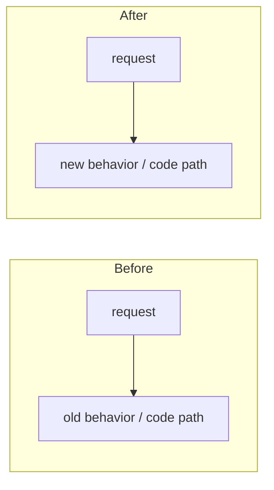

# Darkbloom - Decentralized Private Inference

Darkbloom is a decentralized private inference network for Apple Silicon Macs. Consumers use OpenAI-compatible APIs, the coordinator handles routing, auth, billing, attestation, and capacity management, and providers run local inference workloads on macOS hardware using MLX-Swift. Request bodies are encrypted hop by hop (NaCl Box on each leg): the coordinator decrypts inside its confidential-VM memory for routing and billing, does not log or retain prompt content, and re-seals each request to the provider's attested key; the provider is the plaintext endpoint. Exact model: `docs/architecture/security/encryption.md`. Docs map: `docs/README.md`; docs rules: `docs/AGENTS.md`.

## Project Structure

```
coordinator/          Go control plane (packages live at top level, not internal/)
├── cmd/coordinator/  main service entrypoint
├── api/              HTTP + WebSocket handlers (consumer.go, provider.go, billing_handlers.go, device_auth.go, invite_handlers.go, release_handlers.go, enroll.go, stats.go, server.go, chunk_key_cache.go, types/)
├── apns/             APNs-push code-identity attestation
├── attestation/      Secure Enclave + MDA attestation verification
├── auth/             Privy JWT verification + user provisioning
├── billing/          Stripe (deposits + Connect payouts), referral system
├── config/           AppConfig aggregation of per-package configs
├── env/              Shared env-var helpers/constants
├── mdm/              MicroMDM integration for device attestation
├── payments/         Internal ledger, pricing tables, base rewards
├── profilesign/      CMS-signing of .mobileconfig enrollment profiles
├── protocol/         WebSocket message types shared with provider (type_scan.go: single-parse frame decode)
├── ratelimit/        Rate limiting
├── registry/         Provider registry, queueing, routing, reputation, token-budget admission,
│                     warm-pool controller, two-lane provider WS writer (provider_writer.go), routingsim/
├── saferun/          Panic-safe goroutine runners
├── stateexport/      Consistent encrypted archive of MicroMDM (+ legacy step-ca) state (migration)
├── store/            Persistence (in-memory or Postgres)
├── telemetry/        Telemetry event emitter (process logs + Datadog forwarding)
├── datadog/          Datadog APM / DogStatsD / Logs API client
└── internal/e2e/     End-to-end encryption (X25519 key exchange) helpers + tests

e2e/                  System-level E2E testing framework
├── integration_test.go  14 E2E tests (streaming, billing, encryption, attestation, etc.)
├── profile_test.go      latency profiling tests
├── benchmark_test.go    load benchmarks (posts markdown to PR comments)
└── testbed/             shared test harness (coordinator/provider lifecycle, load generator, assertions)

provider-swift/       Swift provider CLI for Apple Silicon Macs
├── Sources/
│   ├── ProviderCore/                  shared library (protocol, hardware, crypto, security, inference, coordinator client, scheduling, server, telemetry, model downloads, attestation)
│   ├── ProviderCoreFoundation/        Linux-buildable model manifests, scanner, hashing, template render check, publish-safe code
│   ├── darkbloom/                     CLI executable (start, stop, restart, status, doctor, models, local, login, logout, benchmark, update, verify, enroll, logs, ...)
│   ├── darkbloom-publish/             registry manifest builder for the publish workflow
│   ├── darkbloom-enclave-cli/         Secure Enclave attestation/sign helper
│   └── ProviderBenchmark*, kv-*/      benchmark + KV-cache self-test executables
└── Tests/

console-ui/           Next.js 16 / React 19 frontend (chat, billing, models)
├── src/app/          Pages: chat (/), billing, models, stats, providers, settings, link, api-console, earn, login
├── src/app/api/      Proxy routes: chat, auth/keys, keys, payments/*, invite, models, health, pricing, stats, telemetry, attestation, device, me, ...
├── src/components/   Chat UI, sidebar, top bar, trust badges, invite banner, verification panel
├── src/lib/          API client (src/lib/api/), Zustand store (store.ts)
├── src/hooks/        Auth (useAuth.ts), toast notifications (useToast.ts), chat streaming (useChatStream.ts)
└── src/proxy.ts      Next.js 16 proxy (replaces middleware.ts)

admin-ui/             Next.js 16 internal read-only ops dashboard (SELECT-only queries against the
                      prod read replica; Basic Auth via src/proxy.ts; has vitest tests, not in CI)

landing/              Static landing page (index.html, earn calculator, network stats)

deploy/               Infra config: gcp/ (Cloud Build + VM bootstrap), environments/ (dev/prod env),
                      datadog/ (dashboard JSON), provider-fleet/ (fleet update helper)

scripts/
├── install.sh        curl one-liner installer (fetches release, verifies SHA-256 + code signature)
├── admin.sh          Admin CLI (Privy auth, release mgmt, API calls)
├── publish-model.sh  Model registry publish workflow
├── fetch-metallib.sh MLX metallib builder (cmake from libs/mlx-swift source)
├── smoke-dev.sh      Dev-coordinator smoke test
└── entitlements.plist Hardened Runtime entitlements (network, keychain)

docs/                 How-tos, runbooks, reference, architecture, design records, dated reports
                      (map: docs/README.md · rules + freshness stamps: docs/AGENTS.md · lint: make docs-check)
.github/workflows/    CI (ci.yml), integration tests (integration.yml), Swift release (release-swift.yml),
                      model registration (register-model.yml), threat model review (threat-model-review.yml)
```

### External Dependencies (`.external/`)

The `.external/` directory is reserved for local external checkouts and **must never be committed to d-inference**. The current Swift provider uses in-process MLX, not a vllm-mlx subprocess.

## Building & Testing

### Coordinator (Go)
```bash
cd coordinator
go test ./...
# Cross-compile for the GCP production container (Linux amd64):
GOOS=linux GOARCH=amd64 CGO_ENABLED=0 go build -o coordinator-linux ./cmd/coordinator
```

### Provider, Swift
```bash
cd provider-swift
swift test
swift build -c release
# Outputs: .build/release/darkbloom and .build/release/darkbloom-enclave
```

The Swift package depends on `../libs/mlx-swift` and `../libs/mlx-swift-lm`
(git submodules). `scripts/fetch-metallib.sh` (and the release workflow)
build `mlx.metallib` from the MLX source **nested inside mlx-swift** —
`libs/mlx-swift/Source/Cmlx/mlx`, the tree the Cmlx target actually compiles
against — NOT from the top-level `libs/mlx` submodule; updating `libs/mlx`
alone does not change the generated kernels.

### Console UI (Next.js 16)
```bash
cd console-ui
npm install
npm run build
npx eslint src/       # lint check
npm test              # vitest
```

### E2E Integration Tests
```bash
# Requires Postgres + Swift provider binary + MLX model downloaded
go test ./e2e/... -run TestIntegration -v
go test ./e2e/... -run TestBenchmark -v    # load benchmarks
```

## Releases

**Never create a release unless explicitly asked by the user.** When asked:

1. **Squash push**: All local commits since the last tag should be squash-pushed into a single commit on master.
2. **Bump version**: Update the Swift provider version in `provider-swift/Sources/ProviderCore/ProviderCore.swift`.
3. **Create annotated tag** with a description summarizing all changes:
   ```bash
   git tag -a v0.X.Y -m "v0.X.Y: one-line summary

   - Change 1
   - Change 2
   - ..."
   ```
4. **Push** the commit and tag: `git push origin master --tags`
5. The Swift release workflow (`.github/workflows/release-swift.yml`) is
   triggered by tags shaped `vX.Y.Z` (plus legacy
   `vX.Y.Z-swift[.N]`). Dev publication uses `workflow_dispatch`; all requested
   versions must equal the checked-in source constants.

## Deploying

Full deploy runbook: **[docs/operations/coordinator-deploy.md](docs/operations/coordinator-deploy.md)**

Covers coordinator deploy, provider CLI bundling, and install.sh updates.

### Coordinator (prod, Google Cloud)

> **AI agents must NOT deploy or mutate production.** Any mutation of the
> `darkbloom-mainnet` VM, container, services, Caddy, environment, Secret
> Manager, database, DNS, or traffic is human-only. Agents may prepare the PR,
> image-build config, tag, and exact commands. Read-only health/log inspection
> is allowed.

The prod coordinator runs on GCE VM `darkbloom-coordinator` in
`darkbloom-mainnet`. Build target is `coordinator/Dockerfile`; host Caddy
terminates static TLS. The persistent disk is `/mnt/disks/userdata`.

Human-only deploy flow (for reference — do not run this as the agent):

```bash
# 1. Push your changes (agent may do this if explicitly asked)
git push origin master

# 2. The repository trigger builds and pushes the immutable master commit.
# Direct local gcloud builds submit is rejected by cloudbuild-prod.yaml.
gcloud builds list --project=darkbloom-mainnet --limit=5

# 3. HUMAN ONLY: follow the drain and fallback-container swap runbook.

# 4. Verify (agent may do this)
curl https://api.darkbloom.dev/health
```

See `docs/operations/coordinator-deploy.md` for environment preservation,
deployment, verification, and rollback.

### Coordinator (dev, Google Cloud)

The dev coordinator runs on GCP (project `sepolia-ai`) — separate domain (`api.dev.darkbloom.xyz`), separate R2 bucket (`d-inf-app-dev`), **same** trust level as prod (`MIN_TRUST=hardware`, full MDM stack), and a dev-only BIP39 mnemonic (never prod's). **Never** used for prod traffic. Full wiring in [docs/operations/dev-environment.md](docs/operations/dev-environment.md).

Shape: GCE Ubuntu VM + Docker + systemd (coordinator + MicroMDM need persistent disk state), Cloud SQL Postgres via cloud-sql-proxy, **Vercel**-hosted console UI, Cloud Build auto-deploys on master push. ~2–4 min coordinator upgrades.

### Provider bundle

CI (`.github/workflows/release-swift.yml`) builds, signs, notarizes, and uploads the Swift CLI bundle to Cloudflare R2 (`s3://d-inf-app/releases/v{VERSION}/darkbloom-bundle-macos-arm64.tar.gz`), then registers the release with the coordinator via `POST /v1/releases`. Providers fetch via `install.sh` served by the coordinator. There is no SSH-to-a-VM step.

## Infrastructure

| Component | Prod | Dev |
|-----------|------|-----|
| Coordinator host | GCE VM `darkbloom-coordinator` (`darkbloom-mainnet`, `us-east4-a`) | GCE VM `d-inference-dev` (us-central1-a, Ubuntu + Docker + systemd) |
| Console UI | Vercel | Vercel (separate dev project, `NEXT_PUBLIC_COORDINATOR_URL=https://api.dev.darkbloom.xyz`) |
| Domain | `api.darkbloom.dev` | `api.dev.darkbloom.xyz` |
| TLS | Host Caddy + pre-provisioned static certificate | Host Caddy (Let's Encrypt ACME, VM :443) |
| Database | AWS RDS PostgreSQL (managed) | Cloud SQL Postgres 16 `d-inference-dev-db` via cloud-sql-proxy sidecar |
| Persistent storage | GCE persistent disk at `/mnt/disks/userdata` | GCE persistent disk `d-inference-dev-data`, 30 GB, mounted at `/mnt/disks/userdata` |
| Logs | Docker JSON logs + hourly host archival/direct Datadog submission | `gcloud logging read ...` (VM + Cloud SQL in Cloud Logging) |
| Release bucket | R2 `d-inf-app` | R2 `d-inf-app-dev` |
| Trust level | `hardware` (MDM enrollment required) | `hardware` (same — full MDM stack) |
| Provider install | `curl -fsSL https://api.darkbloom.dev/install.sh \| bash` | `curl -fsSL https://api.dev.darkbloom.xyz/install.sh \| bash` |

## Key Design Decisions

- **Token-budget routing**: Providers report real token budget usage (active tokens, max potential, EWMA decode TPS) in heartbeats. Coordinator uses engine-reported capacity for admission, with fleet median TPS as fallback. Speculative TTFT dispatch sends to a backup provider at 50% of the deadline; first token wins, loser is cancelled. Early 429 with Retry-After for OpenRouter compatibility.
- **Provider selection**: cost-based, not multiplicative scoring — candidates are ranked by estimated completion cost in ms (effective decode TPS degraded by current batch load) plus penalties for queue depth, pending requests, slot state, and live system metrics from heartbeats (memory pressure, CPU, GPU utilization, thermal state); near-tie candidates are spread randomly (`registry/scheduler.go`).
- **Continuous batching**: All concurrent requests merged into one batched forward pass per step via MLX-Swift BatchedEngine. Near-linear throughput scaling (B=4/B=1 = 3.8x on Qwen, 2.9x on Gemma MoE). Temperature=0 uses vectorized greedy fast path.
- **Request cancellation**: In-flight inference requests are tracked by request_id with cancellation state. On coordinator disconnect, in-flight requests are cancelled so generation stops promptly.
- **Idle GPU timeout**: Loaded model state is released after 1 hour of no requests to free GPU memory. Lazy-reloaded when the next request arrives. Coordinator can also push `load_model` messages to pre-warm providers.
- **Hop-by-hop encryption**: consumer → coordinator is TLS plus optional NaCl Box sealing (`application/eigeninference-sealed+json`); coordinator → provider is a mandatory per-request NaCl Box to the provider's attested X25519 key; provider → coordinator response chunks are encrypted back. The coordinator decrypts consumer bodies in confidential-VM memory for routing and billing and does not log or retain them; the sealed request is decrypted only inside the hardened provider process. Do not write "the coordinator never sees plaintext" — see `docs/architecture/security/encryption.md`.
- **Attestation chain**: Secure Enclave P-256 key (persistent, keychain access group bound) → signs attestation blob → coordinator verifies signature (self_signed) → MDM SecurityInfo cross-check (hardware trust) → Apple Enterprise Attestation Root CA signs device cert chain via MDA (mda_verified). `GET /v1/providers/attestation` exposes only privacy-redacted trust status; hardware serials, UDIDs, and raw Apple certificates stay private to providers and the coordinator.
- **Protocol symmetry**: `provider-swift/Sources/ProviderCore/Protocol/` and `coordinator/protocol/messages.go` define the same WebSocket message types. Changes to one must be mirrored in the other.
- **Model registry**: Coordinator registry data is DB-backed and points to R2 manifests. The Swift provider downloads the files listed in the manifest from `https://models.darkbloom.ai` and verifies per-file plus aggregate SHA-256. Do not reintroduce hardcoded model catalog lists.
- **Billing**: Stripe Checkout deposits credit an internal micro-USD ledger (`coordinator/payments`); Stripe Connect handles provider payouts/withdrawals. Referral system gives referrers a share of platform fees; base rewards live in `payments/baserewards`. (Solana deposits/payouts were removed; the BIP39 mnemonic env var now only derives the coordinator's X25519 encryption key.)
- **Request queue**: When all providers are busy, requests queue with 120s timeout. Frontend shows "providers are busy" on 503. 429 with Retry-After returned when fleet is at capacity.
- **Pre-content failover**: The dispatch loop does NOT commit to a provider on boilerplate chunks (role-only delta, `response.created`) — only on the first content-bearing chunk. A provider that errors or disconnects before producing content is retried invisibly on another provider (`status:retry_precontent`); in-band SSE errors are only possible after real content has flowed (`inference.in_band_error` metric). Repeated 5xx from a (provider, model) pair triggers a 5-min routing cooldown (2 in 60s, `registry/error_cooldown.go`); retries soft-prefer a different provider binary version. The coordinator also normalizes tool JSON-Schemas (`api/toolschema.go`, mirror of the Swift `ToolSchemaNormalization`) before encryption so lagging providers never see template-crashing shapes, and routes tool-bearing requests only to providers ≥ the `tools` capability floor (0.6.3) whose models don't report `template_render_ok=false` (set by the provider's scan-time chat-template render self-check, `TemplateRenderCheck`).
- **Challenge timing**: Initial attestation challenge sent immediately on provider registration, then every 5 minutes via ticker.
- **Model scan performance**: `ModelScanner` does fast discovery without hashing. Weight hash computed on-demand via `WeightHasher.computeHash(for:)` only for models that need attestation/verification.
- **Vision prefill is per-image**: Qwen3-VL's tower attends over whatever it is handed as one sequence with an N×N intermediate, so `EngineV2VisionTowerRun` drives it once per image and evaluates each before building the next. Batching a request's images made peak device memory quadratic in the image count and asked Metal for buffers many times `MTLDevice.maxBufferLength`, which MLX's default `fatalError` handler turned into a dead daemon. `VisionTowerBudget` predicts that peak from the processor's grids and the model's own vision config (the N² multiple is 1 when MLX fuses the head dim, `numHeads` when it falls back to `[1, H, N, N]` scores); the prefill runs under `MLX.withError`, whose handler records and returns — so every `eval` site checks the box rather than relying on the block-exit check.
- **Streaming hot path**: provider frames are decoded in a single parse (`coordinator/protocol/type_scan.go`, envelope-decode fallback); per-request X25519 shared keys are memoized for chunk decrypt and forgotten on request terminal (`api/chunk_key_cache.go`); provider WebSocket writes go through a two-lane writer (`registry/provider_writer.go`) — control frames (challenges, cancels) take strict non-preemptive priority over data frames, FIFO within a lane only, `WriteText` blocks to wire completion. A full consumer chunk buffer gets one 250ms grace window, then the request fails with 499 — chunks are never silently dropped.
- **Device auth**: RFC 8628 device code flow for linking provider machines to user accounts. Provider runs `login`, gets a code, user enters it on the web.
- **CI code signing**: GitHub Actions release workflow signs provider binary with Developer ID Application cert, notarizes with Apple, computes SHA-256 hashes after signing. Provisioning profile embedded in .app bundle for persistent SE key.
- **Observability**: Datadog DogStatsD metrics for attestation, routing, billing, fleet version, provider capacity. X-Timing JSON header decomposes per-request latency (parse, reserve, route, queue, encrypt, dispatch, provider).

## Problem-Solving Approach

Always think from first principles. When fixing a bug or designing a feature:

1. **Identify the root cause, not the symptom.** Don't patch the immediate error — ask "why does this happen?" repeatedly until you hit the fundamental cause. A hash mismatch isn't the problem; the problem is that CI and providers see different files.

2. **Enumerate the full state space.** Before implementing, ask: "What are ALL the possible states/file types/paths/scenarios?" Don't discover edge cases one at a time through production failures. For example: if hashing a directory, list every file type that could exist (.py, .so, .dylib, .pyc, .json, dirs) and decide how each is handled BEFORE writing code.

3. **Work both top-down and bottom-up.** Top-down: what's the user-visible guarantee we're providing? Bottom-up: what does the code actually do at each step? Find where they diverge.

4. **Simulate the full lifecycle locally before shipping.** Don't assume CI → provider → runtime will work. Actually run the full flow: build the artifact, extract it, hash it, simulate imports, hash again, compare. Verify the invariant holds end-to-end.

5. **Ask "what breaks next?" after every fix.** If you exclude .pyc from hashing, what can an attacker do with .pyc? If you purge before hashing, what regenerates .pyc between purge and the next check? Each fix must not create a new hole.

6. **Pull the thread on every component.** When debugging a failure, map every component in the chain (coordinator → provider → inference engine). Trace the actual flow step by step — look at real logs, real source code, real API responses at each boundary. When you see a specific error, immediately ask "what causes that exact status code in that exact server?" and trace it to the source. Don't theorize about what MIGHT be wrong — verify what IS wrong. The error message IS the clue — follow it.

## Common Pitfalls

- Protocol changes require updating both `provider-swift/Sources/ProviderCore/Protocol/` (Swift) AND `coordinator/protocol/messages.go` (Go). They must stay in sync.
- Telemetry wire types are mirrored in three places: `coordinator/protocol/telemetry.go`, `provider-swift/Sources/ProviderCore/Telemetry/`, and `console-ui/src/lib/telemetry-types.ts`. The field allowlist (`coordinator/api/telemetry_handlers.go`) is the privacy backstop — never add prompt/completion fields. See `docs/architecture/telemetry.md`.
- Attestation minimum-requirement checks (Secure Enclave, SIP, Secure Boot) run sequentially and each overwrites `result.Error` — last failure wins. `AuthenticatedRootEnabled` (ARV) is informational only: logged, not enforced.
- Store selection (`cmd/coordinator/main.go`): the coordinator uses the **Postgres** store whenever `EIGENINFERENCE_DATABASE_URL` is set (prod does), and refuses to start without it unless `EIGENINFERENCE_ALLOW_MEMORY_STORE=true`. The in-memory store is the dev/test fallback only (state lost on restart). The live provider *registry* (WebSocket connections/attestation) is always in-process and rebuilt on reconnect regardless of store.
- `hypervisor_active` is retired: current providers no longer send it, but `AttestationResponseMessage.HypervisorActive` and the canonical-status support must keep decoding so signed payloads from older (< v0.6.31) providers still verify.
- Binary files like `coordinator/coordinator` should NOT be committed to git. Do not model changes from this built artifact.
- CI release workflow must compute binary SHA-256 hashes AFTER code signing, not before. Providers verify hashes of the signed binary.
- Provider bundle semantics span multiple files: `.github/workflows/release-swift.yml`, `scripts/install.sh`, and `LatestProviderVersion` in `coordinator/api/server.go`. Keep them in sync.
- Model registry changes span coordinator registry schema/endpoints, `provider-swift` manifest download/publish code, `scripts/publish-model.sh`, and the console UI.
- Device linking changes span coordinator device auth endpoints and provider `login`/`logout` commands.

## Testing New Features

Every new feature or non-trivial change must ship with tests. Don't rely on "the reviewer will catch it" or "I'll test it manually once" — write tests that a future change can run.

- **Prefer live-isolated tests over mocks.** Spin up a real instance of the dependency in the test process or a throwaway local container (test Postgres via `pgx` + a temp database, a real in-process HTTP server via `httptest.NewServer`, a real in-memory store). Do NOT mock the thing you're actually trying to exercise — mocks hide real bugs (wrong SQL, stale schema, protocol drift). The lesson from past incidents: mocked tests passed while the prod migration failed.
- **Never point tests at production.** No live coordinator, no prod DB, no real wallets, no real Privy tenants. Each test harness builds its own isolated coordinator, its own in-memory or ephemeral store, its own seed data. If a test needs credentials, they're fake fixtures, not the real ones.
- **Cover both impls when a feature spans backends.** If a `store.Store` method gets a memory impl AND a postgres impl, both need coverage (memory in the default test suite; postgres behind a build tag or a local-only integration test that uses a throwaway DB).
- **Test the real HTTP path when possible.** For new endpoints, exercise them through `httptest.NewServer(srv.Handler())` (or the equivalent) — not by calling the handler function directly. That catches routing mistakes, middleware gaps, and path-parameter bugs.
- **Frontend features need frontend tests.** When adding a page or form, add at minimum a vitest for the component's validation + state. For UI that can't be easily unit-tested, boot the dev server and walk through the flow in a browser before declaring done — and say so in the handoff.
- **Regression: every bug fix gets a test that fails without the fix.** Otherwise the bug can come back silently.

The goal is "next engineer can change this and CI tells them if they broke it," not "it worked on my machine today."

## Code Structure & Modularity

Keep the codebase modular, never monolithic.

- Prefer small, single-responsibility files over large catch-all ones. Split by concern: types, pure helpers, data/IO hooks, UI pieces, and a thin orchestrator that wires them together.
- Group a feature's files into a dedicated module/folder with a thin entry point. Examples: the coordinator's top-level Go packages (`registry/`, `billing/`, `store/`), and `console-ui/src/components/api-keys/` (`constants`, `format`, `limits`, `Modal`, `KeyForm`, `KeyCard`, a `useApiKeys` data hook, and a thin `ApiKeysManager` orchestrator).
- One file/component should do one thing. If a file mixes several concerns or grows past a few hundred lines, that's a signal to split it.
- **At the end of every large piece of work, do a refactor pass to make it modular before calling it done.** Extract helpers/types/hooks into focused files, delete dead code, and keep the public entry point thin. The refactor must be behavior-preserving — build, lint, and tests stay green.

## Quality Gate

After completing each objective (task, plan phase, or discrete unit of work), first do a modular refactor pass on any large change (see **Code Structure & Modularity**), then spawn **both** reviewers in parallel:

1. **Codex rescue subagent** (`codex:codex-rescue`) — reviews the diff for correctness, regressions, and build/test pass
2. **Claude Code subagent** (`Agent` tool, general-purpose) — independently reviews the same diff for correctness, edge cases, and code quality

Each reviewer should:

1. Read the diff of all changes made for that objective
2. Verify correctness: does the implementation actually solve what was asked?
3. Check for regressions: broken imports, missing protocol symmetry, untested edge cases
4. Confirm builds/tests pass for affected components (run `go test`, `swift test`, `npm run build`, etc. as appropriate)
5. Confirm the docs moved with the code: the table in `docs/AGENTS.md` ("When you change code, change these docs") names the page for each kind of change; changed pages are restamped (`make docs-stamp FILES=...`) and `make docs-check` passes
6. Report a pass/fail verdict with specific issues if any

Only proceed to the next objective after both reviewers pass. If either flags issues, fix them before moving on.

## Pull Requests

**Every PR MUST include a before-and-after diagram (Mermaid) in its description** that details what changed — covering BOTH:

- **Behavior**: the request/response flow, states, and outcomes a user or caller observes (e.g. dispatch → retry → 429/503/200).
- **Code**: which functions/components changed and how control flows through them.

Use two clearly labeled diagrams — a **Before** and an **After** — (or one side-by-side comparison) so a reviewer sees the delta at a glance. Scope it to what the PR changes; it is not a full-system map. A PR without a before/after diagram is not ready for review.

````markdown

````

## Git Hooks

Hooks live in `.githooks/` and are enabled via `git config core.hooksPath .githooks` (already set for this repo).

- **pre-commit**: Checks formatting on staged files only (fast).
- **pre-push**: Runs formatting + compilation + tests for changed components.

| Component | Check | Manual fix |
|-----------|-------|------------|
| Go (coordinator/) | `gofmt -l` | `gofmt -w <file>` |
| TypeScript (console-ui/) | `npx eslint src/` | `cd console-ui && npx eslint src/ --fix` |
| Swift (provider-swift/) | skipped | `cd provider-swift && swift test` |

If you clone fresh, activate the hook with:
```bash
git config core.hooksPath .githooks
```
