# Exact Prefix Cache Routing

> Last updated: 2026-09-03 · commit `5d400cf75`

Exact prefix cache routing lets the scheduler prefer a provider that has
*proven* it holds the exact token prefix of a request in its encrypted SSD
prefix cache. This page explains the mechanism — proof, evidence lifecycle,
discount — and the guarantees that bound it; it is for engineers changing the
scheduler, the receipt path or the prompt-contract sidecar. The operator
procedure for turning it on is
[`../operations/cache-routing-rollout.md`](../operations/cache-routing-rollout.md).

## Context

A provider that already holds a request's exact token prefix in its encrypted
SSD prefix cache ([`prefix-cache.md`](prefix-cache.md)) can skip that prefill,
but the scheduler's cost model ([`routing.md`](routing.md#cost-model)) knows
nothing about where a prefix lives. Cache-aware routing closes that gap by
pricing a *proven* cache hit as a bounded discount on the provider's estimated
cost — never as a hard affinity, and never on the strength of a caller-supplied
field. It is flag-gated:
[`EIGENINFERENCE_CACHE_ROUTING_MODE`](../reference/configuration.md#routing-admission-and-ttft)
selects `off` (`CacheRoutingOff`, `coordinator/registry/cache_routing.go`) or
`on` (`CacheRoutingOn`); while `off`, none of the machinery below runs.

### Guarantee

Cache routing is an optimization, never an inference dependency. When routing is
`off`, the coordinator emits no reusable remote scope, tracks no receipts, and
applies no cache discount. When routing is `on`, only exact text-token prefix
proofs from protocol-v2 providers can affect selection. Unsupported providers,
multimodal requests, sidecar failures, contract mismatches, stale evidence, and
invalid receipts all use normal cold routing.

The provider's encrypted SSD cache is the only production reusable prefix tier.
No caller field, session identifier, JSON-body hash, probabilistic conversation
anchor, or coordinator heuristic establishes cache ownership.

## Mechanism

### Request flow

```mermaid
flowchart LR
  A[Final provider-bound text body] --> B[Local prompt-contract sidecar]
  B --> C[Exact token boundaries]
  C --> D[Normal provider eligibility gates]
  D --> E[Longest provider-confirmed boundary]
  E --> F[Bounded net staging discount]
  F --> G[Encrypted dispatch]
  G --> H[Provider recomputes token-chain proof]
  H --> I[SSD lookup or durable donation]
  I --> J[Monotonic v2 evidence]
```



The coordinator calls the local prompt-contract sidecar
(`coordinator/promptcontract/`, see
[`prompt-contract-sidecar.md`](prompt-contract-sidecar.md)) only after alias
resolution, tool normalization, endpoint lowering, output-bound injection, and
construction of the final provider-bound body (`planCacheRoute`,
`coordinator/api/prompt_artifacts.go`). The sidecar returns the prompt contract
identity, exact token count, and complete block-chain boundaries. It never
returns or logs the normalized prompt, tokens, or hashes outside the local
response contract.

Sidecar timeout, crash, malformed output, unavailable artifacts, and dynamic-time
templates return a non-participating plan. The request still dispatches.
Requests carrying media (`HasMedia`) never produce a participating plan.

Two operational controls sit between mode `on` and planning
(`cacheActivationGate`, `coordinator/registry/cache_activation.go`): a
deterministic HMAC-sampled cohort over account, resolved model and
provider-bound body (`EIGENINFERENCE_CACHE_ROUTING_PERCENT`), and a
process-local token bucket bounding sidecar plan QPS
(`EIGENINFERENCE_CACHE_ROUTING_MAX_PLAN_QPS`). Both only decline cache
participation; they never reject, delay, or otherwise change ordinary
inference.

### Identity and isolation

One cache plan contains:

- the verified model aggregate hash;
- the prompt contract identity;
- an opaque account/build scope;
- the exact prompt token count;
- ordered complete block-chain boundaries.

The provider-visible scope is a domain-separated HMAC over authenticated account,
concrete model build, aggregate hash, prompt contract, and block-hash contract
(`coordinator/registry/cache_route_keys.go`). The provider does not infer
remote scope from `prompt_cache_key`, `user`, or any other caller-controlled
body field. The only `prompt_cache_key` the coordinator ever writes is a
coordinator-authored cache-bust key inserted into the sealed body for
protocol-0 providers (`bodyForCacheAttempt`, `coordinator/api/consumer.go`;
`LegacyCacheBustKeyLength`, `coordinator/registry/cache_receipts.go`).

Coordinator route keys are separate domain-separated HMACs over the opaque scope,
aggregate hash, prompt contract, provider cache epoch, boundary token count, and
provider-confirmed chain hash. Route keys, account identifiers, raw boundaries,
and prompts are not persisted or attached to telemetry.

### Protocol v2 proof

Every ready model advertises a connection-scoped capability containing:

- concrete model ID and actual post-load aggregate hash;
- prompt contract ID;
- block hash version and block size;
- durable cache epoch;
- enabled and ready state.

The coordinator accepts the capability only when it matches the provider's
registered model inventory and supported block contract. A cache attempt binds
the live provider connection, request, model, plan, capability, nonce, and
expiry.

The provider recomputes the token-chain anchor from the body it actually
tokenizes. Lookup evidence carries the prompt anchor and optional matched anchor.
Durable-ready evidence carries the input-prompt anchor plus, when available, the
final generated-continuation anchor. Evidence sequence numbers are allocated by
the provider's durable epoch store and must increase strictly for each
provider/model/epoch.

A prompt-proof mismatch quarantines that exact capability. The request continues
without preference. A changed capability or cache epoch may participate only
after a fresh valid proof.

### Holder lifecycle

A holder is created only by a valid SSD hit or by a durable-ready callback after
the encrypted DBK3 blocks have been written, indexed, reopened, authenticated,
and found readable. It records the live provider connection, model, aggregate
hash, prompt contract, cache epoch, exact anchor, recompute requirement, expected
saved tokens, measured staging cost, and bounded expiry.

Evidence is removed or made unreachable on:

- provider disconnect or live-connection replacement;
- capability, contract, aggregate hash, or epoch change;
- proof mismatch;
- verified miss or corruption for the attempted boundaries;
- holder expiry or deterministic cap eviction;
- routing transition to `off`.

Holder removals are counted under one of six reasons
(`coordinator/registry/cache_routing.go`): `ttl`, `disconnect`,
`epoch_change`, `capability_change`, `miss_invalidation`,
`capacity_eviction`. Provider capacity eviction rotates the model cache epoch,
coarsely invalidating all old holders for that model. This is intentionally
conservative.

Attempts remain briefly after inference terminal state because encrypted SSD
write-behind can finish later. Attempt and holder maps are memory-only, capped
per boundary ([`EIGENINFERENCE_CACHE_ROUTING_MAX_HOLDERS`](../reference/configuration.md#routing-admission-and-ttft),
`defaultCacheRoutingMaxHolders`) with a bounded lifetime
([`EIGENINFERENCE_CACHE_ROUTING_TTL`](../reference/configuration.md#routing-admission-and-ttft), `defaultCacheRoutingTTL`), and
heap-evicted. V1 receipt
frames remain decodable for mixed-version safety but cannot mutate routing
evidence (`coordinator/registry/cache_receipts.go`).

### Scheduler

All ordinary trust, model, trait, memory, token-budget, queue, cooldown, health,
and time-to-first-token gates run first ([`routing.md`](routing.md#eligibility-gates-and-the-gatereason-vocabulary)).
For each eligible provider, `applyCacheRoutingDiscount`
(`coordinator/registry/scheduler.go`) looks up its longest live exact boundary
under the provider's current capability and applies

```text
saved_ms = exact_saved_tokens / provider_prefill_tps * 1000
net_ms = max(0, saved_ms - measured_ssd_stage_ms)
discount = min(net_ms, configured_max_ms, baseline_cost * configured_fraction)
adjusted_cost = baseline_cost - discount
```

with `configured_max_ms` from
[`EIGENINFERENCE_CACHE_ROUTING_MAX_DISCOUNT_MS`](../reference/configuration.md#routing-admission-and-ttft)
(`defaultCacheRoutingMaxDiscountMs`) and `configured_fraction` from
[`EIGENINFERENCE_CACHE_ROUTING_MAX_COST_FRACTION`](../reference/configuration.md#routing-admission-and-ttft)
(`defaultCacheRoutingMaxCostFraction`). The discount is recorded as
`CacheDiscountMs` in the cost breakdown.

Unknown or non-positive staging cost yields no hint. There is no confidence
multiplier, hard affinity, hypothetical winner, dedicated-cache mode, or stacking
of multiple boundaries. A busy cached provider still loses when its adjusted
cost is worse. Among near-tied, otherwise equivalent candidates a cache
discount decides the tie (`SelectionCacheTiebreak`, [`routing.md`](routing.md#selection-paths)).

Cache-participating attempts (`PendingRequest.CacheRoutingParticipates`) are
excluded from TTFT calibration (`observeTTFTCalibration`,
`coordinator/api/settlement.go`) and from the first-content reputation sample
(`coordinator/api/dispatch.go`). Terminal cache metrics use bounded categorical
tags only.

`GET /v1/cache/status` (`handleExactCacheStatus`,
`coordinator/api/exact_cache_status.go`) exposes only aggregate rollout state:
activation and lifecycle counters; sidecar enabled/running/ready, child
generation, categorical restart reason, failure streak, timeouts/overloads/RSS,
cold/warm contract loads, and planner outcomes; preload generation/counts;
prompt artifact ready/pending/failed counts; protocol 0/1/2 provider counts;
and bounded holder/attempt counts. Current providers also report one bounded
status for each concrete loaded model slot. The coordinator publishes only
counts by `state`, `reason`, `backend`, and `replay_strategy`, plus
reported/unreported loaded totals. The vocabularies
(`coordinator/registry/cache_eligibility.go`):

- state: `ready`, `pending`, `disabled`, or `error`;
- reasons: `ready`, `config_disabled`, `weight_hash_unavailable`,
  `runtime_identity_unavailable`, `unsupported_layout`,
  `unsupported_backend`, `paged_hybrid_unsupported`, `scan_pending`,
  `scan_failed`, `disk_unavailable`, or `cache_init_failed`.
  `paged_hybrid_unsupported` is still decoded for older providers; the current
  provider maps the engine's unsupported-reason enum in
  `provider-swift/Sources/ProviderCore/Inference/PrefixCacheEligibilityStatus.swift`,
  and the engine (`libs/mlx-swift-lm/Libraries/MLXLMCommon/ContinuousBatchingV2/PrefixReusePlan.swift`)
  no longer produces the dual-cursor case, so such slots report
  `unsupported_layout` instead;
- backend: `contiguous`, `paged`, or `unknown`;
- replay strategy: `direct`, `frozen_full`, `tail_replay`, `none`, or
  `unknown`.

Old providers omit the field and contribute only to
`unreported_loaded_models`; omission is never interpreted as a reason.
These fields are optional observability, never provider-admission policy.
Status model IDs are checked only against that provider's advertised inventory;
owner-local/off-catalog models are valid. Unknown future enum values, invalid
state/reason tuples, unadvertised status models, unknown donation outcomes, and
invalid counts drop only the affected entry while known entries still
aggregate. To keep processing bounded and ambiguity-free, an array beyond its
fixed cap (`maxPrefixCacheStatuses = 16` statuses or
`maxPrefixCacheDonationOutcomeEntries = 32` raw outcome entries), duplicate
model/outcome keys, or a blank/non-canonical status model ID drops that whole
optional snapshot (`sanitizePrefixCacheStatuses`). Donation aggregation has
exactly 13 known buckets (`PrefixCacheDonationOutcomes`); the raw cap reserves
19 entries for future outcomes, which are filtered individually.
A dropped/present status snapshot becomes authoritative empty and clears stale
status; a dropped donation snapshot preserves the prior monotonic counter
baseline. Field omission preserves the prior mixed-version behavior.
Authoritative `prefix_cache_v2_models` validation remains strict and can still
reject registration or quarantine malformed routing evidence.
Because statuses describe loaded slots, there is no unloaded-slot reason. A
`ready/ready` status is retained only when the same resulting snapshot has a
v2 capability for that concrete model, a concrete backend
(`contiguous|paged`), and a supported replay strategy
(`direct|frozen_full|tail_replay`). Conversely, once a provider has supplied
the optional status field, every v2 capability must have exactly one matching
ready status. Registration, heartbeat capability/status replacement, and model
updates reconcile these views under one provider lock
(`coordinator/registry/cache_snapshot.go`). Contradictory optional status
becomes unreported; routing capability is never weakened. Providers that omit
the optional field retain backward-compatible v2 capability behavior.
The response never includes model IDs, provider IDs, accounts, scopes, paths,
hashes, epochs, prompts, token IDs, request IDs, or cache keys.

The response and gauge projection are implemented in
`coordinator/api/exact_cache_status.go` and
`coordinator/api/exact_cache_metrics.go`; bounded artifact aggregation lives in
`coordinator/promptcontract/provisioner.go` (`Counts`), protocol/eligibility
aggregation in `coordinator/registry/cache_status.go`
(`PrefixCacheProtocolStatus`), and holder/attempt lifecycle counts in
`coordinator/registry/cache_routing.go` (`CacheRoutingLifecycleStatus`).

For each selected hint, terminal correlation stays on the in-memory
`PendingRequest` and emits bounded tags:
`selected`, `lookup_outcome`, `cache_read`, `tier`, and `result`. This measures
selected-holder precision and actual cached-read success without using an
identifier as a metric tag (`PendingRequest` in
`coordinator/registry/registry.go`; `cacheSelectionTerminalTags` in
`coordinator/api/provider.go`).

### Configuration and rollback

All variables are read once at startup by `ReadConfig`
(`coordinator/registry/config.go`) and applied through
`ConfigureCacheRouting` (`coordinator/registry/registry.go`). The
`EIGENINFERENCE_CACHE_ROUTING_*` variables and `EIGENINFERENCE_CACHE_MASTER_KEY`,
with their types, ranges and defaults, are listed once in
[configuration.md → Routing, admission and TTFT](../reference/configuration.md#routing-admission-and-ttft).

`CacheRoutingConfig.Check` fails startup when the mode is `on` and the master
key is missing or malformed. `off` requires no key. `ConfigureCacheRouting`
installs a fresh, empty holder/attempt tracker on every application, so
applying `off` clears all in-memory evidence. The product mode remains
strictly binary: percentage and QPS are operational caps inside `on`, not extra
modes. Sampling is a keyed, deterministic cohort over account, resolved model,
and provider-bound request body. Repeating the same exact request therefore
stays in the same cohort, allowing a sampled cold miss to donate and later hit,
without logging or exporting the cohort input. The QPS cap only declines cache
planning; ordinary inference continues cold.

Provider caching has one local kill switch,
[`DARKBLOOM_PREFIX_CACHE`](../reference/configuration.md#ssd-prefix-cache)
(`PrefixCachePolicy.environmentFlag`,
`provider-swift/Sources/ProviderCore/Inference/PrefixCachePolicy.swift`).
Providers advertise a model as protocol-v2
only after SSD scan readiness
(`provider-swift/Sources/ProviderCore/KVCacheSSD/SSDPrefixCache.swift`,
`provider-swift/Sources/ProviderCore/Coordinator/CoordinatorClientState.swift`,
`provider-swift/Sources/ProviderCore/Coordinator/CoordinatorClient+Registration.swift`)
under the `cbv2-frozen-full-3|native-fp|…` on-disk block contract
(`provider-swift/Sources/ProviderCore/KVCacheSSD/SSDBlockStore.swift`). The
cache is live only on slots whose resolved KV backend is `paged`; a
`contiguous` slot gets no cache object and reports `unsupportedBackend`, so its
models stay v1/cold (`PrefixCachePolicy.adoptionIsExact`, explained in
[prefix-cache.md](prefix-cache.md)).
Registration and every current-provider heartbeat carry an optional
`prefix_cache_statuses` replacement snapshot and cumulative
`prefix_cache_donation_outcomes`. An explicit empty status array clears the
connection's prior snapshot; absence preserves mixed-version compatibility.
Unsupported future observability is sanitized under the non-fatal rules above;
it never closes registration. Model removal, unload heartbeats, capability
changes, and disconnects remove connection-scoped status/evidence so stale
slots cannot remain in aggregates.

Turning routing on in production, widening the activation bounds and rolling
back are operator procedures, kept in the runbook
[`../operations/cache-routing-rollout.md`](../operations/cache-routing-rollout.md).

## Invariants

1. **Routing `off` runs none of the machinery, and applying `off` clears all
   in-memory evidence** — `ConfigureCacheRouting` installs a fresh, empty
   holder/attempt tracker on every application
   (`coordinator/registry/registry.go`).
2. **Cache routing never rejects, delays or otherwise changes ordinary
   inference.** The activation cohort and the plan-QPS bucket only decline
   participation (`cacheActivationGate`,
   `coordinator/registry/cache_activation.go`); a sidecar failure or a media
   request yields a non-participating plan and the request still dispatches
   (`planCacheRoute`, `coordinator/api/prompt_artifacts.go`).
3. **Only exact text-token prefix proofs from protocol-v2 providers affect
   selection**; V1 receipt frames stay decodable but cannot mutate routing
   evidence (`coordinator/registry/cache_receipts.go`).
4. **Cache ownership is never derived from a caller-controlled field.** The
   provider-visible scope and the route keys are domain-separated HMACs over
   authenticated account, concrete build, aggregate hash and prompt contract
   (`coordinator/registry/cache_route_keys.go`).
5. **Ordinary gates run first and the discount is bounded**:
   `min(net_ms, configured_max_ms, baseline_cost × configured_fraction)`,
   never below zero, never stacked across boundaries
   (`applyCacheRoutingDiscount`, `coordinator/registry/scheduler.go`).
6. **A proof mismatch quarantines that exact capability**; a changed
   capability or cache epoch participates only after a fresh valid proof, and
   evidence sequence numbers increase strictly per provider/model/epoch
   (`rejectCapability`, `acceptV2SequenceLocked`,
   `coordinator/registry/cache_receipts_v2.go`).
7. **Route keys, account identifiers, raw boundaries and prompts are never
   persisted or attached to telemetry**; `GET /v1/cache/status` and the
   terminal tags carry bounded categorical values only
   (`handleExactCacheStatus`, `coordinator/api/exact_cache_status.go`;
   `cacheSelectionTerminalTags`, `coordinator/api/provider.go`).
8. **Cache-participating attempts never train TTFT calibration or
   first-content reputation** (`observeTTFTCalibration`,
   `coordinator/api/settlement.go`; `coordinator/api/dispatch.go`).
9. **Mode `on` without a valid master key does not start**
   (`CacheRoutingConfig.Check`, `coordinator/registry/config.go`).

## Failure modes

| Symptom | Cause | What the code does |
|---|---|---|
| Coordinator exits at startup with `cache routing configuration rejected` | Mode `on` with a missing or malformed `EIGENINFERENCE_CACHE_MASTER_KEY`, or an out-of-range bound | `CacheRoutingConfig.Check` refuses the configuration; `coordinator/cmd/coordinator/main.go` exits |
| Requests dispatch but no plan participates (`plan_failed`, `plan_empty` counters climb) | Sidecar timeout, crash, malformed output, unavailable artifacts or dynamic-time templates | Non-participating plan; cold routing; sidecar supervision in [`prompt-contract-sidecar.md`](prompt-contract-sidecar.md) |
| Media requests never earn a discount | `HasMedia` requests are excluded by design | No participating plan is produced |
| A capability stops participating after a hit | Prompt-proof mismatch quarantined that exact capability | Request continues without preference; participation resumes only after a fresh valid proof |
| Holders vanish fleet-wide for one model | Provider capacity eviction rotated the model's cache epoch | Coarse invalidation of every old holder for that model |
| Holders vanish for one provider | Disconnect or live-connection replacement, capability/contract/aggregate-hash change, verified miss or corruption, TTL, cap eviction | Removal counted under one of the six `CacheRoutingLifecycleStatus` reasons (`coordinator/registry/cache_routing.go`) |
| `/v1/cache/status` shows a provider's models as `unreported` | Status array beyond `maxPrefixCacheStatuses`, duplicate keys, a blank model ID, or a status contradicting the v2 capability | `sanitizePrefixCacheStatuses` drops the optional snapshot; routing capability is never weakened (`coordinator/registry/cache_snapshot.go`) |
| A cached provider loses to a cold one | Its adjusted cost is still worse, or staging cost is unknown/non-positive | No hint or a smaller discount; there is no hard affinity |

## Code map

| Concern | File / symbol |
|---|---|
| Mode, TTL, holder cap, discount bounds, removal reasons | `coordinator/registry/cache_routing.go` — `CacheRoutingOff`, `CacheRoutingOn`, `newCacheRoutingTracker`, `CacheRoutingLifecycleStatus` |
| Configuration and validation | `coordinator/registry/config.go` — `CacheRoutingConfig`, `Check`; `coordinator/registry/registry.go` — `ConfigureCacheRouting` |
| Activation cohort and plan QPS | `coordinator/registry/cache_activation.go` — `cacheActivationGate`, `CacheRoutingActivationStatus` |
| Route keys and scopes | `coordinator/registry/cache_route_keys.go` |
| Receipts, v2 proof acceptance and quarantine, legacy cache-bust key | `coordinator/registry/cache_receipts.go`, `coordinator/registry/cache_receipts_v2.go` — `ApplyPrefixCacheLookupV2`, `ApplyPrefixCacheReadyV2`, `rejectCapability` |
| Status vocabularies and sanitization | `coordinator/registry/cache_eligibility.go`, `coordinator/registry/cache_status.go`, `coordinator/registry/cache_snapshot.go` |
| Discount in the cost model | `coordinator/registry/scheduler.go` — `applyCacheRoutingDiscount`, `SelectionCacheTiebreak` |
| Plan construction and sealed body | `coordinator/api/prompt_artifacts.go` — `planCacheRoute`; `coordinator/api/consumer.go` — `bodyForCacheAttempt` |
| Status endpoint and gauges | `coordinator/api/exact_cache_status.go`, `coordinator/api/exact_cache_metrics.go` |
| Terminal tags, calibration/reputation exclusion | `coordinator/api/provider.go` — `cacheSelectionTerminalTags`; `coordinator/api/settlement.go` — `observeTTFTCalibration`; `coordinator/api/dispatch.go` |
| Sidecar | `coordinator/promptcontract/` — `provisioner.go` (`Counts`) |
| Provider-side cache | `provider-swift/Sources/ProviderCore/KVCacheSSD/`, `provider-swift/Sources/ProviderCore/Inference/PrefixCachePolicy.swift` |

## Related

- [`routing.md`](routing.md) — the cost model this feature discounts and the selection tiebreak.
- [`prompt-contract-sidecar.md`](prompt-contract-sidecar.md) — the local planner that produces exact token boundaries.
- [`prefix-cache.md`](prefix-cache.md) — the provider side: when a request is a hit, hashing, gates and tiers.
- [`../reference/ssd-kv-cache.md`](../reference/ssd-kv-cache.md) — on-disk layout and cryptography of the SSD cache.
- [`../reference/configuration.md`](../reference/configuration.md#routing-admission-and-ttft) — the `EIGENINFERENCE_CACHE_ROUTING_*` variables and `EIGENINFERENCE_CACHE_MASTER_KEY`.
- [`../operations/cache-routing-rollout.md`](../operations/cache-routing-rollout.md) — turning routing on in production, widening the activation bounds, rolling back.
- [`../design/prefix-cache-and-cached-routing.md`](../design/prefix-cache-and-cached-routing.md), [`../reports/2026-07-19-frozen-full-prefix-cache-proof.md`](../reports/2026-07-19-frozen-full-prefix-cache-proof.md) — the analyses that led to this design.
