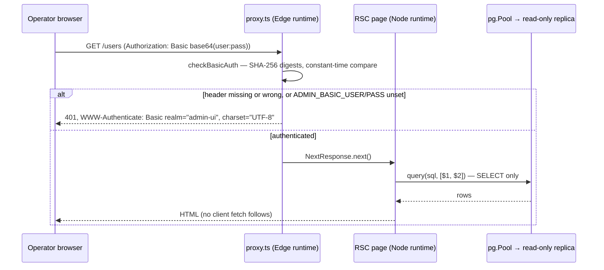

# Admin UI (`admin-ui/`)

> Last updated: 2026-09-03 · commit `5d400cf75`

`admin-ui/` is the internal, read-only operations dashboard: a separate Next.js 16 / React 19 application (`admin-ui/package.json`) whose pages are React Server Components that run parameterised `SELECT` statements against the coordinator database's read-only replica at request time. It has one authentication surface (HTTP Basic, enforced by `admin-ui/src/proxy.ts`), no API routes, and no browser-side data fetching. It is not the consumer console — that is [`console-ui.md`](console-ui.md) — and it never talks to the coordinator's HTTP API.

## Context

Operators need to see raw users, machines, sessions, usage, balances, earnings, keys, models, releases and referral data without giving anyone write access to production or building bespoke coordinator endpoints. The admin UI answers that with the smallest possible surface: server-rendered tables over a replica that is physically read-only, behind a single shared credential, on a private port (`next dev -p 4001` / `next start -p 4001`). `admin-ui/README.md` states the deployment rule that follows from that design: Basic Auth alone is not sufficient for a public origin; front it with a VPN, IAP, Cloudflare Access, or an IP allow-list.

## Mechanism

### Authentication gate

`admin-ui/src/proxy.ts` (`proxy`) runs on every request except `_next/static`, `_next/image`, and `favicon.ico` (`config.matcher`). It calls `checkBasicAuth(req.headers.get("authorization"))` (`admin-ui/src/lib/auth.ts`) and, on failure, returns `401` with `WWW-Authenticate: Basic realm="admin-ui", charset="UTF-8"`. `checkBasicAuth`:

1. Reads `ADMIN_BASIC_USER` and `ADMIN_BASIC_PASS`; if either is unset it returns `false` — the gate fails closed.
2. Requires a `Basic ` prefix, base64-decodes with `atob`, splits on the first `:`.
3. Compares user and password with `digestEqual`, which hashes both operands with `crypto.subtle.digest("SHA-256", …)` and XOR-folds the fixed-length digests, so neither the secret length nor the mismatch position leaks through timing.
4. Evaluates both comparisons via `Promise.all` before combining them, so a wrong username does not short-circuit the password check.

There is no session, cookie, or token: the browser re-sends the Basic header on every request. There is no lockout or rate limit in the gate.

### Database access

`admin-ui/src/lib/db.ts` (`import "server-only"`) builds one `pg.Pool` (`makePool`) from `ADMIN_DB_URL`. It strips any `sslmode`/`ssl` query parameters from the URL and sets TLS explicitly: `ssl: { rejectUnauthorized: false }` when `ADMIN_DB_SSL_NO_VERIFY === "true"`, otherwise `ssl: true` (full verification). Pool settings: `max: 4`, `idleTimeoutMillis: 30_000`, `connectionTimeoutMillis: 10_000`, `statement_timeout: 15_000`, `query_timeout: 20_000`, `application_name: "admin-ui"`. Outside `NODE_ENV=production` the pool is cached on `globalThis.__adminPool` so hot reloads do not leak connections. `query<T>(text, params)` runs a parameterised statement, retries once after 250 ms on SQLSTATE `40001` (hot-standby WAL-replay conflict), logs and rethrows other errors; `scalar()` wraps single-value counts; `isUndefinedTable(err)` detects SQLSTATE `42P01` so pages can render an "awaiting deploy" notice for tables the coordinator has not created yet. `admin-ui/next.config.ts` lists `serverExternalPackages: ["pg"]` so the driver stays in the Node runtime.

### Pages (14)

Every page under `admin-ui/src/app/` exports `runtime = "nodejs"` and is a server component; the three `*View.tsx` files and `components/InteractiveTable.tsx`/`components/CopyButton.tsx` are client components for sorting, filtering, and copy buttons over data the server already rendered. Navigation is the `NAV` array in `admin-ui/src/components/AppShell.tsx`. Query files live in `admin-ui/src/lib/queries/`; each exported function is a `SELECT` (or `WITH … SELECT`) with user input bound as `$n` parameters.

| Path | Page file | Query file (functions) | Tables read |
|---|---|---|---|
| `/` | `admin-ui/src/app/page.tsx` | `overview.ts` (`getHeadlineStats`, `getTableCounts`) | `users`, `providers`; `pg_class`/`pg_namespace` for `reltuples` estimates |
| `/users` | `admin-ui/src/app/users/page.tsx` (+ `UsersView.tsx`) | `users.ts` (`listUsers`, `countUsers`) | `users`, `balances`, `providers` |
| `/providers` (nav "Machines") | `admin-ui/src/app/providers/page.tsx` (+ `MachinesView.tsx`) | `providers.ts` (`listMachines`, `countMachines`) | `providers`, `users` |
| `/providers/[id]` | `admin-ui/src/app/providers/[id]/page.tsx` | `machine.ts` (`getMachineByProviderID`, `getMachineReputation`, `getRecentUsageForProvider`), `sessions.ts` (`getMachineSessions`) | `providers`, `users`, `provider_reputation`, `usage`, `provider_sessions` |
| `/operators` | `admin-ui/src/app/operators/page.tsx` (+ `OperatorsView.tsx`) | `operators.ts` (`listOperators`) | `providers`, `users`, `balances` |
| `/uptime` | `admin-ui/src/app/uptime/page.tsx` | `sessions.ts` (`getUptimeOverview`) | `provider_sessions`, `users` |
| `/usage` | `admin-ui/src/app/usage/page.tsx` | `usage.ts` (`listUsage`, `countUsage`) | `usage`, `api_keys`, `users` |
| `/billing` | `admin-ui/src/app/billing/page.tsx` | `billing.ts` (`listTopBalances`, `listRecentLedger`) | `balances`, `ledger_entries`, `users` |
| `/earnings` | `admin-ui/src/app/earnings/page.tsx` | `earnings.ts` (`listTopEarners`, `listRecentEarnings`) | `earnings_summary`, `provider_earnings`, `users` |
| `/api-keys` | `admin-ui/src/app/api-keys/page.tsx` | `apikeys.ts` (`listApiKeys`, `countApiKeys`) | `api_keys`, `users` |
| `/models` | `admin-ui/src/app/models/page.tsx` | `models.ts` (`listModels`, `countModels`; `DEFAULT_INPUT_PRICE_MICRO`, `DEFAULT_OUTPUT_PRICE_MICRO` mirror the coordinator's fallback prices — values in [`../../reference/pricing-model.md`](../../reference/pricing-model.md)) | `model_registry`, `model_active_versions`, `model_versions`, `model_prices` |
| `/openrouter` | `admin-ui/src/app/openrouter/page.tsx` | `openrouter.ts` (`listOpenRouterAccounts`; `email ILIKE '%@openrouter.ai%'`) | `users`, `balances`, `api_keys`, `ledger_entries`, `usage` |
| `/releases` | `admin-ui/src/app/releases/page.tsx` | `releases.ts` (`listReleases`, `countReleases`) | `releases` |
| `/referrals` | `admin-ui/src/app/referrals/page.tsx` | `referrals.ts` (`listReferrers`, `listInviteCodes`) | `referrers`, `referrals`, `users`, `invite_codes` |

`admin-ui/src/app/error.tsx` (`RouteError`) is the route-level boundary: a failed query renders `admin-ui/src/components/DbError.tsx` plus a Retry button while `AppShell` stays mounted. There are no `route.ts` files anywhere under `admin-ui/src/app/`.

### Security headers

`admin-ui/next.config.ts` (`cspDirectives`, `securityHeaders`) sets on every path: `Content-Security-Policy` with `default-src 'self'`, `script-src 'self' 'unsafe-inline'`, `style-src 'self' 'unsafe-inline'`, `img-src 'self' data:`, `font-src 'self' data:`, `connect-src 'self'`, `frame-ancestors 'none'`, `base-uri 'self'`, `form-action 'self'`; plus `X-Frame-Options: DENY`, `X-Content-Type-Options: nosniff`, `Referrer-Policy: no-referrer`, `Permissions-Policy: camera=(), microphone=(), geolocation=()`. `admin-ui/src/app/layout.tsx` sets `robots: { index: false, follow: false }`. No third-party script, style, or connection is allowed.

### Environment variables

Names and effect only; requiredness and defaults are in [`../../reference/configuration.md`](../../reference/configuration.md). All are server-only; none is `NEXT_PUBLIC_*`.

| Variable | Read in | Effect |
|---|---|---|
| `ADMIN_DB_URL` | `admin-ui/src/lib/db.ts` (`makePool`) | Postgres connection string for the read-only replica; pool creation throws when unset |
| `ADMIN_DB_SSL_NO_VERIFY` | `admin-ui/src/lib/db.ts` | `"true"` disables server-certificate verification |
| `ADMIN_BASIC_USER`, `ADMIN_BASIC_PASS` | `admin-ui/src/lib/auth.ts` (`checkBasicAuth`) | Basic-auth credential; either unset → every request is 401 |
| `NODE_ENV` | `admin-ui/src/lib/db.ts` | Outside `production` the pool is cached on `globalThis` |

## Invariants

1. **Every route is behind Basic auth, and the gate fails closed.** `config.matcher` in `admin-ui/src/proxy.ts` excludes only Next static assets; `checkBasicAuth` (`admin-ui/src/lib/auth.ts`) returns `false` when `ADMIN_BASIC_USER` or `ADMIN_BASIC_PASS` is unset.
2. **Credential comparison is constant-time and non-short-circuiting.** `digestEqual` compares SHA-256 digests with an XOR fold; `checkBasicAuth` awaits both comparisons with `Promise.all` (`admin-ui/src/lib/auth.ts`).
3. **The application only reads.** Every exported function in `admin-ui/src/lib/queries/*.ts` issues `SELECT`/`WITH … SELECT`; all user-supplied values are `$n` parameters passed to `query()` (`admin-ui/src/lib/db.ts`). Write protection is additionally enforced below the app by the replica (`transaction_read_only=on`) and the `readonly` role's grants (`admin-ui/src/lib/db.ts` header comment, `admin-ui/README.md`).
4. **Credential hashes are never selected.** `api_keys.key_hash` and `usage.consumer_key_hash` are used only in `JOIN` conditions (`listUsage` in `admin-ui/src/lib/queries/usage.ts`, `listApiKeys` in `admin-ui/src/lib/queries/apikeys.ts`, `getRecentUsageForProvider` in `admin-ui/src/lib/queries/machine.ts`); coordinator-private `serial_number` values are resolved inside SQL and not returned (`getMachineByProviderID`, `getMachineSessions` in `admin-ui/src/lib/queries/sessions.ts`).
5. **Database access is server-only.** `admin-ui/src/lib/db.ts` and every query module start with `import "server-only"`; `serverExternalPackages: ["pg"]` (`admin-ui/next.config.ts`) keeps the driver out of the client bundle; no file under `admin-ui/src/` calls `fetch`, and there are no route handlers, so the browser receives HTML only.
6. **Every query is time-bounded.** `statement_timeout: 15_000` and `query_timeout: 20_000` on the pool; one retry on SQLSTATE `40001` (`query`, `admin-ui/src/lib/db.ts`).
7. **The page cannot be embedded or indexed.** `frame-ancestors 'none'` and `X-Frame-Options: DENY` (`admin-ui/next.config.ts`); `robots: { index: false, follow: false }` (`admin-ui/src/app/layout.tsx`).

## Failure modes

| Symptom | Cause | Where |
|---|---|---|
| Every request returns 401, including with correct credentials | `ADMIN_BASIC_USER` or `ADMIN_BASIC_PASS` not set in the runtime environment (fail-closed) | `checkBasicAuth` (`admin-ui/src/lib/auth.ts`) |
| Every page shows "Could not query the read-only replica. Check `ADMIN_DB_URL`" | `makePool` threw `ADMIN_DB_URL is not set …`, or the replica is unreachable, or a statement hit `statement_timeout` | `admin-ui/src/lib/db.ts`, `admin-ui/src/app/error.tsx`, `admin-ui/src/components/DbError.tsx` |
| A page fails once, then succeeds on Retry | Hot-standby WAL-replay conflict (SQLSTATE `40001`) that outlasted the single 250 ms retry | `query` (`admin-ui/src/lib/db.ts`) |
| `/uptime` or the sessions section of `/providers/[id]` shows an "awaiting deploy" notice | `provider_sessions` does not exist yet on this database (SQLSTATE `42P01`) | `isUndefinedTable` (`admin-ui/src/lib/db.ts`), `admin-ui/src/app/uptime/page.tsx`, `admin-ui/src/app/providers/[id]/page.tsx` |
| Table counts on `/` look stale or read `0` for a new table | `getTableCounts` uses `pg_class.reltuples` estimates (clamped at `0`), refreshed only by `ANALYZE`/autovacuum | `admin-ui/src/lib/queries/overview.ts` |
| Connection succeeds against a replica with a self-signed certificate only when `ADMIN_DB_SSL_NO_VERIFY=true` | The unset default ([configuration](../../reference/configuration.md#admin-ui)) verifies certificates; the RDS CA must be installed, or verification disabled (internal use only) | `makePool` (`admin-ui/src/lib/db.ts`), `admin-ui/README.md` |
| Credential brute force is not throttled | The gate has no lockout or rate limit; the README requires a network gate in front of any exposed deployment | `admin-ui/src/proxy.ts`, `admin-ui/README.md` |

## Code map

| Concern | File (symbol) |
|---|---|
| Request gate | `admin-ui/src/proxy.ts` (`proxy`, `config.matcher`) |
| Basic-auth check | `admin-ui/src/lib/auth.ts` (`checkBasicAuth`, `digestEqual`) |
| Connection pool and query helpers | `admin-ui/src/lib/db.ts` (`makePool`, `pool`, `query`, `scalar`, `isUndefinedTable`) |
| SQL, per page | `admin-ui/src/lib/queries/` (`overview.ts`, `users.ts`, `providers.ts`, `machine.ts`, `operators.ts`, `sessions.ts`, `usage.ts`, `billing.ts`, `earnings.ts`, `apikeys.ts`, `models.ts`, `openrouter.ts`, `releases.ts`, `referrals.ts`) |
| Layout, navigation, error boundary | `admin-ui/src/app/layout.tsx` (`RootLayout`), `admin-ui/src/components/AppShell.tsx` (`NAV`), `admin-ui/src/app/error.tsx` (`RouteError`), `admin-ui/src/components/DbError.tsx` |
| Security headers | `admin-ui/next.config.ts` (`cspDirectives`, `securityHeaders`, `serverExternalPackages`) |
| Formatting helpers and the only test | `admin-ui/src/lib/format.ts`, `admin-ui/src/lib/format.test.ts` (`npm test`, vitest, `environment: node`) |
| Build, lint, run | `admin-ui/package.json` (`dev`, `build`, `start`, `lint`, `test`) — not wired into the root `Makefile` or CI |

## Related

- [`console-ui.md`](console-ui.md) — the public consumer console, a different application with a different auth model
- [`../storage.md`](../storage.md) — the coordinator's Postgres schema these queries read
- [`../billing.md`](../billing.md) — meaning of `balances`, `ledger_entries`, `provider_earnings`, `earnings_summary`
- [`../../reference/configuration.md`](../../reference/configuration.md) — `ADMIN_*` variables
- [`../../reference/pricing-model.md`](../../reference/pricing-model.md) — fallback prices shown on `/models`
- [`../../developer/build.md`](../../developer/build.md), [`../../developer/test.md`](../../developer/test.md) — building and testing `admin-ui/`
