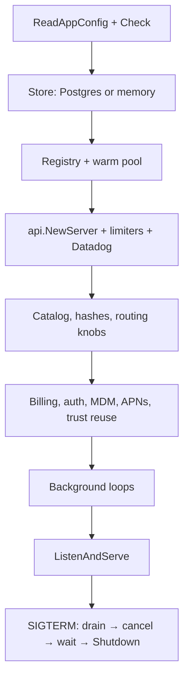

# Coordinator

> Last updated: 2026-09-03 · commit `5d400cf75`

The coordinator is Darkbloom's control plane: one Go HTTP/WebSocket service
(binary `coordinator/cmd/coordinator`) that authenticates consumers, picks a
provider for each request, verifies provider attestations, keeps the ledger,
relays the request and its streamed response, and emits telemetry. Production
runs it in a GCP Confidential VM. It is a trust boundary, not a blind relay: it
holds the plaintext of a request in hardware-encrypted memory for the duration
of that request — decrypting a sender-sealed body, fetching remote media,
rendering prompt templates, then re-sealing hop-by-hop to the chosen provider —
and it must not log or persist prompt or response content. The privacy model is
in [`../security/encryption.md`](../security/encryption.md).

## Context

Providers are consumer-owned Macs behind NAT that dial out over WebSocket;
consumers speak the OpenAI-compatible HTTP API. Something has to sit in the
middle to know which machines are online, trusted and warm for a model, to
charge the right account, and to enforce fleet-wide policy. The coordinator is
that single process. Its registry of connected providers lives in memory and
is rebuilt from reconnects after every restart; everything else durable lives
in Postgres ([`../storage.md`](../storage.md)).

## Responsibilities

| Responsibility | What the coordinator does | Detail lives in |
|---|---|---|
| Authentication and accounts | Privy JWTs, API keys, the admin key, provider device-code login; per-key limits and roles. | [`../../reference/api-contracts.md`](../../reference/api-contracts.md), [`../security/identity-binding.md`](../security/identity-binding.md) |
| Routing and admission | Candidate selection, TTFT and decode-floor estimates, queueing, cold dispatch, warm-pool control, health ejection, cache-aware routing. | [`../routing.md`](../routing.md), [`../scheduling.md`](../scheduling.md), [`../cache-aware-routing.md`](../cache-aware-routing.md) |
| Attestation and trust | Secure Enclave challenges, MDM/MDA verification, APNs code-identity, trust reuse, release-policy evidence. | [`../security/attestation.md`](../security/attestation.md), [`../security/enrollment.md`](../security/enrollment.md) |
| Billing | Reservation, settlement, provider earnings, Stripe deposits and Connect payouts, referrals, base rewards. Prices and the platform fee are stated once in [`../billing.md#invariants`](../billing.md#invariants). | [`../billing.md`](../billing.md) |
| Relay | Decrypts sender-sealed bodies, inlines remote media, renders the prompt contract, seals per request to the provider's X25519 key, streams SSE back. | [`../data-flow.md`](../data-flow.md), [`../prompt-contract-sidecar.md`](../prompt-contract-sidecar.md) |
| Model registry and releases | Catalog, aliases, publishing, provider binary releases and known hashes. | [`../model-registry.md`](../model-registry.md), [`../../operations/release-policy-rollout.md`](../../operations/release-policy-rollout.md) |
| Telemetry | Route and rejection records, the system profiler, Datadog metrics and logs. | [`../telemetry.md`](../telemetry.md), [`../system-profiler.md`](../system-profiler.md) |
| Admin and operations | `/v1/admin/*`, invite codes, state export, MDM webhook, drain/readiness. | [`../../reference/api-contracts.md`](../../reference/api-contracts.md), [`../../operations/state-export.md`](../../operations/state-export.md) |

## Code map

Every directory under `coordinator/` and what it owns.

| Package | Owns |
|---|---|
| `coordinator/cmd/coordinator` | `main`: configuration load, store selection, wiring, background loops, HTTP server, graceful shutdown. |
| `coordinator/config` | `AppConfig` — composes every package's `ReadConfig` and runs their `Check` methods. |
| `coordinator/env` | `EnvPrefix` (`EIGENINFERENCE`) and the `EnvOr`/`EnvInt`/`EnvFloat`/`EnvBool` helpers. |
| `coordinator/api` | The HTTP router (`routes` in `server.go`), middleware, consumer handlers (`consumer.go`), the provider WebSocket (`provider.go`), dispatch ladder (`dispatch.go`), sender encryption, admin, release, model-registry, device-auth and Stripe handlers, drain, profiler wiring. |
| `coordinator/registry` | In-memory fleet view, scheduler and cost model, queue, warm pool, capacity breakers, health ejection, cache routing, TTFT calibration and shadow admission. |
| `coordinator/store` | `Store` interface, Postgres and memory backends, schema migrations. |
| `coordinator/protocol` | Wire types for the provider WebSocket: register, heartbeat, capacity, inference frames, telemetry, profiles. |
| `coordinator/internal/e2e` | NaCl Box (X25519 + XSalsa20-Poly1305) for coordinator↔provider and sender↔coordinator sealing. |
| `coordinator/attestation` | Secure Enclave attestation verification and Apple MDA certificate chains. |
| `coordinator/apns` | APNs push attestor for code identity. |
| `coordinator/mdm` | MicroMDM client and verification scheduler. |
| `coordinator/auth` | Privy JWT verification. |
| `coordinator/profilesign` | CMS signing of the enrollment profile. |
| `coordinator/billing` | Billing service, Stripe Checkout and Connect, referrals. |
| `coordinator/payments` | Ledger and pricing. |
| `coordinator/ratelimit` | Per-account, financial and service-tier limiters; expected-output admission. |
| `coordinator/modelpolicy` | Exact-model first-content deadline policy. |
| `coordinator/mediafetch` | SSRF-guarded remote media resolution. |
| `coordinator/promptcontract` | Supervisor, client and artifact provisioner for the prompt-contract sidecar. |
| `coordinator/promptsidecar` | The Rust sidecar itself. |
| `coordinator/stateexport` | Snapshot, zip and age encryption for the admin state export. |
| `coordinator/datadog` | Metrics (HTTP API and DogStatsD), Logs API forwarding, trace handler. |
| `coordinator/telemetry` | Structured telemetry emitter. |
| `coordinator/saferun` | Panic-safe goroutine launcher used by every background loop. |
| `coordinator/deploy` | `start.sh` container entrypoint (persistent disk, MicroMDM). |

## Startup sequence

`main` (`coordinator/cmd/coordinator/main.go`) runs these steps in order; a
failure in any step marked *fatal* exits the process before it listens.

1. **Logging.** JSON `slog`; a Datadog trace handler is layered on when
   `DD_API_KEY` or `DD_AGENT_HOST` is set.
2. **Configuration** (*fatal*). `config.ReadAppConfig` reads every package's
   environment, then `Check` rejects invalid combinations (no DSN without the
   memory-store opt-in, mock billing with a live Stripe key, malformed media
   fetch or cache-routing values, an unknown trust level). Every variable is
   listed in [`../../reference/configuration.md`](../../reference/configuration.md).
3. **Store** (*fatal*). Postgres when a DSN is set — connect, ping, run the
   idempotent migration slice, seed the admin key — otherwise the memory store
   with its 15 minute pruner. Provider sessions orphaned by the previous
   process are closed, best-effort, with a 10 second budget.
4. **Registry.** `registry.New`, trust floor, dedicated models, quality
   concurrency cap, cache routing (*fatal* on an invalid mode or key), then the
   warm-pool controller starts.
5. **Server.** `api.NewServer` with the live TTFT deadline base, media fetch
   config and durable trust reuse; the prompt-sidecar provisioner if enabled;
   rate limiters (each with its own pruner); telemetry emitter; Datadog tracer
   and client.
6. **Catalog and policy** (*fatal* for the release inventory). Model catalog
   sync, binary-hash and runtime-manifest sync from the store, then the
   routing knobs read directly from the environment (release policy mode,
   TTFT admission, reject list, decode floor, servability gate, prompt
   calibration, pprof listener).
7. **Money and identity.** Ledger and billing service, base rewards, the
   sender-encryption key from the mnemonic, admin emails, Privy, MDM client
   and verification scheduler, profile signer, APNs attestor and the
   code-attestation cache, the trust-reuse cache (*fatal* if its revocation
   journal is unusable).
8. **Background loops.** Provider eviction sweep (`StartEvictionLoop`, cadence and timeout in [scheduling.md](../scheduling.md#heartbeat-cadence-and-eviction)); DogStatsD gauge loop;
   profiler fleet sampler and retention sweep; read-cache janitor; throughput
   anomaly detector; base-rewards settlement (when enabled); Stripe payout
   reconciler; the prompt sidecar supervisor and preloader.
9. **Listen.** `http.Server` on `:EIGENINFERENCE_PORT` with a 5 s header
   timeout, 10 s read timeout, no write timeout (SSE), 120 s idle timeout and
   a 64 KiB header cap; an optional private pprof listener.
10. **Shutdown.** On SIGINT/SIGTERM: mark draining (`/readyz` turns 503 and
    providers are told to reconnect elsewhere), cancel the loops, stop the
    sidecar, wait up to `EIGENINFERENCE_DRAIN_GRACE` for in-flight requests,
    then `Shutdown` with a 15 s backstop; deferred closes stop Datadog and the
    Postgres pool.

## Invariants

1. **Plaintext lives only in memory, only for the request.** Bodies are
   decrypted inside the CVM, re-sealed per request to the provider's attested
   key, and never written to the store or logs; provider error strings are
   reduced to a closed vocabulary before logging
   (`coordinator/api/consumer.go`, `coordinator/api/inference_error_sanitize.go`,
   `coordinator/internal/e2e/e2e.go`).
2. **A misconfigured coordinator does not serve.** `AppConfig.Check` and the
   fatal startup steps above exit 1 before the listener opens
   (`coordinator/config/app_config.go`, `coordinator/cmd/coordinator/main.go`).
3. **Every background loop is panic-safe.** Loops start through
   `saferun.Go`, which logs and recovers instead of taking the process down
   (`coordinator/saferun/saferun.go`).
4. **Only trusted, current providers receive traffic.** Routing passes
   through one chokepoint that checks trust level, version floor, health
   ejection and release-policy evidence (`coordinator/registry/registry.go`,
   `providerSupportsPrivateTextLocked`).
5. **Shutdown drains before it disconnects.** New requests get 429 with
   `Retry-After` while in-flight streams finish, bounded by the drain grace
   (`coordinator/api/drain.go`).

## Failure modes

| Symptom | Likely cause | Where to look |
|---|---|---|
| Process exits before binding the port | A `Check` failure, store connect/migration error, missing release inventory, or an unusable trust-reuse journal | The first `Error` log line; [`../storage.md#failure-modes`](../storage.md#failure-modes) |
| Fleet 429s for minutes after a deploy | Empty registry until providers reconnect and re-attest; release-policy enforcement bites only after its boot grace ([`EIGENINFERENCE_RELEASE_POLICY_ENFORCE_GRACE`](../../reference/configuration.md#release-policy-version-floor-and-binary-hashes)) | [`../../operations/release-policy-rollout.md`](../../operations/release-policy-rollout.md) |
| CPU saturation under retry storms | Routing scans per dispatch attempt; bounded by `EIGENINFERENCE_ROUTING_CONCURRENCY` | [`../scheduling.md`](../scheduling.md) |
| Streams cut during a restart | Drain grace shorter than the longest generation | `EIGENINFERENCE_DRAIN_GRACE` in [`../../reference/configuration.md`](../../reference/configuration.md) |
| Requests with remote images fail | Media fetch disabled or SSRF guard rejected the host | [`../data-flow.md`](../data-flow.md) |

## Configuration

Every environment variable, its default and where it is read:
[`../../reference/configuration.md`](../../reference/configuration.md). This
page deliberately carries no variable table.

## Deployment

Image build, the environment file, blue-green swap and rollback:
[`../../operations/coordinator-deploy.md`](../../operations/coordinator-deploy.md).
The dev VM: [`../../operations/dev-environment.md`](../../operations/dev-environment.md).

## Related

- [`../overview.md`](../overview.md) — where the coordinator sits between consumers and providers
- [`../data-flow.md`](../data-flow.md) — a request end to end
- [`../routing.md`](../routing.md), [`../scheduling.md`](../scheduling.md) — how a provider is chosen
- [`../security/encryption.md`](../security/encryption.md), [`../security/attestation.md`](../security/attestation.md), [`../security/enrollment.md`](../security/enrollment.md) — the trust boundary
- [`../billing.md`](../billing.md) — prices, fee, ledger
- [`../storage.md`](../storage.md) — what it persists
- [`../telemetry.md`](../telemetry.md) — what it emits
- [`../../reference/api-contracts.md`](../../reference/api-contracts.md), [`../../reference/protocol-messages.md`](../../reference/protocol-messages.md) — the HTTP and WebSocket surfaces
- [`provider.md`](provider.md) — the other end of the WebSocket
