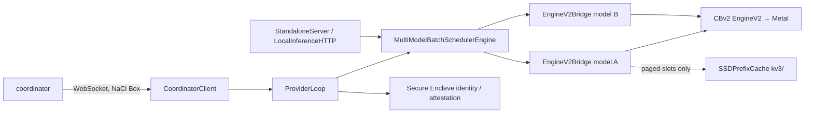

# Provider process

> Last updated: 2026-09-03 · commit `5d400cf75`

The provider is the Apple Silicon Mac that decrypts prompts and runs inference.
It ships as one Swift package (`provider-swift/`) producing the `darkbloom` CLI,
a `darkbloom-enclave` helper and an optional `darkbloom-fan-helper`, all built
on the `ProviderCore` library and the three pinned MLX submodules described in
[`mlx-swift.md`](mlx-swift.md). This page maps the process's components; the
inference path itself is in [`../inference.md`](../inference.md).

## Context

The provider connects outbound to the coordinator over WebSocket, decrypts each
request in-process with its X25519 node key, serves it through one in-process
CBv2 engine per resident model, and encrypts the response back. It is the
decryption endpoint of the hop-by-hop model
([`../security/encryption.md`](../security/encryption.md)), so everything that
touches plaintext — template rendering, tokenisation, the engine, the KV cache —
lives inside this one hardened process. `ProviderCore.version = "0.8.16"`
(`provider-swift/Sources/ProviderCore/ProviderCore.swift`).

## Mechanism

### Binaries and libraries (`provider-swift/Package.swift`)

| Product | Kind | Role |
|---|---|---|
| `darkbloom` | executable | CLI: `start`, `status`, `doctor`, `logs`, `benchmark`, `models`, `fan`, `watchdog`; long-running serve modes host an `NSApplication(.accessory)` run loop for APNs pushes (`provider-swift/Sources/darkbloom/main.swift`, `provider-swift/Sources/darkbloom/Darkbloom.swift`) |
| `darkbloom-enclave` | executable | Secure Enclave helper used by `coordinator/api/install.sh` before the daemon runs: `attest`, `sign`, `info`, `wallet-address` (`provider-swift/Sources/darkbloom-enclave-cli/`); the installer keeps an `eigeninference-enclave` symlink |
| `darkbloom-fan-helper` | executable | Opt-in root LaunchDaemon for fan control; never installed by default (`provider-swift/Sources/DarkbloomFanHelper/`) |
| `ProviderCore` | library | Everything below; shared by the CLI and helpers |
| `ProviderCoreFoundation` | library | Pure-Foundation pieces also linked by publish tooling: `WeightHasher`, `PromptContractIdentity`, `TemplateRenderCheck`, `ModelScanner`, `Manifest` (`provider-swift/Sources/ProviderCoreFoundation/`) |
| `DarkbloomFanCore`, `DarkbloomFanProtocol`, `DarkbloomFanService` | libraries | SMC access, XPC boundary and lease validation for the fan helper |

### `ProviderCore` components

| Component | Responsibility | Code |
|---|---|---|
| Coordinator client | WebSocket connection, reconnection backoff, protocol codec, registration | `provider-swift/Sources/ProviderCore/Coordinator/CoordinatorClient.swift`, `provider-swift/Sources/ProviderCore/Coordinator/CoordinatorClientCodec.swift` |
| `ProviderLoop` (actor) | Event loop: inference requests and cancellations, `load_model` / `prefetch_model` / `desired_models`, heartbeats and capacity, attestation challenges, startup preload, idle timeout, auto-update | `provider-swift/Sources/ProviderCore/ProviderLoop.swift` and its `ProviderLoop+*.swift` extensions |
| Inference | `MultiModelBatchSchedulerEngine` → one `EngineV2Bridge` per model → CBv2; slot construction, memory model, deadlines, MTP, vision | `provider-swift/Sources/ProviderCore/Inference/` — [`../inference.md`](../inference.md), [`../hardware-support.md`](../hardware-support.md) |
| KV cache tiers | Encrypted SSD prefix cache (`KVCacheSSD/`) plus the legacy sweeper and key-wrapping service (`KVCache/`); no RAM prefix tier in production | `provider-swift/Sources/ProviderCore/KVCacheSSD/`, `provider-swift/Sources/ProviderCore/KVCache/` — [`../prefix-cache.md`](../prefix-cache.md) |
| Model discovery and download | Scan of the Hugging Face cache, quantization detection, padded memory estimate, catalog client, prefetch and hot-swap | `provider-swift/Sources/ProviderCore/Models/`, `provider-swift/Sources/ProviderCore/Server/ModelPrefetchCoordinator.swift` |
| Local / standalone serving | OpenAI-compatible HTTP on loopback or tailnet (`start --local`, `--local-endpoint`) using the upstream `MLXLMServer` router over the same engine | `provider-swift/Sources/ProviderCore/Server/StandaloneServer.swift`, `provider-swift/Sources/ProviderCore/Server/LocalInferenceHTTP.swift` |
| Security and identity | Secure Enclave P-256 identity, attestation blob, APNs code-identity, anti-debug, environment scrub, SIP/boot checks | `provider-swift/Sources/ProviderCore/Security/`, `provider-swift/Sources/ProviderCore/Apns/APNsBridge.swift` — [`../security/attestation.md`](../security/attestation.md) |
| Crypto | X25519 node keypair; NaCl Box via `swift-sodium` for the coordinator wire | `provider-swift/Sources/ProviderCore/Crypto/NodeKeyPair.swift` |
| Service management | launchd agents for the provider and the crash-recovery watchdog (`io.darkbloom.watchdog`), env allowlist (`passthroughEnvKeys`), daemon state file, sleep prevention | `provider-swift/Sources/ProviderCore/Service/LaunchAgent.swift`, `provider-swift/Sources/ProviderCore/Service/WatchdogAgent.swift`, `provider-swift/Sources/ProviderCore/Service/DaemonStateFile.swift`, `provider-swift/Sources/ProviderCore/Service/ProcessLifecycle.swift` |
| Hardware and telemetry | Chip identity, memory, thermal state; request profiles and telemetry allowlists | `provider-swift/Sources/ProviderCore/Hardware/`, `provider-swift/Sources/ProviderCore/Telemetry/` — [`../telemetry.md`](../telemetry.md) |

### Process boundaries

- **In-process inference.** The MLX stack is linked into the `darkbloom`
  binary; there is no Python interpreter and no inference subprocess. The only
  child processes are the paged-kernel preflight (`PagedKernelPreflight`,
  `runtime-smoke`) and the launchd-managed watchdog. The optional local HTTP
  endpoint serves from the same loaded models in the same process.
- **Fan helper.** A separate root LaunchDaemon that accepts an activity lease
  only from the exact Darkbloom signing identity and can write only the SMC fan
  keys exposed by `DarkbloomFanCore`; it receives no prompts, keys or network
  (`provider-swift/Sources/DarkbloomFanProtocol/FanIPC.swift`,
  `provider-swift/Sources/DarkbloomFanHelper/FanXPCService.swift`).
- **promptsidecar** is a coordinator-side process; the provider computes the
  same contract identity locally and never talks to it
  ([`../prompt-contract-sidecar.md`](../prompt-contract-sidecar.md)).

## Invariants

1. Prompts are decrypted only inside this process and never logged; logs carry
   request ids, model ids and token counts — `ProviderLoop+InboundDecode.swift`,
   `ProviderLoop+InferenceHandler.swift`.
2. The X25519 private key is generated in-process and never leaves the Mac —
   `Crypto/NodeKeyPair.swift`.
3. The SE P-256 identity binds the node key, binary hash, SIP and boot state
   into every attestation — `Security/AttestationBuilder.swift`,
   `Security/PersistentEnclaveKey.swift`.
4. Installed daemons receive only allowlisted environment variables —
   `Service/LaunchAgent.swift` (`passthroughEnvKeys`).
5. One `EngineV2Bridge` per resident model, at most `max_model_slots` (default
   `3`) — `ProviderLoop+ModelLoading.swift`, `Config/ProviderConfig.swift`.

## Failure modes

| Symptom | Cause | Where |
|---|---|---|
| Daemon exits at start | Metal or RAM preflight failed ([`../hardware-support.md`](../hardware-support.md)) | `provider-swift/Sources/darkbloom/StartCommand+Preflight.swift` |
| Provider offline after a crash | Watchdog agent stopped or persistently disabled | `Service/WatchdogAgent.swift` |
| Env knob has no effect on the installed daemon | Not in `passthroughEnvKeys` | `Service/LaunchAgent.swift` |
| Attestation trust downgraded | SIP off, boot-security warning, or stale APNs code-identity | `Security/BootSecurity.swift`, `Apns/APNsBridge.swift` — [`../../provider/attestation.md`](../../provider/attestation.md) |

## Code map

| Concern | Path |
|---|---|
| CLI | `provider-swift/Sources/darkbloom/` |
| Enclave helper | `provider-swift/Sources/darkbloom-enclave-cli/` |
| Core library | `provider-swift/Sources/ProviderCore/` |
| Foundation-only library | `provider-swift/Sources/ProviderCoreFoundation/` |
| Fan control | `provider-swift/Sources/DarkbloomFanCore/`, `provider-swift/Sources/DarkbloomFanProtocol/`, `provider-swift/Sources/DarkbloomFanService/`, `provider-swift/Sources/DarkbloomFanHelper/` |
| Tests | `provider-swift/Tests/` |

## Related

- [`mlx-swift.md`](mlx-swift.md) — the three pinned submodules and the metallib
- [`../inference.md`](../inference.md), [`../prefix-cache.md`](../prefix-cache.md), [`../hardware-support.md`](../hardware-support.md)
- [`../security/encryption.md`](../security/encryption.md), [`../../provider/attestation.md`](../../provider/attestation.md)
- [`coordinator.md`](coordinator.md) — the other side of the WebSocket
- [`../../provider/cli-reference.md`](../../provider/cli-reference.md), [`../../provider/fan-control.md`](../../provider/fan-control.md)
