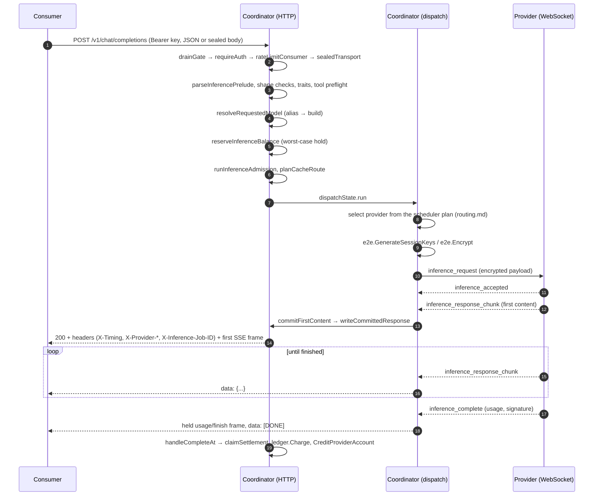

# Data flow: one request end to end

> Last updated: 2026-09-03 · commit `5d400cf75`

A consumer request travels consumer → coordinator → provider → coordinator → consumer. This page shows that journey once — as a sequence diagram and a stage table naming the code that owns each step — for anyone tracing a request through the coordinator.

## Context

The coordinator never executes a model; it authenticates, admits, reserves funds, chooses a provider, encrypts the job, relays the provider's chunks, and settles. Every stage below is one of those jobs. Provider selection and provider-side execution each get one row and a link — [`routing.md`](routing.md) and [`inference.md`](inference.md) hold the detail; the reasoning behind the pipeline's shape is in [`components/consumer.md`](components/consumer.md), and the profiler stamps taken along the path are described in [`system-profiler.md`](system-profiler.md).

## Mechanism

### Sequence

Two things the diagram makes visible. First, the consumer receives no bytes until step 14: every failure before the commit in step 13 is an ordinary HTTP error with a real status (a first-content deadline miss is a 429 with `Retry-After`), and the coordinator may have tried several providers in the meantime. Second, the provider never talks to the consumer; both legs terminate at the coordinator, which is what lets the coordinator hold the money, the identity, and the encryption boundary.

### Stages and owning code

| # | Stage | What happens | Owning symbol |
|---|---|---|---|
| 1 | Ingress | HTTP request hits the mux; `X-Request-ID` is honoured or minted; global body ceiling [`maxRequestBodyBytes`](../reference/api-contracts.md#limits-and-validation) | `loggingMiddleware`, `bodyLimitMiddleware` (`coordinator/api/server.go`) |
| 2 | Drain gate | While draining, new inference is refused with 429 `rate_limit_exceeded` and a fixed [`Retry-After`](../reference/api-contracts.md#timeouts-and-constants) (`coordinatorDrainRetryAfter`) | `drainGate` (`coordinator/api/drain.go`) |
| 3 | Authenticate | Bearer resolved to an API key, Privy user, or admin; key lookups cached for [`apiKeyCacheTTL`](../reference/api-contracts.md#timeouts-and-constants) | `requireAuth`, `extractBearerToken` (`coordinator/api/server.go`) |
| 4 | Rate limit | Per-key `rpm_limit`, then the account limiter; 429 with `Retry-After` | `rateLimitConsumer`, `applyKeyRPMLimit` (`coordinator/api/server.go`) |
| 5 | Unseal (optional) | `application/eigeninference-sealed+json` bodies are decrypted; the response will be sealed per event | `sealedTransport` (`coordinator/api/sender_encryption.go`); [`security/encryption.md`](security/encryption.md) |
| 6 | Parse and validate | Inference body cap [`maxInferenceBodyBytes`](../reference/api-contracts.md#limits-and-validation), tool-schema normalisation, `model` required, key allow-list, `n == 1`, tool-choice and vision rules | `parseInferencePrelude` (`coordinator/api/inference_preprocess.go`), `validateToolConstraintPolicy` (`coordinator/api/tool_constraints.go`), `visionToolsFailFast` |
| 7 | Resolve model | Alias → concrete build; the response will still echo the alias | `resolveRequestedModel` (`coordinator/api/consumer.go`); [`model-registry.md`](model-registry.md) |
| 8 | Deadline and shedding | First-content deadline computed from the prompt size; rejecting models shed with 429 | `FirstContentDeadline`, `shedIfModelRejected` (`coordinator/api/consumer.go`) |
| 9 | Token-rate admission | Input/output tokens per minute | `applyTokenRateLimitWithAdmission` (`coordinator/api/server.go`) |
| 10 | Reserve funds | Worst-case cost held on the account ledger; 402 when it cannot be | `reserveInferenceBalance` (`coordinator/api/inference_admission.go`); [`billing.md`](billing.md) |
| 11 | Fetch media | Remote `image_url` parts fetched and inlined; billed as media | `resolveRemoteMedia` (`coordinator/api/media_resolve.go`) |
| 12 | Capacity admission | Is there an eligible provider that can accept this prompt now? 429/503/413 otherwise | `runInferenceAdmission` (`coordinator/api/inference_admission.go`) |
| 13 | Plan | Cache-aware route plan for the prompt prefix | `planCacheRoute` (`coordinator/api/prompt_artifacts.go`); [`cache-aware-routing.md`](cache-aware-routing.md) |
| 14 | **Select provider** | Lowest-estimated-cost candidate from the request-local plan, with bounded alternatives for failover | `dispatchPrimary` → `registry.Queue` (`coordinator/api/dispatch.go`); scoring in [`routing.md`](routing.md) |
| 15 | Encrypt | Fresh session keys; the job body is sealed to the provider's public key | `e2e.GenerateSessionKeys`, `e2e.Encrypt` (`coordinator/internal/e2e/e2e.go`), called from `dispatchPrimary` |
| 16 | Send | `inference_request` over the provider WebSocket | `coordinator/api/dispatch.go`, message types in `coordinator/protocol/messages.go` |
| 17 | **Provider executes** | Decrypts, loads or reuses the model, streams `inference_response_chunk`, ends with `inference_complete` or `inference_error` | [`inference.md`](inference.md), [`components/provider.md`](components/provider.md) |
| 18 | Wait for first content | Chunks buffered ([`chunkBufferSize`](../reference/api-contracts.md#timeouts-and-constants)); a speculative backup may race; failover on error or deadline | `waitFirstChunk`, `runSpeculative`, `runRace`, `shouldStopFailover` (`coordinator/api/dispatch.go`) |
| 19 | Commit | Status, headers and the first frame are written; from here the status cannot change | `commitFirstContent`, `writeCommittedResponse` (`coordinator/api/dispatch.go`), `writeSSEResponseHeader` (`coordinator/api/sse_response.go`), `writeCommittedProviderHeaders` (`coordinator/api/response_metadata.go`) |
| 20 | Relay | Each chunk normalised and forwarded as one SSE event; usage/finish frames held to the end; single `[DONE]` | `handleStreamingResponseWithFirstChunk`, `normalizeSSEChunk`, `stripSSEDoneEvents` (`coordinator/api/consumer.go`) |
| 21 | Settle | Charge the account from provider-reported usage, record usage against the alias, credit the provider | `handleCompleteAt` → `claimSettlement`, `ledger.Charge`, `store.RecordUsageFullWithPublicModel`, `store.CreditProviderAccount` (`coordinator/api/provider.go`); [`billing.md`](billing.md) |
| 22 | Client gone | Disconnect before commit records 499 and sends `cancel` to the provider | `emitClientGone` (`coordinator/api/dispatch.go`), `sendProviderCancel` (`coordinator/api/consumer.go`) |

The platform fee applied at stage 21 is stated once, in [`billing.md#invariants`](billing.md#invariants).

### What the consumer can observe

- **Timing.** `X-Timing` is a JSON object of microsecond segments (`parse_us`, `reserve_us`, `media_fetch_us`, `route_us`, `queue_us`, `encrypt_us`, `dispatch_us`, `provider_us`, …) computed from the stamps taken at stages 6, 10, 11, 14, 16 and 19 (`requestTimingDetails`, `coordinator/api/response_metadata.go`). With metadata details enabled the same object appears as `metadata.timing`.
- **Provenance.** `X-Provider-*` headers and `metadata` name the provider, its attestation status and hardware; `se_signature` / `response_hash` in the body let the client verify the response — see [`../consumer/verification.md`](../consumer/verification.md).
- **Correlation.** `X-Request-ID` identifies the HTTP request; `X-Inference-Job-ID` identifies the coordinator job, which can differ across retries.

## Invariants

1. **Nothing reaches the consumer before first content.** Status, headers and body are written together at the commit (stage 19), so every earlier failure is an ordinary HTTP error with a real status — `commitFirstContent`, `writeCommittedResponse` (`coordinator/api/dispatch.go`).
2. **The provider never talks to the consumer.** Both legs terminate at the coordinator, which is what lets it hold the money, the identity and the encryption boundary — `dispatchPrimary` (`coordinator/api/dispatch.go`), provider socket in `coordinator/api/provider.go`.
3. **Funds are reserved before dispatch and settled from provider-reported usage** — `reserveInferenceBalance` (`coordinator/api/inference_admission.go`), `handleCompleteAt` (`coordinator/api/provider.go`).
4. **Every job body is sealed with fresh session keys to the provider's public key** — `e2e.GenerateSessionKeys`, `e2e.Encrypt` (`coordinator/internal/e2e/e2e.go`).
5. **The response echoes the alias the client sent** even though the provider ran the concrete build — `resolveRequestedModel` (`coordinator/api/consumer.go`).
6. **Once committed the status cannot change**; usage and finish frames are held to the end and exactly one `[DONE]` is written — `handleStreamingResponseWithFirstChunk`, `stripSSEDoneEvents` (`coordinator/api/consumer.go`).
7. **A client that leaves before commit cancels the job**: 499 is recorded and the provider receives `cancel` — `emitClientGone` (`coordinator/api/dispatch.go`), `sendProviderCancel` (`coordinator/api/consumer.go`).

## Failure modes

Each row is the stage at which a request can end early and what the consumer sees; the full status-code table with causes is [`components/consumer.md` → Failure modes](components/consumer.md#failure-modes).

| Stage | Symptom | Owning symbol |
|---|---|---|
| 2 | 429 `rate_limit_exceeded` with the fixed drain `Retry-After` while the coordinator drains | `drainGate` (`coordinator/api/drain.go`) |
| 4, 8, 9 | 429 with `Retry-After` from key/account rate limits, token-rate admission, or a model that is currently rejecting | `rateLimitConsumer`, `applyTokenRateLimitWithAdmission`, `shedIfModelRejected` |
| 10 | 402 when the worst-case cost cannot be reserved — taxonomy in [`billing.md`](billing.md#payment-required-responses) | `reserveInferenceBalance` |
| 12 | 429 / 503 / 413 when no eligible provider can accept the prompt now | `runInferenceAdmission` |
| 18 | First-content deadline missed on every attempt → 429 with `Retry-After`; provider faults fail over to the next candidate, a speculative backup may win the race | `waitFirstChunk`, `runSpeculative`, `runRace`, `shouldStopFailover` (`coordinator/api/dispatch.go`) |
| 20 | Provider fails after commit → in-band `error` event, status already 200 | `handleStreamingResponseWithFirstChunk` (`coordinator/api/consumer.go`) |
| 22 | Client disconnects before commit → 499 in logs, `cancel` to the provider | `emitClientGone`, `sendProviderCancel` |

## Code map

| Concern | File / symbol |
|---|---|
| Middleware chain, authentication, rate limits, token-rate admission | `coordinator/api/server.go` — `loggingMiddleware`, `bodyLimitMiddleware`, `requireAuth`, `rateLimitConsumer`, `applyTokenRateLimitWithAdmission` |
| Drain gate | `coordinator/api/drain.go` — `drainGate` |
| Sealed client transport | `coordinator/api/sender_encryption.go` — `sealedTransport` |
| Prelude parsing and validation | `coordinator/api/inference_preprocess.go` — `parseInferencePrelude`; `coordinator/api/tool_constraints.go` — `validateToolConstraintPolicy` |
| Model resolution, first-content deadline, relay, cancel | `coordinator/api/consumer.go` — `resolveRequestedModel`, `FirstContentDeadline`, `shedIfModelRejected`, `handleStreamingResponseWithFirstChunk`, `normalizeSSEChunk`, `stripSSEDoneEvents`, `sendProviderCancel` |
| Reservation and capacity admission | `coordinator/api/inference_admission.go` — `reserveInferenceBalance`, `runInferenceAdmission` |
| Remote media | `coordinator/api/media_resolve.go` — `resolveRemoteMedia` |
| Cache route plan | `coordinator/api/prompt_artifacts.go` — `planCacheRoute` |
| Dispatch, speculative backup, commit, client-gone | `coordinator/api/dispatch.go` — `dispatchState.run`, `dispatchPrimary`, `waitFirstChunk`, `runSpeculative`, `runRace`, `commitFirstContent`, `writeCommittedResponse`, `emitClientGone`; `coordinator/api/sse_response.go` — `writeSSEResponseHeader`; `coordinator/api/response_metadata.go` — `writeCommittedProviderHeaders`, `requestTimingDetails` |
| Per-request encryption | `coordinator/internal/e2e/e2e.go` — `GenerateSessionKeys`, `Encrypt` |
| Wire messages | `coordinator/protocol/messages.go` |
| Settlement | `coordinator/api/provider.go` — `handleCompleteAt`, `claimSettlement` |

## Related

- [`components/consumer.md`](components/consumer.md) — the request pipeline stage by stage, its invariants and the full failure-mode table.
- [`../reference/api-contracts.md`](../reference/api-contracts.md) — routes, headers, JSON shapes, error table, limits and timeouts.
- [`routing.md`](routing.md), [`scheduling.md`](scheduling.md) — how stage 14 chooses.
- [`inference.md`](inference.md) — what the provider does in stage 17.
- [`security/encryption.md`](security/encryption.md) — the encryption boundaries at stages 5 and 15.
- [`system-profiler.md`](system-profiler.md) — profiler stamps and the admin export endpoints.
