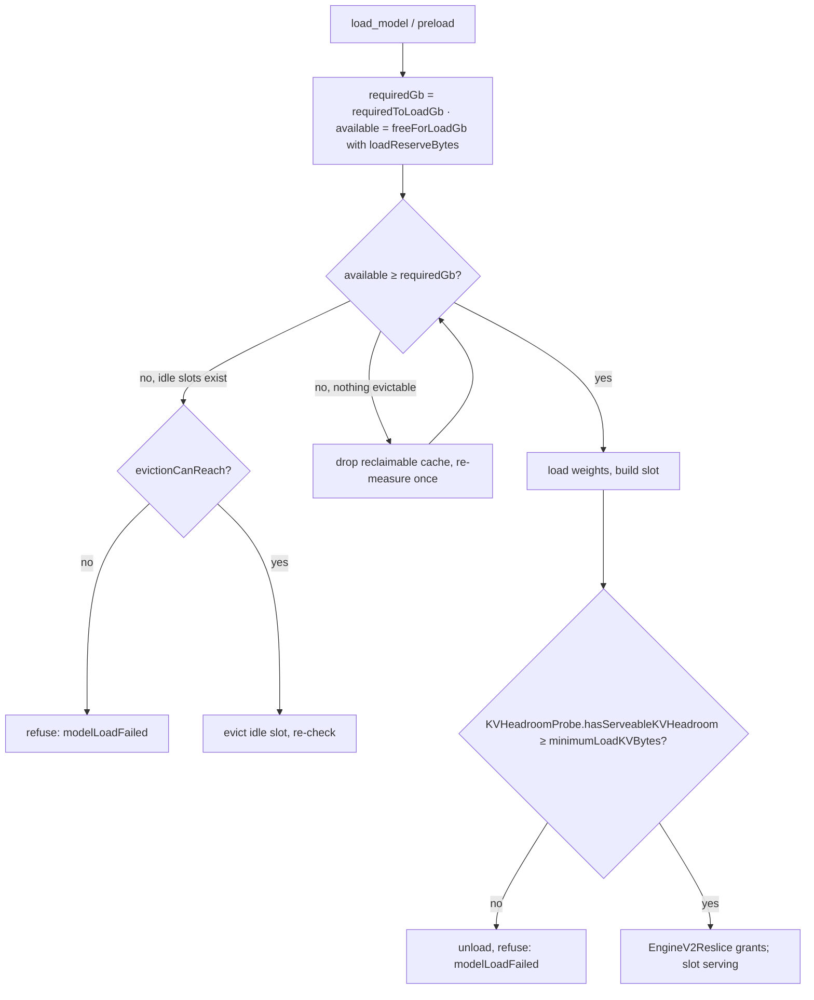

# Hardware support and the provider memory model

> Last updated: 2026-09-03 · commit `5d400cf75`

What hardware the provider runs on and how it decides, in bytes, whether a
model may load and how much KV cache each resident model may use. Read this to
understand why a box refuses a load that "should fit"; for the operator view
(RAM tiers → catalog models) see
[`../provider/hardware-requirements.md`](../provider/hardware-requirements.md).

## Context

The provider is Apple-Silicon-only: the SwiftPM platform floor is declared by
the packages described in
[`components/mlx-swift.md#what-providercore-links`](components/mlx-swift.md#what-providercore-links),
`coordinator/api/install.sh` refuses anything but Darwin on `arm64`, and
`darkbloom start` requires Metal
(`provider-swift/Sources/ProviderCore/Inference/GPUEnforcement.swift`,
`requireMetal`) and a minimum amount of RAM
(`provider-swift/Sources/darkbloom/StartCommand+Preflight.swift`,
`hardware.memoryGb`). There is no hard runtime macOS-version check:
`BootSecuritySnapshot.recommendedMacOSMajorVersion` only turns
`darkbloom doctor` yellow below that major version
(`provider-swift/Sources/ProviderCore/Security/BootSecurity.swift`). The three
values are in [Constants](#constants). Chip
identity is parsed from the brand string into `ChipFamily` ∈ {`M1`, `M2`,
`M3`, `M4`, `M5`, `Unknown`} and `ChipTier` ∈ {`Base`, `Pro`, `Max`, `Ultra`,
`Unknown`} (`provider-swift/Sources/ProviderCore/Hardware/HardwareDetector.swift`,
`parseChipIdentity`; `provider-swift/Sources/ProviderCore/Protocol/Enums.swift`).

Weights, KV cache and activations share unified memory, so the provider owns one
byte-level invariant: `Σ resident weights + KV + activations ≤ hardCapBytes`
(`provider-swift/Sources/ProviderCore/Inference/UnifiedMemoryCap.swift`).

## Mechanism

### Constants

| Symbol | Value | Code |
|---|---|---|
| `recommendedMacOSMajorVersion` | `26` — `darkbloom doctor` warning threshold only, never a gate | `provider-swift/Sources/ProviderCore/Security/BootSecurity.swift` (`BootSecuritySnapshot`) |
| RAM floor at start | `hardware.memoryGb < 8` refuses `darkbloom start` (8 GB) | `provider-swift/Sources/darkbloom/StartCommand+Preflight.swift` |
| `defaultCapFraction` | `0.90` | `UnifiedMemoryCap.swift` |
| `minimumReserveBytes` | `2 * 1024 * 1024 * 1024` (2 GiB OS floor) | `UnifiedMemoryCap.swift` |
| `defaultActivationReserveBytes` | `11 * 1024 * 1024 * 1024 / 2` = 5.5 GiB (since v0.8.0; basis gemma-4 qat-4bit B=8: 5.05 GiB eager / 5.34 compiled + slack) | `UnifiedMemoryCap.swift` |
| `measuredActivationFloorsBytes` | `["gpt-oss-20b": 7 * 1024 * 1024 * 1024 / 2]` = 3.5 GiB; exact catalog-id match only; per-model floors since v0.8.16 | `UnifiedMemoryCap.swift` |
| `minimumLoadKVBytes` | `1 * 1024 * 1024 * 1024` (1 GiB) | `UnifiedMemoryCap.swift` |
| `memoryOverheadFactor` | `1.2`; `estimatedMemoryGb = (sizeBytes / 2^30) * 1.2` | `provider-swift/Sources/ProviderCore/Models/ModelScanner+Discovery.swift` |
| `memory_reserve_gb` | operator config reserve (`memoryReserveGB`); default in [`../provider/cli-reference.md#providertoml-keys-read-by-the-cli`](../provider/cli-reference.md#providertoml-keys-read-by-the-cli) | `provider-swift/Sources/ProviderCore/Config/ProviderConfig.swift` |
| `MLXMemoryGuard.defaultReserveGB` / `defaultCacheLimitGB` | `6` / `8` (soft MLX limits; `cacheFraction = 0.75`, `minimumLimitBytes` 2 GiB) | `provider-swift/Sources/ProviderCore/Inference/MLXMemoryGuard.swift` |

`DARKBLOOM_MEM_CAP_FRACTION` overrides the cap fraction and
`DARKBLOOM_ACTIVATION_RESERVE_GB` raises (never lowers) the activation reserve;
`DARKBLOOM_MLX_MEMORY_RESERVE_GB` and `DARKBLOOM_MLX_CACHE_LIMIT_GB` feed
`MLXMemoryGuard`. Parsing rules and defaults:
[`../reference/configuration.md`](../reference/configuration.md).

### Cap and reserves (`UnifiedMemoryCap`)

```text
hardCapBytes(physical, fraction)
    = min( fraction × physical,
           physical > minimumReserveBytes ? physical − minimumReserveBytes : 0 )

activationFloorBytes(forModelIDs ids)
    = ids.isEmpty ? defaultActivationReserveBytes
                  : max over id of (measuredActivationFloorsBytes[id] ?? defaultActivationReserveBytes)

resolvedCapFraction
    = explicit (clamped to [0, 1])
    → DARKBLOOM_MEM_CAP_FRACTION if finite and > 0 (clamped to [0, 1])   -- ≤ 0 / non-finite ⇒ unset
    → defaultCapFraction

resolvedActivationReserveBytes(modelIDs)
    = explicit
    → floor = activationFloorBytes(modelIDs) (defaultActivationReserveBytes when nil)
      DARKBLOOM_ACTIVATION_RESERVE_GB if finite and > 0: max(gb × 2^30, floor)   -- raise-only
      else floor

loadHeadroomBytes = activations + minimumLoadKVBytes

kvBudgetBytes(physical, Σweights, activations, ramPrefix, configReserve)
    effectiveCap = min(hardCapBytes, physical − configReserve)
    claimed      = Σweights + activations + ramPrefix                       (saturating)
    = effectiveCap > claimed ? effectiveCap − claimed : 0

liveKVHeadroomBytes(physical, mlxUsed, systemAvailable, activations, configReserve)
    effectiveCap = min(hardCapBytes, physical − configReserve)
    realFree     = min(effectiveCap − mlxUsed (clamped ≥ 0), systemAvailable)
    = realFree > activations ? realFree − activations : 0

canAdmit(currentResident, candidate, minimumKV, activations, ramPrefix)
    = currentResident + candidate + activations + ramPrefix + minimumKV ≤ hardCapBytes

loadReserveBytes(configReserve) = max(configReserve, physical − hardCapBytes)

loadIsServeable(measuredLiveKVHeadroomBytes) = measuredLiveKVHeadroomBytes ≥ minimumLoadKVBytes
```

`ramPrefix` is always 0 in production — there is no RAM prefix-cache carve
([`prefix-cache.md`](prefix-cache.md)).

### Load gate (`ModelLoadAdmission`)

```text
defaultLoadHeadroomGb = loadHeadroomBytes() / 2^30
    -- defaultActivationReserveBytes + minimumLoadKVBytes by default;
    -- measuredActivationFloorsBytes["gpt-oss-20b"] + minimumLoadKVBytes for a gpt-oss-20b-only serving set

freeForLoadGb(total, systemAvailable, gpuActive, gpuCache, reserve, outstanding)
    mlxUsed   = gpuActive + gpuCache
    realFree  = min(total − mlxUsed, systemAvailable)
    committed = reserve + outstanding
    = max(0, realFree − committed) / 2^30                    -- no multiplicative discount

maxLoadableWeightGb(total, systemAvailable, mlxUsed, reserve, headroomGb, outstanding)
    reclaimable = min(total, systemAvailable + mlxUsed)
    usable      = reclaimable − (reserve + outstanding)
    = max(0, usable / 2^30 − max(0, headroomGb))

requiredToLoadGb(weightsGb, headroomGb) = max(0, weightsGb) + max(0, headroomGb)
evictionCanReach(available, reclaimable, required) = available + reclaimable ≥ required
fitsAtAllocation(availableNetOfLedger, ownReservation, required) = availableNetOfLedger + ownReservation / 2^30 ≥ required
canLoad(...) = requiredToLoadGb ≤ freeForLoadGb
```

`weightsGb` is the scanner's padded estimate (`sizeBytes / 2^30 ×
memoryOverheadFactor`), so a load needs `weights × memoryOverheadFactor +
activationReserve + minimumLoadKVBytes` of free-for-load memory. The worked
example in the source comment
(`provider-swift/Sources/ProviderCore/Inference/ModelLoadAdmission.swift`)
shows gpt-oss-20b's requirement falling by exactly `defaultActivationReserveBytes
− measuredActivationFloorsBytes["gpt-oss-20b"]` once its measured floor
applies. There is no `× 3.0` headroom rule anywhere in the load path.



(`provider-swift/Sources/ProviderCore/ProviderLoop+ModelLoading.swift`; the
standalone server runs the same sequence in
`provider-swift/Sources/ProviderCore/Server/StandaloneServer.swift`.)

### After the load

- `KVHeadroomProbe.measuredLiveKVHeadroomBytes` (after trimming the cold-load
  buffer cache) must satisfy `loadIsServeable` (≥ `minimumLoadKVBytes`) or the model is
  unloaded and the load rejected
  (`provider-swift/Sources/ProviderCore/Inference/KVHeadroomProbe.swift`).
- `EngineV2KVSizing` derives each slot's KV ceiling from `kvBudgetBytes`, clamped
  to physical RAM; `EngineV2Reslice` re-slices grants across co-resident slots
  on every load/unload with `resliceContextCap = 131_072` tokens and never
  below `minimumServiceableGrantBytes` (= `minimumLoadKVBytes`); a paged pool
  is construction-fixed, so its un-honourable part is reported as
  `pagedPoolResizeShortfall()`
  (`provider-swift/Sources/ProviderCore/Inference/EngineV2KVSizing.swift`,
  `provider-swift/Sources/ProviderCore/Inference/EngineV2Reslice.swift`).
- Per request, the bridge reserves `prompt + maxTokens` bytes in
  `GlobalKVCacheBudget` before submit ([`inference.md`](inference.md)).
- `MLXMemoryGuard.recommendedLimits`: `limit = max(minimumLimitBytes, physical −
  reserve)`, `cacheLimit = min(max(minimumLimitBytes / 2, min(limit × 0.75,
  cacheCap)), limit)` — soft MLX guidelines only; the cap above is what
  refuses work.

### Coordinator mirror

The coordinator predicts servability with its own copy of the cap fraction,
activation floors and per-model table (`coordinator/registry/servability.go`:
`servabilityActivationFloorGB`, `servabilityLegacyActivationFloorGB`,
`servabilityActivationFloorMinVersion`, `servabilityPerModelFloorMinVersion`,
`servabilityModelActivationFloorsGB`, `servabilityMeasuredResidentGiB`;
`coordinator/registry/scheduler.go`, `coldLoadCatalogGBToMemGiB`). The doc
comment on `defaultActivationReserveBytes` requires the provider and
coordinator tables to move in the same commit. The coordinator's arithmetic and
its use in admission are described once, in
[`routing.md`](routing.md); this page does not restate them.

## Invariants

1. `Σ resident weights + KV + activations ≤ hardCapBytes` — every KV budget
   and headroom path derives from `UnifiedMemoryCap.hardCapBytes`
   (`kvBudgetBytes`, `liveKVHeadroomBytes`, `loadReserveBytes`).
2. The cap never leaves the OS less than `minimumReserveBytes` — `hardCapBytes`
   takes `min(fraction × physical, physical − minimumReserveBytes)`.
3. The activation reserve is raise-only from the environment —
   `resolvedActivationReserveBytes` returns `max(env, floor)`.
4. A measured per-model floor applies only to an exact catalog id, and a mixed
   serving set takes the `max` over its models — `activationFloorBytes`.
5. A load passes only if `weights × memoryOverheadFactor + activations +
   minimumLoadKVBytes ≤ freeForLoadGb` and, after loading, measured live KV
   headroom is ≥ `minimumLoadKVBytes` — `canLoad`, `loadIsServeable`,
   `KVHeadroomProbe.hasServeableKVHeadroom`.
6. No slot's KV grant is re-sliced below `minimumServiceableGrantBytes` —
   `EngineV2Reslice`.
7. `freeForLoadGb` applies no multiplicative discount; the only padding is the
   scanner's `memoryOverheadFactor` on weights — `ModelLoadAdmission.swift`,
   `ModelScanner+Discovery.swift`.

## Failure modes

| Symptom | Cause | Where |
|---|---|---|
| `darkbloom start` exits: "At least … GB is needed to serve any model" | `hardware.memoryGb` below the RAM floor in [Constants](#constants) | `StartCommand+Preflight.swift` |
| Start refused: Metal unavailable | `GPUEnforcement.requireMetal()` threw | `GPUEnforcement.swift` |
| Load refused: "… need N GB to serve — unloaded" | Post-load `hasServeableKVHeadroom` false (live KV headroom below `minimumLoadKVBytes`) | `ProviderLoop+ModelLoading.swift`, `KVHeadroomProbe.swift` |
| Load refused with `no_kv_headroom` | Slot KV sizing overflowed or no serviceable grant during construction | `EngineV2Config.swift` (`EngineV2RefusalReason.noKVHeadroom`), `EngineV2SlotFactory.swift` |
| Catalog says the tier fits, provider refuses | Static cap arithmetic passes but `freeForLoadGb` (real free minus `loadReserveBytes` and in-flight reservations) is below `requiredToLoadGb` | `ModelLoadAdmission.swift`, `ProviderLoop+ModelLoading.swift` |
| Model loads but every request is refused | Grant re-sliced to the floor, or paged pool shortfall | `EngineV2Reslice.swift` |
| Raising `DARKBLOOM_ACTIVATION_RESERVE_GB` shrinks KV, lowering it does nothing | Raise-only semantics | `UnifiedMemoryCap.swift` (`resolvedActivationReserveBytes`) |
| `darkbloom doctor` warns about macOS | Below `recommendedMacOSMajorVersion` ([Constants](#constants)); warning only | `BootSecurity.swift` |

## Code map

| Concern | File / symbol |
|---|---|
| Cap, reserves, floors | `provider-swift/Sources/ProviderCore/Inference/UnifiedMemoryCap.swift` |
| Load gate | `provider-swift/Sources/ProviderCore/Inference/ModelLoadAdmission.swift` |
| Post-load probe | `provider-swift/Sources/ProviderCore/Inference/KVHeadroomProbe.swift` |
| Slot KV sizing and re-slice | `provider-swift/Sources/ProviderCore/Inference/EngineV2KVSizing.swift`, `provider-swift/Sources/ProviderCore/Inference/EngineV2Reslice.swift` |
| Process-wide KV ledger | `provider-swift/Sources/ProviderCore/Inference/GlobalKVCacheBudget.swift` |
| MLX soft limits | `provider-swift/Sources/ProviderCore/Inference/MLXMemoryGuard.swift` |
| Padded weight estimate, quantization | `provider-swift/Sources/ProviderCore/Models/ModelScanner+Discovery.swift` |
| Platform and hardware gates | `provider-swift/Package.swift`, `provider-swift/Sources/darkbloom/StartCommand+Preflight.swift`, `provider-swift/Sources/ProviderCore/Inference/GPUEnforcement.swift`, `provider-swift/Sources/ProviderCore/Hardware/HardwareDetector.swift`, `provider-swift/Sources/ProviderCore/Security/BootSecurity.swift` |
| Coordinator mirror | `coordinator/registry/servability.go`, `coordinator/registry/scheduler.go` |
| Measurements behind the floors | `docs/reports/2026-08-30-activation-floor-measurements.md` |

## Related

- [`../provider/hardware-requirements.md`](../provider/hardware-requirements.md) — RAM tiers and catalog models, for operators
- [`inference.md`](inference.md) — per-request KV reservation
- [`prefix-cache.md`](prefix-cache.md) — KV layouts and the SSD tier's RAM staging
- [`routing.md`](routing.md) — coordinator servability predictor
- [`components/mlx-swift.md`](components/mlx-swift.md) — the pinned MLX stack and the SwiftPM platform floor
- [`../design/activation-reserve-overhaul-plan.md`](../design/activation-reserve-overhaul-plan.md) — the plan that introduced per-model floors
