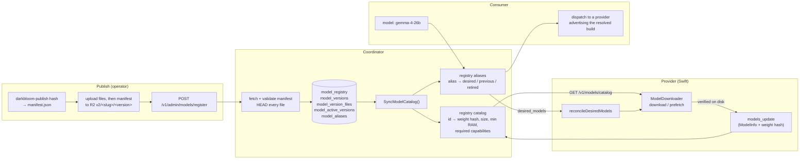

# Model registry

> Last updated: 2026-09-03 · commit `5d400cf75`

How Darkbloom decides which model builds exist, which bytes are trusted, which
providers may serve them, and what public name a consumer uses for them. The
registry is a set of Postgres tables owned by the coordinator; model bytes live
in Cloudflare R2 and are fetched by providers directly, never proxied by the
coordinator. Public model names are **aliases** that resolve to concrete builds,
which is what makes zero-downtime quantisation swaps possible. Exact field
tables are in [`../reference/model-registry-format.md`](../reference/model-registry-format.md);
the operator procedure for a cutover is
[`../operations/model-migration.md`](../operations/model-migration.md).

## Context

Three parties need to agree on a model: the operator who publishes weights,
the provider Mac that downloads and serves them, and the consumer who names a
model in a request. Without a registry the failure modes are familiar — a
provider advertising weights nobody vetted, a consumer pinned to a specific
quantisation that the fleet has moved off, or a "same" model with different
bytes on different machines. The registry answers three questions with one
database and one hash:

| Question | Answer | Where |
|---|---|---|
| Is this build real? | A `model_registry` row with an `active`/`beta` status **and** a `ready` version pointed to by `model_active_versions` | `coordinator/store/postgres_model_registry.go` (`activeModelRegistryQuery`) |
| Are these the right bytes? | The version's `aggregate_sha256` — a SHA-256 over the sorted per-file digests — must match what the provider computed after download | `coordinator/api/model_registry_handlers.go` (`aggregateManifestFileHashes`); `provider-swift/Sources/ProviderCoreFoundation/ManifestBuilder.swift` |
| What does `gemma-4-26b` mean today? | A `model_aliases` row: `desired_build`, optional `previous_build`, lineage in `retired_builds` | `coordinator/registry/registry.go` (`ResolveModel`) |

## Mechanism

### 1. Publishing puts bytes in R2 before the registry knows about them

`scripts/publish-model.sh` runs `swift run -c release darkbloom-publish hash`
(`provider-swift/Sources/darkbloom-publish/HashCommand.swift`) over a local
HuggingFace snapshot directory. `ManifestBuilder.build` walks the allow-listed
integrity files, hashes each one, and emits `manifest.json` whose `r2_prefix`
is `v2/<slug>--<first 12 hex of sha256(model_id)>/<version>`
(`ManifestBuilder.safeModelID`). The script uploads every file to the
`darkbloom-models` bucket under that prefix and uploads `manifest.json` **last**,
so a registration can never observe a half-uploaded build. The CDN in front of
the bucket is `https://models.darkbloom.ai` — the same constant on both sides
(`defaultModelRegistryCDNBaseURL` in
`coordinator/api/model_registry_handlers.go`; `ModelDownloader.defaultR2CDNURL`
in `provider-swift/Sources/ProviderCore/Models/ModelDownloader.swift`).

### 2. Registration verifies the upload and writes the rows

`coordinator/api/model_registry_handlers.go` (`handleRegisterModel`) is the
only way a build enters the registry. It authenticates with a publishing key
(`requirePublishingAPIKey`), recomputes the R2 prefix from `model_id` and
`version` (`modelR2Prefix`, byte-identical to the Swift builder), fetches
`<cdn>/<prefix>/manifest.json`, and rejects the request unless
`validateModelManifest` passes (schema version 1, ids match, every path is a
safe relative path, `file_count` and `total_size_bytes` agree with the file
list, and the recomputed aggregate hash equals `aggregate_sha256`). It then
issues an HTTP `HEAD` for every file with 8 workers (`verifyManifestFiles`)
and compares `Content-Length` to the manifest. Only after all of that does
`SetModelVersion` write the entry, version, and file rows in one transaction,
`SetModelPrice("platform", …)` record the price, and — if `promote` was set —
`PromoteModelVersion` upsert `model_active_versions`. A new entry starts with
`status = "beta"`; its version starts `ready`.

### 3. `SyncModelCatalog` is the single handoff into routing

Every admin mutation (register, promote, status, capabilities,
runtime-parameters, alias upsert/delete) and coordinator boot
(`coordinator/cmd/coordinator/main.go`) ends by calling
`coordinator/api/server.go` (`SyncModelCatalog`). It re-reads the active rows
and installs two in-memory structures in the registry:

- the **catalog**: `registry.CatalogEntry{ID, WeightHash, SizeGB, MinRAMGB,
  RequiredProviderCapabilities}` per active build (`SetModelCatalog`). A nil
  catalog (tests, dev without a database) disables the gate; an empty non-nil
  catalog denies everything, which is the correct state for a fresh database.
- the **alias map**: `registry.AliasTarget{Desired, Previous, Retired,
  OpenRouterOnly}` per active alias (`syncModelAliases` → `SetModelAliases`).
  OpenRouter-only aliases resolve requests but never drive provider
  convergence.

It also reconciles prompt-contract artifacts for the new hashes, fans out
`desired_models` to connected providers, and invalidates the 60-second
`/v1/models/catalog` response cache.

### 4. The catalog gates what a provider may advertise

A provider's advertised inventory only counts when the catalog agrees.
`coordinator/registry/registry.go` (`modelAllowedByCatalogLocked`) requires the
build id to be in the catalog and, when both sides carry a hash, the provider's
`WeightHash` to equal the catalog's. The `models_update` merge path
(`mergeProviderModels`) is stricter: a build the catalog has never heard of is
rejected, a provider missing a required runtime capability is rejected, and
when the catalog pins a hash the update **must** carry a matching one — a
missing hash is treated as a mismatch. Rejected builds are simply not merged,
so a bad desired build never causes the previous build to be dropped.

Weight hashes are also re-checked on every attestation challenge: the response
carries a hash per advertised model, and any mismatch against
`CatalogWeightHash` marks the provider untrusted
(`coordinator/api/provider.go`, log line
`provider model weight hash mismatch — possible model swap`).

### 5. Providers download from R2, verify, then announce

`provider-swift/Sources/ProviderCore/Models/ModelCatalogClient.swift` reads
`GET /v1/models/catalog` (optionally `?type=text&include_aliases=1`) and
`GET /v1/models/catalog/manifest/{id}`. `ModelDownloader` has two flows that
share one contract — every file is checked against its manifest size and
SHA-256 before it leaves staging, and the aggregate is recomputed with
`WeightHasher.hashFilesWithRelativeKey` before the snapshot is published to
`~/.cache/huggingface/hub/models--{org}--{name}/snapshots/local/` with a
`refs/main` pointer so `ModelScanner` discovers it:

| Flow | Entry point | Used by | Notes |
|---|---|---|---|
| Foreground download | `ModelDownloader.download` (`ModelDownloader.swift`) | `darkbloom models download` (`provider-swift/Sources/darkbloom/ModelsCommand.swift`) and the `darkbloom start` model picker | 4 concurrent file fetches; resumes into `.local-staging-<r2Prefix>` |
| Background prefetch | `ModelDownloader.prefetch` (`ModelDownloader+Prefetch.swift`) | `desired_models` reconciliation | sequential, resume-aware, reports verified bytes against the manifest total; refuses models whose `required_provider_capabilities` the machine lacks (`ModelRuntimeRequirements.evaluate`) |

On an aggregate mismatch over individually valid files (a poisoned manifest)
`finalizeStagedManifest` deletes the staging directory so a corrected manifest
re-downloads cleanly; transient failures keep staging so the next attempt
resumes.

Once a prefetched build is verified, `ProviderLoop+Prefetch.swift`
(`applyVerifiedPrefetch`) advertises it and sends `models_update` with the
computed hash; the coordinator merges it (step 4) and the build becomes
routable on that provider without a re-register.

### 6. Aliases turn a public name into a build at request time

`coordinator/api/consumer.go` (`resolveRequestedModel`) calls
`coordinator/registry/registry.go` (`ResolveModelConstrainedWithTraits`):

1. Not an alias → the id is used unchanged (raw build ids keep working).
2. An alias → `Desired` if at least one eligible provider can route it;
   otherwise `Previous` if routable; otherwise `Desired` anyway so the request
   queues against a real build instead of failing. Serial allowlists,
   self-route, prefer-owner, and request-shape traits narrow "eligible" so an
   alias never resolves to a build the allowed providers cannot serve.

The response echoes the alias; billing, stats, and earnings store the concrete
build, and `PublicNameForBuild` maps back for consumer-facing surfaces.

### 7. `desired_models` converges the fleet declaratively

`coordinator/registry/registry.go` (`DesiredModelsForProvider`) emits, for each
alias, `{model_name, desired_build, previous_build}` — but only to providers
that already advertise the desired, previous, or a retired member of that alias
and that could acquire the desired build (`providerCanAcquireCatalogModelLocked`).
`fanOutDesiredModels` (`coordinator/api/model_alias_handlers.go`) sends it only
to Swift providers at or above `minProviderVersionForDesiredModels = "0.5.17"`
(`coordinator/api/server.go`), because older decoders reject unknown message
types. Empty sets are sent on purpose: they mark a provider's in-flight prefetch
for a deleted or repointed alias as stale.

The provider side (`ProviderLoop+Prefetch.swift`, `reconcileDesiredModels`)
prefetches any missing desired build, hard-swaps and drops the previous build
once verified, and retries failed prefetches with the bounded backoff
`desiredPrefetchRetryDelays = [30s, 60s, 120s, 300s, 600s]`
(`provider-swift/Sources/ProviderCore/ProviderLoop.swift`); a fresh push resets
the budget.

## Invariants

1. **Bytes precede rows.** A version row exists only after the coordinator has
   fetched its manifest and HEAD-verified every file — `handleRegisterModel`
   returns 400 and writes nothing otherwise.
2. **One hash, computed three ways, must agree.** Publisher
   (`ManifestBuilder.build`), coordinator (`aggregateManifestFileHashes` at
   registration; `validateModelManifest`), and provider
   (`WeightHasher.hashFilesWithRelativeKey` in `finalizeStagedManifest`) all
   hash the sorted per-file digests. The catalog pins the result as
   `CatalogEntry.WeightHash`, and `mergeProviderModels` refuses a build whose
   reported hash is absent or different.
3. **Routable ⇔ active status, ready version, catalog membership.**
   `activeModelRegistryQuery` selects `status IN ('active','beta')` joined
   through `model_active_versions` to a `ready` version; `SetModelCatalog`
   installs exactly that set; `modelAllowedByCatalogLocked` consults nothing
   else.
4. **Alias and build namespaces do not overlap** (except by explicit takeover).
   `handleRegisterModel` returns 409 when `model_id` equals an existing alias;
   `handleModelAliasUpsert` returns 409 when `alias_id` equals a concrete model
   unless `takeover=true` **and** `previous_build == alias_id`
   (`coordinator/api/model_alias_handlers.go`).
5. **An alias resolves to a registered build or not at all.** `desired_build`
   and `previous_build` must be registry rows, may not equal each other, and
   `desired_build` may never equal `alias_id` (`handleModelAliasUpsert`).
6. **`SyncModelCatalog` is the only writer of the in-memory catalog and alias
   map.** Every mutation path calls it; nothing else calls `SetModelCatalog` or
   `SetModelAliases` outside tests.
7. **A rejected desired build never strands a provider.** `mergeProviderModels`
   derives the hard-swap drop from builds that *passed* validation, not from
   the raw message, so a bad-hash desired build leaves the previous build
   advertised.
8. **Providers only receive `desired_models` they can act on.**
   `providerSupportsDesiredModels` (backend + version floor) and
   `DesiredModelsForProvider` (already a member of the alias, capable of the
   build) gate every send.

## Failure modes

| Symptom | Cause | Where to look |
|---|---|---|
| `POST /v1/admin/models/register` → 400 `failed to fetch manifest` / `manifest file verification failed` | manifest uploaded before files, wrong `version`, or R2 object missing | `fetchModelManifest`, `verifyManifestFileHEAD` (`coordinator/api/model_registry_handlers.go`) |
| Registration → 409 `model_id collides with an existing public alias` | the concrete id is already a public alias | Invariant 4; pick a different `model_id` |
| Registered model never appears in `/v1/models/catalog` | not promoted (`model_active_versions` has no row) or `status` not `active`/`beta`; also the 60 s response cache | `PromoteModelVersion`, `handleModelCatalog` (`coordinator/api/billing_handlers.go`) |
| Provider log `models_update weight-hash missing or mismatched; rejecting build` | bytes on disk differ from the registered version, or the provider reported no hash | `mergeProviderModels`; re-download the build |
| Provider marked untrusted with `provider model weight hash mismatch — possible model swap` | challenge-time hash differs from `CatalogWeightHash` | `coordinator/api/provider.go`; treat as tamper until proven otherwise |
| Alias flipped but old providers keep serving the previous build | providers below `0.5.17` or not yet members of the alias never receive `desired_models`; prefetch failing with bounded retries | `providerSupportsDesiredModels`, `DesiredModelsForProvider`; provider logs `desired_models: … → converging to …` |
| Fresh coordinator routes nothing | empty (non-nil) catalog is deny-all until a model is registered and promoted | `SetModelCatalog` |
| Provider prefetch loops on `aggregate hash mismatch` | poisoned manifest; staging is cleared each time | `finalizeStagedManifest`; re-publish the version |

## Code map

| Concern | Code |
|---|---|
| Tables (`model_registry`, `model_versions`, `model_version_files`, `model_active_versions`, `model_aliases`, `publishing_api_keys`) | `coordinator/store/postgres.go` (DDL); `coordinator/store/postgres_model_registry.go` (queries) |
| Store types (`ModelRegistryEntry`, `ModelVersion`, `ModelVersionFile`, `ModelManifest`, `ManifestFile`, `ModelAlias`, `PublishingAPIKey`, `SupportedModel`) | `coordinator/store/interface.go` |
| Registration, admin actions, publishing-key auth, manifest validation, R2 prefix | `coordinator/api/model_registry_handlers.go` |
| Alias upsert/list/delete, lineage, `desired_models` fan-out | `coordinator/api/model_alias_handlers.go` |
| OpenRouter-only aliases | `coordinator/api/openrouter_alias_handlers.go`, `coordinator/api/openrouter_alias_invariants.go` |
| Public catalog endpoints | `coordinator/api/billing_handlers.go` (`handleModelCatalog`); `coordinator/api/model_registry_handlers.go` (`handleModelCatalogItem`, `handleModelCatalogManifest`) |
| Catalog → registry handoff | `coordinator/api/server.go` (`SyncModelCatalog`, `syncModelAliases`) |
| In-memory catalog, alias resolution, `desired_models` computation, models_update merge | `coordinator/registry/registry.go` (`SetModelCatalog`, `SetModelAliases`, `ResolveModel`, `ResolveModelConstrainedWithTraits`, `PublicNameForBuild`, `DesiredModelsForProvider`, `SendDesiredModels`, `mergeProviderModels`, `modelAllowedByCatalogLocked`) |
| Capability requirements per model | `coordinator/registry/provider_capabilities.go` (`providerCanAcquireCatalogModelLocked`, `ProviderCapabilityAppleM5`, `ProviderCapabilityMLXNAX`) |
| Wire messages | `coordinator/protocol/messages.go` (`DesiredModelsMessage`, `DesiredModelEntry`, `ModelsUpdateMessage`, `PrefetchModelStatusMessage`) |
| Manifest schema and builder (publisher side) | `provider-swift/Sources/ProviderCoreFoundation/Manifest.swift`, `provider-swift/Sources/ProviderCoreFoundation/ManifestBuilder.swift`, `provider-swift/Sources/ProviderCoreFoundation/WeightHasher.swift` |
| Publish CLI and script | `provider-swift/Sources/darkbloom-publish/`, `scripts/publish-model.sh`, `.github/workflows/register-model.yml` |
| Provider catalog client and downloads | `provider-swift/Sources/ProviderCore/Models/ModelCatalogClient.swift`, `provider-swift/Sources/ProviderCore/Models/ModelDownloader.swift`, `provider-swift/Sources/ProviderCore/Models/ModelDownloader+Download.swift`, `provider-swift/Sources/ProviderCore/Models/ModelDownloader+Prefetch.swift`, `provider-swift/Sources/ProviderCore/Models/ModelRuntimeRequirements.swift` |
| Provider reconciliation of `desired_models` | `provider-swift/Sources/ProviderCore/ProviderLoop+Prefetch.swift` (`reconcileDesiredModels`, `applyVerifiedPrefetch`); `provider-swift/Sources/ProviderCore/ProviderLoop.swift` (`desiredPrefetchRetryDelays`) |

## Related

- [`../reference/model-registry-format.md`](../reference/model-registry-format.md) — manifest fields, request/response shapes, alias rules, R2 layout.
- [`../operations/model-migration.md`](../operations/model-migration.md) — publishing a build and flipping an alias in production.
- [`../consumer/models.md`](../consumer/models.md) — what `GET /v1/models` exposes and how the `model` field is resolved.
- [`routing.md`](routing.md) — the gates applied after a build is resolved.
- [`security/attestation.md`](security/attestation.md) — the challenge loop that re-checks weight hashes.
- [`storage.md`](storage.md) — the wider store schema.
