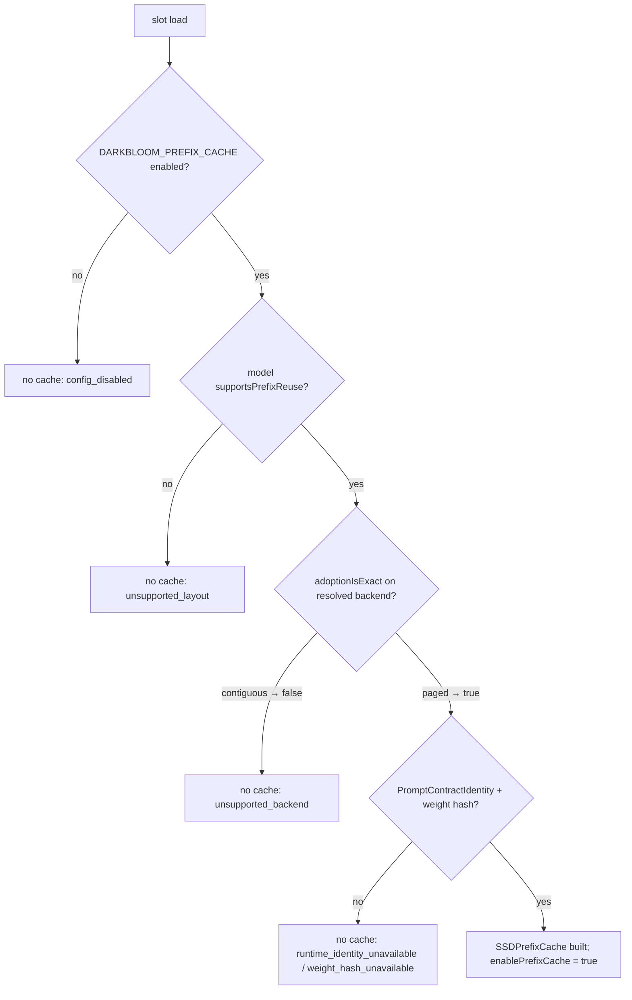

# KV cache layouts and prefix caching

> Last updated: 2026-09-03 · commit `5d400cf75`

How the provider lays out a request's KV cache, how it decides whether a
previously computed prefix can be reused, and where reusable blocks live (a RAM
staging map and an encrypted SSD tier). Read this to understand why a box
serves a repeated prompt cold or warm; for the file format and every SSD knob
see [`../reference/ssd-kv-cache.md`](../reference/ssd-kv-cache.md), and for the
coordinator's use of cache state in routing see
[`cache-aware-routing.md`](cache-aware-routing.md).

## Context

CBv2 owns one KV cache per running request. Two backends exist; the choice is
made per slot at load time and fixed for the slot's life. Prefix reuse — seeding
a new request's KV from blocks computed by an earlier request with the same
token prefix — is only safe when the cached rows can be restored exactly, which
depends on the model's layer layout (full attention vs sliding window vs
recurrent state) and on the backend. The durable tier is SSD; there is no
production RAM cache and no persistent memory carve
(`provider-swift/Sources/ProviderCore/Inference/PrefixCachePolicy.swift`).

## Mechanism

### KV layouts

| | Contiguous | Paged |
|---|---|---|
| Type | `CBv2ContiguousKVBackend`, `EngineV2KVBackendKind.contiguous` | `PagedKVBackend`, `EngineV2KVBackendKind.paged`; `PagedKVPool.pageSize = 16` tokens |
| Selected by | `engine_v2_kv_backend = "auto"` (default) or `"contiguous"`; every degrade target | `engine_v2_kv_backend = "paged"` (global or `engine_v2_kv_backend_by_model`) only |
| Memory | Per-request grant reserved at admission in `GlobalKVCacheBudget` | Pool sized by `PagedKVPhysicalCapacityPolicy` and committed whole at first admission (`slabCommitment = .atFirstAdmission`) |
| On failure | — | Under `auto`: degrade to contiguous with a `fallback:<why>` reason; under explicit `paged`: refuse the load with `EngineV2ProductionError.pagedUnavailable` (503) |
| Prefix-reuse backend | `.contiguousUnquantized` | `.pagedFP16` |

`auto` resolves contiguous since v0.8.1 (`case .auto: resolvedKind =
.contiguous` in `prepareProductionBackend`,
`provider-swift/Sources/ProviderCore/Inference/EngineV2Factory+Production.swift`;
v0.8.0 shipped paged by default and its capacity policy sized fleet KV about
10× smaller). Before construction, `EngineV2KVBackendPolicy` applies, in order:
the kill switch `DARKBLOOM_CBV2_PAGED_KV` (negative polarity — it forces
contiguous everywhere and cannot turn paged on); slot vetoes
(`applySlotVetoes`: a VLM slot is forced contiguous when the paged cache does
not honour span masks — at the pinned engine
`PagedLayerCache.honorsSpanMaskContextsByConstruction = true`, so this veto is
armed but inert); and a model-capability check (`supportsPagedKV == false` →
contiguous, reason `model_capability`). Paged construction runs
`PagedKernelPreflight` in a child process (`defaultChildTimeout = 120 s`,
`DARKBLOOM_NO_UPDATE_CHECK=1` injected) and sizes the pool with
`usefulContextTokensPerRequest = 32_768`, `physicalMemoryDivisor = 16`,
`absoluteHardCapBytes` 8 GiB, `liveHeadroomDivisor = 4`,
`minimumProductionPoolBytes` 1 GiB
(`provider-swift/Sources/ProviderCore/Inference/PagedKVPhysicalCapacityPolicy.swift`,
`provider-swift/Sources/ProviderCore/Inference/PagedKernelPreflight.swift`).
Pool dtype is `DARKBLOOM_CBV2_PAGED_KV_DTYPE` (`float16` or `float32`).

### Block hashing

Prefixes are hashed in whole blocks of `CBv2BlockHasher.defaultBlockSize = 256`
tokens (`libs/mlx-swift-lm/Libraries/MLXLMCommon/ContinuousBatchingV2/BlockHasher.swift`),
mirrored by `PrefixCachePolicy.blockSize`. A partial trailing block is never
cached. The coordinator's promptsidecar computes the same chain
(`darkbloom-block-chain-v1`, `PromptContractIdentity.blockHashVersion`) so it
can predict which provider holds a prefix — see
[`prompt-contract-sidecar.md`](prompt-contract-sidecar.md).

### Prefix-reuse capability

`CBv2PrefixReuseCapability.derive(layerKinds:backend:modelSupportsPrefixReuse:)`
(`libs/mlx-swift-lm/Libraries/MLXLMCommon/ContinuousBatchingV2/PrefixReusePlan.swift`)
decides once per slot:

1. `modelSupportsPrefixReuse == false` → unsupported
   (`.modelRequestStateUnsupported`). `CBv2ModelCapabilities.supportsPrefixReuse`
   is `false` for the Qwen3.5 family (`.initialRecurrentTarget`, recurrent
   state) and for Qwen3-VL (`MLXVLM.Qwen3VL.cbv2Capabilities`); GPT-OSS and
   Gemma 4 are `.attentionOnly` (all capabilities on) —
   `libs/mlx-swift-lm/Libraries/MLXLMCommon/ContinuousBatchingV2/RecurrentStateV2.swift`,
   `EngineV2Factory+Production.swift` (`prepareProductionBackend`).
2. Empty layout → `.emptyLayout`; a layer with non-positive
   `headDim`/`kvHeads`/`queryHeads`, an invalid `sharesKVWithLayer`, or a
   window ≤ 0 → `.invalidLayout`.
3. `maxWindow = max(window)`, `windowCount = #slidingWindow layers`,
   `replayBound = windowCount × maxWindow`; `hasOwningFullAfterWindow` when a
   storage-owning `.full` layer follows a windowed layer (interleaved hybrid).
4. Backend `.unknown` → unsupported.

| Layout | `.contiguousUnquantized` | `.pagedFP16` |
|---|---|---|
| All full-attention layers (`replayBound == 0`) | `.direct` | `.direct` |
| Sliding-window layers, no owning full layer after a windowed one | `.tailReplay` | `.tailReplay` |
| Interleaved hybrid (Gemma 4, GPT-OSS) | `.frozenFullReplay`, `conservativeReplayBoundTokens = replayBound` | `.frozenFullReplay`, same bound |
| `supportsPrefixReuse == false` (Qwen3.5 family, Qwen3-VL) | unsupported | unsupported |

On a hit with `matched` tokens the engine recomputes
`cbv2RequiredRecompute = min(windowCount × maxWindow, matched)` tokens (0 when
there are no sliding-window layers;
`libs/mlx-swift-lm/Libraries/MLXLMCommon/ContinuousBatchingV2/CBv2Contracts.swift`).
With `M` the matched boundary and `R` that recompute span, sliding rows are
rebuilt from `C = M − R`; under `.frozenFullReplay` the storage-owning full
rows keep their exact cached K/V immutable through `M` while replay runs, so
replay error cannot persist into full-attention state
(`libs/mlx-swift-lm/Libraries/MLXLMCommon/ContinuousBatchingV2/SequenceKV/FrozenReplayFullSequenceKV.swift`).

### Provider gates and tiers

`PrefixCachePolicy.adoptionIsExact(onResolvedBackend:)` returns `true` for
`.paged` and `false` for `.contiguous`: contiguous adoption was measured to
diverge from the cold run on `gemma-4-26B-A4B-it-qat-4bit` and
`gpt-oss-20b-MXFP4-Q8`. `EngineV2SlotFactory` therefore skips construction on a
resolved-contiguous slot and records
`PrefixCacheConstructionStatus(state: .disabled, reason: .unsupportedBackend)`
(`provider-swift/Sources/ProviderCore/Inference/EngineV2SlotFactory.swift`).
When a cache is built, `prefixReuseCapability` maps the resolved `.paged`
backend to `.pagedFP16`. (The policy function also has a `pagedKilled` branch
yielding `.contiguousUnquantized`, but the production slot factory resolves the
backend first, so a slot the `DARKBLOOM_CBV2_PAGED_KV=0` kill switch degraded
to contiguous takes the `unsupportedBackend` path above and builds nothing.)
`adoptionBoundTokens` is the capability's `conservativeReplayBoundTokens`, and
`minEffectiveTokens` is the raise-only donation floor whose constants are in
[`../reference/ssd-kv-cache.md#size-and-eviction-rules`](../reference/ssd-kv-cache.md#size-and-eviction-rules).

Lookup at submit (`provider-swift/Sources/ProviderCore/Inference/EngineV2Bridge+PrefixCache.swift`,
`provider-swift/Sources/ProviderCore/KVCacheSSD/EngineV2Bridge+SSDPrefixCache.swift`):
the bridge calls `ssd.stage(...)`, which reads and authenticates matching
`.dbk3` blocks and rehydrates them into the RAM staging map (bytes reserved in
`GlobalKVCacheBudget`; refused ⇒ silent recompute); the engine's synchronous
`lookup()` hits the staging map; `applyAdoption` runs on the engine thread;
`endAdoption` balances the ticket. On completion the bridge donates complete
blocks to a bounded write-behind queue subject to the donation floor,
write-rate, low-disk, TTL and box-wide LRU guards
(`provider-swift/Sources/ProviderCore/KVCacheSSD/SSDPrefixCache.swift`,
`donate`; every constant is in
[`../reference/ssd-kv-cache.md#size-and-eviction-rules`](../reference/ssd-kv-cache.md#size-and-eviction-rules)). The coordinator learns each slot's state from
`prefix_cache_statuses` and cumulative `prefix_cache_donation_outcomes`
([`cache-aware-routing.md`](cache-aware-routing.md)).

## Invariants

1. **With default configuration no slot builds an SSD prefix cache in
   0.8.16.** `DARKBLOOM_PREFIX_CACHE` defaults to enabled, but
   `engine_v2_kv_backend = "auto"` resolves contiguous and
   `adoptionIsExact(onResolvedBackend: .contiguous) == false`, so
   `EngineV2SlotFactory` records `.disabled` / `.unsupportedBackend` and sets
   `enablePrefixCache = false`. The tier is live only on slots explicitly
   configured `paged` (not killed, not vetoed) whose model supports prefix
   reuse — `EngineV2SlotFactory.swift`, `PrefixCachePolicy.swift`
   (`adoptionIsExact`), `EngineV2Factory+Production.swift`
   (`prepareProductionBackend`).
2. A cache is bound to the model's verified weight hash and a
   `PromptContractIdentity`; missing either disables the tier rather than
   binding by model id — `SSDPrefixCacheFactory.swift` (`make`).
3. A model whose `CBv2ModelCapabilities.supportsPrefixReuse` is `false`
   (Qwen3.5 family, Qwen3-VL) never gets a cache object, so the bridge can never
   stage an incomplete snapshot — `EngineV2SlotFactory.swift`
   (`.unsupportedLayout`).
4. Recompute after a hit is exactly `min(windowCount × maxWindow, matched)`
   and owning full rows stay frozen through `M` — `CBv2Contracts.swift`
   (`cbv2RequiredRecompute`), `FrozenReplayFullSequenceKV.swift`.
5. Vision requests never stage SSD blocks — `EngineV2Bridge.swift`
   (`submitTokenized`, text-only guard).
6. `DARKBLOOM_CBV2_PAGED_KV` can only force contiguous; there is no
   environment variable that turns paged on — `EngineV2KVBackendPolicy.swift`
   (`killSwitchEnvKey`).
7. Every `stage()` reservation is released on cancellation, preemption,
   refusal, shutdown or unload; a preempted request restarts cold —
   `EngineV2Bridge+SSDPrefixCache.swift`.

## Failure modes

| Symptom | Cause | Where |
|---|---|---|
| `prefix_cache_statuses` reports `disabled` / `unsupported_backend` on every slot | Default `auto` → contiguous (invariant 1) | `EngineV2SlotFactory.swift` |
| `disabled` / `unsupported_layout` | `supportsPrefixReuse == false` (Qwen3.5 family, Qwen3-VL) | `EngineV2SlotFactory.swift` |
| `disabled` / `weight_hash_unavailable` or `runtime_identity_unavailable` | No verified weight hash or no `PromptContractIdentity` for the model directory | `SSDPrefixCacheFactory.swift` |
| `pending` / `scan_pending`, `error` / `scan_failed` | Startup disk scan not finished or failed | `SSDPrefixCache.swift` |
| Warm prompt served cold | Prefix shorter than one block; staging reservation refused; donation below the effective-token floor; TTL expiry; box-wide LRU eviction | `SSDPrefixCache.swift` (`donate`), `SSDBlockIndex.swift` |
| Load refused with `pagedUnavailable` | Explicit `paged` and preflight/capacity/pool construction failed | `EngineV2Factory+Production.swift` |
| Every slot contiguous despite `paged` config | `DARKBLOOM_CBV2_PAGED_KV` set to a negative value, or `supportsPagedKV == false` | `EngineV2KVBackendPolicy.swift`, `EngineV2Factory+Production.swift` |

## Code map

| Concern | File / symbol |
|---|---|
| Backend selection, kill switch, vetoes | `provider-swift/Sources/ProviderCore/Inference/EngineV2KVBackendPolicy.swift` (`applySlotVetoes`, `degradesPagedFailure`) |
| `auto` resolution, paged fallback | `provider-swift/Sources/ProviderCore/Inference/EngineV2Factory+Production.swift` (`prepareProductionBackend`) |
| Prefix-cache gate, exactness, capability | `provider-swift/Sources/ProviderCore/Inference/PrefixCachePolicy.swift` (`isEnabled`, `adoptionIsExact`, `prefixReuseCapability`, `ssdDiskBudgetBytes`) |
| Construction-skip logic | `provider-swift/Sources/ProviderCore/Inference/EngineV2SlotFactory.swift` (`PrefixCacheConstructionStatus`) |
| Reuse plan | `libs/mlx-swift-lm/Libraries/MLXLMCommon/ContinuousBatchingV2/PrefixReusePlan.swift` (`CBv2PrefixReuseCapability.derive`) |
| Frozen full replay | `libs/mlx-swift-lm/Libraries/MLXLMCommon/ContinuousBatchingV2/SequenceKV/FrozenReplayFullSequenceKV.swift`, `libs/mlx-swift-lm/Libraries/MLXLMCommon/ContinuousBatchingV2/SequenceKV/ContiguousKVBackend.swift` |
| Paged pool | `libs/mlx-swift-lm/Libraries/MLXLMCommon/ContinuousBatchingV2/Paged/PagedKVPool.swift`, `libs/mlx-swift-lm/Libraries/MLXLMCommon/ContinuousBatchingV2/Paged/PagedLayerCache.swift` |
| SSD tier | `provider-swift/Sources/ProviderCore/KVCacheSSD/` (`SSDPrefixCache`, `SSDPrefixCacheFactory`, `SSDPrefixCachePolicy`, `SSDBlockStore`) |
| Status and outcome vocabularies | `provider-swift/Sources/ProviderCore/Protocol/Messages.swift` (`PrefixCacheStatusReason`, `PrefixCacheDonationOutcome`) |

## Related

- [`../reference/ssd-kv-cache.md`](../reference/ssd-kv-cache.md) — DBK3 format, paths, env knobs, eviction, per-family table
- [`cache-aware-routing.md`](cache-aware-routing.md) — how the coordinator consumes cache state
- [`inference.md`](inference.md) — the request path this cache sits in
- [`hardware-support.md`](hardware-support.md) — the KV budget the grants come from
- [`../design/ssd-kv-cache.md`](../design/ssd-kv-cache.md), [`../design/kv-cache-lookup-shadowing.md`](../design/kv-cache-lookup-shadowing.md) — superseded design records
