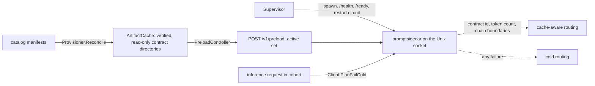

# Prompt-contract sidecar

> Last updated: 2026-09-03 · commit `5d400cf75`

How the coordinator's `promptsidecar` child process derives deterministic,
provider-compatible token boundaries so exact-cache routing can predict which
provider already holds a prompt's prefix, and why a sidecar that is disabled,
unhealthy, overloaded, timed out or malformed can never block ordinary
inference. Read this to understand contract identity, the block chain and the
process trust boundary; every `EIGENINFERENCE_PROMPT_SIDECAR_*` knob and its
default is in
[`../reference/configuration.md#prompt-sidecar-and-media-fetch`](../reference/configuration.md#prompt-sidecar-and-media-fetch),
and the block format the provider shares is in [`prefix-cache.md`](prefix-cache.md).

## Context

Cache-aware routing ([`cache-aware-routing.md`](cache-aware-routing.md)) needs
the coordinator to know, before dispatch, which provider holds the KV blocks of
a prompt's prefix. The provider derives those block hashes from its own
tokenizer, chat template and normalisation
(`PromptContractIdentity.compute(modelDirectory:)`,
`provider-swift/Sources/ProviderCoreFoundation/PromptContractIdentity.swift`);
the coordinator therefore has to run the same normalisation, template render
and tokenisation with byte-identical results, in a process that never keeps a
prompt-derived byte. That work is isolated in a Rust child, `promptsidecar`
(`coordinator/promptsidecar/`), supervised by the Go package
`coordinator/promptcontract/`.

The inference path consults the sidecar only when routing mode is `on`, the
request is inside the operational rollout cohort, every active artifact has
been provisioned, and the request's contract has been explicitly preloaded.
Any other state — including every failure listed below — is ordinary cold
routing.

## Mechanism



### Process and lifecycle

The coordinator starts `promptsidecar` as its child only when
`EIGENINFERENCE_PROMPT_SIDECAR_ENABLED` is true (`Supervisor.runChild`,
`coordinator/promptcontract/supervisor.go`). It creates the socket directory
with mode `0700` (`prepareSocketDirectory`), passes only bounded numeric
settings and local paths, and uses separate probes and transports for liveness
and readiness: `GET /health` is a cheap liveness probe that stays responsive
while contracts load; `GET /ready` gates cache planning until preload
succeeds (`coordinator/promptsidecar/src/server/handler.rs`). Planning, health,
startup/preload and shutdown have independent deadlines
(`EIGENINFERENCE_PROMPT_SIDECAR_TIMEOUT_MS`, `_HEALTH_TIMEOUT_MS`,
`_STARTUP_TIMEOUT_MS`, `_PRELOAD_TIMEOUT_MS`, `_SHUTDOWN_TIMEOUT_MS`). A single
missed health probe never restarts the child: the supervisor requires
`EIGENINFERENCE_PROMPT_SIDECAR_HEALTH_FAILURE_THRESHOLD` consecutive
post-liveness failures, records the categorical restart reason and exit
status, retains only a bounded stderr tail
(`EIGENINFERENCE_PROMPT_SIDECAR_STDERR_MAX_BYTES`), and applies restart backoff
and a restart-loop circuit (`EIGENINFERENCE_PROMPT_SIDECAR_RESTART_MIN_MS`,
`_RESTART_MAX_MS`, `_RESTART_WINDOW_MS`, `_RESTART_MAX_IN_WINDOW`,
`_RESTART_COOLDOWN_MS`; `restartCircuitDelay`,
`coordinator/promptcontract/supervisor_status.go`). Shutdown sends `SIGTERM`,
then kills a child that exceeds the shutdown deadline. On Linux the child also
installs `PR_SET_PDEATHSIG` and verifies the supervisor PID
(`coordinator/promptsidecar/src/main.rs`), so a coordinator crash cannot leave
an orphan retaining the socket.

Every `EIGENINFERENCE_PROMPT_SIDECAR_*` variable — safety controls, paths,
provisioning concurrency and the sidecar-side limits — is listed once, with its
default and range, in
[`../reference/configuration.md#prompt-sidecar-and-media-fetch`](../reference/configuration.md#prompt-sidecar-and-media-fetch);
`promptcontract.ReadSupervisorConfig` (`coordinator/promptcontract/config.go`)
reads them and `Check` refuses startup on an out-of-range value.

The sidecar serves HTTP/1.1 only on the Unix socket named by
`EIGENINFERENCE_PROMPT_SIDECAR_SOCKET`. The socket is mode `0600`; there is no
TCP listener and no network client. Connections stay alive and the Go client
pools them (`newUnixTransport`, `coordinator/promptcontract/client.go`).
Resource consumption is bounded by the request-body limit
(`EIGENINFERENCE_PROMPT_SIDECAR_MAX_BODY_BYTES`), the connection limit
(`_MAX_CONNECTIONS`), the planning semaphore (`_MAX_CONCURRENCY`), the token
limit (`_MAX_TOKENS`), the contract LRU (`_MAX_LOADED_CONTRACTS`), the per-plan
deadline (`_TIMEOUT_MS`) and, on Linux, the address-space limit
(`_MEMORY_LIMIT_MIB`). Completed connection tasks are reaped continuously.
Contract misses use a per-contract singleflight (`SingleflightLru`,
`coordinator/promptsidecar/src/artifact_cache.rs`): one worker performs file
verification and tokenizer construction and concurrent callers wait for that
same result. Distinct contracts remain bounded by the planner semaphore and
LRU capacity.

At startup the sidecar binds its socket and reports live but not ready; it does
not discover or load every directory left on disk. After asynchronous artifact
provisioning finishes (`Provisioner.Reconcile`,
`coordinator/promptcontract/provisioner.go`), the coordinator sends the
complete, deduplicated active set to `POST /v1/preload`, which loads that set
sequentially before traffic (`coordinator/promptsidecar/src/preload.rs`). This
prevents stale contracts from consuming the bounded cache during a restart. The
endpoint serializes preload runs, stops new plans while swapping readiness,
rejects sets larger than the configured contract capacity
(`validate_contracts`), and reports only bounded cold/warm/failure results. The
Go preload gate (`PreloadController.ReadyFor`,
`coordinator/promptcontract/preload_controller.go`) records the child
generation and will not route a model until its contract succeeded in that
generation. A fresh or stale artifact root is live but has no
planning-eligible contract until this explicit handoff completes.

Prompt artifacts live under `EIGENINFERENCE_PROMPT_SIDECAR_ARTIFACT_ROOT` on
the persistent disk. The verified artifact loader rejects symlinks in every
path component, so `/data` — a runtime symlink to the persistent disk — must
never be used as the artifact root.

`POST /v1/plan` accepts (`PlanRequest`, `coordinator/promptsidecar/src/api.rs`):

```json
{
  "prompt_contract_id": "<64 lowercase hex characters>",
  "scope_id": "<authenticated cache scope>",
  "endpoint": "chat_completions",
  "body": {}
}
```

It returns the contract identifier, the prompt token count, the ordered chain
boundaries (one per complete block — block size in
[`prefix-cache.md#block-hashing`](prefix-cache.md#block-hashing)), and the last
lookup-eligible boundary (`PlanResponse`). The normalized body and token IDs
remain transient and are not returned by the service. The offline fixture
generator is the only interface that emits token IDs.

### Contract identity

`prompt_contract_id` is SHA-256 over this binary encoding (`ContractID`,
`coordinator/promptcontract/contract.go`; `compute_contract_id`,
`coordinator/promptsidecar/src/contract.rs`):

1. `u32be(length) || bytes` for the domain
   `darkbloom.prompt-contract.v1`.
2. `u32be(artifact_count)`.
3. For artifacts sorted by `(role, path, sha256)`, length-prefixed UTF-8 role,
   length-prefixed UTF-8 relative path, and a length-prefixed 32-byte digest.
   Only manifest roles `config`, `template`, and `tokenizer` participate
   (`IsPromptRole`).
4. Length-prefixed name and value pairs for `normalization`, `renderer`,
   `tokenizer`, and `block_hash`.
5. Length-prefixed `block_size` followed by the block size as `u32be`
   (`CBv2BlockHasher.defaultBlockSize`,
   [`prefix-cache.md#block-hashing`](prefix-cache.md#block-hashing)).

The semantic versions (`CurrentVersions`) are:

- normalization: `darkbloom-request-normalization-v2` (includes Gemma 4 tool-schema, argument, and turn-structure compatibility)
- renderer: `swift-jinja-compatible-v1`
- tokenizer: `huggingface-tokenizer-json-v1`
- block hash: `PromptContractIdentity.blockHashVersion`, stated in
  [`prefix-cache.md#block-hashing`](prefix-cache.md#block-hashing)

Changing an artifact digest, path, role, semantic implementation, or block size
creates a different contract.

The artifact loader records the pinned `swift-transformers` precedence:
`chat_template.jinja`, then `chat_template.json`, then the tokenizer-config
value. V2 readiness is intentionally narrower: the provider advertises an exact
prompt contract only when `chat_template.jinja` exists and passes the real
serving-render checks. Alternate template sources stay cold until their
multi-template selection and Swift compatibility rewriting are proven by the
same production gate; their hashes still remain part of artifact identity.

### Block-chain encoding

For block index `i`, the engine, Go package (`BlockHash`,
`coordinator/promptcontract/blockhash.go`) and Rust sidecar (`block_hash`,
`coordinator/promptsidecar/src/hash.rs`) compute:

```text
SHA256(
  "darkbloom.prefix-block-chain.v1" ||
  field(prompt_contract_id) ||
  field(scope_id) ||
  parent_hash_32 ||
  u32be(i) ||
  u32be(token_0) || ... || u32be(token_n)
)
```

`field(x)` is `u32be(byte_length(x)) || x`; the fixed domain is unprefixed and
the first parent is 32 zero bytes. Only complete blocks are hashed, so the
token sequence has an invariant length and needs no count field. Lookup always
reserves the final token (`LastCompleteBoundary`): a prompt of exactly one
block has no eligible boundary, one block plus one token has the first
boundary, and two exact blocks still use only the first boundary. The
provider's SSD tier stores the resulting blocks in the DBK3 format described in
[`../reference/ssd-kv-cache.md#dbk3-file-format`](../reference/ssd-kv-cache.md#dbk3-file-format);
its layout-epoch binding includes the block size.

### Artifact handoff and threat model

The Go cache (`ArtifactCache.Ensure`,
`coordinator/promptcontract/artifact_cache.go`) accepts catalog manifest data,
filters to prompt roles, verifies the model aggregate identity
(`verifyManifestAggregate`), downloads each declared file from the configured
HTTPS origin, rejects cross-origin redirects (`sameOrigin`), verifies size and
SHA-256 while writing, fsyncs files and directories, and atomically renames a
random same-root temporary directory. `os.Root`, exclusive creation,
relative-path validation, and symlink checks (`rejectSymlinks`) contain
traversal. Published files are mode `0400` and directories mode `0500`; every
reuse re-hashes every artifact (`verifyPublished`).

The Rust process never downloads. It opens every path component from `/` with
`O_NOFOLLOW` (`load`, `coordinator/promptsidecar/src/artifacts.rs`), so a
symlink anywhere in the artifact path is rejected; it rechecks sizes and
hashes, verifies metadata and contract identity, and loads only a
coordinator-published contract directory.

Protected failures include malicious JSON, oversized or slow bodies, unsafe
paths, symlinks, changed artifacts, wrong contracts, incompatible templates,
unsupported tokenizers, child crashes, stale sockets, process hangs, and
malformed responses. Errors contain fixed categories (`ErrorResponse`,
`coordinator/promptsidecar/src/api.rs`) and never include request bodies,
rendered prompts, token IDs, or hashes. Cache routing treats every such
failure as ordinary cold routing (`Client.PlanFailCold`,
`coordinator/promptcontract/client.go`).

`GET /metrics` returns a bounded JSON snapshot for the local coordinator
(`MetricsSnapshot`, `coordinator/promptsidecar/src/metrics.rs`): planning
success/failure/capacity/timeout counts and latency buckets,
cold/warm/waited/failed contract loads and cold-load latency, preload runs, and
cache occupancy. It contains no model IDs, contract IDs, accounts, scopes,
prompts, tokens, or chain hashes. Public status projects only aggregate values.

Templates that call `strftime_now` are deliberately ineligible
(`validate_template_source`, `RenderError::DynamicTime`,
`coordinator/promptsidecar/src/render.rs`): the pinned Swift renderer
evaluates that function in each provider Mac's local timezone, so a central
process cannot derive the same prompt for every provider near a date boundary.
The sidecar returns a fixed planning failure instead of claiming an exact
cache key for dynamic provider-local input.

### Parity fixtures and measured latency

`fixtures/prompt-contract/v1` is shared by Rust, Go, and Swift tests:
`contract_vectors.json` and `block_hash_vectors.json` hold the contract and
block-hash vectors; `corpus.json` contains complete requests for tools, null
sanitization, Harmony and Gemma normalization, reasoning effort, Unicode, all
four endpoints, exact block multiples, and long prompts;
`production_vectors.json` holds the per-model normalized bodies, token IDs and
boundaries generated from manifest-pinned, coordinator-provisioned artifacts,
and `manifests/` is the catalog snapshot they were generated from. Production
tokenizer/template/config artifacts are not stored in this repository. How to
regenerate the vectors and run the three-way parity gate
(`scripts/verify-prompt-parity.sh`) is a developer procedure:
[`../developer/test.md#9-prompt-contract-parity-fixtures-and-vectors`](../developer/test.md#9-prompt-contract-parity-fixtures-and-vectors).
Models with provider-local dynamic time stay in the inventory with
`cache_routing_eligible: false` and `ineligibility_reason: "dynamic_time"`
(written by `prompt-fixtures`,
`coordinator/promptsidecar/src/bin/prompt-fixtures.rs`), have no routable
vectors, and must fail provider contract readiness
(`PromptContractIdentity.compute(modelDirectory:)`).

Latency is enforced by `coordinator/promptsidecar/tests/planner_fixture.rs`
(`measure_fixture_planning_latency`, `measure_fixture_unix_http_latency`): 1,000
warm plans of the local `"hello world " × 128` fixture, asserting
`p99 <= 250 × p50` and `16 × p99 <= 1 s` (`assert_latency_distribution`) for
both the in-process planner and the persistent Unix HTTP/1.1 path. A one-off
2026-07-14 run of that harness (arm64 Apple Silicon release build, Rust 1.88.0)
recorded 72 µs p50 / 133 µs p99 in the planner and 82 µs / 168 µs over HTTP
including JSON work; CI checks the ratios, not these absolute figures, and
neither includes production model cold-load cost. The
`EIGENINFERENCE_PROMPT_SIDECAR_TIMEOUT_MS` deadline leaves the enforced ≥ 16×
p99 margin until manifest-pinned production measurements replace the synthetic
gate.

## Invariants

1. **Fail cold.** A disabled, not-live, not-ready, overloaded, timed-out or
   malformed sidecar yields cold routing, never an inference error —
   `coordinator/promptcontract/client.go` (`Client.PlanFailCold`,
   `validatePlan`).
2. **Identity is a pure function of the artifact set.** `prompt_contract_id`
   is SHA-256 over the sorted prompt-role artifact digests, the four semantic
   versions and the block size; changing any of them yields a different
   contract — `coordinator/promptcontract/contract.go` (`ContractID`),
   `coordinator/promptsidecar/src/contract.rs` (`compute_contract_id`),
   `provider-swift/Sources/ProviderCoreFoundation/PromptContractIdentity.swift`
   (`compute`).
3. **Three implementations, one chain.** Go, Rust and the Swift provider
   produce byte-identical chain hashes and boundaries for the shared vectors —
   `coordinator/promptcontract/blockhash.go` (`ChainHashes`,
   `LastCompleteBoundary`), `coordinator/promptsidecar/src/hash.rs`
   (`chain_hashes`), `fixtures/prompt-contract/v1`,
   `scripts/verify-prompt-parity.sh`.
4. **A model routes only after its contract preloaded in the current child
   generation** — `coordinator/promptcontract/preload_controller.go`
   (`PreloadController.ReadyFor`).
5. **The sidecar never downloads and never follows a symlink**; it loads only
   a coordinator-published, re-verified contract directory —
   `coordinator/promptsidecar/src/artifacts.rs` (`load`),
   `coordinator/promptcontract/artifact_cache.go` (`ArtifactCache.Ensure`,
   `rejectSymlinks`, `verifyPublished`).
6. **No prompt-derived bytes leave the sidecar.** A plan returns the contract
   id, the token count and chain boundaries; errors are fixed categories;
   `/metrics` carries no identifiers; only the offline fixture generator emits
   token IDs — `coordinator/promptsidecar/src/api.rs` (`PlanResponse`,
   `ErrorResponse`), `coordinator/promptsidecar/src/metrics.rs`
   (`MetricsSnapshot`), `coordinator/promptsidecar/src/bin/prompt-fixtures.rs`.
7. **One missed probe never restarts the child.** Restarts need the
   consecutive-failure threshold and pass through backoff and the restart
   circuit — `coordinator/promptcontract/supervisor.go` (`Supervisor.run`),
   `coordinator/promptcontract/supervisor_status.go` (`restartCircuitDelay`).
8. **Dynamic-time templates are ineligible.** A template that calls
   `strftime_now` gets a fixed planning failure, never an exact cache key —
   `coordinator/promptsidecar/src/render.rs` (`validate_template_source`).

## Failure modes

| Symptom | Cause | Where |
|---|---|---|
| Every request routes cold although routing mode is `on` | Sidecar disabled, not live or not ready; the model's contract has not preloaded in this child generation; the plan timed out or failed validation | `client.go` (`PlanFailCold`, `validatePlan`), `preload_controller.go` (`ReadyFor`) |
| Child restarts repeatedly, then stops being restarted | Consecutive health failures reached the threshold; the restart circuit opened and suppresses restarts for the cooldown | `supervisor_status.go` (`restartCircuitDelay`, `setRestartSuppressed`) |
| Contract provisioned but never planning-eligible | Artifact root reached through a symlink (for example `/data`), or an artifact failed size or hash re-verification | `artifacts.rs` (`load`), `artifact_cache.go` (`verifyPublished`) |
| Fixed planning failure for one model on every request | Template calls `strftime_now`; body over `EIGENINFERENCE_PROMPT_SIDECAR_MAX_BODY_BYTES`; rendered prompt over `_MAX_TOKENS` | `render.rs` (`RenderError::DynamicTime`), `server/handler.rs` (body limit), `planner.rs` (`PlanError::TooManyTokens`) |
| Preload rejected | Active set larger than `EIGENINFERENCE_PROMPT_SIDECAR_MAX_LOADED_CONTRACTS` | `preload.rs` (`validate_contracts`) |
| `verify-prompt-parity.sh` fails | Regenerated vectors differ from `production_vectors.json`; a manifest, artifact or corpus case is missing; an unrecognised template incompatibility — no fabricated token IDs are accepted | `scripts/verify-prompt-parity.sh`, `prompt-fixtures.rs` (`require_model_manifests`, `require_case_ids`) |

## Code map

| Concern | File / symbol |
|---|---|
| Supervisor: spawn, probes, restart circuit, shutdown | `coordinator/promptcontract/supervisor.go`, `coordinator/promptcontract/supervisor_status.go`, `coordinator/promptcontract/supervisor_process.go`, `coordinator/promptcontract/supervisor_defaults.go` |
| Configuration and startup checks | `coordinator/promptcontract/config.go` (`ReadSupervisorConfig`, `Check`) |
| Go client: plan, fail-cold, preload, metrics | `coordinator/promptcontract/client.go` (`Plan`, `PlanFailCold`), `coordinator/promptcontract/client_control.go` (`Ready`, `Preload`, `Metrics`) |
| Artifact provisioning and verified publication | `coordinator/promptcontract/provisioner.go`, `coordinator/promptcontract/artifact_cache.go` |
| Preload gate per child generation | `coordinator/promptcontract/preload_controller.go` |
| Contract identity and block chain (Go) | `coordinator/promptcontract/contract.go`, `coordinator/promptcontract/blockhash.go` |
| Sidecar process, socket server, routes | `coordinator/promptsidecar/src/main.rs`, `coordinator/promptsidecar/src/server.rs`, `coordinator/promptsidecar/src/server/handler.rs` |
| Planner, contract LRU, artifact loading | `coordinator/promptsidecar/src/planner.rs`, `coordinator/promptsidecar/src/artifact_cache.rs`, `coordinator/promptsidecar/src/artifacts.rs` |
| Normalisation, render, tokenizer-side identity and hashes | `coordinator/promptsidecar/src/normalize.rs`, `coordinator/promptsidecar/src/render.rs`, `coordinator/promptsidecar/src/contract.rs`, `coordinator/promptsidecar/src/hash.rs` |
| Wire shapes and metrics | `coordinator/promptsidecar/src/api.rs`, `coordinator/promptsidecar/src/preload.rs`, `coordinator/promptsidecar/src/metrics.rs` |
| Provider-side identity | `provider-swift/Sources/ProviderCoreFoundation/PromptContractIdentity.swift` |
| Fixtures, generator, parity gate | `fixtures/prompt-contract/v1`, `coordinator/promptsidecar/src/bin/prompt-fixtures.rs`, `coordinator/cmd/promptfixtureinput`, `coordinator/cmd/promptsidecarloadproof`, `scripts/verify-prompt-parity.sh`, `coordinator/promptsidecar/tests/planner_fixture.rs` |

## Related

- [`prefix-cache.md`](prefix-cache.md) — block size, block-hash version and the provider's prefix-reuse rules
- [`cache-aware-routing.md`](cache-aware-routing.md) — how the coordinator uses the plan
- [`inference.md`](inference.md) — the provider side of the same contract
- [`../reference/ssd-kv-cache.md`](../reference/ssd-kv-cache.md) — the DBK3 blocks the chain addresses
- [`../reference/configuration.md#prompt-sidecar-and-media-fetch`](../reference/configuration.md#prompt-sidecar-and-media-fetch) — every `EIGENINFERENCE_PROMPT_SIDECAR_*` variable and default
- [`../developer/test.md#9-prompt-contract-parity-fixtures-and-vectors`](../developer/test.md#9-prompt-contract-parity-fixtures-and-vectors) — regenerating vectors and running the parity gate
