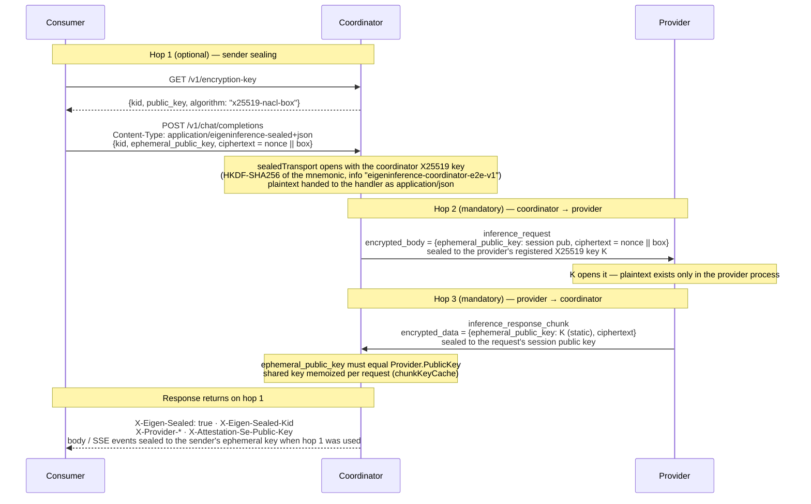

# Encryption and privacy model

> Last updated: 2026-09-03 · commit `5d400cf75`

An inference request crosses three NaCl Box hops: consumer → coordinator
(optional), coordinator → provider (mandatory), provider → coordinator
(mandatory). This page is the canonical home for what each hop encrypts, which
key opens it, and what each party can observe. Every other page links here
instead of restating it.

## Context

The provider runs the model, so the prompt must be plaintext inside the
provider process. The coordinator routes, bills, and enforces the request
contract, so it parses the request body in memory. Neither fact can be hidden
by cryptography at interactive latency; the design therefore protects the two
network legs and constrains the endpoints:

- The coordinator handles plaintext only for the life of one request and
  writes none of it to logs or the store (see
  [What the coordinator logs and retains](#what-the-coordinator-logs-and-retains)).
- The provider is the decryption endpoint, and the security claim is about
  *which* provider process holds the decryption key — see
  [`attestation.md`](./attestation.md) and
  [`identity-binding.md`](./identity-binding.md).

Primitive on all three hops: NaCl `box` (X25519 key agreement, XSalsa20-Poly1305
authenticated encryption) from `golang.org/x/crypto/nacl/box` on the
coordinator, `provider-swift/Sources/ProviderCore/Crypto/NodeKeyPair.swift` on
the provider, `console-ui/src/lib/encryption.ts` in the console.

## Mechanism

### Hop 1 — consumer → coordinator (optional)

| Property | Value | Code |
|---|---|---|
| Transport | HTTPS; plaintext JSON bodies are accepted on the same routes | `coordinator/api/server.go` (`sealedTransport` wraps `/v1/chat/completions`, `/v1/responses`, `/v1/completions`, `/v1/messages`) |
| Key discovery | `GET /v1/encryption-key` (no auth) → `{kid, public_key, algorithm: "x25519-nacl-box"}`, `Cache-Control: public, max-age=300`; `503 encryption_unavailable` when no coordinator key is configured | `coordinator/api/sender_encryption.go` (`handleEncryptionKey`) |
| Coordinator key | BIP39 mnemonic from `MNEMONIC` / `EIGENINFERENCE_MNEMONIC` ([configuration](../../reference/configuration.md#auth-admin-key-privy-release-key-sender-encryption)) → seed → HKDF-SHA256 with info `eigeninference-coordinator-e2e-v1` → X25519 private key; `kid` = first 16 hex chars of SHA-256(public key) | `coordinator/internal/e2e/coordinator_key.go` (`DeriveCoordinatorKey`, `CoordinatorKeyHKDFInfo`) |
| Detection | `Content-Type: application/eigeninference-sealed+json` only (parameters ignored, case-insensitive); there is no marker header | `coordinator/api/sender_encryption.go` (`SealedContentType`, `isSealedContentType`) |
| Request envelope | `{kid, ephemeral_public_key, ciphertext}`; `ciphertext` = base64(24-byte nonce ‖ `box.Seal` output); body read capped at the [inference body limit](../../reference/api-contracts.md#limits-and-validation) | `coordinator/api/sender_encryption.go` (`sealedRequestEnvelope`, `sealedTransport`) |
| Errors | `400 invalid_request_error` (body unreadable / over cap), `400 invalid_sealed_envelope`, `400 kid_mismatch`, `400 decryption_failed`, `503 encryption_unavailable` | `coordinator/api/sender_encryption.go` (`sealedTransport`) |
| Handoff | Plaintext is re-injected as `application/json` with `sealedCtxKey` on the request context; sealed requests refuse remote-media URL fetching (`isSealedRequest`) | `coordinator/api/sender_encryption.go` (`sealedTransport`, `isSealedRequest`); `coordinator/api/media_resolve.go` (`gateRemoteMediaPreDispatch`) |
| Response | Sealed to the sender's `ephemeral_public_key` with the coordinator key. Non-streaming: body = `{kid, ciphertext}`. SSE: one sealed event per `\n\n` boundary, written as `data: <base64(nonce ‖ sealed event)>\n\n`. Headers `X-Eigen-Sealed: true`, `X-Eigen-Sealed-Kid: <kid>` | `coordinator/api/sender_encryption.go` (`sealingResponseWriter`, `sealedResponseEnvelope`) |
| Scope | Terminates at the coordinator. The coordinator re-encrypts to the provider with a separate per-request key (hop 2) | — |

### Hop 2 — coordinator → provider (mandatory)

| Property | Value | Code |
|---|---|---|
| Session key | Fresh X25519 key pair per request (`SessionKeys`); the private key lives only in the in-flight `PendingRequest.SessionPrivKey` | `coordinator/internal/e2e/e2e.go` (`GenerateSessionKeys`) |
| Recipient key | `Provider.PublicKey` — the X25519 key from `register.public_key`, which must equal the SE-signed blob's `encryptionPublicKey` ([`identity-binding.md`](./identity-binding.md)) | `coordinator/api/provider.go` (`verifyProviderAttestation`); `coordinator/internal/e2e/e2e.go` (`ParsePublicKey`) |
| Encrypt | `box.Seal` with a random 24-byte nonce → `EncryptedPayload{ephemeral_public_key, ciphertext}` where `ciphertext` = base64(nonce ‖ box) | `coordinator/internal/e2e/e2e.go` (`Encrypt`); `coordinator/protocol/messages.go` (`EncryptedPayload`) |
| Body preparation | The parsed request map is re-marshalled with HTML escaping disabled; plaintext inference bodies are capped at `maxInferenceBodyBytes` ([limits](../../reference/api-contracts.md#limits-and-validation)) before sealing | `coordinator/api/inference_preprocess.go` (`marshalForwardBody`, `maxInferenceBodyBytes`) |
| Wire message | `inference_request` with `encrypted_body` set and `body` empty | `coordinator/protocol/messages.go` (`InferenceRequestMessage`) |
| Eligibility | Only providers passing `providerSupportsPrivateTextLocked` receive requests; a missing key fails that gate ([`attestation.md`](./attestation.md#routing-gate)) | `coordinator/registry/registry.go` (`providerSupportsPrivateTextLocked`) |

### Hop 3 — provider → coordinator (mandatory)

| Property | Value | Code |
|---|---|---|
| Wire message | `inference_response_chunk` with `encrypted_data = {ephemeral_public_key, ciphertext}` and `data` empty | `coordinator/protocol/messages.go` (`InferenceResponseChunkMessage`) |
| Sender key | The provider's **static** registered X25519 key `K`; `encrypted_data.ephemeral_public_key` must equal `Provider.PublicKey`. Only the coordinator side of this hop is per-request | `coordinator/api/provider.go` (`decryptTextResponseChunk`) |
| Recipient key | The request's session public key from hop 2 | `provider-swift/Sources/ProviderCore/ProviderLoop.swift` |
| Decrypt | Shared key `box.Precompute(K, SessionPrivKey)` memoized per request in `chunkKeyCache` (keyed by the `SessionPrivKey` pointer, cap `chunkKeyCacheMax` = 8192, dropped wholesale when full); per chunk only `box.OpenAfterPrecomputation` runs | `coordinator/api/chunk_key_cache.go` (`sharedKey`, `forget`); `coordinator/internal/e2e/e2e.go` (`PrecomputeSharedKey`, `DecryptWithSharedKey`) |
| Requirement | The provider must register with `encrypted_response_chunks: true`; otherwise it never passes `providerSupportsPrivateTextLocked` | `coordinator/protocol/messages.go` (`RegisterMessage`) |
| Violation | A plaintext chunk, a mixed chunk, or a sender key ≠ `K` marks the provider `untrusted` and fails the request with `502` / `FailureCodeEncryptionFailure` | `coordinator/api/provider.go` (`decryptTextResponseChunk`, `errTextChunkViolation`) |

### What each party can observe

This table is the privacy statement. [`../../consumer/privacy-expectations.md`](../../consumer/privacy-expectations.md) and [`../../provider/attestation.md`](../../provider/attestation.md) link to it and do not restate it.

| Data | Consumer | Coordinator | Provider |
|---|---|---|---|
| Prompt and attached media | yes | yes, in memory for the life of the request (parsed for routing, cache affinity, billing); never logged or stored | yes (decryption endpoint) |
| Completion text | yes | yes, in memory while relaying; never logged or stored | yes (generates it) |
| Model, sampling parameters, `stream`, `max_tokens` | yes | yes; stored as non-content request params | yes |
| Token counts, latency, request/trace IDs, selected provider | yes (headers, usage) | yes; stored and logged | own requests only |
| Consumer identity, API key, Privy DID, balance | own | yes | no |
| Provider identity: SE public key, chip, model | yes (`X-Provider-*`, `GET /v1/providers/attestation`) | yes | own |
| Provider serial, UDID, APNs token, MDA certificate chain | no | yes (stored) | own |
| Provider X25519 private key, SE private key | no | no | own process / Secure Enclave |
| Other consumers' prompts | no | yes, in memory, one request at a time | no |

### What the coordinator logs and retains

| Retained or logged (metadata only) | Code |
|---|---|
| Access log, one `request` line per HTTP request: `request_id`, `method`, `path`, `route`, `status`, `duration_ms`, `remote` (the connection's remote address), `user_id` (account, when authenticated) | `coordinator/api/server.go` (`loggingMiddleware`) |
| `inference request dispatched`: `trace_id`, `request_id`, `model`, `provider_id`, `stream`, `attempt` | `coordinator/api/dispatch.go` |
| Request / route records: token counts, timing, non-content params (`temperature`, `top_p`); the record types document that they contain no prompt or response content | `coordinator/store/interface.go` |
| Cache-affinity keys: keyed digests of identity / prefix bytes; raw bytes are never stored, logged, or returned | `coordinator/registry/cache_route_keys.go` |
| Provider identity rows: SE public key, serial, MDA UDID and chain, posture bits (`ProviderTrustReuse`); code-identity proofs `CodeAttestation{se_pubkey, version, attested_at, apns_token, node_public_key, binary_hash}`; push budgets keyed by SE key + APNs token hash | `coordinator/store/interface.go` (`ProviderTrustReuse`, `CodeAttestation`, `CodeAttestPushBudget`); `coordinator/api/trust_reuse.go`; `coordinator/api/code_attest_throttle.go` |
| MDM webhook body: `body_size` and a 500-byte `body_preview` at `Debug` level (MDM plist, never inference data) | `coordinator/api/server.go` (`HandleMDMWebhook`) |
| Device-code lifecycle: `user_code`, `account_id` at `Info` level | `coordinator/api/device_auth.go` |

| Explicitly avoided | Code |
|---|---|
| Prompt content is decrypted for routing "but never logs prompt content, then re-encrypts each request to the provider" | `coordinator/api/consumer.go` (package comment) |
| Provider inference errors are reduced to a closed vocabulary before logging or returning | `coordinator/api/inference_error_sanitize.go` (`sanitizeProviderInferenceError`, `clientSafeInferenceErrorMessage`) |
| `POST /v1/telemetry/events` answers `telemetry_ingest_disabled` ([api-contracts](../../reference/api-contracts.md#telemetry-1)) and never reads the body, because provider telemetry has free-form `message` / `stack` fields | `coordinator/api/telemetry_handlers.go` (`handleTelemetryIngest`) |
| Sealed requests never trigger remote-media fetching (no coordinator egress derived from sealed content) | `coordinator/api/sender_encryption.go` (`isSealedRequest`) |
| Session private key and memoized shared key are dropped at request end | `coordinator/api/chunk_key_cache.go` (`forget`) |

## Invariants

1. A request is dispatched only to a provider that passes `providerSupportsPrivateTextLocked`: non-empty X25519 key, `mlx-swift` backend, `encrypted_response_chunks`, runtime manifest checked, coordinator-verified SIP, code identity when enforced, and the five required `PrivacyCapabilities` — `coordinator/registry/registry.go` (`providerSupportsPrivateTextLocked`). The full gate is tabulated in [`attestation.md`](./attestation.md#routing-gate).
2. Every hop-2 payload uses a fresh X25519 session key pair and a random 24-byte nonce — `coordinator/internal/e2e/e2e.go` (`GenerateSessionKeys`, `Encrypt`).
3. A response chunk is accepted only if it is encrypted, carries no plaintext, and its `ephemeral_public_key` equals `Provider.PublicKey`; any other chunk untrusts the provider and fails the request — `coordinator/api/provider.go` (`decryptTextResponseChunk`).
4. The provider's X25519 key is the one bound to its Secure Enclave identity: `register.public_key` must equal the signed blob's `encryptionPublicKey` — `coordinator/api/provider.go` (`verifyProviderAttestation`).
5. A sealed request that fails to open is rejected (`decryption_failed`) and never falls through to plaintext handling; a sealed request is recognised by `Content-Type` alone — `coordinator/api/sender_encryption.go` (`sealedTransport`, `isSealedContentType`).
6. A sealed request never causes the coordinator to fetch remote media — `coordinator/api/media_resolve.go` (`gateRemoteMediaPreDispatch`), `coordinator/api/sender_encryption.go` (`isSealedRequest`).
7. The hop-2 session private key and the memoized hop-3 shared key exist only in the in-flight request state and are forgotten when the request completes, errors, or the provider disconnects — `coordinator/api/chunk_key_cache.go` (`forget`).
8. No request body, prompt, or completion text reaches structured logs or the store; the only content-derived artifacts are keyed digests for cache routing — `coordinator/api/dispatch.go`, `coordinator/store/interface.go`, `coordinator/registry/cache_route_keys.go`.
9. Client telemetry ingest is disabled (`telemetry_ingest_disabled`, [api-contracts](../../reference/api-contracts.md#telemetry-1)) and its body is never read — `coordinator/api/telemetry_handlers.go` (`handleTelemetryIngest`).

## Failure modes

| Failure | Observed behaviour | Code |
|---|---|---|
| No coordinator mnemonic configured | `GET /v1/encryption-key` and sealed requests return `503 encryption_unavailable`; plaintext requests still work | `coordinator/api/sender_encryption.go` |
| Sender used an old `kid` after key rotation | `400 kid_mismatch`; the client must refetch `GET /v1/encryption-key` | `coordinator/api/sender_encryption.go` |
| Corrupt envelope or wrong key | `400 invalid_sealed_envelope` / `400 decryption_failed`; nothing is forwarded | `coordinator/api/sender_encryption.go` |
| Sealed body over the [inference body limit](../../reference/api-contracts.md#limits-and-validation) | `400 invalid_request_error` | `coordinator/api/sender_encryption.go` |
| Plaintext inference body over `maxInferenceBodyBytes` | `413 invalid_request_error`; the global ceiling for any body is `maxRequestBodyBytes` ([limits](../../reference/api-contracts.md#limits-and-validation)) | `coordinator/api/inference_preprocess.go` (`parseInferencePrelude`, `maxInferenceBodyBytes`); `coordinator/api/server.go` (`bodyLimitMiddleware`) |
| Provider registered without an X25519 key or without `encrypted_response_chunks` | Never routable for private text | `coordinator/registry/registry.go` (`providerSupportsPrivateTextLocked`) |
| Provider returns a plaintext or wrong-key chunk | Provider marked `untrusted`; request fails `502` with `FailureCodeEncryptionFailure` | `coordinator/api/provider.go` |
| Provider disconnects mid-stream | Session key forgotten; `chunkKeyCache` cap (8192) bounds leaked entries and drops the cache wholesale when full | `coordinator/api/chunk_key_cache.go` |

## Code map

| Concern | File (symbol) |
|---|---|
| Sealed request middleware, key endpoint, response sealing | `coordinator/api/sender_encryption.go` (`sealedTransport`, `handleEncryptionKey`, `sealingResponseWriter`) |
| Coordinator key derivation | `coordinator/internal/e2e/coordinator_key.go` (`DeriveCoordinatorKey`) |
| NaCl Box helpers | `coordinator/internal/e2e/e2e.go` (`GenerateSessionKeys`, `Encrypt`, `Decrypt`, `PrecomputeSharedKey`, `DecryptWithSharedKey`) |
| Per-request shared-key memoization | `coordinator/api/chunk_key_cache.go` (`chunkKeyCache`) |
| Request body cap and forward marshalling | `coordinator/api/inference_preprocess.go` (`maxInferenceBodyBytes`, `marshalForwardBody`) |
| Chunk decryption and violation handling | `coordinator/api/provider.go` (`decryptTextResponseChunk`) |
| Wire types | `coordinator/protocol/messages.go` (`EncryptedPayload`, `InferenceRequestMessage`, `InferenceResponseChunkMessage`, `RegisterMessage`) |
| Private-text routing gate | `coordinator/registry/registry.go` (`providerSupportsPrivateTextLocked`) |
| Consumer-visible headers | `coordinator/api/response_metadata.go` (`writeCommittedProviderHeaders`) |
| Telemetry ingest disabled | `coordinator/api/telemetry_handlers.go` (`handleTelemetryIngest`) |
| Provider key pair and decrypt/encrypt | `provider-swift/Sources/ProviderCore/Crypto/NodeKeyPair.swift`, `provider-swift/Sources/ProviderCore/ProviderLoop.swift` |
| Console sealing | `console-ui/src/lib/encryption.ts` |

## Related

- [`attestation.md`](./attestation.md) — trust levels, challenge cadence, and the routing gate that decides which provider receives hop 2.
- [`identity-binding.md`](./identity-binding.md) — how `K`, the SE key, the APNs token, and the MDA chain are bound.
- [`../../consumer/privacy-expectations.md`](../../consumer/privacy-expectations.md) — consumer-facing summary that links to this page.
- [`../../consumer/verification.md`](../../consumer/verification.md) — how to read the `X-Provider-*` headers and `GET /v1/providers/attestation`.
- [`../../reference/api-contracts.md`](../../reference/api-contracts.md) — HTTP contract for the inference routes.
