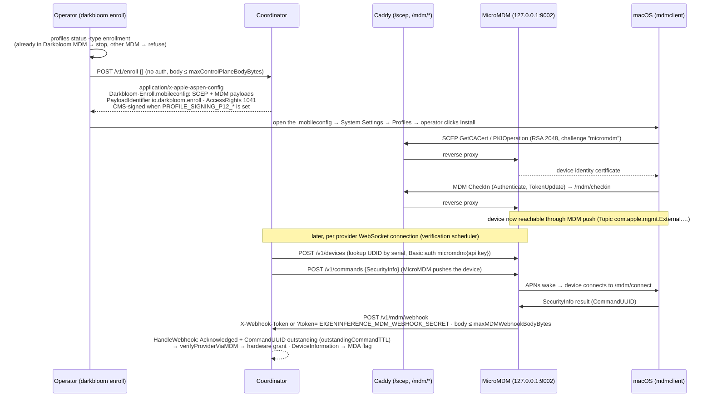

# MDM enrollment

> Last updated: 2026-09-03 · commit `5d400cf75`

How a provider Mac joins Darkbloom's MDM so the coordinator can ask Apple's
management subsystem, rather than the provider binary, whether SIP and Secure
Boot are on. Enrollment is SCEP + MDM only; the historical ACME
`device-attest-01` payload was removed.

## Context

The `hardware` trust level ([`attestation.md`](./attestation.md#trust-levels))
is granted only from an MDM `SecurityInfo` report. That report is produced by
`mdmclient`, signed with the device's MDM identity certificate, and delivered
through MicroMDM — none of which the provider process controls. Enrollment is
the one-time step that installs the identity certificate and the MDM payload.
The profile is generic (no serial, no UDID), read-only (`AccessRights` 1041),
and removable by the operator at any time.

## Mechanism

Source: `docs/assets/diagrams/enrollment-flow.mmd` (updated for this
revision; the checked-in `enrollment-flow.svg` predates it and was not
re-rendered).

### The profile

| Property | Value | Code |
|---|---|---|
| Endpoint | `POST /v1/enroll`, no authentication, JSON body decoded into an empty struct, capped at [`maxControlPlaneBodyBytes`](../../reference/api-contracts.md#limits-and-validation); a legacy `serial_number` field is ignored, never stored or logged | `coordinator/api/server.go` (route), `coordinator/api/enroll.go` (`handleEnroll`) |
| Response | `200`, `Content-Type: application/x-apple-aspen-config`, `Content-Disposition: attachment; filename="Darkbloom-Enroll.mobileconfig"` | `coordinator/api/enroll.go` (`handleEnroll`) |
| Base URL | `EIGENINFERENCE_BASE_URL` when set; only in local/dev does it fall back to `X-Forwarded-Proto` + request `Host`, because a signed profile pointing at an attacker host would launder a malicious enrollment | `coordinator/api/server.go` (`resolveBaseURL`); `coordinator/api/server_config.go` |
| Top-level payload | `PayloadType Configuration`, `PayloadIdentifier io.darkbloom.enroll`, `PayloadDisplayName "Darkbloom Provider Enrollment"`, `PayloadOrganization Darkbloom`, fresh `PayloadUUID` per download | `coordinator/api/enroll.go` (`generateCombinedProfile`) |
| Payload 1 — SCEP | `PayloadType com.apple.security.scep`, `PayloadIdentifier io.darkbloom.enroll.scep`, `PayloadUUID D01D95F9-762E-4538-A9B3-4D949D55577C`; `URL <base>/scep`, `Challenge micromdm`, RSA 2048, `Key Usage 5`, Subject `O=Darkbloom`, `CN=Darkbloom Identity` | `coordinator/api/enroll.go` (`generateCombinedProfile`) |
| Payload 2 — MDM | `PayloadType com.apple.mdm`, `PayloadIdentifier io.darkbloom.enroll.mdm`, `PayloadUUID 4DF05DBF-6D20-41A4-8072-A51D327258E7`; `IdentityCertificateUUID` = SCEP UUID; `CheckInURL <base>/mdm/checkin`; `ServerURL <base>/mdm/connect`; `Topic com.apple.mgmt.External.10520cbe-9635-453d-ac4e-c79aab56f8ce`; `SignMessage true`; `CheckOutWhenRemoved true`; `ServerCapabilities [com.apple.mdm.per-user-connections, com.apple.mdm.bootstraptoken]` | `coordinator/api/enroll.go` (`generateCombinedProfile`) |
| `AccessRights` | 1041 = 1 (inspect installed profiles) + 16 (query device information) + 1024 (security queries). Not requested: install/remove profiles (2), lock/passcode (4), erase (8), network queries (32), provisioning profiles (64, 128), installed apps (256), restrictions (512), settings (2048), app management (4096) | `coordinator/api/enroll.go` (`generateCombinedProfile` comment) |
| Stable identifiers | PayloadIdentifiers, the two PayloadUUIDs, and the push `Topic` never change, so re-enrolling replaces the profile in place (and drops the old ACME payload on devices that still carry it) | `coordinator/api/enroll.go` |
| Removed | The ACME `device-attest-01` payload and its coordinator verification leg; `acme_verified` remains in `GET /v1/providers/attestation` as a constant `false` because shipped provider builds decode it | `coordinator/api/enroll.go`; `coordinator/api/provider.go` (`handleProviderAttestation`) |

### Profile signing

| Property | Value | Code |
|---|---|---|
| Configuration | `PROFILE_SIGNING_P12_B64` or `PROFILE_SIGNING_P12_PATH`, plus `PROFILE_SIGNING_P12_PASSWORD`; a Developer ID Application identity is expected | `coordinator/profilesign/signer.go` (`LoadFromEnv`) |
| Format | CMS `SignedData`, SHA-256 digest, signer chain added with `pkcs7.AddSignerChain`; the profile is encapsulated (not detached), so the MIME type is unchanged | `coordinator/profilesign/signer.go` (`Sign`) |
| Failure policy | No signer → `enroll.profile_unsigned`; signing error → error log + `enroll.profile_sign_error` and the **unsigned** profile is served; success → `enroll.profile_signed`. Signing is install-time UX trust only and never affects the SCEP/MDM chain | `coordinator/api/enroll.go` (`handleEnroll`) |

### Operator flow

`darkbloom enroll [--coordinator URL] [--no-open]`
(`provider-swift/Sources/darkbloom/EnrollCommand.swift`) calls
`EnrollmentService.enroll` (`provider-swift/Sources/ProviderCore/Auth/Enrollment.swift`):

1. `profiles status -type enrollment` (`checkMDMEnrollment`,
   `provider-swift/Sources/ProviderCore/Security/MDMEnrollment.swift`).
   `enrolledDarkbloom` → print "Already enrolled" and stop;
   `enrolledOtherMDM` → `EnrollmentError.managedByOtherMDM`; `notEnrolled` or
   `checkFailed` → continue (a redundant download is idempotent).
2. `POST <https base>/v1/enroll` with `Content-Type: application/json`; a
   non-2xx → `coordinatorReturnedHTTP`.
3. Save to a temp `Darkbloom-Enroll-<uuid>.mobileconfig`; unless `--no-open`,
   `open` the file (registers it with System Settings) and then `open
   x-apple.systempreferences:com.apple.Profiles-Settings.extension`.
4. The operator clicks **Install** and authenticates. `mdmclient` performs
   SCEP against `/scep` and MDM check-in against `/mdm/checkin`; both are
   reverse-proxied by Caddy to MicroMDM on `127.0.0.1:9002`
   (`coordinator/Caddyfile`, `deploy/gcp/vm-startup.sh`).
5. `darkbloom unenroll` (`provider-swift/Sources/darkbloom/UnenrollCommand.swift`)
   opens System Settings → General → Device Management for removal; the
   coordinator has no remove-profile right.

### Coordinator ↔ MicroMDM

| Property | Value | Code |
|---|---|---|
| Client config | `EIGENINFERENCE_MDM_URL` (empty = MDM verification disabled), `EIGENINFERENCE_MDM_API_KEY`; HTTP Basic `micromdm:<api key>` | `coordinator/mdm/config.go` (`ReadConfig`); `coordinator/mdm/mdm.go` (`NewClient`) |
| Device lookup | `POST /v1/devices` filtered by serial → UDID and `EnrollmentStatus` | `coordinator/mdm/mdm.go` (`LookupDevice`) |
| Commands | `POST /v1/commands` (structured; MicroMDM sends exactly one push) for `SecurityInfo`; raw plist `POST /v1/commands/<udid>` + `GET /push/<udid>` for `DeviceInformation` with `DeviceAttestationNonce` (the raw endpoint does not auto-push) | `coordinator/mdm/mdm.go` (`SendSecurityInfoCommand`, `SendDeviceAttestationCommand`, `pushDevice`, `RequestDeviceAttestation`) |
| Allowed request types | `SecurityInfo`, `DeviceInformation` only; anything else panics in `assertReadOnlyCommand` before it is sent | `coordinator/mdm/mdm.go` (`readOnlyMDMRequestTypes`, `assertReadOnlyCommand`) |
| Outstanding commands | `CommandUUID` recorded per issued command with `outstandingCommandTTL` = 30m; consumed on the first matching response | `coordinator/mdm/mdm.go` (`trackCommand`, `consumeCommand`) |

### Webhook

MicroMDM is started with `command-webhook-url` pointing at the coordinator.

| Property | Value | Code |
|---|---|---|
| Route | `POST /v1/mdm/webhook` | `coordinator/api/server.go` |
| Authentication | When `EIGENINFERENCE_MDM_WEBHOOK_SECRET` is set: `X-Webhook-Token: <secret>` header **or** `?token=<secret>` query (MicroMDM cannot add headers), constant-time compare; failure → `403 forbidden` before the body is read. Unset → startup warning; the CommandUUID gate alone protects the webhook | `coordinator/api/server.go` (`HandleMDMWebhook`, `mdmWebhookTokenValid`); `coordinator/cmd/coordinator/main.go` |
| Body cap | [`maxMDMWebhookBodyBytes`](../../reference/api-contracts.md#limits-and-validation) | `coordinator/api/server.go` |
| Logging | `Debug` level: `body_size` and a 500-byte `body_preview` (MDM plist, never inference data) | `coordinator/api/server.go` (`HandleMDMWebhook`) |
| Parsing | JSON `{topic, acknowledge_event: {status, raw_payload}}`; only `status == "Acknowledged"` with a non-empty base64 plist is processed | `coordinator/mdm/mdm.go` (`HandleWebhook`) |
| Solicited-response gate | `parseCommandUUID(plist)` must match an outstanding command; otherwise the payload is dropped — a forged SecurityInfo can never drive a grant | `coordinator/mdm/mdm.go` (`HandleWebhook`) |
| Dispatch | `SecurityInfo` → the waiting `VerifyProviderWithUDIDObserver` or the late path `ApplyLateSecurityInfo`; `DevicePropertiesAttestation` → `ApplyLateMDA` | `coordinator/mdm/mdm.go` (`SetOnLateSecurityInfo`, `SetOnMDA`); `coordinator/api/provider.go` (`ApplyLateSecurityInfo`); `coordinator/api/mdm_scheduler_callbacks.go` (`ApplyLateMDA`) |
| Response | `200` once the body is read, even for payloads the gate drops; `400 bad request` only when the body cannot be read (for example over the cap) | `coordinator/api/server.go` (`HandleMDMWebhook`) |

What the coordinator reads from `SecurityInfo`: `SystemIntegrityProtectionEnabled`,
`SecureBootLevel` (`"full"` required), `AuthenticatedRootVolumeEnabled`
(recorded only) — `coordinator/mdm/mdm.go` (`parseSecurityInfoPlist`). What
it never requests: installed apps, network information, restrictions, or
anything under the unrequested `AccessRights` bits.

## Invariants

1. The enrollment profile contains no device identity and grants only read-only rights (`AccessRights` 1041) — `coordinator/api/enroll.go` (`generateCombinedProfile`).
2. `POST /v1/enroll` never reads, stores, or logs a serial number; enrollment identity comes from the authenticated MDM check-in — `coordinator/api/enroll.go` (`handleEnroll`).
3. SCEP/MDM URLs in a signed profile come from `EIGENINFERENCE_BASE_URL`, not from the request `Host` — `coordinator/api/server.go` (`resolveBaseURL`).
4. Signing failures degrade to an unsigned profile with an error log and metric; they never block enrollment — `coordinator/api/enroll.go` (`handleEnroll`).
5. The coordinator issues only `SecurityInfo` and `DeviceInformation` commands — `coordinator/mdm/mdm.go` (`assertReadOnlyCommand`).
6. A webhook payload is acted on only if it is `Acknowledged` and its `CommandUUID` matches a command the coordinator issued within `outstandingCommandTTL` ([Coordinator ↔ MicroMDM](#coordinator--micromdm)) — `coordinator/mdm/mdm.go` (`HandleWebhook`).
7. When a webhook secret is configured, unauthenticated webhooks are rejected before the body is read — `coordinator/api/server.go` (`HandleMDMWebhook`).
8. Possession of the profile proves nothing; trust is earned by the per-connection verification described in [`attestation.md`](./attestation.md#layer-3--mdm-securityinfo-the-hardware-grant) — `coordinator/api/provider.go` (`verifyProviderViaMDM`).

## Failure modes

| Failure | Effect | Code |
|---|---|---|
| Mac already managed by another MDM | `darkbloom enroll` refuses (`managedByOtherMDM`); doctor reports "enrolled in another MDM … hardware trust unavailable on this Mac" | `provider-swift/Sources/ProviderCore/Auth/Enrollment.swift`; `provider-swift/Sources/darkbloom/DoctorCommand.swift` |
| Profile downloaded but never installed | MDM lookup returns `device-not-found`; provider stays `self_signed` and the scheduler retries | `coordinator/api/provider.go` (`verifyProviderViaMDM`) |
| Enrolled but SecurityInfo never arrives (asleep, APNs delivery, Apple throttling) | `securityinfo-timeout`; retried on the MDM scheduler cadence ([attestation, Layer 3](./attestation.md#layer-3--mdm-securityinfo-the-hardware-grant)); a late webhook still grants | `coordinator/api/mdm_scheduler.go`; `coordinator/api/provider.go` (`ApplyLateSecurityInfo`) |
| `EIGENINFERENCE_MDM_URL` unset | No MDM client, no scheduler; no provider can reach `hardware` | `coordinator/cmd/coordinator/main.go` |
| Webhook secret mismatch | `403`; SecurityInfo responses are lost until MicroMDM's `command-webhook-url` token matches | `coordinator/api/server.go` (`mdmWebhookTokenValid`) |
| Webhook body over `maxMDMWebhookBodyBytes` | `400 bad request`; payload ignored | `coordinator/api/server.go` (`HandleMDMWebhook`) |
| Forged or replayed SecurityInfo | Dropped by the CommandUUID gate | `coordinator/mdm/mdm.go` (`HandleWebhook`) |
| Signing identity misconfigured | Unsigned profile served; macOS shows it as unverified; `enroll.profile_sign_error` | `coordinator/api/enroll.go` (`handleEnroll`) |

## Code map

| Concern | File (symbol) |
|---|---|
| Profile generation and serving | `coordinator/api/enroll.go` (`handleEnroll`, `generateCombinedProfile`) |
| Profile signing | `coordinator/profilesign/signer.go` (`LoadFromEnv`, `Sign`) |
| Base URL pinning | `coordinator/api/server.go` (`resolveBaseURL`); `coordinator/api/server_config.go` |
| Webhook | `coordinator/api/server.go` (`HandleMDMWebhook`, `mdmWebhookTokenValid`, `maxMDMWebhookBodyBytes`) |
| MicroMDM client | `coordinator/mdm/mdm.go` (`NewClient`, `LookupDevice`, `VerifyProviderWithUDIDObserver`, `RequestDeviceAttestation`, `HandleWebhook`, `assertReadOnlyCommand`, `parseSecurityInfoPlist`); `coordinator/mdm/config.go` |
| Wiring and env | `coordinator/cmd/coordinator/main.go` |
| Reverse proxy | `coordinator/Caddyfile`; `deploy/gcp/vm-startup.sh` |
| Provider CLI | `provider-swift/Sources/darkbloom/EnrollCommand.swift`, `provider-swift/Sources/darkbloom/UnenrollCommand.swift`; `provider-swift/Sources/ProviderCore/Auth/Enrollment.swift`; `provider-swift/Sources/ProviderCore/Security/MDMEnrollment.swift` |

## Related

- [`attestation.md`](./attestation.md) — how the enrolled device's SecurityInfo becomes the `hardware` level, and the MDA flag.
- [`identity-binding.md`](./identity-binding.md) — how the MDA certificate's serial and UDID are bound to the SE key.
- [`../../provider/attestation.md`](../../provider/attestation.md) — operator how-to for enrolling and checking `darkbloom doctor`.
- [`../../operations/coordinator-deploy.md`](../../operations/coordinator-deploy.md) — deploying MicroMDM, `EIGENINFERENCE_MDM_*`, `PROFILE_SIGNING_*`.
