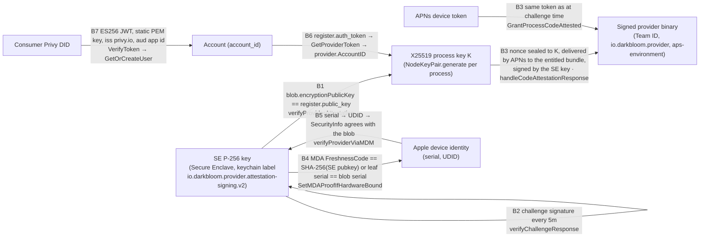

# Identity binding

> Last updated: 2026-09-03 · commit `5d400cf75`

A provider connection carries five identities — a Secure Enclave P-256 key, an
X25519 process key `K`, an APNs device token, an Apple device identity
(serial, UDID), and an account — and a consumer carries one (a Privy DID).
This page lists every binding between them and the check that enforces it, so
that "the prompt was decrypted by the attested process on the enrolled Mac
owned by this account" is a chain of verified links rather than an assumption.

## Context

Each identity is produced by a different party and can be swapped
independently: the SE key by the Mac, `K` by every provider process start, the
APNs token by the OS, the device identity by Apple, the account by the
operator. [`attestation.md`](./attestation.md) decides how much to trust the
connection; [`encryption.md`](./encryption.md) seals the prompt to `K`. Neither
means anything unless `K` is provably the key of the process that also holds
the SE key, on the device Apple says it is, linked to the account that gets
paid. That is what the bindings below establish.

## Mechanism

### The identities

| Identity | Produced by | Lifetime | Code |
|---|---|---|---|
| SE P-256 signing key | `PersistentEnclaveKey.loadOrCreateVerified`: keychain-backed Secure Enclave key, access group `SLDQ2GJ6TL.io.darkbloom.provider`, label `io.darkbloom.provider.attestation-signing.v2` (`kSecAttrAccessibleAfterFirstUnlockThisDeviceOnly`, so challenge signing works with the screen locked); keys under the legacy label `io.darkbloom.provider.attestation-signing.v1` are migrated. Fallback: `SecureEnclaveIdentity.createEphemeral` (CryptoKit `SecureEnclave.P256.Signing.PrivateKey`, lost at exit); `darkbloom-enclave-cli` always uses the ephemeral form | Persistent per Mac and signing identity; per process on the fallback path | `provider-swift/Sources/ProviderCore/Security/PersistentEnclaveKey.swift`; `provider-swift/Sources/ProviderCore/Security/SecureEnclaveIdentity.swift`; `provider-swift/Sources/ProviderCore/ProviderLoop.swift` (`createAttestationSigner`); `provider-swift/Sources/darkbloom-enclave-cli/EnclaveCLI.swift` |
| X25519 process key `K` | `NodeKeyPair.generate()` in the `ProviderLoop` initialiser (libsodium CSPRNG); legacy on-disk key files are purged | One provider process | `provider-swift/Sources/ProviderCore/Crypto/NodeKeyPair.swift`; `provider-swift/Sources/ProviderCore/ProviderLoop.swift` |
| APNs device token | macOS, for the signed bundle with `aps-environment`; sent as `register.apns_device_token` with `register.apns_environment` | Until the OS rotates it | `provider-swift/Sources/ProviderCore/Apns/APNsBridge.swift`; `coordinator/protocol/messages.go` (`RegisterMessage`) |
| Apple device identity | `serialNumber` inside the SE-signed blob (self-reported, SE-signed); serial and UDID inside the MDA leaf certificate (Apple-signed); UDID from the MicroMDM device record | Device lifetime | `coordinator/attestation/attestation.go` (`AttestationBlob`); `coordinator/attestation/mda.go` (`OIDDeviceSerialNumber`, `OIDDeviceUDID`); `coordinator/mdm/mdm.go` (`LookupDevice`) |
| Account | `account_id` created by `GetOrCreateUser` for a Privy DID; attached to a provider through a device-linked provider token | Account lifetime | `coordinator/auth/privy.go`; `coordinator/api/device_auth.go` |
| Provider ID | `uuid.New()` per WebSocket connection — a session handle, never an identity | One connection | `coordinator/api/provider.go` (`handleProviderWS`) |

### The bindings

| # | Binding | Proof | Enforced by |
|---|---|---|---|
| B1 | `K` ↔ SE key | The registration blob, signed by the SE key, carries `encryptionPublicKey`; it must equal `register.public_key`. A mismatch invalidates the attestation (and untrusts under a binary-hash policy) | `coordinator/api/provider.go` (`verifyProviderAttestation`) |
| B2 | SE key ↔ live process | Every `DefaultChallengeInterval` = 5m the process signs `nonce + timestamp` and the canonical status payload with the SE key; verified against the **registration** key, never one in the reply | `coordinator/api/provider.go` (`verifyChallengeResponse`); `coordinator/attestation/attestation.go` (`VerifyChallengeSignature`, `VerifyStatusSignature`) |
| B3 | `K` ↔ SE key ↔ signed binary ↔ APNs token | The code-identity nonce is NaCl-Box-sealed to `K` (only the `K` holder opens it), delivered through APNs to the bundle with App ID `io.darkbloom.provider` and Team ID (only that binary receives it), and returned signed by the SE key. The grant is refused if `K` or the token changed since the challenge; persisted proofs record `(se_pubkey, apns_token, node_public_key, binary_hash)` and authorise only a resume challenge, never a grant | `coordinator/api/provider_codeattest.go` (`handleCodeAttestationResponse`); `coordinator/registry/registry.go` (`GrantProcessCodeAttested`); `coordinator/api/code_attest_throttle.go` (`reuseAttestation`) |
| B4 | SE key ↔ Apple device | `DeviceAttestationNonce` = SHA-256 of the SE public key string; Apple echoes it as `FreshnessCode` in the leaf. A chain is attached only if the connection is `hardware` and (`FreshnessCode` matches this SE key **or** the leaf serial equals the blob `serialNumber`); a cached chain is reused only when the nonce binds this SE key | `coordinator/mdm/mdm.go` (`RequestDeviceAttestation`); `coordinator/attestation/mda.go` (`VerifyMDADeviceAttestation`); `coordinator/registry/registry.go` (`SetMDAProofIfHardwareBound`); `coordinator/api/provider.go` (`attachCachedMDAProof`) |
| B5 | blob serial ↔ MDM device ↔ posture | The blob's `serialNumber` selects the MicroMDM device (`LookupDevice` → UDID); the device's own `SecurityInfo` must report SIP on and `SecureBootLevel == "full"`, and both must equal the blob's `sipEnabled` / `secureBootEnabled` | `coordinator/mdm/mdm.go` (`VerifyProviderWithUDIDObserver`); `coordinator/api/provider.go` (`verifyProviderViaMDM`) |
| B6 | provider ↔ account | `register.auth_token` is looked up by SHA-256 hash (`GetProviderToken`); on success `provider.AccountID = token.AccountID` and the stable fault key is rebound. An invalid token logs a warning and leaves the provider unlinked | `coordinator/api/provider.go` (`handleProviderWS`); `coordinator/store/postgres.go` (`hashKey`); `coordinator/registry/registry.go` (`RebindStableFaultKey`) |
| B7 | consumer ↔ account | `Authorization: Bearer <Privy access token>` verified as below; the JWT subject (Privy DID) maps to an account via `GetOrCreateUser` | `coordinator/api/server.go` (`requirePrivyAuth`, `extractBearerToken`); `coordinator/auth/privy.go` (`VerifyToken`, `GetOrCreateUser`) |
| B8 | durable evidence ↔ device | Trust-reuse rows are keyed by SE public key and carry `serial`, `mda_udid`, posture bits and generations; reuse refuses `serial_mismatch`, `missing_identity`, `no_device_evidence` | `coordinator/store/interface.go` (`ProviderTrustReuse`); `coordinator/api/trust_reuse.go` (`tryTrustReuseFastSkip`) |

### Stable identity for coordinator state

Reconnects, reputation, fault ejection, and stored trust must follow the
machine, not the session UUID.

| Use | Key | Code |
|---|---|---|
| Stored provider record lookup on registration | `serialNumber` from the fresh blob first, then `"sekey:" + <SE public key>` | `coordinator/api/provider.go` (`verifyProviderAttestation`) |
| Fault / reputation key | `serial:<serial>` → `sekey:<SE key>` → `acct:<account_id>` → `""` (valid attestation required for the first two; the account fallback is safe because `AccountID` comes from the authenticated token, never from the blob) | `coordinator/registry/health_ejection.go` (`stableProviderIdentityLocked`) |
| Trust reuse, code-identity proofs, push budgets | SE public key (plus token hash for budgets) | `coordinator/api/trust_reuse.go`; `coordinator/api/code_attest_throttle.go` |

### Device-code account linking

RFC 8628-style flow implemented in `coordinator/api/device_auth.go` and
`provider-swift/Sources/ProviderCore/Auth/DeviceAuth.swift` (`darkbloom login`).

| Step | Endpoint / value | Code |
|---|---|---|
| 1 | `POST /v1/device/code` (no auth, body capped at `maxControlPlaneBodyBytes`) → `{device_code, user_code, verification_uri, expires_in, interval}`. `device_code` = 32 random bytes hex; `user_code` = 8 chars from `ABCDEFGHJKMNPQRSTUVWXYZ23456789` formatted `XXXX-XXXX`; `expires_in` = `DeviceCodeExpiry` and `interval` = `DeviceCodePollInterval` ([api-contracts](../../reference/api-contracts.md#device-code-flow-3)); `verification_uri` = `EIGENINFERENCE_CONSOLE_URL` + `/link`, else `<scheme>://<host>/link` | `handleDeviceCode`, `generateUserCode` |
| 2 | Operator signs in to the console and submits the code: `POST /v1/device/approve {user_code}` behind `requirePrivyAuth` and `rateLimitFinancial`; code normalised to upper-case; errors `invalid_code`, `expired_code`, `already_used`; success → `ApproveDeviceCode(device_code, account_id)` | `handleDeviceApprove` |
| 3 | CLI polls `POST /v1/device/token {device_code}` (no auth; the secret is the code): `200 {status: "authorization_pending"}` while pending; `invalid_grant` when unknown; `expired_token` after `DeviceCodeExpiry` or once consumed; on approval `200 {status: "authorized", token, account_id}` | `handleDeviceToken` |
| 4 | Token = the provider token whose shape is under [api-contracts](../../reference/api-contracts.md#device-code-flow-3); the store keeps `ProviderToken{TokenHash, AccountID, Label: "device-" + user_code, Active}`; the CLI writes the token to `~/.darkbloom/auth_token` with mode `0600` | `handleDeviceToken`; `AuthTokenStore` |
| 5 | The daemon sends it as `register.auth_token` (binding B6) | `coordinator/api/provider.go` |
| Logging | `device code created {user_code, expires_in}`, `provider token issued {account_id, user_code}`, `device approved {user_code, account_id, email}` at `Info` — never the `device_code` or the token | `coordinator/api/device_auth.go` |

### Consumer identity: Privy JWT verification

| Property | Value | Code |
|---|---|---|
| Configuration | `EIGENINFERENCE_PRIVY_APP_ID`, `EIGENINFERENCE_PRIVY_APP_SECRET`, and the verification key as `EIGENINFERENCE_PRIVY_VERIFICATION_KEY` (PEM; literal `\n` sequences are expanded) or `EIGENINFERENCE_PRIVY_VERIFICATION_KEY_FILE`; both app ID and key are required | `coordinator/auth/config.go`; `coordinator/auth/privy.go` (`NewPrivyAuth`) |
| Key | A single **static** PEM `SubjectPublicKeyInfo` parsed with `x509.ParsePKIXPublicKey`; must be ECDSA. There is no JWKS fetch and no key rotation without a restart | `coordinator/auth/privy.go` (`NewPrivyAuth`) |
| Token checks | Algorithm exactly `ES256`; issuer `privy.io`; audience = app ID; standard `exp`/`nbf` via `jwt.RegisteredClaims`; non-empty `sub` | `coordinator/auth/privy.go` (`VerifyToken`) |
| Result | `sub` is the Privy DID (`did:privy:…`); `GetOrCreateUser` looks it up or creates `User{AccountID: uuid, PrivyUserID, Email}` after fetching details from `https://auth.privy.io/api/v1/users/<did>` with Basic auth `app_id:app_secret` and `Privy-App-Id` | `coordinator/auth/privy.go` (`GetOrCreateUser`, `fetchUserDetails`) |
| Failure | Missing header → `401 authentication_error "missing credentials"`; bad token → `401 authentication_error "invalid Privy token"` | `coordinator/api/server.go` (`requirePrivyAuth`) |

## Invariants

1. The provider's X25519 key is accepted only if the SE-signed blob names it as `encryptionPublicKey` — `coordinator/api/provider.go` (`verifyProviderAttestation`).
2. All challenge and code-identity signatures are checked against the registration-time SE key — `coordinator/api/provider.go` (`verifyChallengeResponse`), `coordinator/api/provider_codeattest.go` (`handleCodeAttestationResponse`).
3. Code identity is granted only if `K` and the APNs token are unchanged since the challenge was issued — `coordinator/registry/registry.go` (`GrantProcessCodeAttested`).
4. An MDA chain is attached only when it binds this SE key or the blob's serial, and only on a `hardware` connection — `coordinator/registry/registry.go` (`SetMDAProofIfHardwareBound`).
5. Hardware posture is taken from the device selected by the blob's serial and must agree with the blob — `coordinator/api/provider.go` (`verifyProviderViaMDM`).
6. `AccountID` is set only from a valid device-linked token, never from anything in the attestation blob — `coordinator/api/provider.go` (`handleProviderWS`), `coordinator/registry/health_ejection.go` (`stableProviderIdentityLocked`).
7. Provider tokens and API keys are stored and looked up by SHA-256 hash only — `coordinator/store/postgres.go` (`hashKey`), `coordinator/api/device_auth.go` (`handleDeviceToken`).
8. Privy tokens are accepted only with `ES256`, issuer `privy.io`, and the configured audience, under the static configured key — `coordinator/auth/privy.go` (`VerifyToken`).
9. The provider UUID is never used as an identity for trust, reputation, or reuse — `coordinator/registry/health_ejection.go` (`stableProviderIdentityLocked`).

## Failure modes

| Failure | Effect | Code |
|---|---|---|
| Provider restarts | New `K`; B1 re-established by the fresh blob; cached code-identity proofs no longer match `node_public_key`, so a resume needs the durable proof's process-key match or a new push | `coordinator/api/code_attest_throttle.go` (`reuseAttestation`) |
| Persistent SE key unusable (keychain locked, poisoned) | `loadOrCreateVerified` repairs once, else ephemeral fallback: a new SE identity, so stored trust, code proofs, and MDA binding start over | `provider-swift/Sources/ProviderCore/Security/PersistentEnclaveKey.swift`; `provider-swift/Sources/ProviderCore/ProviderLoop.swift` |
| APNs token rotates | `CodeAttested` cleared; push budget re-keyed (at most once per `budgetClearCooldown` = 20m) | `coordinator/api/code_attest_throttle.go` |
| Blob serial does not match any MicroMDM device | `device-not-found`; stays `self_signed`; retried | `coordinator/api/provider.go` (`verifyProviderViaMDM`) |
| MDA leaf serial ≠ blob serial and nonce does not bind the SE key | `mda_verified` stays false | `coordinator/registry/registry.go` (`SetMDAProofIfHardwareBound`) |
| Invalid or revoked provider token | Warning logged; provider connects unlinked (no account, no owner self-route, no payouts) | `coordinator/api/provider.go` |
| Privy key rotated upstream | Every consumer token fails `401` until the coordinator is restarted with the new PEM | `coordinator/auth/privy.go` |
| Device code expired or reused | `expired_token` / `already_used`; operator reruns `darkbloom login` | `coordinator/api/device_auth.go` |

## Code map

| Concern | File (symbol) |
|---|---|
| SE key lifecycle | `provider-swift/Sources/ProviderCore/Security/PersistentEnclaveKey.swift` (`loadOrCreateVerified`, `defaultLabel`, `defaultAccessGroup`); `provider-swift/Sources/ProviderCore/Security/SecureEnclaveIdentity.swift` (`createEphemeral`); `provider-swift/Sources/ProviderCore/ProviderLoop.swift` (`createAttestationSigner`) |
| `K` lifecycle | `provider-swift/Sources/ProviderCore/Crypto/NodeKeyPair.swift` (`generate`, `purgeLegacyFiles`) |
| Blob ↔ `K` binding | `coordinator/api/provider.go` (`verifyProviderAttestation`); `coordinator/attestation/attestation.go` (`AttestationBlob`) |
| Code identity | `coordinator/api/provider_codeattest.go` (`handleCodeAttestationResponse`); `coordinator/api/code_attest_throttle.go` (`reuseAttestation`, `persistCodeAttestation`); `coordinator/registry/registry.go` (`GrantProcessCodeAttested`) |
| MDA binding | `coordinator/mdm/mdm.go` (`RequestDeviceAttestation`); `coordinator/attestation/mda.go`; `coordinator/registry/registry.go` (`SetMDAProofIfHardwareBound`); `coordinator/api/provider.go` (`attachCachedMDAProof`) |
| MDM posture binding | `coordinator/mdm/mdm.go` (`LookupDevice`, `VerifyProviderWithUDIDObserver`); `coordinator/api/provider.go` (`verifyProviderViaMDM`) |
| Stable identity | `coordinator/registry/health_ejection.go` (`stableProviderIdentityLocked`); `coordinator/registry/registry.go` (`RebindStableFaultKey`); `coordinator/registry/persistence.go` (`RestoreProviderState`) |
| Account linking | `coordinator/api/device_auth.go` (`handleDeviceCode`, `handleDeviceToken`, `handleDeviceApprove`, `DeviceCodeExpiry`, `DeviceCodePollInterval`); `provider-swift/Sources/ProviderCore/Auth/DeviceAuth.swift` (`AuthTokenStore`) |
| Consumer identity | `coordinator/auth/privy.go` (`NewPrivyAuth`, `VerifyToken`, `GetOrCreateUser`); `coordinator/auth/config.go`; `coordinator/api/server.go` (`requirePrivyAuth`) |

## Related

- [`attestation.md`](./attestation.md) — the trust levels and flags these bindings feed.
- [`encryption.md`](./encryption.md) — what is sealed to `K`.
- [`enrollment.md`](./enrollment.md) — how the device becomes addressable by serial in MicroMDM.
- [`../../provider/attestation.md`](../../provider/attestation.md) — `darkbloom login`, `darkbloom enroll`, and reading the resulting status.
