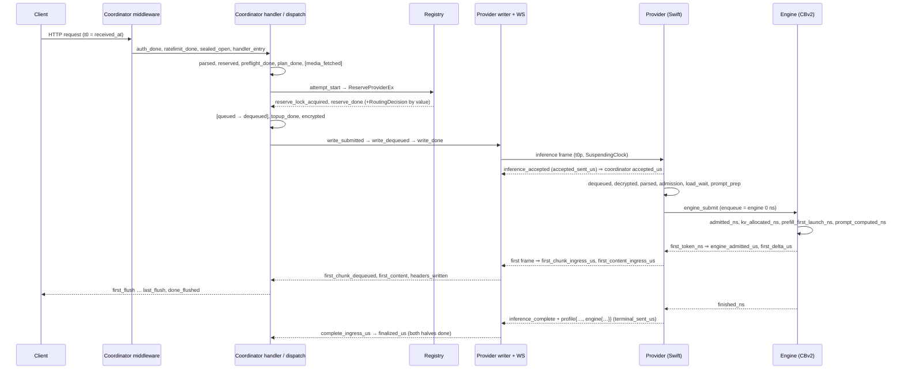

# System profiler

Status: slice 1 (coordinator record, routing context, fleet snapshots, admin export) landed in `02832be21` with review fixes in `14d6af703`/`0e2ca90e5`/`85f6fc68e`; slice 2 (provider profile on the wire, heartbeat telemetry sub-objects, Go ingress validation) landed in `14d6af703` (Go) and `e58464908` (Swift); slice 3 (engine `CBv2RequestTiming`) landed in `0825526dc` (submodule `libs/mlx-swift-lm` commit `7823081`). Companions: `telemetry-inventory.md` (what existed before), `request-outcome-observability.md` §Privacy (invariants table rows for both tables), `docs/reference/api-contracts.md:232` (`X-Timing`).

**Provenance.** Every `file:line` refers to commit `02832be21`; reproduce with `git show 02832be21:<path>`. Paths are relative to `coordinator/` unless they start with `e2e/`, `docs/`, `provider-swift/` or `libs/`. Fields that exist as columns but whose producer ships later are listed explicitly in §5.4 so a NULL is never mistaken for a bug.

## 1. Purpose and mental model

The profiler answers "where did the time go, and what did the router know when it chose?" for one request without ever carrying prompt-derived bytes. It produces **one prompt-free row per dispatched attempt** (`request_profiles`; `store/profile_records.go:8-13` — pre-dispatch rejections never produce a row) holding coordinator-clock microsecond offsets, bounded counters, closed-enum outcomes, the routing decision context copied by value at reserve time, and (from slice 2) a validated provider/engine profile; plus **one fleet row per (provider session, model slot) per minute** and one coordinator row per tick (`fleet_snapshots`; `registry/fleet_sample.go:34-57`, cadence `api/profiler.go:38`). **Postgres is the system of record** (DDL `store/postgres.go:5175`, `:5321`); **NDJSON export** (`api/profiler_admin.go:35`, `:67`) feeds `routingsim`; **Datadog gets bounded-tag counters only** — no percentiles, no ids (§7.3).

| Artefact | Grain | Producer | Sink | Retention |
|---|---|---|---|---|
| `request_profiles` row | dispatched attempt | stamps on `registry.RequestProfile`/`AttemptProfile`, flattened by `api/profiler_record.go:139` | batched `profileSink` (`api/profiler_sink.go`) → multi-row INSERT | 14 d (`api/profiler.go:36`) |
| `fleet_snapshots` row | (provider, slot) per 60 s + 1 coordinator row | `registry.FleetSample` / `CoordinatorSample` (`registry/fleet_sample.go:44`, `:194`) | own goroutine, `pgx.CopyFrom` (`store/postgres_profiles.go:182`) | 30 d (`api/profiler.go:37`) |
| `X-Timing` additive keys | committed response | `api/profiler_dispatch.go:52` | response header | n/a |
| Datadog counters | process | §7.3 | DogStatsD | n/a |

## 2. Principles

| # | Principle | Where it is enforced (slice 1) |
|---|---|---|
| P1 | **No new channel.** Per-request provider data is an optional `profile` object on `inference_complete`/`inference_error`, carried as `json.RawMessage`, decoded only after the terminal is fully processed; system data is one pointer sub-object `telemetry` on `BackendSlotCapacity`/`BackendCapacity` plus counters on the existing `HeartbeatStats`. | Raw bytes are only length-checked and retained on the attempt (`registry/attempt_profile.go` (`SetProviderProfileRaw`)); decode is a sink-worker job (`api/profiler_provider.go:16`). |
| P2 | **Closed by construction.** Every persisted string is a coordinator-minted id or a closed enum; provider strings are folded at the profiler boundary; stored structs are flat typed columns; unknown enum values fold to `other`; invalid outcomes are a bounded reason set (§6.2). | `foldChipFamily`/`foldThermalState`/`foldProviderVersion` (`api/profiler_record.go:30`, `:43`, `:54`); `SlotStateFold`/`ThermalStateFold` (`registry/gate_reason.go:153`, `:173`); reflective test `TestRequestProfileRecordHasNoFreeFormProviderBytes` (`store/profile_records_test.go:197`); 4 KiB cap (`registry/request_profile.go:337`). |
| P3 | **Clock domains.** Coordinator: `t0` = middleware start (`api/server.go:2596`), every stamp is µs from `t0` on the monotonic clock (`registry/request_profile.go:202-233`), `received_at` = `t0` is the single wall anchor (`api/profiler_record.go:163`). Provider: anchor and stamps on `SuspendingClock` (mach_absolute_time, the engine's `DispatchTime` domain), taken beside the existing `ContinuousClock` `receivedAt` that keeps driving deadlines; `slept_us` = continuous Δ − suspending Δ. Engine: ns from engine enqueue on `DispatchTime`. **Never subtract across hops.** `transport_est_us = (complete_ingress_us − write_done_us) − prov_total_us` is "non-provider time: both network legs + WS reader wake + coordinator ingress, including provider `slept_us`" — two coordinator stamps minus a provider *duration*. `wall_ms` is stored verbatim and untrusted. | Offsets are `atomic.Int64` first-write-wins with 0 = unset (a stamp at exactly 0 µs is stored as 1; `registry/request_profile.go:14-17`). |
| P4 | **Hot-path budget.** Profile allocated lazily at inference-handler entry, never in middleware; stamps are one clock read + one CAS; routing context returned by value from fixed-size fields filled inside the existing scan loops (0 allocations, no new lock under `r.mu`); per chunk on the WS read loop = 1 clock read + 2 atomic adds; provider ≤ 30 lock ops per request, no per-token lock; engine ≤ 8 clock reads per step (5 unconditional + 1 conditional; rows finished at a step boundary share one lazily-taken boundary read), 0 added allocations or per-row lookups per step (one timing box per request at finish), host syncs unchanged and now counted at the finalize readbacks behind a test-only gate so the per-step sync assertion is exact, no per-step ring. | Middleware stores only `{coordID, start}` (`api/profiler.go:50`); lazy creation `api/profiler.go:134`; `RoutingDecision` context block `registry/scheduler.go:372-426`, `CandidateSummary` value type `registry/gate_reason.go:187`; four `time.Now()` stamps in `ReserveProviderEx` (`registry/scheduler.go:458`); chunk path `api/provider.go:1627-1629`. |
| P5 | **Reuse.** `RequestTiming`/`PendingRequest`/`dispatchState`, `RoutingDecision`, the `telemetrySink` pattern, `admin_telemetry.go` helpers, `HeartbeatStats`, `BackendSlotCapacity`, `CBv2Usage`. | `PendingRequest.Profile` (`registry/registry.go:260`); admin handlers reuse `parseSince`/`parseLimit`/`writeNDJSON` (`api/profiler_admin.go:17-78`). |
| P6 | **Two knobs only.** `EIGENINFERENCE_PROFILER=off` (kill switch) and `EIGENINFERENCE_PROFILE_SAMPLE_RATE` (default 0.1). Sampling is all-or-nothing per logical request, keyed by FNV hash of the minted `coord_request_id`; always-record predicates are code constants (§5.5). Retention 14 d / 30 d and the 60 s cadence are constants. | `api/profiler.go:11-17`, `:32-44`, `:101-117`, `:165-181`. |
| P7 | **Mixed fleet.** Presence of the `profile` object / `telemetry` sub-object is the "new provider" sentinel; inside them absent numeric == 0 by contract and order checks skip absent stamps. Old provider → all provider columns NULL. New provider + old coordinator → unknown keys ignored. No `minProviderVersion` bump. | Fleet rows leave slice-2/3 fields zero/nil (`registry/fleet_sample.go:39-43`); missing profile → `provider_profile_invalid_reason='absent'` (`api/profiler_record.go:278`). |
| P8 | **Write once, exactly once.** Two-halves finalize (handler half + terminal half) under `sync.Once`; `INSERT … ON CONFLICT (request_id, attempt) DO NOTHING`. Attempts that never reach the provider (reserve, queue or write failures) get only their terminal half at the failure site (`closeUndispatchedAttempt`); the handler half of every attempt lands in `finalizeProfile` when the dispatch loop returns, so a record is never built while the handler still writes request-level fields. A provider terminal frame that owns the terminal claim completes the terminal half itself, after its provider outcome is written; the route-outcome funnel completes it only when no frame owns it (`CompleteTerminalUnlessClaimed`, atomic with the claim). | `registry/attempt_profile_finalize.go`; `api/profiler_dispatch.go`; `store/postgres_profiles.go:72`. |
| P9 | **Identity.** `coord_request_id` is always coordinator-minted (the client's `X-Request-ID` is echoed and logged, never persisted); `request_id` is the attempt UUID; `provider_id` is the session id; **no serial, stable identity, Secure Enclave key or account id column anywhere** (machine dedupe joins `providers`/`provider_sessions` in SQL without selecting the serial); `endpoint` is the mux pattern; `model` the catalog id; CSV cells are formula-guarded. | `api/server.go:2596-2600`; `request_rejections.request_id` minted (`api/rejection_telemetry.go:100`); `httpPathLabel(r.Pattern)` (`api/profiler.go:146`); `csvCell` (`api/profiler_admin.go:122`). |

## 3. Request lifecycle waterfall

### 3.1 Coordinator stamps (slice 1, live)

Request-level stamps live on `RequestProfile` (`registry/request_profile.go`), attempt-level on `AttemptProfile` (`registry/attempt_profile.go`). Chat and generic paths (`/v1/completions`, `/v1/messages`, `/v1/responses`) share the attempt stamps; the generic handler stamps `parsed_us`/`reserved_us` at `api/consumer.go:4141`/`:4180`.

| Column | Taken at | Segment since the previous stamp |
|---|---|---|
| `auth_done_us`, `auth_kind`, `auth_db_read` | `stampAuth` (`api/profiler.go:194`) from `api/server.go:2299`, `:2307`, `:2392` | TLS/header read + API-key or Privy auth; `auth_db_read` says whether a key lookup hit the store |
| `ratelimit_done_us` | `api/server.go:2481`, `:2518` | rate limiter |
| `sealed_open_us`, `sealed_body_bytes` | `api/sender_encryption.go:207` | sealed-transport body decrypt (absent for plain HTTPS) |
| `handler_entry_us` | `api/profiler.go:158` at `api/consumer.go:1518` (chat) / `:4005` (generic) | remaining middleware + mux (= `X-Timing.pre_handler_us`) |
| `parsed_us`, `db_us`, `db_calls` | `api/consumer.go:1722`; DB accumulator `:1688`, `:2035` (`profileDBCall`, `api/profiler.go:185`) | body read, JSON decode, model resolve, registry-record read |
| `reserved_us` | `api/consumer.go:1825` | balance reservation (store write) |
| `preflight_done_us`, `preflight_us`, `preflight_outcome` ∈ {passed, handled} | `api/consumer.go:1995-1996` | admission preflight (quick capacity / TTFT checks) |
| `plan_done_us`, `first_content_budget_ms` | `api/consumer.go:2038`, `:2041` | second registry read + cache-route plan |
| `media_fetched_us` | `api/consumer.go:2043` (only when media was inlined) | remote media fetch |
| `attempt_start_us` | `api/consumer.go:856` (direct) / `api/dispatch.go:1245` (queued) | retry/backup loop overhead before this attempt |
| `reserve_lock_acquired_us` | derived: `attempt_start_us + LockWaitUS` (`registry/attempt_profile.go`, `SetDecision`) | wait for `r.mu` measured from `ReserveProviderEx` entry (`registry/scheduler.go:458`) |
| `reserve_done_us` | `api/consumer.go:928` / `api/dispatch.go:1356`; decision copied at `api/consumer.go:929` / `api/dispatch.go:1357` | candidate scan + selection + admit re-check (`scan_us`, `admit_us`) |
| `queued_us` | `api/dispatch.go:1246` | (queued path) enqueue into the model queue |
| `dequeued_us` | `api/dispatch.go:1355` | pure queue wait (= `X-Timing.queue_pure_us`) |
| `topup_done_us` | `api/consumer.go:998` | provider-specific surcharge reservation (store) |
| `encrypted_us` | `api/consumer.go:1066` / `api/dispatch.go:1485` | session key + body encryption |
| `write_submitted_us` | `api/consumer.go:1076` / `api/dispatch.go:1494` | frame build + submit to the provider writer |
| `write_dequeued_us` | `api/consumer.go:1086` / `api/dispatch.go:1502` (writer `DequeuedAt`) | provider-writer queue wait (= `writer_us`) |
| `write_done_us` | `api/consumer.go:1091` / `api/dispatch.go:1507` | socket write (= `socket_us`) |
| `accepted_us` | `api/provider.go:1777` | provider ack round trip (= `provider_ack_us`) |
| `first_chunk_ingress_us`, `chunks_in`, `decrypt_us_total` | `api/provider.go:1627-1629` (ingress `receivedAt`) | provider dequeue → prefill → first frame → transport |
| `first_content_ingress_us` | `api/provider.go:1635` | boilerplate/preamble frames before the first content-bearing chunk |
| `first_chunk_dequeued_us`, `first_content_us`, `held_preamble_chunks` | `api/profiler_dispatch.go:92-105` from `api/dispatch.go:541` | channel hand-off to the dispatch goroutine + commit decision |
| `headers_written_us` | `stampCommitted` (`api/profiler_dispatch.go`) at commit for streams; `writeNonStreamBody` at the body write for non-streaming responses | `X-Timing` computed, headers written (a non-stream row therefore has `complete_ingress_us ≤ headers_written_us = first_flush_us`) |
| `first_flush_us`, `last_flush_us`, `done_flushed_us`, `chunks_out`, `bytes_out`, `max_chunk_gap_us`, `client_write_err` (only bytes the ResponseWriter accepted count; a failed or short write sets `client_write_err` and `done_flushed_us` stays absent) | `relayStamps` (`api/profiler_dispatch.go`) from the chat, Responses and generic SSE relays; non-streaming 200 bodies stamp the same four fields (one chunk, body bytes) in `writeNonStreamBody` | SSE relay / JSON body to the client |
| `client_gone_us`, `client_gone_phase` ∈ {before_first_token, after_commit} | `api/profiler_dispatch.go:157`, `:216` from `api/dispatch.go:1062`, `api/consumer.go:2336`; also at finalize `api/profiler_dispatch.go:149` | client disconnect |
| `cancel_sent_us` | `api/dispatch.go:3506` | cancel frame to the provider after the relay returns |
| `complete_ingress_us` | `api/provider.go:1812` (parked), `:1850` (complete), `:2417` (error) | provider terminal frame received |
| `finalized_us` | `api/profiler_record.go:196` | both halves done → row built |

Outcome columns are written first-wins by `SetOutcome` (`registry/attempt_profile.go`): provider complete (`api/provider.go:2247`), provider error with `terminal_cause` (`:2418`), consumer-side synthetic terminals (`api/route_outcome.go:189`), never-dispatched attempts (`api/profiler_dispatch.go:120`, class from `dispatchErrorClass` `api/dispatch.go:905`), grace expiry → `provider_outcome='no_terminal'` (`registry/attempt_profile_finalize.go`, `armFallback`).

### 3.2 Provider stamps (landed: `provider-swift/Sources/ProviderCore/Telemetry/RequestProfileBuilder.swift`, stamp sites listed in commit `e58464908`)

Microseconds from `t0p` = WS frame receipt on the provider's `SuspendingClock`; every field optional; absent = did not happen.

| Stamp | Segment since previous |
|---|---|
| `dequeued_us` | WS reader → inference handler queue |
| `decrypted_us` → `parsed_us` | body decrypt, JSON parse |
| `admission_us` → `accepted_sent_us` | admission decision (`deadline_mode`, `budget_remaining_at_admit_us`, `running/waiting/queued_prefill_tokens_at_admit`, `kv_bytes_*_at_admit`), ack frame sent |
| `load_wait_start_us` → `load_wait_end_us` (`load_cold`, `load_parked`) | model load / park wait |
| `task_spawned_us`, `prompt_prep_start_us` → `prompt_prep_end_us` (`tool_constraint_us`, `vision_prep_us`, `ssd_stage_us`) | detached task spawn, prompt preparation |
| `engine_submit_us` → `engine_admitted_us` (`kv_reserve_us`, `steps_at_submit`) | bridge submit → engine admission |
| `first_delta_us`, `first_frame_us` | prefill + first token; first frame on the wire |
| `last_delta_us` (pump-local, written once at `.finished`) | decode |
| `terminal_built_us` → `terminal_sent_us` (`flush_us`, `se_sign_us`, `steps_at_finish`, `frames_emitted`, `bytes_emitted`) | terminal build, signing, send |
| `cancel_received_us` → `cancel_aborted_us` (`cancel_stage`, `tokens_after_cancel`) | cancel handling |
| `total_us`, `slept_us`, `wall_ms` | end of request; sleep during it; untrusted wall anchor |

### 3.3 Engine stamps (landed: `libs/mlx-swift-lm/Libraries/MLXLMCommon/ContinuousBatchingV2/CBv2RequestTiming+Stamps.swift`, mapped by `provider-swift/Sources/ProviderCore/Inference/EngineV2Bridge+Profile.swift`)

Nanoseconds from `SchedulerV2.enqueue` on `DispatchTime` (`CBv2RequestTiming` on `CBv2Usage.timing`; the bridge copies it into the wire `engine` sub-object and records `engine_enqueue` in the provider clock so the chains join in one domain).

| Stamp | Meaning |
|---|---|
| `admitted_ns` (`readmissions`, `preemptions`, `capacity_requeues`) | first `markAdmitted` |
| `kv_allocated_ns` | `ensureKVState`; on a prefix-cache adoption at enqueue the stamp is raised to `admitted_ns` at first admission so the exported chain stays ordered (adoption itself is evidenced by `prefix_adoption_ns > 0`) |
| `prefill_first_launch_ns` (`prefill_chunks`, `packed_prefill_chunks`, `vision_chunks`, `solo_stripe_chunks`, `prefill_chunk_tokens_max`) | `wallStartedNanos` of the first step whose plan included this row's prefill chunk |
| `prompt_computed_ns` | finalize of the step where `numComputedTokens ≥ promptTokens` |
| `first_token_ns` (`detok_delay_first_ns`, `prefix_lookup_ns`, `prefix_adoption_ns`) | finalize of the step that produced token 1; detok delay measured for the first token only, inside the stream lock |
| `finished_ns` (`decode_steps`, `chained_decode_steps`, `batch_rows_sum/min/max`, `step_latency_ns_sum/max`, `mtp_rounds/proposed/accepted`, `paused_ns`, `pause_count`, `finish_reason`) | `finishRequest` |

Cumulative engine counters `step_wall_ns_total`, `decode_rows_total` land on `CBv2CapacitySnapshot` and then `fleet_snapshots` via the heartbeat slot `telemetry` sub-object.

### 3.4 One request across the hops



## 4. Routing decision context

Filled by value under `r.mu` from fixed-size `candidateScan` fields (`registry/scheduler.go:372-426`), returned on `RoutingDecision`, and copied into the attempt **after** the lock is released (`api/consumer.go:929`, `api/dispatch.go:1357`, `registry/attempt_profile.go` `CopyPreDispatchFrom`). JSON encoding happens on the sink worker (`api/profiler_record.go:112`).

| Column(s) | Definition (reviewer-agreed) | Where |
|---|---|---|
| `scanned` | providers the candidate loop visited. Since the per-model provider index (`registry/model_index.go`, PR B of the 2026-09-02 perf program) the loop visits only providers **advertising** the requested model, so `scanned` is the advertising count, not the fleet size, and `gate_rejections.not_serving_model` is 0 unless an advertiser still fails the catalog rule (off-catalog model on a public route). The same applies to the `allowlist` / `excluded` tallies, which run before the catalog check and now count only advertisers (a serial-allowlist miss used to tally ~fleet size per request). Records written before the index landed have `scanned == fleet size`. Fleet size is available from `fleet_snapshots`. | `registry/scheduler.go` `RoutingDecision.Scanned` |
| `candidate_set_size` | `scanned − gate_rejections.not_serving_model` (unchanged in meaning by the index); exclude/allowlist drops happen before the catalog check and count as advertising | `registry/scheduler.go` `scan.candidateSetSize` |
| `gate_rejections` JSONB `{reason: count}` | per-`GateReason` tally, uint16-saturating; keys are the Go constants (`registry/gate_reason.go:50`). **`allowlist` absorbs exclusive self-route-not-owned** (`registry/scheduler.go:851-852`) and serial allowlist misses (`registry/scheduler.go:857`); `excluded` is the caller's exclude list (`registry/scheduler.go:862`) | tally `registry/scheduler.go:737` |
| `candidates` JSONB (≤ 4 rows) | `Top[0]` **is the winner** when one exists, then the lowest-cost other candidates of the narrowed pool ascending; each row = `CandidateSummary` (cost + 7 terms, `ttft_ms`, `effective_tps`, `effective_queue`, `total_pending`, `backend_running/waiting`, `active_token_budget_used/max`, `queued_prefill_tokens`, folded `slot_state`, `hb_age_ms`) | `registry/scheduler.go:388-391`, `registry/scheduler.go:784`; shape `api/profiler_record.go:75` |
| `runner_up_provider_id`, `runner_up_cost_ms` | **lowest-cost candidate of the narrowed pool other than the winner** ("what we would have chosen instead"); absent when the pool had one candidate | `registry/scheduler.go:392-395`, `lowestCostOther` `registry/scheduler.go:1199`, `registry/scheduler.go:1178` |
| `best_idle_provider_id`, `best_idle_ttft_ms` | lowest-TTFT candidate with the model resident and `backend_running + backend_waiting == 0`, **computed unconditionally** over every candidate that passed the gates (before pool narrowing) — works with the shadow evaluator off | `registry/scheduler.go:396-400`, `registry/scheduler.go:789-799`, `registry/scheduler.go:988` |
| `near_tie_pool_size`, `selection_path` ∈ {none, unique_min, tie_queue, tie_pending, cache_tiebreak, random} | candidates inside `nearTieCostWindowMs` (`registry/scheduler.go:39`) of the minimum; which branch of `selectRoutingCandidate` chose | `registry/scheduler.go:1097-1179`; enum `registry/gate_reason.go:93` |
| `snapshot_age_ms` | winner's `now − LastHeartbeat` at the moment its routing snapshot was taken (uses the `now` the snapshot already reads; observability only, routing is not gated on it); `hb_age_ms` per candidate row | `registry/scheduler.go:405-407`, `registry/scheduler.go:615`, snapshot `registry/scheduler.go:1525`, `heartbeatAgeMs` `registry/scheduler.go:1594` |
| `predicted_ttft_ms`, `raw_ttft_ms`, `ttft_calibration_ratio`, `prefill_decode_ratio` | calibrated vs pre-calibration TTFT estimate; ratio applied for (model, chip); decode→prefill fallback multiplier | `registry/scheduler.go:619`, `registry/scheduler.go:649`; copy `api/profiler_record.go:240-256` |
| `predicted_decode_tps` | `projectedPerRequestDecodeTPS(winner snapshot)` | `registry/scheduler.go:616` |
| `pending_for_model`, `total_pending` | winner's coordinator-side pending counts before this reservation | `registry/scheduler.go:411-413` |
| `capacity_rate_ms`, `cache_discount_ms` | gray-box capacity-503 penalty; exact-cache discount | `registry/scheduler.go:313-317`, `registry/scheduler.go:352` |
| `shadow_would_shed`, `shadow_idle_alternative` | NULL unless the TTFT shadow evaluator ran | `api/profiler_record.go:248` |
| `lock_wait_us`, `scan_us`, `admit_us` | the three phases of `ReserveProviderEx`; **`lock_wait_us` is measured from function entry** (cache-hint read and hint computation are inside it) | `registry/scheduler.go:453-458`, `registry/scheduler.go:620-622` |
| `queue_position_at_enqueue`, `queue_depth_at_enqueue`, `drain_trigger` ∈ {heartbeat, idle, challenge, load, disconnect, kick, unknown} | queue path only: index at enqueue (0 = head), waiters ahead, and the bounded event whose drain reserved it | `registry/scheduler.go:2874-2876`; `registry/queue.go:60-77`, `registry/queue.go:93` |
| `slot_state` (candidates, fleet rows) | provider string **folded** via `SlotStateFold` → {running, idle, idle_shutdown, crashed, reloading, other}; `other` includes the coordinator's own "unknown" (cold candidate, still visible through a non-zero `state_ms`) | `registry/gate_reason.go:136-168` |

## 5. Tables, indexes, retention, sampling, sink

### 5.1 `request_profiles` (DDL `store/postgres.go:5175-5316`; column order pinned by `store/profile_records.go:247`)

| Group | Columns | Go fields |
|---|---|---|
| identity + outcome | `id`, `coord_request_id`, `request_id`, `attempt`, `backup_of`, `winning`, `endpoint`, `stream`, `model`, `public_model`, `provider_id`, `provider_version` (semver-shaped or `invalid`), `chip_family` ∈ {m1…m9, other}, `kv_backend`, `final_status`, `error_reason` (the routes row's closed `error_class` when recorded, else its normalized reason — one vocabulary for the funnel, the provider terminal, undispatched closes and the queue exits), `terminal_cause`, `client_outcome`, `provider_outcome`, `client_gone_phase`, `first_content_budget_ms`, `admission_mode`, `received_at` | `store/profile_records.go:18-40` |
| coordinator offsets (BIGINT µs, NULL = did not happen) | the 32 `*_us` columns of §3.1 + `settle_db_us`, `db_us`, `db_calls` | `store/profile_records.go:42-77` |
| counts / context | `body_bytes`, `sealed_body_bytes`, `auth_kind`, `auth_db_read`, `reserve_mode`, `media_items`, `media_bytes`, `preflight_outcome`, `plan_outcome`, `chunks_in/out`, `bytes_out`, `decrypt_us_total`, `max_chunk_gap_us`, `held_preamble_chunks`, `client_write_err`, `attempts_total`, `failed_attempts`, `failed_attempts_us`, `backup_launched`, `backup_won`, `transport_est_us`, `slept_us`, `timing_anomaly` | `store/profile_records.go:79-102` |
| routing context | §4 columns + `gate_rejections` JSONB, `candidates` JSONB | `store/profile_records.go:104-133` |
| provider profile | hot typed columns `prov_total_us`, `prov_first_delta_us`, `prov_engine_submit_us`, `prov_engine_admitted_us`, `prov_prompt_prep_us`, `prov_load_wait_us`, `prov_load_cold`, `prov_running_at_admit`, `prov_waiting_at_admit`, `prov_kv_bytes_in_use_at_admit`, `prov_cancel_stage`, `eng_queue_wait_ns`, `eng_first_token_ns`, `eng_prompt_computed_ns`, `eng_prefill_chunks`, `eng_decode_steps`, `eng_mtp_accepted`, `eng_finish_reason`; long tail `provider_profile` JSONB (re-encoded from the coordinator's own struct); `provider_profile_valid`, `provider_profile_invalid_reason`, `provider_profile_consistent` | `store/profile_records.go:135-157` |

Nullability mirrors Go pointer-ness exactly (`store/profile_records.go:15-17`): pointer and `json.RawMessage` fields are nullable, everything else `NOT NULL DEFAULT` zero. Constraints and indexes: `id BIGSERIAL PRIMARY KEY`, `UNIQUE (request_id, attempt)` (`store/postgres.go:5315`; a backup attempt has a fresh UUID and the same `attempt`, so `backup_of`, not `attempt`, separates primary from backup), `idx_request_profiles_created (created_at DESC)`, `idx_request_profiles_coord (coord_request_id)`, `idx_request_profiles_provider (provider_id, created_at DESC)` (`store/postgres.go:5317-5319`). Both tables are created `WITH (autovacuum_vacuum_scale_factor=0.02, autovacuum_analyze_scale_factor=0.01)` (`store/postgres.go:5316`, `store/postgres.go:5391`) because they are insert-heavy with a rolling DELETE. The DDL is appended at the end of the boot migration slice (`store/postgres.go:1042-1056`); no `ALTER` on any existing table; any future index must be built `CONCURRENTLY` outside the boot loop.

### 5.2 `fleet_snapshots` (DDL `store/postgres.go:5321-5391`; columns `store/profile_records.go:368`)

| Group | Columns | Go fields |
|---|---|---|
| key | `id`, `sampled_at`, `provider_id` (session; `'coordinator'` for the coordinator row), `model` (`''` for a provider with no resident slot), `eligibility_reason` (first failing `GateReason` for a 500-token text probe, or `eligible`), `slot_state` (folded) | `store/profile_records.go:167-172`; probe `registry/fleet_sample.go:29`, verdict `:162` |
| slot capacity | `num_running`, `num_waiting`, `queued_prefill_tokens`, `partial_prefill_rows`, `active_token_budget_used/max`, `kv_bytes_in_use/capacity`, `observed_decode_tps`, `observed_prefill_tps`, `isolated_prefill_tps`, `ewma_initialized`, `max_concurrency`, `pending_count`, `effective_cap`, `cooldown_active`, `breaker_open`, `clamp_active`, `ejected` | `store/profile_records.go:174-192`; producer `registry/fleet_sample.go:117-146` |
| host posture | `gpu_memory_active_gb`, `gpu_memory_peak_gb`, `free_for_load_gb`, `memory_pressure`, `cpu_usage`, `thermal_state` (folded), `low_power_mode`, `memory_pressure_level`, `steps_executed`, `step_wall_ns_total`, `decode_rows_total`, `prefill_tokens_total`, `mtp_*_total`, `heartbeat_age_ms`, `wedge_suspected`, `eval_in_flight_ms` | `store/profile_records.go:193-210` |
| `HeartbeatStats` cumulative counters (as reported, lifetime merge) | `requests_served` … `usage_gaps`, plus `cancel_stage_*_total`, `tokens_after_cancel_total`, `cancel_abort_ns_sum` | `store/profile_records.go:212-229`; copy `registry/fleet_sample.go:76-85` |
| coordinator row only | `queue_depth_total`, `queue_depth_by_model` JSONB (catalog ids), `inflight_requests`, `reserve_lock_wait_p95_us`, `profile_sink_depth`, `profile_sink_dropped_total`, `route_sink_dropped_total`, `unknown_request_frames_total`, `goroutines` | `store/profile_records.go:231-241`; `registry/fleet_sample.go:194-236`, `api/profiler_fleet.go:52-60` |
| capability gating (provider rows only; zero/NULL on the coordinator row) | `provider_version` (`registry.ProviderVersionFold`: bounded semver ≤ 29 bytes, `''` unreported, `invalid` otherwise — what the tools version floor compares), `model_vision` (the slot model's advertised `ModelInfo.IsVision`, the vision gate), `template_render_ok` (`ModelInfo.TemplateRenderOK`; NULL = no opinion, `false` = render-broken, the template-render gate) | trailing fields of `FleetSnapshotRow` in `store/profile_records.go`; producer `registry/fleet_sample.go` phase A under `p.mu`; `ALTER TABLE … ADD COLUMN IF NOT EXISTS` upgrade in `store/postgres.go` next to the `request_profiles` request-shape columns |

Indexes `idx_fleet_snapshots_sampled (sampled_at DESC)`, `idx_fleet_snapshots_provider (provider_id, sampled_at DESC)` (`store/postgres.go:5392-5393`). Lock discipline of the sampler: `r.mu` read-held for the walk because eligibility reuses the real routing gates; each `p.mu` taken inside (`registry/fleet_sample.go:16-23`, `:50`, `:63`).

Fleet reconstruction (`registry/routingsim/fleet_ndjson.go`, `LoadFleetNDJSON` + `FleetSpec.Build`) rebuilds provider and slot state from these rows and, with the capability columns, the capability gates too: `provider_version` is applied to `Provider.Version` (the same path the register handler uses) and `model_vision` / `template_render_ok` to the slot model's `ModelInfo`, so a replayed tool-bearing or vision arrival passes or fails the tools floor, the vision gate and the template-render gate exactly as production did. An export from before these columns rebuilds a fleet with no version and no flags, and such arrivals are honestly classified `no_provider` rather than served on invented capabilities. `free_for_load_gb` is nullable: nil means the provider never reported free-for-load headroom (replay falls back to the total-memory heuristic), while an explicit 0 is a saturated provider and is honoured as 0 so a replay refuses the cold loads the live scheduler refused. Still not rebuilt: per-provider pending counts, open breakers, cooldowns, budget clamps and health ejections (recorded on the row; a replay that needs them applies them itself); catalog and weight-hash evidence (`not_serving_model`, hash mismatch) — every snapshot provider is assumed catalog-approved, so a wrong-hash provider is routable in replay; and the request's `tool_choice` mode / required-tool constraint, which `request_profiles` does not carry (a replayed tool arrival is a plain `has_tools` request). A coordinator without a model catalog (dev/test) records slot models as the `uncatalogued` sentinel, which a replay registers literally.

### 5.3 Retention and the manual view

| Item | Value | Where |
|---|---|---|
| Retention | 14 d profiles, 30 d snapshots; hourly sweep, batches of 5000 | `api/profiler.go:36-40`; loop `api/profiler_fleet.go:95-110` |
| Sweep algorithm | per table: `cutoff = MAX(id) WHERE time < before` via the time index, then `DELETE … WHERE id >= lo AND id < hi` in id windows, each its own transaction with `SET LOCAL lock_timeout = '2s'`; stops at the first error | `store/postgres_profiles.go:237-325` (cutoff `:268`, window `:307`, lock timeout `:314`) |
| Memory store | implements the same `TelemetryStore` methods and prunes its slices | `store/interface_domains.go:191-211`; `TestMemoryPruneCapsProfilerSlices` |
| `request_waterfall` view | **not in the boot slice**; apply by hand: `psql "$EIGENINFERENCE_DATABASE_URL" -f coordinator/store/migrations/request_waterfall.sql`; explicit column list (`p.<every request_profiles column>` + selected `inference_routes` columns, never `r.*`), `LEFT JOIN inference_routes r ON (request_id, attempt)`; re-run (`CREATE OR REPLACE`) after adding a column; `TestRequestWaterfallViewListsEveryProfileColumn` pins it | `store/migrations/request_waterfall.sql:1-31`, `:243` |

### 5.4 Columns declared in slice 1 whose producer lands later

`reserve_mode`, `media_items`, `media_bytes`, `plan_outcome`, `admission_mode` (deliberately not produced yet). Since slice 2, `settle_db_us`, `body_bytes`, `kv_backend`, `transport_est_us`, `slept_us`, the `prov_*` columns, `provider_profile*`, the request-shape columns (`estimated_prompt_tokens`, `requested_max_tokens`, `requires_vision`, `has_tools`) and the heartbeat-derived fleet fields are produced whenever the provider runs ≥ the slice-2 build; a NULL there means an older provider. Treat NULL/0 in the not-yet-produced set as "not produced", not as a measurement.

### 5.5 Sampling rule and always-record predicates

| Rule | Where |
|---|---|
| A finalized attempt is kept when `alwaysRecord(rec)` **or** `sampled(coord_request_id)`; otherwise it is counted as `profiler.records{status:sampled_out}` and dropped | `api/profiler_record.go:330-343` |
| `sampled`: FNV-32a of the minted `coord_request_id` mapped to [0,1) `< sample_rate`; rate ≥ 1 or missing id ⇒ keep; rate ≤ 0 ⇒ drop. All attempts of one logical request land together | `api/profiler.go:165-181` |
| Always recorded (code constants, not knobs): `final_status != success`; `first_content_us > 5 s`; `finalized_us > 30 s`; `attempts_total > 1`; `backup_launched`; `timing_anomaly`; `client_gone_phase` set; `provider_profile_valid = false` with a reason other than `absent` | `api/profiler_record.go:306-326`; thresholds `api/profiler.go:42-43` |
| `timing_anomaly`: any non-monotonic pair among the ordered coordinator stamps (never rejects the row) | `api/profiler_record.go:286-303` |

### 5.6 Sink and batching

| Property | Value | Where |
|---|---|---|
| Separate from the route sink | own 4096-slot channel, own worker; profile pressure can never evict an `inference_routes` row | `api/profiler_sink.go:5-10`; capacity `api/telemetry_sink.go:33` |
| Batching | drain up to 64 records or 250 ms, one store call per batch | `api/profiler_sink.go:22-23`, `:92-118` |
| Non-blocking submit | drop when full; `telemetry.sink_dropped{sink:profile}` + a log line at powers of ten | `api/profiler_sink.go:49-67` |
| Store write | multi-row INSERT padded to shapes {1, 8, 64} (bounded prepared-statement cache) with `ON CONFLICT (request_id, attempt) DO NOTHING`; 5 s ctx | `store/postgres_profiles.go:22`, `:72`, `:90-126` |
| Result counters | `profiler.records{status:written\|write_failed}` per batch | `api/profiler_sink.go:130-134` |
| Fleet rows | never on the sink: one `pgx.CopyFrom` per tick from the sampler goroutine; 10 s ctx | `api/profiler_fleet.go:45-76`; `store/postgres_profiles.go:169-190` |
| Finalize path | whichever half completes second runs `finalizeAttemptProfile` on its own goroutine; a fallback timer (`settle grace + 1 s`) arms at the handler half and is stopped inside the `Once` | `registry/attempt_profile_finalize.go`; `api/profiler.go:35` |

## 6. Wire contract (landed; Go `coordinator/protocol/profile.go`, Swift `provider-swift/Sources/ProviderCore/Protocol/InferenceProfile.swift`)

### 6.1 Shapes

| Message | Field | Notes |
|---|---|---|
| `inference_complete`, `inference_error` | `profile` (Go `json.RawMessage`, Swift `InferenceProfile?`) | `schema: 1`, `wall_ms`, the §3.2 `_us` offsets and durations, counts/bytes/bools, closed enums `deadline_mode` ∈ {none, projected, legacy, other}, `thermal_state` ∈ {nominal, fair, serious, critical, other}, `cancel_stage` ∈ {none, pre_accept, pre_engine, prefill, decode, post_terminal, other}, and the `engine` sub-object (§3.3, `finish_reason` ∈ {stop, length, stop_sequence, cancelled, error, other}). Encoded size ≤ 4096 bytes. The error path carries it through `sanitizeProviderInferenceError` as a byte copy (like `AttemptUsage`) and decodes at the store site. |
| `heartbeat` → `BackendSlotCapacity.telemetry` (`*SlotTelemetry`) | `queued_prefill_tokens`, `partial_prefill_rows`, `prefill_tokens_total`, `isolated_prefill_tps`, `ewma_initialized`, `pump_tasks`, `mtp_rounds/proposed/accepted_total`, `kv_bytes_in_use/capacity`, `eval_in_flight_ms`, `step_wall_ns_total`, `decode_rows_total` | presence == new provider; cloned in `canonicalHeartbeatModelState`; clamped in `clampBackendCapacity` (counts ≤ 1e12, bytes ≤ 2^48, tps ≤ 20000, ms ≤ 3.6e6) |
| `heartbeat` → `BackendCapacity.telemetry` (`*CapacityTelemetry`) | `low_power_mode`, `memory_pressure_level` ∈ {normal, warning, critical, other}, `mlx_num_resources`, `in_admission`, `inflight_tasks` | same rules |
| `heartbeat` → `HeartbeatStats` | `cancel_stage_{pre_accept,pre_engine,prefill,decode,post_terminal}_total`, `tokens_after_cancel_total`, `cancel_abort_ns_sum` | existing delta-merge semantics; non-monotonic flagged, never rejected |
| Shared fixture | `coordinator/protocol/testdata/profiler_wire_fixture.json` | Go writes, Swift loads; both round-trip and assert key sets |

### 6.2 Ingress validation checklist (runs on the profile sink worker, never on the WS read loop)

| Step | Rule | Outcome |
|---|---|---|
| 1 | raw object absent | `provider_profile_valid=false`, reason `absent` (slice 1 already: `api/profiler_record.go:278`) |
| 2 | `len(raw) > 4096` — the only check on the read loop | reason `size` (`registry/attempt_profile.go`, `SetProviderProfileRaw`) |
| 3 | second profile for the attempt / profile after finalize / profile for a request that is not pending | `duplicate` / `late` (`registry/attempt_profile.go`, `api/profiler_record.go:275`) / `inference.unknown_request_frames{kind}` counter at the three unknown-request sites (`api/provider.go:1590`, `:1846`, `:2410`) |
| 4 | decode into the pointer-typed wire struct (unknown keys ignored); any error | reason `decode` |
| 5 | `schema != 1` | reason `schema` |
| 6 | `_us` ∉ [0, 3.6e9], `_ns` ∉ [0, 3.6e12], counts ∉ [0, 1e9], bytes ∉ [0, 2^48], `\|wall_ms − received_at\| > 24 h` | reason `range` |
| 7 | order over **present** stamps: `dequeued ≤ decrypted ≤ parsed ≤ admission ≤ engine_submit ≤ engine_admitted ≤ first_delta ≤ last_delta ≤ terminal_built ≤ terminal_sent ≤ total`; `load_wait_start ≤ load_wait_end`; `prompt_prep_start ≤ prompt_prep_end`; `cancel_received ≤ cancel_aborted`; engine `admitted ≤ kv_allocated ≤ prefill_first_launch ≤ prompt_computed ≤ first_token ≤ finished`; `mtp_accepted ≤ mtp_proposed`; `batch_rows_min ≤ batch_rows_max`; `steps_at_submit ≤ steps_at_finish` | reason `order` |
| 8 | unknown enum value | folded to `other`, `enum_folded` set, **record stays valid**; counted as `profiler.provider_profile{valid:true,reason:enum}` |
| 9 | consistency (`prompt_tokens` vs usage, `frames_emitted` vs `chunks_in`) | `provider_profile_consistent=false`, never invalidates |
| 10 | persist a separately built stored struct (numerics clamped, enums named types); raw bytes never logged or stored | `provider_profile` JSONB + hot columns |
| 11 | the profile never influences routing, health, breakers, billing, deadlines or client bytes; `EIGENINFERENCE_PROFILER=off` also skips the decode | test: a max-clamped profile yields identical client output / usage / route outcome as no profile |

`provider_profile_invalid_reason` ∈ {absent, size, decode, schema, range, order, late, duplicate}; a missing terminal is `provider_outcome='no_terminal'` (this includes the narrow window where consumer-side cleanup removes the pending request between the read loop's completion ingress and the off-loop settlement worker: that terminal is counted in `inference.unknown_request_frames{kind:complete}`; a frame that passed the pending lookup owns the terminal claim, retains usage and profile, and closes the record itself with `provider_outcome='completed'` when it finds the pending request gone — an ownership hand-off the profiler deliberately does not change) (`registry/attempt_profile_finalize.go`, `armFallback`), not an invalid-reason.

## 7. Operations

### 7.1 Environment knobs (the only two)

| Variable | Default | Effect | Where |
|---|---|---|---|
| `EIGENINFERENCE_PROFILER` | `on` | `off` = no profiles created, no sink, no fleet sampler, no retention sweep, no provider-profile decode | `api/profiler.go:32`, `:101-117`, `api/profiler_fleet.go:22-28`; loops started from `coordinator/cmd/coordinator/main.go:798` |
| `EIGENINFERENCE_PROFILE_SAMPLE_RATE` | `0.1` | success-row sample rate in [0,1]; bypassed by the §5.5 predicates | `api/profiler.go:33-34`, `:107-112` |

### 7.2 Admin endpoints (admin key required; routes `api/server.go:1986-1989`)

| Endpoint | Returns | Query params |
|---|---|---|
| `GET /v1/admin/profiles` | JSON list `{object:list, count, data:[RequestProfileRecord]}` newest first | `since` (Go duration or RFC3339; default 24 h, `api/admin_telemetry.go:126`), `limit` (default 1000, `:24`; store cap 50 000, `store/interface.go:97`), `provider`, `model` (matches `model` or `public_model`), `final_status`, `coord_request_id` — applied in the store query (`RequestProfilesSinceFiltered`) before the 50 000-row read cap, so a matching row older than the newest 50 000 is still returned (`api/profiler_admin.go`) |
| `GET /v1/admin/profiles/export` | NDJSON, one record per line | same filters; `limit` default unbounded up to the store cap (`api/profiler_admin.go:35-49`) |
| `GET /v1/admin/snapshots` | JSON list of `FleetSnapshotRow` | `since`, `limit`, `provider`, `model` (`api/profiler_admin.go:52-64`) |
| `GET /v1/admin/snapshots/export` | NDJSON | same (`api/profiler_admin.go:67-78`) |

CSV is deliberately not offered for these tables (`api/profiler_admin.go:3-7`); the CSV writers that exist elsewhere run every cell through `csvCell` (`:122`).

### 7.3 Datadog metrics added

| Metric | Type | Tags | Where |
|---|---|---|---|
| `telemetry.sink_dropped` | count | `sink:profile` | `api/profiler_sink.go:63` |
| `telemetry.sink_depth` | gauge (per fleet tick) | `sink:profile`, `sink:route` | `api/profiler_fleet.go:71-74` |
| `profiler.records` | count | `status:written\|write_failed\|sampled_out` | `api/profiler_sink.go:130-134`, `api/profiler_record.go:339` |
| `profiler.fleet_snapshot` | count | `status:written\|write_failed` | `api/profiler_fleet.go:66-69` |
| `profiler.pruned_rows` | count | none | `api/profiler_fleet.go:108` |
| `inference.unknown_request_frames` | count | `kind:chunk\|complete\|duplicate_complete\|duplicate_error\|error` (`duplicate_*` = a second terminal frame for one in-flight request, dropped before it can remove the pending request because the first frame owns the terminal claim; retention is exactly-once and, outside the narrow parked race where a post-commit disconnect parks the record between a completion's claim and an error frame's settlement, the settler is the claim owner; consequently a synthetic chunk-path error — decrypt failure, chunk overflow, content after the deadline — that lands while an owned completion is already in flight defers to that completion instead of failing the request over it) | `api/provider.go` |
| `profiler.provider_profile` | count | `valid`, `reason` | ingress validation |

Tags never include a request id, provider id, or any provider-authored string. **Prod caveat:** the prod VM may have no DogStatsD agent, and even where one runs, histograms may be dropped; percentiles come from Postgres (§8), never from Datadog.

### 7.4 Migration window (DMS / Cloud SQL)

Both tables are created by the boot slice with `CREATE TABLE IF NOT EXISTS` and carry a primary key, so logical replication can carry their DELETEs. Logical CDC does **not** replicate DDL: if slice 1 is deployed inside a DMS window the operator must (a) run the two `CREATE TABLE` + index statements on the target, (b) add `request_profiles` and `fleet_snapshots` to the replication set, and (c) accept the hourly retention DELETE volume in CDC. Outside the window nothing is needed; the physical read replica needs nothing either way.

## 8. Query recipes

Run against the read replica via the coordinator SSH path. All offsets are µs from `received_at`; subtract two coordinator columns to get a segment, never a coordinator column and a provider column.

```sql
-- 8.1 Waterfall for one logical request (every attempt, backups included)
SELECT attempt, backup_of, winning, provider_id, final_status, error_reason,
       handler_entry_us, parsed_us, reserved_us, preflight_done_us, plan_done_us,
       attempt_start_us, reserve_lock_acquired_us, reserve_done_us, queued_us, dequeued_us,
       encrypted_us, write_submitted_us, write_dequeued_us, write_done_us, accepted_us,
       first_chunk_ingress_us, first_content_ingress_us, first_content_us, headers_written_us,
       first_flush_us, last_flush_us, client_gone_us, cancel_sent_us, complete_ingress_us,
       done_flushed_us, finalized_us, prov_total_us, transport_est_us
FROM request_profiles WHERE coord_request_id = $1 ORDER BY attempt, id;

-- 8.2 p50 / p95 per coordinator segment by model, last 24 h (winning attempts)
SELECT model, seg,
       percentile_cont(0.5) WITHIN GROUP (ORDER BY us) AS p50_us,
       percentile_cont(0.95) WITHIN GROUP (ORDER BY us) AS p95_us, count(*) AS n
FROM request_profiles p
CROSS JOIN LATERAL (VALUES
  ('pre_handler', handler_entry_us),
  ('parse',       parsed_us - handler_entry_us),
  ('reserve',     reserved_us - parsed_us),
  ('preflight',   preflight_done_us - reserved_us),
  ('route',       reserve_done_us - attempt_start_us),
  ('queue',       dequeued_us - queued_us),
  ('encrypt',     encrypted_us - GREATEST(reserve_done_us, topup_done_us)),
  ('writer',      write_dequeued_us - write_submitted_us),
  ('socket',      write_done_us - write_dequeued_us),
  ('provider_ack',accepted_us - write_done_us),
  ('to_first_chunk', first_chunk_ingress_us - write_done_us),
  ('to_first_flush', first_flush_us - first_chunk_ingress_us),
  ('stream',      last_flush_us - first_flush_us)) AS s(seg, us)
WHERE p.created_at > now() - interval '24 hours' AND p.winning AND s.us IS NOT NULL AND s.us >= 0
GROUP BY model, seg ORDER BY model, p95_us DESC;

-- 8.3 Provider-vs-coordinator split (prov_total_us / transport_est_us; NULL for pre-slice-2 providers)
SELECT model, provider_id,
       percentile_cont(0.5) WITHIN GROUP (ORDER BY complete_ingress_us - write_done_us) AS p50_round_trip_us,
       percentile_cont(0.5) WITHIN GROUP (ORDER BY prov_total_us)                        AS p50_provider_us,
       percentile_cont(0.5) WITHIN GROUP (ORDER BY transport_est_us)                     AS p50_transport_est_us,
       percentile_cont(0.95) WITHIN GROUP (ORDER BY slept_us)                            AS p95_slept_us
FROM request_profiles
WHERE created_at > now() - interval '24 hours' AND provider_profile_valid
GROUP BY model, provider_id ORDER BY p50_transport_est_us DESC;

-- 8.4 Routing regret proxy: runner-up vs winner cost against realised first-content latency
SELECT model, selection_path,
       CASE WHEN runner_up_provider_id = '' THEN 'no_runner_up'
            WHEN runner_up_cost_ms - (candidates->0->>'cost_ms')::float < 250 THEN 'near_tie'
            ELSE 'clear_winner' END AS margin,
       count(*) AS n,
       percentile_cont(0.5) WITHIN GROUP (ORDER BY predicted_ttft_ms) AS p50_predicted_ttft_ms,
       percentile_cont(0.5) WITHIN GROUP (ORDER BY (first_content_us - write_done_us) / 1000.0) AS p50_realised_first_content_ms,
       percentile_cont(0.95) WITHIN GROUP (ORDER BY (first_content_us - write_done_us) / 1000.0) AS p95_realised_first_content_ms
FROM request_profiles
WHERE created_at > now() - interval '24 hours' AND winning AND candidates IS NOT NULL
GROUP BY 1, 2, 3 ORDER BY 1, 2, 3;
-- "Would the runner-up have been faster" is only inferable from the runner-up's own
-- neighbouring rows (same provider_id, same minute); join on runner_up_provider_id = provider_id.

-- 8.5 How often an idle warm alternative existed and was not chosen
SELECT model, date_trunc('hour', created_at) AS hour, count(*) AS n,
       count(*) FILTER (WHERE best_idle_provider_id <> '' AND best_idle_provider_id <> provider_id) AS idle_alternative,
       count(*) FILTER (WHERE best_idle_provider_id <> '' AND best_idle_provider_id <> provider_id
                          AND best_idle_ttft_ms < predicted_ttft_ms) AS idle_alternative_faster_by_estimate
FROM request_profiles WHERE created_at > now() - interval '24 hours' AND winning
GROUP BY 1, 2 ORDER BY 1, 2;

-- 8.6 Gate rejection reasons by hour (why capacity was not routable)
SELECT date_trunc('hour', created_at) AS hour, g.key AS reason, sum(g.value::int) AS rejections, count(*) AS attempts
FROM request_profiles, jsonb_each_text(gate_rejections) AS g
WHERE created_at > now() - interval '24 hours'
GROUP BY 1, 2 ORDER BY 1, 3 DESC;

-- 8.7 Slot occupancy time series for one provider session
SELECT sampled_at, model, slot_state, eligibility_reason, num_running, num_waiting,
       active_token_budget_used, active_token_budget_max, pending_count, effective_cap,
       cooldown_active, breaker_open, clamp_active, heartbeat_age_ms, observed_decode_tps
FROM fleet_snapshots
WHERE provider_id = $1 AND sampled_at > now() - interval '6 hours' ORDER BY sampled_at, model;

-- 8.8 Sink drop rate (coordinator row; cumulative counters → per-minute deltas)
SELECT sampled_at,
       profile_sink_dropped_total - lag(profile_sink_dropped_total) OVER (ORDER BY sampled_at) AS profile_drops,
       route_sink_dropped_total   - lag(route_sink_dropped_total)   OVER (ORDER BY sampled_at) AS route_drops,
       unknown_request_frames_total - lag(unknown_request_frames_total) OVER (ORDER BY sampled_at) AS unknown_frames,
       profile_sink_depth, queue_depth_total, inflight_requests, goroutines
FROM fleet_snapshots WHERE provider_id = 'coordinator' AND sampled_at > now() - interval '24 hours'
ORDER BY sampled_at;

-- 8.9 Which providers were routed on a stale snapshot (heartbeat age at decision time)
SELECT provider_id, count(*) AS n,
       percentile_cont(0.5) WITHIN GROUP (ORDER BY snapshot_age_ms)  AS p50_age_ms,
       percentile_cont(0.95) WITHIN GROUP (ORDER BY snapshot_age_ms) AS p95_age_ms,
       count(*) FILTER (WHERE snapshot_age_ms > 10000) AS older_than_10s
FROM request_profiles WHERE created_at > now() - interval '24 hours' AND winning
GROUP BY provider_id ORDER BY p95_age_ms DESC LIMIT 30;
```

Exports (admin key in `ADMIN_KEY`, coordinator base URL in `COORD`):

```sh
curl -sS -H "Authorization: Bearer $ADMIN_KEY" "$COORD/v1/admin/profiles/export?since=24h&model=$MODEL"  > profiles.ndjson
curl -sS -H "Authorization: Bearer $ADMIN_KEY" "$COORD/v1/admin/snapshots/export?since=6h&provider=$PID" > snapshots.ndjson
curl -sS -H "Authorization: Bearer $ADMIN_KEY" "$COORD/v1/admin/profiles?coord_request_id=$CID&limit=20" | jq .
```

## 9. Deliberately not built in v1, and follow-ups

Not built (stated so nobody reads a NULL as a defect): full-pool candidate sample (top-4 + runner-up + near-tie size answer regret); rejection-stage timing (pre-dispatch rejections get only `request_rejections.request_id`); per-request provider-side cancel detail for already-abandoned requests (covered by the cumulative `HeartbeatStats` cancel counters); per-step engine ring; MLX GPU-busy counters; per-token ITL arrays; deadline-survival canary; metallib/git provenance; expert-reduction posture; stable provider identity; Datadog APM spans; provider-local profile ring / `DaemonState` mirror.

| Follow-up | Safe design already agreed |
|---|---|
| MLX GPU-busy counters | Small MLX patch, relaxed-atomic `fetch_add` at three proven hook sites in `libs/mlx/mlx/backend/metal/device.cpp`: the `CommandEncoder::commit` completion handler (`gpu_busy_ns += GPUEndTime − GPUStartTime`, `command_buffers_completed++`, `command_buffers_errored++`), `commit()` itself (`dispatches_committed += buffer_ops_`, `bytes_bound += buffer_sizes_`), and `synchronize(reason)` indexed by an enum (`sync_wait_ns[reason]`, `sync_count[reason]`; `expert_descriptor_readback` is the one the reports care about). Expose via one mlx-c `mlx_runtime_counters_snapshot(struct*)`; read deltas in Swift at the existing decode-step / chunk-complete boundary, after the readback wait; keep counters per stream and sum. Nothing else from the lab tracer is ported (no TLS context, no `emit()`, no `.gputrace`). |
| Per-step engine ring | Ring storage = `UnsafeMutableBufferPointer<StepSample>` allocated once (POD struct, no references) + `OSAllocatedUnfairLock<Int>` guarding `head` (one uncontended lock op per step; the package targets macOS 14 so `Synchronization.Atomic` is unavailable); reader copies at most the last 256 entries; `detok_delay` stays first-token-only inside the stream lock (never write `CBv2ScheduledRequest` from `detokQueue`); `EvalProbe` reads stay in the heartbeat reader. |
| Stable provider identity | Not a column. If an index ever needs it: `HMAC-SHA256(coordinator_secret, stable_identity)[:16]` — never the fault key, never an unsalted hash (serials are low-entropy). Until then, dedupe in SQL by joining `providers`/`provider_sessions` without selecting the serial, or emit a per-export `DENSE_RANK()` pseudonym. |
| Datadog spans | Only after a DogStatsD/APM agent is confirmed on prod; ids stay out of tags regardless. |

### 9.1 Terminal-ownership interleavings not closed (protocol-violating providers only)

Two windows remain for a provider that sends more than one terminal frame, or content after its
own completion, for a single request; both are billing-safe (settled once) but the row's settler can
differ from the claim owner or the consumer can see a timeout instead of an immediate error:

- **Parked settlement taken by a duplicate terminal.** An owned completion claims on its worker, a
  post-commit disconnect parks the record, and a second terminal frame wins the parked settlement
  with a failed claim; it settles (refund) while the owner closes its record as `completed` without
  billing. Fix would make parked-record extraction ownership-aware (re-park on a failed claim).
- **On-time empty completion followed by late content.** The completion owns the claim and waits
  for speculative arbitration; a post-deadline content chunk records first-content ingress and its
  synthetic error is dropped as `duplicate_error`, so the race loop waits until the request
  deadline instead of failing immediately. Fix would decide "empty" by ordering (completion before
  first content) rather than by content absence.

## 10. How to extend safely

| Rule | Why / where it is checked |
|---|---|
| One key, one meaning; add a key only together with its producer; omission means unknown | mixed-fleet contract (P7); `docs/reference/telemetry-schema.md` |
| Every new string is a closed enum with a named Go type, a `Valid()`/fold, and `other`; never copy a provider string verbatim | reflective test `store/profile_records_test.go:197`; folds in `api/profiler_record.go:30-63`, `registry/gate_reason.go:153-180` |
| Add the field to **both mirrors** (Go `protocol` struct and Swift `Types.swift`/`Messages.swift`) and the shared fixture, with the round-trip / omitted / explicit-zero test triplet | slice-2 fixture `coordinator/protocol/testdata/profiler_wire_fixture.json` |
| New `GateReason`/`SelectionPath`/`DrainTrigger` values go **before** the `*Count` sentinel / into the fold, never reorder persisted enums | `registry/gate_reason.go:9-14`; `TestGateReasonNamesComplete` |
| New column: append at the **end** of the Go struct, the DDL, and `requestProfileColumns`/`fleetSnapshotColumns` in the same change; `TestRequestProfileColumnsStayAligned` pins the three | `store/profile_records.go:247-251`, `:368` |
| Never `ALTER` a hot table; the profiler tables are new so `CREATE TABLE IF NOT EXISTS` at boot is fine, but any future index must be built `CONCURRENTLY` outside the boot loop | `store/postgres.go:1042-1049` |
| Anything read under `r.mu` must be a fixed-size value copy (no maps, slices, pointers, JSON) — `BenchmarkReserveProviderEx_350x2` must show 0 added allocs | `registry/gate_reason.go:182-186`, `registry/scheduler.go:372-376` |
| Nothing on the WS read loop beyond a length check and atomic adds; decode on the sink worker | `api/provider.go:1627-1629`, `api/profiler_provider.go:13-15` |
| Tags: only `stage`, `model`, `status`, `valid`, `reason`, `sink`, `kind`; never an id | §7.3 |
| Re-run `request_waterfall.sql` after adding a column the view should expose; keep the explicit column list | `store/migrations/request_waterfall.sql:11-25` |
