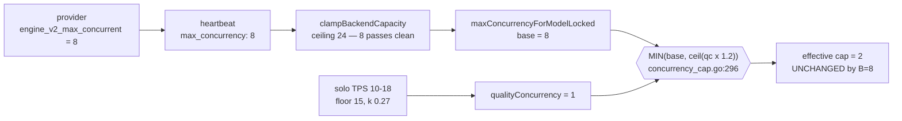
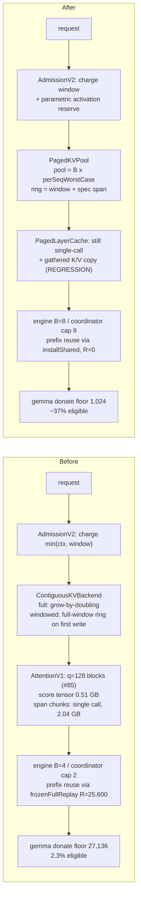

# Migration Plan: Contiguous → Paged KV, and B=4 → B=8

> Last updated: 2026-09-03 · commit `5d400cf75`

Status: **Implemented (v0.8.0)** — 2026-07-25 — shipped as v0.8.0's paged default and B=8 ([`../releases/v0.8.0-notes.md`](../releases/v0.8.0-notes.md)); v0.8.1 reverted both defaults (`case .auto: resolvedKind = .contiguous` in `provider-swift/Sources/ProviderCore/Inference/EngineV2Factory+Production.swift`, `defaultEngineV2MaxConcurrent` in `provider-swift/Sources/ProviderCore/Config/ProviderConfig.swift`) and paged stays opt-in via `engine_v2_kv_backend = "paged"`; supersedes [paged-attention-for-prefill.md](paged-attention-for-prefill.md) (§21).

Companion to `2026-07-25-prefill-and-fleet-performance-findings.md`.

Everything here is either measured, read out of the source, or derived from a
model that is validated against a measurement. Derived numbers say so.

**Revision 2 (2026-07-25).** Rev 1 was written against submodule `b177c35`;
this revision is verified against **`abd1985`** (`Layr-Labs/mlx-swift-lm` #85)
on superproject `e65b5bbc1`. Four findings changed the plan's shape:

| # | Finding | Effect |
|---|---|---|
| 1 | **#85 already shipped query sub-blocking.** Track A / WS-0.2 is done. | Removes a track. Also makes paged **worse**: the win is contiguous-only (§7.2). |
| 2 | **B=8 is NOT reachable by provider config.** The coordinator's quality cap clamps gemma-4 to **2** regardless of what the provider reports. | Rewrites §3, §5-G0 and Track E. Gate G0 as written would have measured nothing. |
| 3 | **The wire cannot distinguish a paged provider from a contiguous one.** | Promotes WS-7 from "nice" to a hard rollout blocker (§18). |
| 4 | **CI runs no paged correctness test.** Four suites are compiled and discarded. | New §19. An 11-track parallel migration with no numerical gate is not executable. |

A full correction log against Rev 1 is in §22.

---

## 1. Why

Two goals, in priority order:

1. **Batching.** Decode is bandwidth-bound and MoE batches unusually well. B=4
   → B=8 is a modelled **1.26x** aggregate decode throughput at p50 context
   (**measured 1.30x**, §3.2), with per-request ITL at ~25 tok/s (floor is
   `EIGENINFERENCE_MIN_DECODE_TPS=15`, `deploy/environments/prod.env:27`).
2. **Removing a model-architecture bet.** Contiguous is competitive only
   because 25 of gemma-4's 30 layers are sliding-window and therefore already
   fixed-size rings. Add one large full-attention long-context model and the
   fragmentation math flips. Paging buys out of that dependency.

Paged is **not** faster today. It is 13% slower at B=1 on GPT-OSS
(88.5 vs 101.8 tok/s, `libs/mlx-swift-lm/benchmarks/reports/*-paged-gate-2026-07-09.md`)
and marginally *faster* at B=4 (38.5 vs 37.3 gpt-oss; 39.0 vs 38.0 gemma). The
migration is a bet on B, on context length, and on the model set — not a
performance win on the current operating point. Any justification that promises
otherwise will be contradicted by the first benchmark after the flip.

**New in Rev 2:** since #85, paged is also *behind* on prefill memory. Query
sub-blocking bounds the score tensor to O(1) in chunk length on the contiguous
path only; `PagedLayerCache.prefillAttend` still materialises the full
`[L, kL]` rectangle **and** pays a gathered K/V copy contiguous does not
(§7.2). That is a new, first-order cost of the migration.

---

## 2. Target state

| Dimension | Today | Target | Measured by |
|---|---|---|---|
| Engine concurrency | B=4 | **B=8** | heartbeat `max_concurrency` |
| **Coordinator-effective concurrency (gemma-4)** | **2** | **8** | `effectiveMaxConcurrencyForModelRateLocked` |
| Aggregate decode throughput | 1.0x | **1.26x** modelled / **1.30x** measured | tok/s at fixed ITL floor |
| Per-request ITL @ target B | 51 tok/s | **~25 tok/s** (measured 24.7) | `observed_decode_tps` |
| KV per sequence @ ctx 5k | 348 MB | **312 MB (-10%)** | `bytesInUse / B` |
| KV per sequence, distribution-weighted | 348 MB | **257 MB (-26%)** | `bytesInUse / B` |
| gemma-4 prefix donation floor | 27,136 tok | **1,024 tok** | `SSDPrefixCache.config` |
| gemma-4 donatable traffic | 2.3% | **~37%** | donation settle counters |
| Per-slot KV-backend on the wire | **absent** | **present** | `BackendSlotCapacity` |
| Paged correctness on CI | **none** | **gated** | CI job |
| MTP | cross-arm diff only (unreachable on gemma-4) | **lossless vs each backend's OWN greedy decode** (non-negotiable) | `mtp_token_exactness` in the G2 parity report |
| Vision, packed prefill | working | **working** | e2e |

**Non-goals:** beating contiguous at B=1; preserving compiled decode (§14);
B > 8 (§3).

---

## 3. Why B=8 and not higher

8 is the sanctioned engine ceiling, encoded in three places:

```swift
// provider-swift/Sources/ProviderCore/Config/ProviderConfig.swift:90-96
/// Box-wide concurrent-request cap per v2 engine slot
/// (`engine_v2_max_concurrent` under `[backend]`). Default 4 — the
/// CBv2 product target. Clamped to [1, 8] at use: the engine's KV
/// byte-ledger admission binds long before count does, and caps past 8
/// recreate the batch-collapse regime the one-engine release exists to
/// kill.
```

```swift
// provider-swift/Sources/ProviderCore/ProviderLoop.swift:690-692
internal static func clampEngineV2Concurrency(_ raw: UInt64) -> Int {
    Int(min(max(raw, 1), 8))
}
```

`CBv2SchedulerConfig.maxConcurrentRequests` defaults to 4
(`CBv2Contracts.swift:594`), whose own doc reads "product target: 4, max 8" —
B=8 is the top of the supported range, not an overrun.

### 3.1 The batching model

Decode bytes per step, gemma-4-26b-qat-4bit:

```
bytes(B, ctx) = invariant + experts(B) + B * kv(ctx)

invariant  = 1,608 MB    (dense MLP 23.3% + attn weights 25.5% + LM head 17.0%)
experts(B) = 100.25 MB * 128 * (1 - (1 - 8/128)^B)
kv(ctx)    = 209.7 MB + 0.0205 MB * ctx
             ^ 25 sliding layers, FLAT   ^ 5 full layers, 20,480 B/tok
```

**Model validation:** at ctx=1000, B=4 this predicts **1.94x** vs B=1. The
measured value is **1.92x** (findings doc §7). It also independently reproduces
the findings doc's "entire KV at 124k = 2.76 GB" (`kv(124000)` = 2,752 MB).

At ctx=1000 (near p50 of 979):

| B | unique experts | throughput vs B=1 | vs B=4 | per-request TPS |
|---|---:|---:|---:|---:|
| 1 | 8.0 | 1.00x | 0.52x | 106 |
| **4 (today)** | 29.1 | 1.94x | — | **51** |
| **8 (target)** | 51.6 | **2.45x** | **1.26x** | **32.5** |
| 16 | 82.4 | 3.12x | 1.61x | 20.7 |
| 32 | 111.8 | 4.19x | 2.16x | 13.9 |

MoE batches well because at B=1 you draw 8 of 128 experts and at B=8 you draw
~52 — once most experts are being read anyway, extra sequences are cheap on
that term. It still flattens because `B * kv(ctx)` grows linearly: at B=8,
ctx=5000, KV is ~27% of bytes read.

B=16 would give another 1.28x, but 20.7 tok/s leaves little margin over the
15 tok/s floor, and past 8 the clamp comment warns of a regime the one-engine
release was built to eliminate. **B=8 first; revisit 16 only with measurements
in hand.**

### 3.2 B=8 has already been measured — use it

`libs/mlx-swift-lm/benchmarks/reports/gemma4-26b-qat4bit-paged-gate-2026-07-09.md`
already contains the B=8 row. Eager v2, gemma-4-26B, M4 Max:

| B | decode TPS/req | decode-only aggregate (B × TPS) | step gain |
|---|---:|---:|---:|
| 1 | 101.8 | 101.8 | — |
| 2 | 59.6 | 119.2 | 1.17x |
| 4 | 38.0 | 152.0 | 1.28x |
| **8** | **24.7** | **197.6** | **1.30x** |

**Measured B=4 → B=8 is 1.30x against a modelled 1.26x.** The batching premise
is validated at the target operating point.

Two caveats that must travel with this number:

1. **The workload shape changes between rows.** `promptMix(batch:)`
   (`BenchCBv2RealModel.swift:293-299`) is hardcoded: B=4 is `100/500/1500/500`
   (mean 650) and B=8 is `8 × 500` (mean 500). The B=4 → B=8 comparison is
   therefore **not apples-to-apples**. Treat 1.30x as indicative, not as the
   gate result.
2. **The model over-predicts the absolute level.** Measured B=1 → B=4 is
   **1.49x** against a modelled 1.94x, so the whole per-request curve sits
   ~25% below the model even though the 4 → 8 *slope* matches. That is why the
   plan targets ~25 tok/s per request, not the 32.5 the model implies.

### 3.3 B=8 is **not** reachable by provider config alone

Rev 1 claimed "no code change is required to test the batching hypothesis."
**That is wrong, and it invalidated Gate G0 as originally written.**

The provider-reported `max_concurrency` is only the `base` operand of a MIN
against a coordinator-computed quality cap:

```go
// coordinator/registry/concurrency_cap.go:272-299
base := p.maxConcurrencyForModelLocked(model)
qc := qualityConcurrency(rate.tps, r.qualityCapFloorTPS, effectiveTPSLoadFactor, base, r.qualityCapFallback)
capped := int(math.Ceil(float64(qc) * r.qualityCapOvercommitForModelLocked(model)))
if capped < base { return capped }
```

```go
// coordinator/registry/warm_pool_target.go:84-107
// b = floor((solo/floor - 1) / k); 1 if solo <= floor
```

At production settings — floor `15` (`prod.env:27`), `k = 0.27`
(`scheduler.go:57-65`), overcommit forced to `1.2` because
`EIGENINFERENCE_QUALITY_CONCURRENCY_OVERCOMMIT` is unset
(`concurrency_cap.go:103-105`) — the base only binds above a solo-TPS
threshold:

| target B | requires solo decode TPS ≥ |
|---:|---:|
| 4 | **27.2 tok/s** |
| 8 | **39.3 tok/s** |

gemma-4's solo median is **10–18 tok/s** → `qc = 1` → **effective cap 2, at
both B=4 and B=8.** This is not a theory; it is pinned by tests:
`concurrency_cap_test.go:140-147` asserts "provider-reported 8 is looser than
quality 2 → quality binds", and `solo_tps_test.go:521-522` pins the cold-start
gemma cap at 2. `QualityCap.Enabled` defaults true (`config.go:157`) and is
unset in `prod.env`, so this is live.



**Consequence table at prod settings:**

| model / rate source | cap at B=4 | cap at B=8 | change? |
|---|---:|---:|---|
| gemma-4-26b (solo 10–18) | 2 | 2 | **none** |
| gpt-oss-20b on seed 30 | 4 | 4 | **none** |
| gpt-oss-20b on registration bench | 4 | 8 | lands |

So B=8 delivers concurrency only to benchmarked fast-model pairs. **Track E
must ship a coordinator co-change in the same change-set** — see §8.0 — or G0
measures nothing.

### 3.4 The load factor `k = 0.27` is stale

```go
// coordinator/registry/scheduler.go:57-65
// Measured on M4 Max (Qwen2.5-7B-4bit) at N=1/2/4/8 concurrent decodes:
// per-request TPS = 92.8 / 69.5 / 35.9 / 29.6 ... effectiveTPSLoadFactor = 0.27
```

[DERIVED] `rate(8) = solo / (1 + 0.27 × 8) = solo / 3.16`. With gemma solo
medians of 10–18 that predicts **3.2–5.7 tok/s** at B=8. The measured value is
**24.7**. The coefficient is roughly **16x too aggressive** for the CBv2
engine — it was fitted on a legacy engine and a dense 7B model.

`k` is the single shared coefficient behind four systems:

| consumer | site |
|---|---|
| admission quality cap | `concurrency_cap.go:293` |
| effective decode TPS | `scheduler.go:1720` |
| projected per-request TPS at batch | `scheduler.go:1954-1972` |
| warm-pool target | `warm_pool_controller.go:423` |

**Re-fitting `k` against the B=8 harness is a prerequisite for B=8, not a
follow-up.** It is item 0.0 in §7.

---

## 4. Before / after



---

## 5. Phase gates

Six stop-or-continue decisions (G0 split; G5 added).

| Gate | Question | Exit criterion |
|---|---|---|
| **G0a** | Does the coordinator actually dispatch 8? | `effectiveMaxConcurrencyForModelRateLocked` returns 8 for gemma-4 on a canary; `slot.NumRunning` observed at 8 |
| **G0b** | Does batching pay end to end? | agg throughput ≥ 1.07x of B=4 at matched prompt mix; per-request decode ≥ 22 tok/s |
| **G1** | Is paged sized correctly? | **per-sequence** paged KV ≤ contiguous at ctx {1k, 10k, 100k}; pool footprint fits 36 GB boxes |
| **G2** | Is parity green? | MTP lossless against each backend's own greedy decode, vision serving, packed prefill active, prefix reuse ≥ contiguous |
| **G3** | Does gpt-oss canary hold? | 24h at parity or better on TTFT p50/p90, decode TPS, 503 rate |
| **G4** | Does gemma-4 hold? | same, plus donation rate materially above 2.3% |
| **G5** | Is the canary observable? | coordinator can segment TTFT/TPS/error-rate by KV backend (§18) |

Four changes from Rev 1, all forced by measurement:

- **G0 is split.** G0a is the coordinator co-change; without it G0b is
  unmeasurable. Rev 1 collapsed them and would have reported "no gain."
- **G0's ITL bar moved 25 → 22 tok/s.** The already-measured B=8 values are
  24.7 (gemma) and 21.9 (gpt-oss); a 25 bar fails on data the plan already had.
  22 keeps a real margin over the 15 floor without being pre-falsified.
- **G1 says "per-sequence."** The 07-09 reports' `gpuPeak` for paged
  (30.5–32.5 GiB) is dominated by the `--kv-gb 16` pool reservation, not by
  KV/seq, and `gpuActive` is inert (13.48 GiB on every row — weights only).
  As emitted, those columns do not answer G1.
- **G2's MTP bar is per-arm losslessness, not a cross-arm diff.** Rev 1 scored
  MTP by diffing the two arms' token streams against each other. That form
  cannot fail wherever plain greedy decode already diverges — and it does
  diverge on 2 of 3 gemma-4 parity prompts with no backend involved, purely
  under the shipped `DARKBLOOM_CBV2_ATTN_QUERY_BLOCK` knob (977a5893e). So on
  gemma-4 every MTP divergence classified as "inherited from the base decode"
  and the criterion was structurally unable to reach a FAIL: a gate in name
  only, on the one model this migration is named for. It now compares each
  arm's MTP output against **its own** plain greedy output. Verified greedy
  speculation is lossless by construction, and both sides of that comparison
  share a backend, its kernels and its storage order, so base-decode drift
  cancels instead of propagating. The criterion can accuse again, and it
  attributes to the right backend. Corollary: once both arms are self-
  lossless, a cross-backend MTP difference *is* exactly the base-decode
  difference `token_exactness` reports — the old attribution guess becomes a
  proof.

Gates map to **waves**, not to elapsed weeks — see §6.

---

## 6. Execution model — tracks and waves

The whole plan is executed in one pass, in parallel. The binding constraint is
not total effort; it is **file ownership** and **verification capacity**.

### 6.1 The real constraint

Mapping every work item to the files it touches shows four contended files:

| File | Work items wanting it |
|---|---:|
| `Paged/PagedLayerCache.swift` | 5 (poison-page pad, exact-ring gather, packed prefill, spans, last-query) |
| `Paged/PagedKVPool.swift` | 5 (poison page, guards, ring formula, lazy reservation, spec headroom) |
| `Paged/PagedSequenceKV.swift` | 3 (fixed ring table, spec transaction, `installShared`) |
| `EngineV2Factory+Production.swift` | 4 (merge configs, pool sizing, B=8, slot vetoes) |

**Therefore: partition by file, not by workstream.** Once ownership is
exclusive, most of the plan is genuinely independent.

### 6.2 Tracks

Each track owns its files exclusively. No two tracks edit the same file.

| Track | Owns (exclusive) | Work items |
|---|---|---|
| **T — oracle** | `Tests/CBv2Paged*`, `CBv2KVSharingParityTests`, differential harness | the parity oracle (§6.3) |
| **E — memory + coordinator** | `AdmissionV2.swift`, `UnifiedMemoryCap.swift`, `ModelLoadAdmission.swift`, coordinator `registry/{concurrency_cap,warm_pool_target,servability,scheduler,pooled_admission,budget_clamp,health_ejection,capacity_rate,solo_tps}.go` | 0.0, 0.1, 0.3, §8 |
| ~~**A — attention**~~ | ~~`AttentionV1.swift`~~ | **DONE — shipped as #85 (`abd1985`)** |
| **F — telemetry + wire** | `coordinator/protocol/{telemetry,messages}.go`, Swift `Telemetry/` + `Protocol/Types.swift`, `console-ui/src/lib/telemetry-types.ts`, `console-ui/src/app/providers/types.ts`, `api/telemetry_handlers.go`, `docs/reference/telemetry-schema.md` | §18 |
| **P — pool** | `PagedKVPool.swift`, `PagedAttentionKernel.swift` | 0.5, 0.6, 1.2 (formula), 1.3, 3.1, 6.4 |
| **R — row** | `PagedSequenceKV.swift`, `PrefixReusePlan.swift` | 1.3 (row side), 3.2, 3.3, 4.1 |
| **L — layer** | `PagedLayerCache.swift`, `LayerCacheBankV2.swift` | 0.5 (pad site), 1.2 (gather++chunk), **0.2p (paged sub-blocking)**, 2.1–2.5 |
| **X — factory** | `EngineV2Factory+Production.swift`, `ProviderConfig.swift`, `EngineV2SlotFactory.swift`, `EngineV2Bridge*.swift`, `EngineV2Config.swift` | 0.4, 1.1, 2.6, 6.1–6.3, 6.5 |
| **M — MTP seams** | `MTP/EngineLoopV2+MTP*.swift`, `EngineV2.swift` (mode selection) | 3.4, 3.5 |
| **D — SSD tier** | `provider-swift/.../KVCacheSSD/*`, `PrefixCachePolicy.swift` | 4.2 |
| **G — compiled** | `Compiled/*` and its hooks in `FullSequenceKV`/`WindowedSequenceKV`/`EngineLoopV2` | §14 |
| **C — CI + benchmark** | `.github/workflows/ci.yml`, `Makefile`, `scripts/gemma_contbatch/*`, `Sources/ProviderBenchmark/*`, `Sources/BenchCBv2/*`, `e2e/testbed/*` | §19, §20 |

Repo split: **L, P, R, M, G, T** are PRs to `Layr-Labs/mlx-swift-lm`.
**D, X, C** and the provider half of **E**/**F** are PRs to `d-inference`. The
submodule bump is the integration point and must be a single commit that takes
every engine track at once.

Two changes from Rev 1: **Track A is deleted** (shipped), and **Track E roughly
triples** — Rev 1 gave it `registry/scheduler.go` alone, which is the wrong
file for every coordinator item (§8).

### 6.3 Track T ships first — and it does not start from zero

Rev 1 said to build the differential harness from scratch, patterned on
`CBv2MTPKVStagingTests.swift`. **A two-arm differential already exists:**

```swift
// libs/mlx-swift-lm/Tests/MLXLMTests/CBv2KVSharingParityTests.swift:76-78
enum BackendKind { case contiguous; case paged }
```

with a shared `runChunkedBorrowingParity` body driven through both arms
(`:165`, `:169`) and a hardware skip. A real-weights provider-side oracle also
exists — `EngineV2PagedParityLiveTests.swift`, whose own header says it "gates
explicit paged canaries before any future default reconsideration," i.e.
exactly this plan.

Track T's genuinely new work is therefore narrower and sharper:

1. **A contiguous-backend arm for `CBv2PagedKernelTests`.** Today every
   reference in that file is an in-file fp32 recomputation over a *mirror of
   the same writes*, so a bug in the shared write path (the poison page,
   §7.5) corrupts mirror and pool identically and parity still holds.
2. **Adopt-vs-cold greedy parity** — the only oracle for the residency/plan
   mismatch (§17). `adoptPrefixRoundtrip` (`CBv2PagedBackendTests.swift:264-300`)
   is happy-path only.
3. **A slab canary** for the poison page. No existing test writes a canary into
   a neighbouring page and re-reads it after a short bulk write.
4. **A CI step that actually schedules any of it** (§19).

**T is not a testing chore appended to the end; it is the first deliverable.**

### 6.4 The interface contract gates P, R, and L

`PagedKVPool` ↔ `PagedSequenceKV` ↔ `PagedLayerCache` are the three hottest
files and they call each other. Before those tracks start, freeze the seam:

```
pool:  allocatePage / freePage / retainPage / refCount / ringPages
       / reserve(pages) / writeTokens / gather / drainDeferredFrees
row:   installShared / restoreWindow / windowSnapshot / attendableViews
       / decodeAttendRange / decodeTableLength / speculativeHeadroom
layer: updateAndAttend(B,L) / attendBorrowing / bindSpanContext
```

~30 lines of protocol, one day of design. **This is the single decision that
determines whether the three hottest files parallelize or collide.** It is not
delegable — it should be written and reviewed by a human before Wave 1.

Note: `beginSpeculativeWrite()` / `commitSpeculativeWrite()` are **already**
protocol requirements (`CBv2Contracts.swift:297`, `:304`) with default no-ops,
and the contiguous windowed ring already implements real staging
(`WindowedSequenceKV.swift:183-195`). Only `speculativeHeadroom` is new.

### 6.5 Waves

| Wave | Runs in parallel | Entry condition |
|---|---|---|
| **0** | **T, E(0.0/0.1), F, C** + the §6.4 contract | none — start immediately |
| **1** | **P, R, L, X, M, G, D**, E(0.3) | contract merged; T's harness green on contiguous; C's CI step live |
| **2** | integration, submodule bump, benchmark matrix, adversarial review | Wave 1 merged |
| **3** | G0a → G0b → gpt-oss canary (G3) → gemma-4 canary (G4) | Wave 2 green, G5 green |

Within a track, items stay sequential — Track R does fixed ring table → spec
transaction → `installShared` in that order, because they are the same file.

Every track runs in its own git worktree so a mistake in the ownership map
produces a merge conflict rather than silent clobbering.

### 6.6 What does not compress

Parallelism reduces wall clock, not total work. Rev 1 listed four hard floors;
two of them were overstated and are corrected here.

1. **G0 needs real traffic and a coordinator change.** No longer config-only
   (§3.3). Bug A plus the quality-cap co-change must land first. ~1 wk.
2. **Benchmarks need hardware — but less than Rev 1 claimed.** The B axis and
   the engine axis are **free**: `BenchCBv2` already sweeps
   `{v2, v2-compiled, v2-paged} × B{1,2,4,8}` in one process on one loaded
   model and emits `gpuActive`/`gpuPeak` per cell automatically
   (`BenchCBv2RealModel.swift:784-785`, `:978-982`). The 07-09 reports are one
   command. **The context axis is the real gap** — `promptMix(batch:)` is
   hardcoded and caps at 1,500 tokens, and the bench's paged pool hardcodes
   `nominalMaxSequenceLength: 4096`, so G1's ctx {10k, 100k} is unreachable
   without two source edits (Track C).
3. **Canary gates are wall-clock.** G3 and G4 are 24h soaks each.
4. **The three silent-corruption risks need adversarial review** — shared-page
   writes, residency/plan mismatch, `spanChunkMask` offsets. All produce wrong
   output with no crash and no telemetry. Each should be reviewed by someone
   other than its author.

### 6.7 Wall clock

| Wave | Elapsed |
|---|---|
| 0 (4 tracks + contract) | ~1 wk |
| 1 (7 tracks) | ~1–2 wk |
| 2 (integration + hardware, serialized) | ~1 wk |
| 3 (gates, wall-clock bound) | ~1–1.5 wk |
| **Total** | **~4–5.5 weeks** |

Against ~20–24 engineer-weeks of content (Track A's ~1 wk is now free).

---

## 7. WS-0 — Memory model · Tracks E, L, P, X

None of this needs paged. All of it is needed *by* paged, and most of it
independently unblocks B=8.

### 0.0 Re-fit the coordinator load factor · **Track E** — NEW, gates everything

`effectiveTPSLoadFactor = 0.27` (`scheduler.go:57-65`) is fitted on legacy-engine
Qwen2.5-7B data and mispredicts CBv2 gemma-4 at B=8 by ~16x (§3.4). Re-fit
against the B-sweep from Track C, and thread the new value through all four
consumers. Without this, the quality cap (0.0b) cannot be raised safely,
because the same coefficient sets the warm-pool target and the TTFT backlog.

### 0.0b Let the quality cap reach 8 · **Track E** — NEW, gates G0

Pick one, in ascending order of blast radius:

| Option | Change | Blast radius |
|---|---|---|
| (a) per-model overcommit | `EIGENINFERENCE_QUALITY_CONCURRENCY_OVERCOMMIT_BY_MODEL` for gemma-4 | config only; `qualityCapOvercommitByModel` already parsed at `concurrency_cap.go:112` |
| (b) re-fit `k` (0.0) | raises `qualityConcurrency` for every model | `concurrency_cap_test.go`, `solo_tps_test.go`, warm-pool tests |
| (c) lower the decode floor | changes routing *and* admission (they share the 15) | `main.go:194-199` couples them — highest risk |

**Recommend (a) for the canary, (b) as the durable fix.** Do not touch (c):
`EIGENINFERENCE_MIN_DECODE_TPS` is simultaneously the routing floor and the
quality-cap floor.

Also set `EIGENINFERENCE_MODEL_SOLO_TPS_SEED` before B=8 ships. It is absent
from `prod.env`, and higher B **starves the solo-TPS sampler** that feeds the
cap — `soloSampleEligible` requires the whole box to have ≤1 running-or-waiting
request (`solo_tps.go:140-152`). Without a seed the fallback is the
provider-level registration benchmark, which is the exact cross-model
contamination that file exists to prevent.

### 0.1 Fix the admission/allocation mismatch · **Track E** — small, do this first

Admission charges actual tokens capped at the window:

```swift
// libs/mlx-swift-lm/.../AdmissionV2.swift:206
case .slidingWindow(let window): retained = min(tokens, window)
```

Allocation takes the whole window on first write:

```swift
// SequenceKV/WindowedSequenceKV.swift:516-522
guard keys == nil else { return }                    // lazy…
keys = MLXArray.zeros([1, kvHeads, window, keyTemplate.dim(3)], ...)   // …but full-size
```

A 500-token request is charged ~102 MB of sliding KV and allocates 209.7 MB.

| B | hidden overshoot |
|---:|---:|
| 4 | 0.4 GB (invisible today) |
| **8** | **0.9 GB** |
| 16 | 1.7 GB |

On a 36 GB box with ~14 GB of KV headroom this is a 6% overshoot at B=8
against a gate that believes it has margin. On unified memory the failure mode
is swap pressure, not a clean rejection. **This must land before G0.**

Three corrections to Rev 1:

- Allocation is **lazy on first write**, full-*size* — not eager at admission.
- **The fix already exists.** `AdmissionV2.fixedWindowBytesShortfall(afterReservingTokens:)`
  (`:222-227`) computes exactly the missing bytes; its only caller is the
  prefix-cache adoption path (`EngineV2.swift:493`). This is a call-site
  addition, not new accounting.
- The contiguous backend's own ledger is **correct** —
  `ContiguousKVBackend.swift:343-352` charges windowed layers their full ring.
  The leak is confined to the `AdmissionV2` layer.

Also note B and paged pool size are already coupled:
`PagedKVPhysicalCapacityPolicyTests.machineSizingMatrix` will **fail
arithmetically** at B=8 — `usefulDemand = min(maxContext, 32768) × B × rate`
goes 6 GiB → 12 GiB, `machineCap` (8 GiB) displaces it as the binding
constraint, and the 128/256 GiB rows move 6 → 8 GiB.

### 0.2 Query sub-blocking q=128 · ~~Track A~~ — **SHIPPED (#85, `abd1985`)**

Landed upstream. `attendQueryBlocks` (`AttentionV1.swift:460-495`), width from
`DARKBLOOM_CBV2_ATTN_QUERY_BLOCK` (default 128, `0` = kill switch, `:35-42`),
applied at both prompt-attention call sites — `updateAndAttendRow:252` and
`borrowAndAttendRow:394`. `attendSerialQueries` is now
`attendQueryBlocks(blockSize: 1)` and is bit-identical to the loop it replaced.
Score tensor 2.04 GB → 0.51 GB at 124k context. Max abs diff vs the single-call
path 2.384e-07 (~2 ulp).

**Two things Rev 1's trap warning becomes.** The `spanChunkMask` absolute-
coordinate hazard was not fixed — it was **structurally avoided**:

```swift
// AttentionV1.swift:243-251
if let spanContext, L > 1 {
    // Vision spans carry a bidirectional overlay across the WHOLE
    // chunk, so a query block cannot be sliced to a causal-only
    // visible span. Span chunks keep the single-call path.
    return attendSpanChunk(...)
}
```

Therefore:

- **The score-tensor bound does NOT hold for vision requests.** They still
  materialise the full `[L, kL]` rectangle plus a `[L, kL]` bool mask per image
  block. Vision chunks are also the only path whose `L` can exceed
  `prefillChunkSize` (scheduler snap-over, `SchedulerV2.swift:135-140`) — so
  they are simultaneously the largest-`L` and the only unblocked prefill path.
  **WS-0.3 cannot be justified from the blocked bound** (see below).
- The trap re-arms the moment anyone sub-blocks span chunks, which WS-2's
  vision work will want. Keep the warning; move it to §9.

Coverage note: `CBv2QueryBlockAttentionTests.swift` is strong (parity vs two
independent references, causality by perturbation, window boundaries from both
sides, `blockSize == 1` bit-equality, kill-switch truth table) but
`attendQueryBlocks` is `private`, so **only one block width is exercised per
run**, and the file does not run on CI (§19).

### 0.2p Sub-block the paged prefill path · **Track L** — NEW

**Paged gets none of #85's win.** `PagedLayerCache.prefillAttend`
(`:309-344`) gathers the whole retained tail, builds one full `[l, retained]`
mask, and issues a single `MLXFast.scaledDotProductAttention`. There is no
`queryBlockSize` reference anywhere under `Paged/`.

So as of `abd1985` the migration would **regress** prefill activation memory:
contiguous 0.51 GB vs paged 2.04 GB at 124k, and paged additionally pays a
gathered contiguous K/V copy that `PagedKVPool.gather` documents as a
materialised copy (`:521-522`).

This is now a **migration blocker**, not an optimisation. Port the blocking
loop into `prefillAttend` before G1.

### 0.3 Parametric activation reserve · **Track E**

```swift
// provider-swift/Sources/ProviderCore/Inference/UnifiedMemoryCap.swift:45
static let defaultActivationReserveBytes: UInt64 = 3 * 1024 * 1024 * 1024  // 3 GiB
```

Flat. Its own doc calls it "a conservative SAFETY FLOOR, not a per-batch
estimate," justified by a measurement taken **at 4-concurrent**. Nothing in it
scales with B.

The prefill score tensor is `[concurrent_prefills, heads, C, kL]`, fp32 in the
composed fallback (gemma-4 head_dim 256/512 never reaches MLX's fused kernel —
`sdpa_full_supported_head_dim` is {64, 80, 128}).

| concurrent prefills | ctx 10k | ctx 100k |
|---:|---:|---:|
| 4 (today, budget-capped) | 0.66 GB | **6.6 GB — exceeds reserve** |
| 8 (after §13.2) | 1.3 GB | 13.1 GB |

Already broken at B=4 for long contexts. #85 fixes this **for text only** —
vision chunks remain unblocked (0.2), so the parametric reserve must be
`f(maxBatchedTokensPerStep, maxContext, heads, subBlockSize, spanChunkMaxL)`
with the span path costed at full `L`.

> **RETIRED — Track E is closed and the table above is wrong.** Two errors, one
> fatal. (1) The `concurrent prefills` axis does not apply to the span path,
> which is the only path this section is really costing. Span-bearing chunks
> are pinned to batch 1 on BOTH backends —
> `AttentionV1.swift:153` and `:379` (`spanContext == nil || (B == 1 && L > 1)`)
> and `PagedLayerCache.swift:228-230` (`precondition(boundSpanContext == nil ||
> b == 1, "span-bearing chunks are never packed")`) — so at most ONE span score
> tensor is ever live and raising `maxBatchedTokensPerStep` does not multiply
> it. The `8 (after §13.2) → 13.1 GB` row is **unreachable**; §13 item 6.2's
> "requires 0.3 first (activation memory doubles)" dependency is void.
> (2) Both rows are computed at heads = 8, which is gemma-4's KV-head count.
> The score tensor is materialised after the GQA repeat, so the multiplier is
> the QUERY-head count, 16 — see the gemma-4 config dump in
> `2026-07-25-paged-gate-results.md` (grep `num_attention_heads`; :600 at time
> of writing, and it has already moved once). The table understates its own
> model by 2x.
>
> The parametric reserve shipped provider-side with zero call sites and was
> deleted; the coordinator mirror that DID ship was charging a surcharge no
> provider gate held back, which 429'd servable prompts. Both sides are now
> flat at 3 GiB. Measured transient peak-over-weights (M4 Max 128 GB,
> 2026-07-10) is 3.40 GiB for gemma-4 and 2.20 GiB for gpt-oss at B=4, i.e. the
> dominant term is non-attention working set — which this table does not model
> at all, and which is 0 under this formula for the fused model that spends
> 2.20 GiB of it. Retune the flat floor against a measurement, in both repos,
> or not at all.

> **Rev 1 pointed at the wrong coordinator file.** It said to thread this
> through `freeMemoryAdmits` (`registry/scheduler.go:1301`). That function is
> **reserve-blind by design** — it charges flat tokens against the
> provider-reported `active_token_budget_max` and on the cold path defers
> wholesale to the provider-reported `free_for_load_gb`.
>
> The real mirror is **`coordinator/registry/servability.go:50`**:
> ```go
> // servabilityActivationReserveGB mirrors the provider's activation reserve
> // kept aside on top of weights before KV cache (UnifiedMemoryCap ~3 GiB).
> servabilityActivationReserveGB = 3.0
> ```
> used at `:98` in `coldTokenBudgetEstimate` to predict a cold provider's
> post-load budget before any heartbeat exists.

**Exact parallel-edit set** (9 sites, two of them hardcoded goldens):

1. `registry/servability.go:44-50` — the two constants
2. `registry/servability.go:93-111` — `coldTokenBudgetEstimate`
3. `registry/servability.go:119-132` — `snapshotStructuralBudget` call site
4. `registry/servability_test.go:7-12` — the constant-pinning doc comment
5. `registry/servability_test.go:18-19` — `const wantRoomy = int64(110565)` **will break**
6. `registry/servability_test.go:28,35-59` — tiny-node + kvpt-fallback equalities
7. `registry/servability_test.go:90,95` — `wantCold` recomputations
8. `registry/servability_provider_fit_test.go:57-75` — the gemma 28GB-on-48GB shape
9. `registry/servability_provider_fit_test.go:113-121` — `coldTokenBudgetEstimate(48, 28, 0)`

Do **not** conflate `scheduler.go:1272 coldLoadCatalogGBToMemGiB` — that is the
weight-padding conversion.

### 0.4 Merge the duplicate scheduler config · **Track X**

`EngineV2Factory+Production.swift:356` (feeds paged pool sizing) and `:485`
(handed to `EngineV2`; also passes `enablePrefixCache`). They agree on
`prefillChunkSize` **only because both accept the memberwise default 512**
(`CBv2Contracts.swift:594-595`) — nothing links them, and they live in
different static funcs.

The LOCKSTEP comment at `:410-415` wires the paged ring's `maxPrefillChunk` to
instance #1, but the engine runs on instance #2. Divergence trips:

```swift
// PagedSequenceKV.swift:149-153
precondition(n <= pool.config.maxPrefillChunk,
    "windowed update of \(n) tokens exceeds maxPrefillChunk ...")
```

A `precondition` — process kill, not an error. `CBv2PagedSafetyTests`
covers the *overflow* path (`maxPrefillChunk: Int.max` must throw) but **not**
the divergence case.

### 0.5 Poison page · **Tracks P + L** — ship independently

`PagedLayerCache.swift:296` pads `deviceTables` with `0`, and page 0 is **not**
a sentinel: `PagedKVPool.swift:184` builds the free list reversed and `:192`
pops with `removeLast()`, so page 0 is the first page handed to the first
tenant. Reserve one permanently-zeroed page per group and pad with it.

> **Rev 1 overstated this.** It called this "a live cross-request leak on the
> paged path today." It is a genuine **fail-open** design, but no reachable
> trigger exists: `PagedSequenceKV.swift:256-258` states the protecting
> invariant ("every position the decode actually attends was written, so its
> ring slot is allocated"), upheld by `ensurePage` growing the table and
> `decodeAttendRange` clamping to `[baseOffset, absoluteOffset)`.
>
> **A worse latent variant exists**, and Rev 1 missed it: the kernel's modulo
> divisor is `decodeTableLength` (= `ringPages`, e.g. **97**) while the tables
> array width is `max(8, max table.count)`. If the invariant breaks, the read
> runs past the row's table row **into the next row's table** — worse than
> page 0.
>
> **And item 1.2 tightens exactly that invariant.** 0.5, 1.2 and WS-3 are
> coupled, not independently schedulable.

There is a second pad-with-a-real-slot site at `PagedKVPool.swift:501-509`
(`while padded.count < 8 { padded.append(slots[slots.count - 1]) }`) whose
safety argument is also a code comment. No test would catch either (§19).

### 0.6 Construction guards · **Track P**

`blockSize % pageSize == 0` (256 % 16, `BlockHasher.swift:31` and
`PagedKVPool.swift:82`) and `maxPrefillChunk + pageSize >= blockSize`. Both
currently hold by coincidence across two files with zero cross-reference — the
only page-modulo guards in the stack are PTOK-based
(`PagedKVPool.swift:275`, `PagedAttentionKernel.swift:407`). Both are
load-bearing for WS-4's windowed-sharing residency proof.

---

## 8. Coordinator surface — Track E · **NEW SECTION**

Rev 1 gave Track E `registry/scheduler.go`. That is the wrong file for every
item in this section. Raising B to 8 touches nine coordinator files, and four
of them are **capacity-feedback loops that can cancel the throughput win**.

### 8.1 The shed paths B=8 actually opens

**`EIGENINFERENCE_MIN_DECODE_TPS` is not one of them.** It is soft
(`scheduler.go:792-798`) and never rejects; `projectedPerRequestDecodeTPSAtBatch`
unwinds the observed rate at `backendRunning` and reapplies at +1
(`:1954-1986`), so a self-consistent observation survives the floor. What it
*does* is narrow the candidate pool, so filled boxes lose to idle peers — a
throughput cancellation, not an outage.

The real risks are capacity-shaped:

| # | Mechanism | Site | Effect at B=8 |
|---|---|---|---|
| 8.1a | **Live TTFT backlog → hard reject** | `scheduler.go:1537-1540` `backlogMs = tokensAhead / effectiveTPS × 1000`; drop at `:722-724` | `activeTokenBudgetUsed` ~doubles → `backlogMs` ~doubles → candidates cross the 9 s deadline (`prod.env:38`) → **429 `ttft_too_slow`**. `EIGENINFERENCE_TTFT_HARD_REJECT=true` in prod. |
| 8.1b | **Budget clamp** | `budget_clamp.go:257-261`, default on | ONE capacity-503 zeroes the pair's live headroom for up to 5 min. Release needs a strictly-later heartbeat with ≥1024 free tokens **and** an accept. |
| 8.1c | **Capacity-rate derater** | `capacity_rate.go:63-68`, `:190` | >25% reject rate over 8 samples → +15 s cost penalty. **No accept-triggered reset by design.** |
| 8.1d | **Health ejection** | `health_ejection.go:59-61` | 10 consecutive capacity-shaped 5xx with zero interleaved successes → node quarantined 60 s–10 min. |

These compose: a B=8 box that over-commits KV rejects a burst → clamp arms →
capacity rate rises → cost penalty → fewer accepts → more consecutive rejects →
ejection. **Track E must add a canary abort condition on 8.1b–8.1d.**

Latent, not active: `ttftOccupancyMs` at `alpha=50` (`prod.env:39`) would
compute ~18,000 ms at occ=8 vs a 9,000 ms deadline, but the term is provably
**out** of the live decision (`scheduler.go:2346-2365` documents this as a
safety invariant, `TTFT_ADMISSION_MODE=shadow`). Flipping that mode to enforce
after B=8 would shed every 8-batched box instantly. **Add to the risk
register, §17.**

### 8.2 KV-byte accounting drift under paged

Coordinator consumers split into two classes:

| class | sites |
|---|---|
| rate-aware | `scheduler.go:1229`/`:2239` (`snap.kvBytesPerToken`); `pooled_admission.go:183-286`; `servability.go:102-105` when reported |
| **rate-blind** | `scheduler.go:1381` (fixed `kvCacheBytesPerToken = 400_000`); `pooled_admission.go:106-109` (`max(400k, maxResident)`); `servability.go:104` fallback |

As WS-1 lowers the real per-token rate **below** 400k, the rate-blind sites
over-charge relative to the rate-aware ones by a factor that **grows as paged
improves** — cold requests priced at 400k against a pool sized at the true
lower rate. Net effect: `pooledBudgetAdmits` and `PredictServable` get
progressively more pessimistic exactly as the engine gets better.

The ceiling clamp (`maxKVBytesPerToken = 1 << 24`) never binds — paged lowers
the rate. But the **floor** is a hazard: `clampKVBytesPerToken` maps a negative
rate to 0, and 0 means "absent", which flips `knownZeroTokenBudget` from
"known-full, reject" to "unknown, **fail open**". Pin the wire contract so a
fully-committed paged ring can never emit 0.

Worse, `kv_bytes_per_token` is **already wrong on paged slots**: it is reported
unconditionally from contiguous-shaped sizing
(`EngineV2Bridge+Capacity.swift:154` ← `ProviderLoop+EngineV2.swift:560`), but
paged never reserves per-token (`EngineV2Bridge.swift:495`) — its true capacity
is the immutable physical pool (`:711-713`, `kvBackendPoolBytes()` at `:729`),
which is never on the wire.

### 8.3 What does NOT change

Three numerical decoys. State them so nobody "fixes" them:

- `registry.go:4212 DefaultMaxConcurrent = 4` — the fallback for providers that
  report **no** `BackendCapacity`. Leaving it at 4 while providers serve 8 is
  correct (conservative for silent providers). Pinned by
  `registry_capacity_test.go:17-18`.
- `promptcontract/config.go:40 MaxConcurrency` — the prompt-planning sidecar's
  own semaphore. Unrelated to inference batch size.
- `registry.go:1197-1200` returns a flat **24** for any token-budget provider —
  B is not the binding constraint on those slots at all.

Also clean, verified: value 8 survives every clamp untouched
(`registry.go:2699-2706`, ceiling 24; pinned by `clamp_test.go:121-133`), the
protocol round-trips it, and no token-budget site assumes any concurrency.

### 8.4 Observability regressions at higher B

Two detectors go blind as B rises, both by design and both silently:

- **Throughput-anomaly detector**: `api/throughput_anomaly.go:140-142` samples
  only slots with `NumRunning <= 1`. At steady-state B=8 the sample supply
  falls below `DefaultAnomalyMinSamples = 3`. This is the detector that would
  notice a paged decode regression.
- **Solo-TPS sampler**: `solo_tps.go:140-152` requires the whole box to be
  near-idle. Feeds the quality cap (§3.3), so the cap's input degrades exactly
  when the cap matters most. Mitigate with `EIGENINFERENCE_MODEL_SOLO_TPS_SEED`.

Finally, `api/me_handlers.go:622` shows providers the **provider-level**
`MaxConcurrency` (the hardcoded 24), not the per-model effective cap of 2. A
provider who sets B=8 will see "24" and no change either way.

---

## 9. WS-1 — Paged sized correctly · Tracks X, P, R, L → **G1**

The 2.3x memory gap measured in the paged gate reports is a sizing bug plus an
over-provision, not a property of paging.

Calibration on that "2.3x": it is the **B=1 GPT-OSS `gpuPeak`** ratio
(28.21/12.44). At the fleet-relevant batch sizes it is ~2.13x (gpt-oss B=4/8)
and **1.75x** (gemma B=8). `gpuActive` is *identical* across all engines
(13.48 GiB gemma / 11.25 GiB gpt-oss) — the gap is entirely peak, which is
consistent with eager slab materialisation.

| # | Item | Effect |
|---|---|---|
| 1.1 | `poolCapacity = min(kvBytesCapacity, B * perSeqWorstCase * safety)` | Paged **eagerly materialises** its physical pool (`materializeSlabs()`, `EngineV2Factory+Production.swift:424`) while contiguous treats its grant as a **lazily-enforced ceiling** (`ContiguousKVBackend.swift:81`, `:285-287`). 28 GB → ~2 GB at B=4. |
| 1.2 | Ring = `ceil(window/pageSize) + ceil(maxSpeculativeSpan/pageSize)` | Today `window + maxPrefillChunk` = 1,552 tok for a 1,024 window. A **1.52x penalty on 25 of 30 layers** — this is why paged currently loses on memory. Attend `gather(ring) ++ chunk` as contiguous does. |
| 1.3 | Lazy reservation: charge `min(ctx, window)` | `pageDemand` is capped only by worst-case `maxLength` (prompt + maxTokens), so any request with `maxLength ≥ 1552` charges the full ring. `E[min(ctx, 1024)] ≈ 757` vs 1,024 over the production distribution. |

Rev 1 said 1.1 gives paged "the entire remaining KV grant." Corrected:
`PagedKVPhysicalCapacityPolicy.swift:104-108` caps it five ways —
`min(logicalGrantBytes, usefulDemand, machineCap, liveLimit, maxBufferLength×2)`
— and the in-code comment at `:421-423` reads "Commit only the
independently-capped PHYSICAL pool." The eager-vs-ceiling contrast is real; the
"entire grant" framing is not.

The ring arithmetic reproduces exactly:

```swift
// PagedKVPool.swift:420-423
let tokens = window + config.maxPrefillChunk          // 1024 + 512 = 1536
return (tokens + config.pageSize - 1) / config.pageSize + 1   // 96 + 1 = 97
```

97 pages × 16 = **1,552 tokens** = **1.5156x**. Note 1,536 is already a multiple
of 16, so the entire 16-token excess comes from the unconditional `+1` slack
page.

Projected KV per sequence:

| | sliding | full | total |
|---|---:|---:|---:|
| contiguous @ ctx 5k (eager window + doubling) | 209.7 MB | 138 MB | **348 MB** |
| paged today @ ctx 5k (1.52x ring) | 317.9 MB | 102.4 MB | 420 MB |
| **paged fixed** @ ctx 5k | 209.7 MB | 102.4 MB | **312 MB** |
| paged fixed, *expected over the traffic distribution* | 155 MB | — | — |

Rev 1's table put the distribution-expected 155 MB (= `E[min(ctx,1024)] = 757`
tokens) in a column labelled ctx 5,000, where the window is in fact full. Both
numbers are now shown with their meaning. At B=8 and ctx 5k: contiguous 2.8 GB,
paged fixed 2.5 GB.

**1.2 is coupled to WS-3 and to 0.5.** Shrinking the ring removes the accidental
headroom MTP staging depends on, and tightens the invariant the poison-page pad
relies on. The `+maxSpeculativeSpan` term is mandatory.

**No existing test constrains this.** `CBv2PagedBackendTests.swift:198-201`
re-derives its expectation from the same formula and thereafter asserts only
`table.count <= ring` — an under-provision bound. Shrinking *or* growing the
ring fails nothing. Track T must add an upper-bound assertion.

---

## 10. WS-2 — Capability parity · Tracks L, X

| Capability | Gap | Work | Est |
|---|---|---|---:|
| **Packed prefill** | `precondition(b == 1, ...)` at `PagedLayerCache.swift:142` (twin at `:175`) | Replace with the per-row loop `AttentionV1.updateAndAttend` already uses for `B>1, L>1` (`:127` → `updateAndAttendRow:235`). Nothing in it is storage-specific — `row.update(...)` then `attend(...)`, both `CBv2SequenceKV` protocol surface. | **3 d** |
| **Vision / spans** | No `CBv2SpanMaskBinding` conformance | Compose the span overlay onto the mask `prefillAttend` already builds in absolute coordinates. Paged is *better* positioned than contiguous, which must abandon symbolic `.causal`. **Carries the `spanChunkMask` trap forward** — see below. | 1.5 wk |
| **Capability protocol** | `supportsPackedPrefill = caches.allSatisfy { $0 is CBv2LayerCache }` (`LayerCacheBankV2.swift:121-123`) | A type check makes every future backend second-class by construction. Convert to an affirmative protocol. | 3 d |
| **Last-query prefill** | No `CBv2LastQueryPrefillLayerCache` conformance | **LIVE on the flagship model — Rev 2 was wrong to call this dead.** See the correction below; this is a real paged-vs-contiguous perf regression, not a no-op. | 2 d |
| `uniformAttentionSoftcap` | Bank only inspects `CBv2LayerCache` (`:99`) → nil → fail-safe compiled veto (`EngineV2.swift:205-215`) | Report it for paged caches. **Not sufficient alone** — `EngineV2.swift:225` carries an independent `backendVeto = !producesCompiledDecodeEligibleRows` OR'd on the same line. Moot if §14 deletes compiled decode. | 2 d |
| Slot vetoes | VLM and kv-quant forced to contiguous (`EngineV2SlotFactory.swift:182-185`) | Lift the VLM veto once spans land. **Note:** the vetoes are currently load-bearing for *test* correctness — `LiveInferenceFixtures` defaults `kvBackendConfig: "auto"`, so a default flip repoints ~10 live suites at paged and the VLM veto bounces them back. | 1 d |

> ### Correction (Rev 2.1): last-query prefill is NOT dead
>
> Rev 2 claimed the feature was dead on gemma-4-26B because
> `gemma4SupportsLastQueryPrefill` (`Gemma4Text.swift:80-84`) requires
> `!layerUsesSharedKV(numHiddenLayers-1)` and `numKvSharedLayers` "defaults to
> 20". **That default applies only when the JSON key is ABSENT.** Every
> shipping checkpoint sets it explicitly. Verified on disk:
>
> | checkpoint | `num_kv_shared_layers` | `num_hidden_layers` | `layer_types[-1]` |
> |---|---:|---:|---|
> | `gemma-4-26B-A4B-it-qat-4bit` | **0** | 30 | `full_attention` |
> | `gemma-4-26b-a4b-it-4bit` | **0** | 30 | `full_attention` |
>
> So `layerUsesSharedKV(29)` short-circuits false (`:330`), all three
> conditions hold, and the feature is **live**: every prompt chunk ≥ 128
> tokens selects it on the final layer via `Gemma4TextModel.cbv2Prefill` →
> `SteppableAdapterV2.swift:78`, because `CBv2LayerCache` conforms to
> `CBv2LastQueryPrefillLayerCache` (`LayerCacheV2.swift:186`).
>
> **Why the wrong conclusion looked tested.** The cited proof,
> `CBv2LastQueryPrefillTests.swift:729-734`, uses
> `TinyGemma.sharedFinalConfig()` — a synthetic fixture deliberately built
> with `numKvSharedLayers = 2`. It pins the NEGATIVE case only and never
> exercised the production shape. A production-shape test now exists
> (`CBv2LastQueryPrefillProductionShapeTests`).
>
> **Consequence for the migration — this makes WS-2.4 more important, not
> less.** Under paged, if `PagedLayerCache` does not conform to
> `CBv2LastQueryPrefillLayerCache`, `hasCapableCache` goes false and the trunk
> falls back to ordinary chunk attention. That is correct but slower, on the
> flagship model, on the final layer of every chunk — a paged-vs-contiguous
> regression that was not priced. It is a perf item, not a correctness one, so
> it does not block the flip; it does belong in the release measurement.
>
> **Process lesson, recorded because it nearly cost a silent production
> regression.** A Swift struct default is evidence about absent keys only,
> never about a shipping checkpoint. The contradicting fact
> (`num_kv_shared_layers: 0`, read from the real `config.json`) was already
> present elsewhere in this document's own research and was not reconciled.

**The `spanChunkMask` trap, relocated from Rev 1's §0.2.** `AttentionV1.swift:559-577`
is the only absolute-coordinate mask site in the file:

```swift
let chunkEnd = context.chunkEnd
let qAbs = MLXArray(Int32(chunkEnd - L) ..< Int32(chunkEnd))...
let kAbs = MLXArray(Int32(chunkEnd - kL) ..< Int32(chunkEnd))...
```

#85 avoided it by keeping span chunks on the single-call path. Any work that
sub-blocks spans — which the vision item above will want, for the memory reason
in §7.0.2p — re-arms it. Under sub-blocking, `L` becomes the sub-block size
while `chunkEnd` stays the whole-chunk end, so `qAbs` slides to the wrong
absolute window. **Silent wrong output on multimodal, no crash, no telemetry.**

---

## 11. WS-3 — MTP parity · Tracks P, R, M

**The staging blocker is largely illusory.** The comment at
`PagedSequenceKV.swift:107-114` claims the ring aliases within the window. It
does not:

```swift
// PagedKVPool.swift:420-423
let tokens = window + config.maxPrefillChunk     // +512, not +0
```

Aliasing distance is `ringPages * pageSize`. Gemma-4: ring 1,552 tokens vs
window 1,024 → **528 tokens of headroom against a max speculative span of 8, a
66x margin.** The safety condition is `R >= W + s`; it holds by 520 tokens. The
Metal shader asserts exactly this (`pagedattention.metal:105-107`: "Windowed
rings cannot alias"). **The shader is right and the Swift comment is wrong** —
the comment also contradicts its own file header 97 lines above (`:14-16`).

**Framing correction to Rev 1.** Staging is not blocked *by aliasing*. It is
blocked by an unconditional gate whose *justification* is the false comment:

```swift
// PagedSequenceKV.swift:115
public var supportsSpeculativeWrites: Bool { windowSize == nil }
```

The contiguous windowed ring implements real staging
(`WindowedSequenceKV.swift:183-195`), so this is an implementation gap, not an
architectural one.

| # | Item |
|---|---|
| 3.1 | Explicit `maxSpeculativeSpan` term in `ringPageCount` + construction guard — converts an accident into an enforced invariant. The term appears **nowhere** in source today. |
| 3.2 | Bookkeeping-only transaction: `speculativeBase`, tightened rollback precondition, deferred page frees, `lastUpdateTokens` restoration |
| 3.3 | Derive `supportsSpeculativeWrites` from headroom; delete the false comment |
| 3.4 | **Force serial verification for paged banks.** See the correction below. |
| 3.5 | **Materialize MTP captures before rounds.** Contiguous gets snapshot freezing free from MLX array versioning; paged slabs are mutated in place, and `PagedKVPool.gather`'s own doc (`:523-526`) warns "a stale unevaluated gather could observe pages after they were recycled." |

> **3.4 was mis-justified in Rev 1, and it matters.** Two defects:
>
> - The cited path `MTP/MTPTargetVerification.swift` **does not exist**. The
>   real file is `MTP/EngineLoopV2+MTPTargetVerification.swift`; the
>   `preconditionFailure("MTP rectangular verification requires CBv2 layer
>   caches")` is at `:49-54`.
> - "Unreachable today only because the rectangular envelope defaults to 0" is
>   **false in production.** That 0 is the library struct default
>   (`MTPContractsV2.swift:226`). Production overrides it:
>   `EngineV2SlotFactory.swift:224-230` passes
>   `MTPAutomaticVerificationPolicy.maxRectangularTokens()`, which returns **8
>   on M3/M4/M5** and 4 on M1/M2 — never 0.
>
> **Rectangular verification is live in production.** The precondition is
> unreachable only because paged rows never reach an MTP-enabled slot — a
> guarantee **this migration removes**. The first paged MTP slot is a *process
> abort*, not a graceful fallback. `DARKBLOOM_MTP_VERIFICATION_MODE=rectangular`
> also bypasses the envelope check entirely. **3.4 is a hard blocker, not
> hygiene.**

**Zero Metal changes.** Conditional +2–3 wk for paged rectangular verification,
gated on measuring how much of MTP's 1.24–1.79x survives serial-only.

MTP context: the drafter **is published** —
`mlx-community/gemma-4-26B-A4B-it-qat-assistant-4bit`, rev `bb94eae1`, 236 MB,
`spec_dec` metadata on `gemma-4-26b-qat-4bit` only, full digest chain verified
against `models.darkbloom.ai`. It is gated behind `[backend] mtp`, default
`false` (`ProviderConfig.swift:257`).

---

## 12. WS-4 — Prefix reuse · Tracks R, D — **hard migration blocker**

**Paged today gives gemma-4 zero prefix reuse.**
`PrefixReusePlan.swift:127-141` sees `hasOwningFullAfterWindow` for gemma's
`sliding ×4 → full` pattern and returns
`unsupported(.pagedHybridRequiresDualCursor)` for `.pagedFP16`. "Zero" is
literal, not rhetorical: `unsupported` sets `strategy: nil` (`:293-305`) and
`isSupported` requires non-nil (`:47-49`). `PagedKVBackend.swift:156-158`
**throws** `backendIneligible` on `.frozenFullReplay`.

**Flipping gemma-4 to paged without this is a 2.3% → 0% regression** — an
elimination, not a degradation.

Where the 27,136 comes from — all computed, none hardcoded:

```
R    = windowCount × maxWindow = 25 × 1024 = 25,600   (PrefixReusePlan.swift:117-118)
floor = adoptionBoundTokens + minEffectiveTokens
      = 25,600 + 1,536 = 27,136                       (SSDPrefixCache.swift:783-785)
```

`minEffectiveTokens` is 1,536, not the generic 1,024 default — the long-hybrid
override at `PrefixCachePolicy.swift:151-155` fires when
`conservativeReplayBoundTokens >= 25_600`. (The findings doc's 26,624 used the
generic default and is wrong; live tests pin `bound == 25_600` and
`benefitFloor == 1_536`.) The gate is a strict `>`, so the true minimum
donatable prompt is **27,137** tokens.

| # | Item | Est |
|---|---|---:|
| 4.1 | `installShared` / `restoreWindow` / `windowSnapshot` on `PagedSequenceKV`; fixed-length ring table with sentinel; `CBv2PrefixResidencyClass` threaded through `derive`/`plan` | 1.5 wk |
| 4.2 | SSD windowed sidecar blocks | 2.5 wk |

The single semantic change that deletes 25,600 tokens of replay:
**`baseOffset = M - W` instead of `M`.** With R=0 there is no second cursor, so
`pagedHybridRequiresDualCursor` evaporates rather than being solved.

Two facts make windowed sharing work, both currently unasserted (hence 0.6):

- Ring slot is `(p / pageSize) % ringPages` over the **absolute** position
  (`PagedSequenceKV.swift:187-193`, stated in the file header at `:10-11`), so
  donor and adopter share identical slots with no re-indexing.
- `blockSize 256 % pageSize 16 == 0`, so every matched boundary is
  page-aligned and post-adoption writes start at slot 0 — COW is a pointer
  swap, never a byte copy.

Sidecar economics (gemma-4): **3.25x disk and write-wear, +9.4 MB stage read,
+6 ms** against a 1,000 ms budget (write-always, read-terminal-four). Buys
**27,136 → 1,024** and **2.3% → ~37%** donatable traffic.

**Open question the plan does not resolve.** The 2.3% → 37% win comes from
4.2, the SSD windowed sidecar — persisting the sliding window so it need not be
replayed. That is a *cache format* change. Paging makes adoption a pointer swap
instead of a ≤210 MB memcpy, but nothing here establishes that a windowed
sidecar is impossible on contiguous. [INFERENCE] If it is not, the migration's
largest single justification is separable from the migration. **Resolve this
before Wave 1** — it is a one-day spike against `WindowedSequenceKV`'s ring and
`SSDPrefixCache`'s block format, and it can save 20 engineer-weeks.

**Deferred: refcounted COW page sharing (3 wk).** Production installs only
`SSDPrefixCache`, never `PrefixCacheV2` — in-memory sharing ships zero
production value until a resident tier exists. Revisit after B=8.

Cross-repo hazard: `adoptionBoundTokens` hardcodes
`backend: .contiguousUnquantized` (`PrefixCachePolicy.swift:135-140`) while its
own selection-aware sibling at `:120-126` branches on `.paged`. **There are
three such hardcodes, not one** — the other two are
`EngineV2SSDPrefixCacheLiveTests.swift:158-159` and
`FrozenReplayRealModelTests.swift:143-144`. All must become residency- and
backend-aware or the floors will silently disagree.

Prior-art note: the measured gemma replay benefit is *small and noisy* just
above 25,600 — one sample in `2026-07-19-frozen-full-prefix-cache-proof.md` was
**32.2% slower**. The floor fix matters precisely because it moves the win into
the region where the saved fraction is large.

---

## 13. WS-6 — Scale to B=8 · Tracks X, P, E

| # | Item |
|---|---|
| 6.0 | **Coordinator co-change (§7.0.0b).** Without it, 6.1 is invisible in production. |
| 6.1 | `engine_v2_max_concurrent = 8`, ramped per model via `engine_v2_max_concurrent_by_model` |
| 6.2 | `maxBatchedTokensPerStep` 2048 → 4096. At B=8 the current budget affords ~4 prefill chunks per step, so 8 prefilling rows each get a chunk every other step. Requires 0.3 first (activation memory doubles). Note raising it alone does **not** exercise sub-blocking — per-call `L` is capped by `prefillChunkSize` (still 512), not by the step budget. |
| 6.3 | **Enable `DARKBLOOM_CBV2_MIXED_PREFILL_CAP`** (`Int?`, nil = OFF, `EngineV2.swift:295-302`). It bounds prompt tokens on steps that **also carry decode work**; pure-prefill steps stay uncapped (`SchedulerV2.swift:307-318`), and even `cap == 0` cannot deadlock (`:194-197`). At B=8 a single 512-token prefill chunk makes 7 decoding rows wait out the whole step. This is the ITL protection that makes higher B tolerable rather than janky. |
| 6.4 | Adaptive `PTOK`/split sizing — fixes paged's B=1 deficit (~16 threadgroups on a 40-core GPU at short context) |
| 6.5 | Hardware-aware chunk sizing: `chunk = clamp(target_step_ms * measured_tok_per_ms, 512, 4096)` from the existing `observed_prefill_tps` EWMA. Note `EngineV2Config.swift` holds **zero live knobs** — it is a retired-env warner; this belongs in the factory. |

**There are four independent `4`s for concurrency across two repos**, and Rev 1
assigned only the first to Track X:

| site | role |
|---|---|
| `EngineV2Factory+Production.swift:78` | `productionMaxConcurrentRequests` |
| `EngineV2Bridge.swift:235` | bridge default |
| `EngineV2Config.swift:133` | config default |
| `CBv2Contracts.swift:594` | scheduler default |

Plus `ProviderConfig.swift:172`/`:241` and `StandaloneServer.swift:95` for the
TOML surface. Track X owns all of them; the justification comment at
`ProviderConfig.swift:91-95` must be updated in the same commit or it will
contradict the new default.

---

## 14. WS-5 — Retire compiled decode · Track G

Incompatible, and proven: `PagedKVPool.gather` returns a fresh variable-length
**copy** (`:521-522`, `:550-554`), so a paged row can never satisfy the
requirement for a live, stable, fixed-shape `[1, kvHeads, capacity, headDim]`
array that *is* the row's storage (`FullSequenceKV.swift:187-192`, enforced by
`precondition` at `CompiledLayerCacheV2.swift:95-96`).

**But it is worth negative.** Same-run A/B, GPT-OSS-20B decode TPS:

| B | v2 eager | v2 compiled | Δ |
|---:|---:|---:|---:|
| 1 | **101.8** | 96.7 | **-5.0%** |
| 2 | **59.8** | 56.0 | **-6.4%** |
| 4 | **37.3** | 35.3 | **-5.4%** |
| **8** | **21.9** | **21.6** | **compiled falls back entirely** |

Compiled attention masks the entire padded 4,096-slot buffer every step
(`kvCapacity = 4096`, `CompiledLayerCacheV2.swift:216`/`:229`) while eager
attends `..<absoluteOffset` (`FullSequenceKV.swift:140-141`). A row 200 tokens
deep costs compiled 4,096 slots of KV bandwidth per layer per step versus 200.

**New in Rev 2: compiled decode does not cover B=8 at all.** The 07-09 report
records `fallbacks=["batch_8_exceeds_ladder": 127]`, `compiledSteps=3` — the
compiled ladder has no B=8 rung. At the target operating point it is already
dead, which removes most of the reason to be careful here.

Supporting claim, with a caveat Rev 1 omitted: v2's eager path already captured
the legacy compile win independently — `forward.build` fell from 40.9% of step
time on legacy to **12.1%** on v2. Both figures reproduce exactly as p50 ratios
from `gptoss-20b-mxfp4q8-decode-profile.md`, **but that report self-flags
"HOST CONTENDED, numbers suspect."** The ratio is plausibly robust to
contention where the absolute timings are not; treat it as supporting, not
decisive.

Dropping compiled returns **~966 MiB of admission ceiling** and deletes
**exactly 1,135 lines** (`Compiled/`: 93 + 623 + 121 + 298) plus ~110 dedicated
hook lines in `FullSequenceKV`/`WindowedSequenceKV`, 42 scattered references in
`EngineLoopV2.swift`, and a fourth alternation writer at
`MTP/EngineLoopV2+MTPFinalize.swift:196`.

**One honest gap:** no report exercises compiled decode near `kvCapacity` (max
benchmark context ~1,628 vs capacity 4,096). Run the long-context A/B (0.5 wk)
before deleting.

---

## 15. Multi-model co-residency — **NEW, unscheduled prerequisite**

`EngineV2CoResidencyLiveTests.swift:66-79` pins contiguous and says why, in
source:

> PINNED contiguous: this drill asserts the LEDGER shrink/serve/regrow
> arithmetic... Under paged-by-default, gpt-oss's lone-slot grant would be
> physically committed as slabs (~the full fleet budget on this box) and the
> later gemma load correctly FAILS CLOSED at the post-load headroom guard — the
> designed v1 paged co-residency behavior, but not what this test measures.
> Meaningful paged co-residency at these scales needs the **pool-resize
> follow-up**.

Providers hold up to `maxModelSlots` (default 3) models simultaneously, and the
fleet is 94 mixed boxes (findings §4). **Paged-by-default makes every
multi-slot box hit this.** The "pool-resize follow-up" is referenced nowhere in
this plan's 11 tracks. Either schedule it as a Wave-1 item under Track X/P, or
scope the rollout to single-model boxes and say so in §18.

Related, and currently correct-by-refusal:
`EngineV2ProductionWiringTests.mixedPagedContiguousResliceIsLedgerOnly`
(`:687-801`) pins that the paged pool is construction-fixed and re-slices move
ledgers only. Its central contrast is a **mixed** fleet
(`kvBackendKindByModel: ["gemma-4-26b-qat-4bit": .paged]` with slot B
contiguous); under a paged default both slots are paged and the test's
asymmetry collapses. It needs restructuring, not re-pinning.

---

## 16. WS-7 — Rollout · Track F + ops

**Telemetry first — you cannot roll out what you cannot see.**

### 16.1 The canary discriminator is a rollout blocker

**The wire cannot distinguish a paged provider from a contiguous one.**
`BackendSlotCapacity` (`coordinator/protocol/messages.go:267-300`) has 20 fields
and no KV-backend field; the Swift mirror (`Protocol/Types.swift:437-503`) is
identical.

Consequence during a mixed canary: the coordinator **cannot** A/B TTFT/TPS/error
rate by backend, **cannot** exclude paged slots from routing on regression, and
**cannot** attribute a fleet-wide regression to the rollout. This is Gate G5.

Two near-misses that will be mistaken for coverage:

- `PrefixCacheModelStatus.Backend` (`messages.go:164`) does carry the real
  serving kind, but it is **fleet-aggregate only**
  (`cache_status.go:53 ByBackend[...]++`), **conditional** on the provider
  sending `prefix_cache_statuses` at all (`api/provider.go:472-474`), and
  unread by console-ui.
- The `engine_v2_kv_backend` INFO telemetry event
  (`EngineV2Config.swift:236-246`) fires **once per engine construction** on a
  best-effort sink that **drops on full** (`telemetry_sink.go:14-17`) behind a
  100/min rate limit. A once-per-load droppable event is not a fleet inventory.

**Decision required: telemetry fields for diagnostics, heartbeat field for
anything the canary gates on.** They are different plumbing with different edit
sets, and Rev 1 conflated them.

### 16.2 The real edit sets

**Telemetry-field path — six artifacts, not four.** `coordinator/protocol/telemetry.go`
is a **non-edit**: `Fields map[string]any` (`:126`) is generic.

| # | Artifact | Anchor |
|---|---|---|
| 1 | Go allowlist | `api/telemetry_handlers.go:48-147` (applied `:417`) |
| 2 | Swift client filter | `Telemetry/TelemetryEvent.swift:238-283` |
| 3 | TS set | `console-ui/src/lib/telemetry-types.ts:58-143` |
| 4 | Schema doc | `docs/reference/telemetry-schema.md` (anchors at `:106` are stale) |
| 5 | Ops doc | `docs/architecture/operations/telemetry.md:29-31` (all three anchors stale) |
| 6 | **A real 3-way parity test** | does not exist — see below |

Copy the prefix-replay cohort (`prefix_reuse_strategy`, `prefix_matched_tokens`,
…) — eight fields appended as a commented block in all three layers, Go `:132-142`,
Swift `:280-283`, TS `:135-142`.

**Heartbeat path — five artifacts.** `protocol/messages.go` +
`messages_backend_capacity_test.go` + `Protocol/Types.swift` (four sites:
property, CodingKey, decode `:569-579`, encode `:595-605`) +
`console-ui/src/app/providers/types.ts:33-45` (an undocumented **5th mirror**
carrying 8 of 20 fields) + its test.

### 16.3 No test enforces allowlist parity

Add a field to Go only and CI stays green while the Swift client filter strips
it before transmission. Four supposed guards, all miss:

| guard | what it actually pins |
|---|---|
| `protocol/telemetry_symmetry_test.go:15` | event **shape** only — never `fields` keys |
| `TelemetrySymmetryTests.swift:63-77` | the **kind** set/count |
| `api/telemetry_handlers_test.go:200-205` | seven hardcoded keys, **Go-side existence only** |
| `console-ui/__tests__/telemetry.test.ts:66-85` | asserts `_bufferSize() == 1` — never inspects the filtered output |

The drift is **already live**: the Swift filter lacks `network_reachable`,
`coordinator_url`, `url`, `user_agent`, `route`; the TS set lacks the first two.
**A real parity test is a WS-7 deliverable, not a nice-to-have.**

### 16.4 Fields to add

MTP appears **nowhere on the wire** (control-checked zero across
`coordinator/protocol/`, `coordinator/api/`, provider `Protocol/` and
`Telemetry/`, and `console-ui/src/lib/`). Add `mtp_enabled`, `mtp_active`,
`mtp_inactive_reason`, acceptance rate — and note the routing hazard: MTP
inflates `observed_decode_tps` with no discriminator, so a partial-MTP fleet
biases routing toward MTP boxes on a metric the coordinator believes is
homogeneous.

Paged pool metrics (`pages_pinned`, `cow_events`, `pool_utilization`) are
greenfield — zero naming collisions.

Beware `backend` as a field key: it already carries **two contradictory
meanings** — `"engine_v2"` at `EngineV2Config.swift:243` and
`paged|contiguous` at `EngineV2Bridge+PrefixCache.swift:197`/`:252`. Any
`group by backend` dashboard mis-buckets. Rename or pin the meaning.

Verify the pipeline flows first — `telemetry_events` has been stale since
2026-05-28.

### 16.5 Local observability

An operator on a canary box has **no way to confirm the active backend**.
`StatusCommand.swift:24-51` and `DoctorCommand.swift:118-235` expose neither KV
backend, nor concurrency, nor pool bytes. (`api/install.sh:74-77` greps the
binary's string table — that proves paged is *compiled in*, never that it is
*active*.) Add a `darkbloom doctor` KV-backend/pool check.

### 16.6 The flip

One line:

```swift
// EngineV2Factory+Production.swift:346
case .auto: resolvedKind = .contiguous     // → .paged
```

Everything else is preparation. Rollout mechanics that already exist:

- Per-model backend override: `engine_v2_kv_backend_by_model`
  (`ProviderLoop+EngineV2.swift:603`)
- Per-slot vetoes: `EngineV2KVBackendPolicy.applySlotVetoes`
- Fleet kill switch: `DARKBLOOM_CBV2_PAGED_KV=0`
  (`EngineV2Factory+Production.swift:349-354`) — **but note it is unreachable
  under today's default**, because the guard is `if resolvedKind == .paged` and
  `.auto` already resolved to `.contiguous` three lines earlier. It becomes a
  real net only *after* the flip. Rev 1 presented it as an active safety net
  today; it is not.

The flip is **not** a one-line diff in practice. In the same commit:
`EngineV2KVBackendGateTests.swift:125-141` (two `auto == .contiguous`
assertions plus the file header), `EngineV2BridgeTests.swift:1375-1408`
(telemetry `reason == "contiguous"`), and
`EngineV2ProductionWiringTests.swift:687-801` (restructure). These are the
intended tripwires and they work — the plan must schedule them.

**Order:** gpt-oss first (no vision, single KV group, shorter 1,536-token replay
bound makes the sharing win easy to measure) → gemma-4 only after WS-4 lands.

---

## 17. Risk register

| Risk | Severity | Mitigation |
|---|---|---|
| **In-place write to a shared page** | Silent cross-request corruption | Single choke point (`ensurePage`), three independent assertions, **net-new** slab-canary test (§19: nothing today would fire) |
| **Residency/plan mismatch** | Silently truncated window for the first W tokens — no crash, mildly wrong output | `residency` as a field on the plan; refuse `.direct` without it; **net-new** adopt-vs-cold greedy parity in CI. Today's protection is refusal (`CBv2InvariantSuiteTests.swift:332`), which WS-4 removes |
| **Ring residency broken by config drift** | Pinned pages already overwritten | Construction assert **and** per-pin runtime check |
| **Free-list underflow** | **Process abort under load** | `available = pageCount - pagesReserved - pagesPinned` |
| **Paged MTP slot reached** | **Process abort** (§11 item 3.4) | Force serial verification before any MTP+paged slot can exist |
| **B=8 capacity feedback loop** | Provider ejected 60 s–10 min; win cancelled | §8.1b–d: canary abort on budget-clamp / capacity-rate / ejection counters |
| **B=8 TTFT backlog shed** | 429 `ttft_too_slow` | §8.1a: watch `ttft_429` rate on the canary; `TTFT_HARD_REJECT` is on in prod |
| **`TTFT_ADMISSION_MODE` flipped to enforce after B=8** | Every 8-batched box shed instantly | Latent: `alpha=50` × occ 8 ≈ 18 s vs a 9 s deadline. Do not change that env var while B=8 is rolling |
| **Paged prefill activation regression** | Lost the #85 win, 0.51 → 2.04 GB | §7.0.2p is a blocker, not an optimisation |
| Sub-blocking spans misses `spanChunkMask` | Silent vision corruption | Span parity tests before merge (§10) |
| Serial-only MTP loses the speedup | Scope +2–3 wk | Measure at G0 |
| Pool footprint disqualifies fleet | Migration blocked | G1 exit criterion |
| Multi-model co-residency fails closed | Every mixed box degrades | §15 — currently unscheduled |

---

## 18. Content volume per track

Sizing is content volume, **not** a schedule. Wall clock is §6.7.

| Track | Items | Content | Notes |
|---|---|---:|---|
| **T** oracle | harness | M | ships first; extends `CBv2KVSharingParityTests`, does not start over |
| **E** memory + coordinator | 0.0, 0.0b, 0.1, 0.3, §8 | **L** | **tripled vs Rev 1.** 0.1 is small and gates G0 — land it standalone, first |
| ~~**A** attention~~ | — | — | **done (#85)** |
| **F** telemetry + wire | §16 | M | 6 artifacts + a parity test + a heartbeat field; must precede rollout |
| **P** pool | 0.5, 0.6, 1.2, 1.3, 3.1, 6.4 | **L** | heaviest engine track |
| **R** row | 1.3, 3.2, 3.3, 4.1 | **L** | strictly sequential internally |
| **L** layer | 0.2p, 0.5, 1.2, 2.1–2.5 | **L** | 6 items, one file; 0.2p is new and blocking |
| **X** factory | 0.4, 1.1, 2.6, 6.1–6.3, 6.5 | M | config surface; owns all four concurrency `4`s |
| **M** MTP seams | 3.4, 3.5 | S | 3.4 is a hard blocker, not hygiene |
| **D** SSD tier | 4.2 | **L** | separate repo; needs R's `windowSnapshot` shape only |
| **G** compiled | §14 | M | mostly deletion; measure at long context before deleting |
| **C** CI + bench | §19, §20 | M | **new**; gates Wave 1 |

**P, R, L are the three heavy tracks and they are the three contended files.**
That is not a coincidence — it is why §6.4 exists.

Load-balancing note: if a track must be split, split **P** by concern
(`PagedKVPool` sizing/ring vs refcounts/free-list) rather than **R**, whose
items genuinely serialize.

---

## 19. Test and CI coverage — **NEW SECTION, Track C**

**CI runs no paged correctness test.** This is the largest process gap in the
plan: eleven parallel tracks, four of which mutate `PagedKVPool`/
`PagedLayerCache`, with no automated numerical gate.

```yaml
# .github/workflows/ci.yml:169-181 — the ONLY engine-submodule test step
swift test --skip-build --filter CBv2PagedSafetyTests
swift test --skip-build --filter CBv2PrefixCacheHasherTests
```

`CBv2PagedSafetyTests` scopes itself, in its own header, to "missing/corrupt
SwiftPM resources, Metal maxBufferLength violations, and hostile size
arithmetic" — **zero numerical assertions**.

Compiled by `swift build --build-tests` and then **never executed**:
`CBv2PagedKernelTests` (fp32 decode parity, bitwise batch-composition
invariance, 200-step greedy token match), `CBv2PagedBackendTests`,
`CBv2PagedEligibilityTests`, `CBv2KVSharingParityTests`. Also never run
anywhere: `EngineV2PagedParityLiveTests`, the real-weights oracle whose header
says it "gates explicit paged canaries before any future default
reconsideration" — no `DARKBLOOM_LIVE_MLX_TESTS` in any workflow and no
checkpoint fetched.

### 19.1 The three silent-corruption classes have zero fireable assertions

Verified at source, one by one:

| Class | Why nothing fires |
|---|---|
| **Poison page** | `PagedKVPool.swift:501-509` pads by duplicating a real slot id; the safety argument is a comment. No test writes a canary into a neighbouring page and re-reads it after a short bulk write. |
| **Ring over-provision** | `CBv2PagedBackendTests.swift:198-201` re-derives its expectation from the same formula, then asserts only `table.count <= ring` — an *under*-provision bound. Shrinking or growing the ring fails nothing. |
| **Residency/plan mismatch** | `adoptPrefixRoundtrip` is happy-path only; there is no adopted-vs-cold comparison. Today's real protection is *refusal* (`CBv2InvariantSuiteTests.swift:332`), which WS-4 removes. |

### 19.2 e2e is blind to all of it

`e2e/testbed/suite.go:474-487` launches the provider with five env vars, none of
them CBv2 — no `engine_v2_kv_backend`, no `engine_v2_max_concurrent`, no
provider.toml `[backend]`. So (a) e2e **cannot** exercise paged today, and (b)
the moment `.auto` resolves `.paged`, all 14 integration tests silently switch
backend with no test edit and no signal.

`TestIntegration_ConcurrentRequests` is the only concurrency test: 5 requests,
and it passes if **one** succeeds (`integration_test.go:559`). Nothing in e2e
would need updating for B=8 — which is exactly the problem. No e2e test would
detect a paged numerical regression: the two content-checking tests
(`_E2EEncryptionCorrectness`, `_StreamingContentValidation`) check envelope and
stream shape, not token-exactness, so a paged drift produces different-but-
plausible text and passes.

### 19.3 The mixed-version gate is red

`e2e/mixed_version_test.go:23-26` requires SIP and **fails rather than skips**
on a runner reporting `SIP status: disabled` — the anti-silent-skip design
works, and the gate is currently non-functional. The reverse lane
(`integration.yml:107-125`) runs only 2 of 14 tests and neither asserts token
content.

Paged-by-default changes heartbeat `max_concurrency` and the
`engine_v2_kv_backend` telemetry field — **precisely the wire surface this gate
exists to protect. Repair it before the flip, not after.**

### 19.4 Track C deliverables

1. A CI step that runs `CBv2PagedKernelTests`, `CBv2PagedBackendTests`,
   `CBv2KVSharingParityTests` and Track T's new differential. Budget note: the
   `cache-swift` lane is `if: github.event_name == 'push'`, so PRs restore but
   do not save, and a cold nested build already eats the 35-minute budget.
2. A `--kv-backend` knob in `e2e/testbed` plus a paged-pinned lane.
3. Parameterise `CBv2QueryBlockAttentionTests` over ≥2 block widths (today only
   one width runs per invocation, and it never runs on CI).
4. Parameterise the churn-storm invariance test (`CBv2InvarianceTests.swift:206-207`,
   `:249-250`) over B ∈ {4, 8}. It is the engine's strongest batch-composition
   oracle and it would otherwise keep testing a configuration the fleet no
   longer serves.
5. Repair the mixed-version gate.

Tests that **must change**, enumerated so no track is surprised:

| Test | Why | Owner |
|---|---|---|
| `EngineV2KVBackendGateTests.swift:125-141` | two `auto == .contiguous` + header | flip |
| `EngineV2BridgeTests.swift:1375-1408` | telemetry `reason == "contiguous"` | F |
| `EngineV2BridgeTests.swift:1495,1528` | `engineV2MaxConcurrent == 4` | X |
| `EngineV2ProductionWiringTests.swift:687-801` | mixed-fleet contrast collapses | X + E |
| `EngineV2CoResidencyLiveTests.swift:66-79` | documents paged-by-default failure | §15 |
| `PagedKVPhysicalCapacityPolicyTests.machineSizingMatrix` | **breaks arithmetically** at B=8 | E |
| `PrefixCachePolicyTests.swift:60-98,119-155` | WS-4 makes paged hybrids reusable | R + D |
| `servability_test.go`, `servability_provider_fit_test.go` | hardcoded goldens (§7.0.3) | E |
| `concurrency_cap_test.go`, `solo_tps_test.go` | any cap/floor/`k` change | E |

Explicitly clean, so nobody chases them: no Go test asserts a KV backend;
console-ui already uses `max_concurrency: 8` in fixtures and renders it
generically (`ConcurrencyDots.tsx`, `MAX_DOTS = 16`); `ProtocolTests.swift`
round-trips whatever integer it is given; `release-swift.yml` correctly verifies
the paged artifacts ship.

---

## 20. Benchmark harness — **NEW SECTION, Track C**

Two disjoint stacks, split by repo, with no shared driver — and the automated
one **cannot measure paged**.

### 20.1 What exists

**Provider stack** (automated, statistically careful, **contiguous-only**):

```bash
make benchmark-gemma-contbatch \
  GEMMA_BENCHMARK_ARGS="--max-batch 8 --iterations 5 --decode-prompt-tokens 512 --label g0-b8"
```

Builds a release binary + metallib, runs the decode curve, medians it, validates
matrix completeness (fails closed), and pins git commit + binary sha + env +
thermal. `environment.py:34` already captures the `DARKBLOOM_CBV2_` prefix, so
both `DARKBLOOM_CBV2_ATTN_QUERY_BLOCK` and `DARKBLOOM_CBV2_PAGED_KV` land in
every report unmodified.

**Submodule stack** (measures paged, zero automation):

```bash
cd libs/mlx-swift-lm && swift run -c release BenchCBv2 \
  --model <hf-snapshot-dir> --mode all \
  --engines v2,v2-compiled,v2-paged --batches 1,2,4,8 --steps 128 --kv-gb 16 \
  --out benchmarks/reports/<name>.md
```

This produced the 07-09 reports. It already sweeps three backends × four batch
sizes in one process on one loaded model and emits `gpuActive`/`gpuPeak` per
cell with a per-cell peak reset (`:336`, `:978-982`).

### 20.2 What is missing

| # | Gap | Site |
|---|---|---|
| C1 | **`darkbloom benchmark` can never construct a paged engine.** `ThroughputSweep.swift:288-292` calls `makeProductionEngine` with no `kvBackend:` → `.auto` → contiguous. There is no `--kv-backend` flag, and `DARKBLOOM_CBV2_PAGED_KV` is **negative-polarity only** — it can force paged off, never on. | Track X owns `EngineV2Factory+Production.swift`; thread an option through |
| C2 | **The sweep bypasses the production ceiling.** Same call passes `maxConcurrentRequests: max(batchSize, 1)`, so a green B=8 sweep does **not** demonstrate that `productionMaxConcurrentRequests` was raised. | G0a must be measured on a real canary, not here |
| C3 | **No ITL, no p90.** `summary.py:59-84` emits only elapsed / per-request TPS / aggregate TPS. G0's ITL criterion has no producer in the provider harness; only `BenchCBv2` computes `itlP50Ms`. | Track C |
| C4 | **No GPU memory anywhere in the provider harness.** `ThroughputSweepReport.swift:16-26` has only static hardware facts. Bug A's over-admission at B=8 will not be caught by that run. | Track C |
| C5 | **The context axis does not exist.** `--decode-prompt-tokens` is a scalar; `promptMix(batch:)` is hardcoded and caps at 1,500 tokens; the bench's paged pool hardcodes `nominalMaxSequenceLength: 4096`. G1's ctx {10k, 100k} needs two source edits. | Track C — **the binding gap for G1** |
| C6 | **Arrival invariance is pinned at 4 rows.** `EXPECTED_ARRIVAL_PATTERNS` (4 entries × 4 delays) and `ArrivalInvarianceBenchmark.swift:108-113`; `:189` derives concurrency *from* the pattern width. Raising B leaves arrival invariance unmeasured at the new operating point. | Track C |
| C7 | **`BenchCBv2` bypasses the production paged construction.** `BenchCBv2RealModel.swift:130-137` builds `PagedKVBackend` directly, skipping `PagedKernelPreflight.run`, `PagedKVPhysicalCapacityPolicy.decide` and `materializeSlabs()`. **G1 as measured today validates a different paged construction than the one that ships.** | Track C + Track X |
| C8 | `--max-batch 8` runs B=1..8 dense, not `{1,2,4,8}` (`BenchmarkCommand+Sweep.swift:28`). Doubles G0 wall time for no information. | Track C, cheap |
| C9 | `BenchCBv2` records no invocation, git commit, or submodule sha in its report header. | Track C |
| C10 | **No benchmark sweeps `DARKBLOOM_CBV2_ATTN_QUERY_BLOCK`.** The 0.51 GB claim is unmeasured end to end — `BenchCBv2`'s longest prompt is 1,500 tokens, well under the L where q=128 pays. | Track C |

**Net:** G0 is ~90% automated; G1's engine and batch axes are free but its
context axis and its construction fidelity are not. Rev 1's "3 contexts × 4
batch sizes × 2 models is machine-hours" overstated the batch/engine cost and
understated the context problem.

---

## 21. What changed since the "no" verdict

`2026-07-25-paged-attention-for-prefill-decision.md` recommended against paged.
Its conclusion was right for the question it asked ("should we migrate *instead
of* optimizing prefill?"), but three of its supporting arguments do not hold:

| Claim | Reality |
|---|---|
| "Paged adds a materialized mask the contiguous path avoids via symbolic `.causal`" | `.causal` is only symbolic if MLX takes the fused path, and at head_dim 256/512 it does not. The fallback builds an equivalent mask itself (`libs/mlx/mlx/fast.cpp:738-747`). **No extra mask for gemma-4.** |
| "Rectangular packed prefill — **Disabled**" | Not implemented, not disabled. A `b == 1` precondition; contiguous handles it with a per-row loop that has no storage dependency. **3 days.** |
| "Cannot serve vision requests at all" | Not implemented. Paged's always-materialized absolute-coordinate mask composes with the span overlay *more* directly than contiguous's symbolic mode. |

What survives from that document, and remains true: **there is no paged prefill
kernel** (`pagedattention.metal` defines only `paged_attention_part_impl`,
`paged_attention_merge_impl`, and a bulk `paged_kv_write_impl` scatter), so
paged cannot improve the prefill phase; and paged's decode kernel addresses KV
bandwidth, which is only 8.6% of decode bytes at p50 context.

**And one of its arguments got stronger after #85.** That document warned that
adopting paged would cost the prefill work then in flight. Sub-blocking has
since shipped, and paged does not inherit it (§7.0.2p) — so the migration now
regresses prefill activation memory 0.51 → 2.04 GB unless 0.2p lands first.

The reframe that justifies the migration is unchanged: **paged is a batching
enabler and an architecture hedge, not a prefill or single-stream decode
optimization.** But note §3.3 — the batching enablement is gated on a
coordinator change, not on paging.

---

## 22. Correction log — Rev 1 → Rev 2

Every item below was verified against `e65b5bbc1` / `abd1985`.

| # | Rev 1 claim | Correction |
|---|---|---|
| 1 | Track A (sub-blocking) is Wave-0 work | **Shipped** as #85 (`abd1985`). Track deleted. |
| 2 | "No code change is required to test the batching hypothesis" | **False.** The coordinator quality cap clamps gemma-4 to 2 at both B=4 and B=8 (§3.3). G0 split into G0a/G0b. |
| 3 | Track E owns `registry/scheduler.go` | Wrong file for every item. Nine coordinator files, four of them capacity-feedback loops (§8). |
| 4 | Thread the activation reserve through `freeMemoryAdmits` (`scheduler.go:1301`) | That function is reserve-blind. The mirror is `registry/servability.go:50`; 9-site parallel edit (§7.0.3). |
| 5 | Poison page is "a live cross-request leak today" | Fail-open, but no reachable trigger — invariant at `PagedSequenceKV.swift:256-258`. A worse latent variant exists (`table_len` 97 > row width 8). |
| 6 | WS-3.4 unreachable "because the envelope defaults to 0" | **False in production** — `MTPAutomaticVerificationPolicy` returns 8 on M4. Cited file path also does not exist. 3.4 is a hard blocker. |
| 7 | Paged "receives the entire remaining KV grant" | Capped five ways (`PagedKVPhysicalCapacityPolicy.swift:104-108`). Real contrast is eager materialisation vs lazily-enforced ceiling. |
| 8 | Bug A: allocation is "unconditional" | Lazy on first write, full-size. And `fixedWindowBytesShortfall` already exists — the fix is a call site. |
| 9 | MTP staging blocked by ring aliasing | Blocked by an unconditional gate (`PagedSequenceKV.swift:115`) whose justification comment is false. `begin/commitSpeculativeWrite` already exist. |
| 10 | `pageDemand` charges the full ring | `min(ceil(maxLength/pageSize), ringPageCount)`, capped by worst-case `maxLength`. Conclusion stands. |
| 11 | `attendSerialQueries` "generalizes directly" | Loop bounds do; the mask does not (`L:1, window:nil` → `.none`). Moot — #85 shipped. |
| 12 | `DARKBLOOM_CBV2_PAGED_KV` is an active fleet kill switch | **Unreachable** under today's default — `.auto` resolves contiguous before the switch is consulted. |
| 13 | gemma donation floor 27,136 | **Correct** (25,600 + 1,536). The findings doc's 26,624 is the wrong one. Strict `>`, so the true floor is 27,137. |
| 14 | "2.3x memory gap" | B=1 gpt-oss `gpuPeak`. ~2.13x at B=4/8; **1.75x** on gemma at B=8. `gpuActive` identical across engines. |
| 15 | Paged "roughly par at B=4" | Slightly **faster**: 38.5 vs 37.3 (gpt-oss), 39.0 vs 38.0 (gemma). Conservative against itself. |
| 16 | `forward.build` 40.9% → 12.1% | Reproduces exactly, but from a report self-flagged **HOST CONTENDED**. |
| 17 | Compiled decode A/B at B=1/2/4 | Add B=8: compiled **falls back entirely** (`batch_8_exceeds_ladder`). Strengthens §14. |
| 18 | `uniformAttentionSoftcap` fix re-enables compiled for paged | Insufficient — `EngineV2.swift:225` has an independent `backendVeto`. |
| 19 | Track T builds a differential harness from scratch | `CBv2KVSharingParityTests.swift:76-171` already has the two-arm structure; `EngineV2PagedParityLiveTests` is a real-weights oracle. Extend, don't restart. |
| 20 | §6.6 "benchmarks are machine-hours" | B and engine axes are free; the **context axis** and construction fidelity are the real gaps (§20). |
| 21 | WS-7 is a four-file telemetry change | Six artifacts, and `protocol/telemetry.go` is a **non-edit**. Plus a heartbeat field on a different five-file path. |
| 22 | — (absent) | **New:** the wire cannot distinguish paged from contiguous. Rollout blocker, Gate G5 (§16.1). |
| 23 | — (absent) | **New:** CI runs no paged correctness test; three silent-corruption classes have zero fireable assertions (§19). |
| 24 | — (absent) | **New:** paged prefill gets none of #85's memory win and adds a gathered copy (§7.0.2p). |
| 25 | — (absent) | **New:** multi-model co-residency under paged is known-broken and unscheduled (§15). |
| 26 | — (absent) | **New:** `effectiveTPSLoadFactor = 0.27` mispredicts CBv2 B=8 by ~16x and drives four systems (§3.4). |
| 27 | §7.0.3's B=8 → 13.1 GB score-tensor row; Track E "parametric activation reserve" | **Unreachable and retired.** Span chunks are batch-1-pinned on both backends (`AttentionV1.swift:153`/`:379`, `PagedLayerCache.swift:228-230`), so the step batch never multiplies the span score tensor; the table is also computed at KV heads (8) not query heads (16). Provider-side machinery deleted, coordinator mirror flattened — both sides now hold a flat 3 GiB (§7.0.3). |
