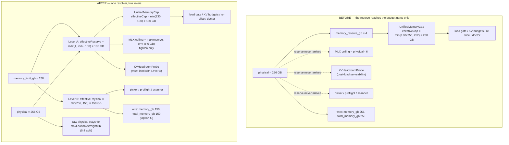
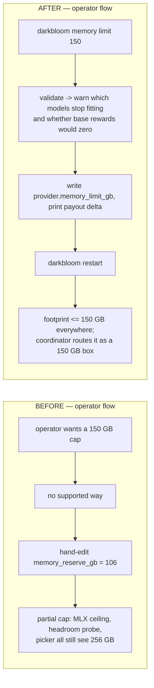

# Operator-settable memory limit (`memory_limit_gb`) — design proposal

> Last updated: 2026-09-03 · commit `5d400cf75`

Status: **Proposed** — 2026-08-10 — no `memory_limit_gb` key or `darkbloom memory` command exists; the provider budget is still the fixed `UnifiedMemoryCap.defaultCapFraction` cap plus `memory_reserve_gb` (`provider-swift/Sources/ProviderCore/Inference/UnifiedMemoryCap.swift`, `provider-swift/Sources/ProviderCore/Config/ProviderConfig.swift`); as built: [`../architecture/hardware-support.md`](../architecture/hardware-support.md#cap-and-reserves-unifiedmemorycap).

**Date:** 2026-08-10
**Scope:** `provider-swift` only for the core; one reporting decision touches coordinator-visible wire fields (no coordinator code change)

---

## 1. The ask

> "Someone has a 256 GB machine but only wants to allocate 150 GB to Darkbloom. Give them a
> command-line option that writes something into their config file."

Today there is no way to express this. The provider sizes every budget from
`ProcessInfo.processInfo.physicalMemory` and holds back a fixed `provider.memory_reserve_gb`
(default 4 GB), so a 256 GB box will grow model weights + KV up to `0.90 × 256 ≈ 230 GB`.

## 2. The key insight: a cap is a reserve in disguise

`UnifiedMemoryCap` already threads an operator reserve through every budget gate:

| Gate | File | Arithmetic |
|---|---|---|
| Static KV budget (fleet re-slice) | `UnifiedMemoryCap.swift:111-126` | `effectiveCap = min(0.90×physical, physical − configReserve)` |
| Live KV admission | `UnifiedMemoryCap.swift:146-168` | same `min(...)` |
| Model-load gate hold-back | `UnifiedMemoryCap.swift:201-209` | `max(configReserve, physical − hardCap)` |

So:

```
cap 150 GB on a 256 GB box   ⇔   configReserve = 106 GB
effectiveCap = min(0.90 × 256, 256 − 106) = min(230, 150) = 150 GB   ✅ exact
```

**No new enforcement path is needed.** The whole feature is one resolver feeding the reserve that
already exists, plus closing the two places the reserve does not currently reach that would
otherwise make the cap incoherent (§5.3) — both of which are latent bugs today, independent of this
feature.

### 2.1 Zero-code baseline (and why we still want the key)

An operator can get most of this **today** by setting `memory_reserve_gb = 106`. Three reasons a
dedicated key is still right:

1. **Portable intent.** `memory_limit_gb = 150` means the same thing after `scp`-ing the config to a
   192 GB box; `memory_reserve_gb = 106` silently becomes an 86 GB cap.
2. **It is the question operators actually ask.** "Use at most N GB", not "hold back 256 − N".
3. **The baseline is only partially effective.** `memory_reserve_gb` never reaches the MLX ceiling,
   the live-headroom probe, the paged-KV pool sizer, the model picker, or `darkbloom local` (§5).
   A big reserve today gives an operator a *false* sense of a cap.

## 3. Semantics (state this explicitly — mixing the two readings is a bug)

**`memory_limit_gb = 150` means: the provider's total unified-memory footprint (weights + KV +
activations) stays at or below 150 GB.** It is *not* "pretend the machine has 150 GB" — that
reading would apply the 0.90 fraction on top and yield 135 GB usable.

Two levers fall out, and each consumer takes exactly one:

| Lever | Formula | Applies to |
|---|---|---|
| **A — effective reserve** | `max(memory_reserve_gb, physical − memory_limit_gb)` | Everything that goes through `UnifiedMemoryCap` (load gate, KV budgets, re-slice, doctor) |
| **B — effective physical** | `min(physical, memory_limit_gb)` | Scale-derived heuristics and reporting: model picker, preflight, model scanner, wire fields. (Paged-KV's `physical/16` is nominally a Lever B consumer but is deferred — see §5.3.) |

Lever A gives the exact-150 semantics. Lever B is only for consumers that use physical RAM as a
crude scale rather than a budget. Applying both to the same consumer double-counts.

Interaction with the existing key: **`max()` — the more conservative of `memory_reserve_gb` and the
cap wins.** An operator who sets both gets both honored, never a loosened guard.

## 4. Proposed surface

### 4.1 Config

`[provider]` in `~/.config/darkbloom/provider.toml`:

```toml
[provider]
name = "darkbloom-mac16-1"
memory_reserve_gb = 4
memory_limit_gb = 150      # NEW — optional; absent means "no artificial cap"
```

Swift, in `ProviderSettings` (`Config/ProviderConfig.swift:22-68`):

```swift
/// Artificial ceiling (GB) on the provider's total unified-memory footprint
/// (weights + KV + activations). nil (default) = no cap; the 0.90 × physical
/// hard cap governs. Combined with `memoryReserveGB` via max() — the more
/// conservative hold-back always wins.
public var memoryLimitGB: UInt64?     // TOML key: memory_limit_gb
```

**Optional, not defaulted.** `decodeIfPresent` → `nil`, and `TOMLEncoder` omits nil, so a config
that never set it stays byte-identical across a `ConfigManager.save()`. Precedent + negative test:
`mtp_drafter_path` (`MTPConfigTests.swift:132-143`, `#expect(!toml.contains("mtp_drafter_path"))`).

### 4.2 CLI — `darkbloom memory`

Modeled directly on `darkbloom beta` (`BetaCommand.swift`), which is the repo's config-mutation
precedent, including the canonical-save-path fix at `BetaCommand.swift:189-194` that keeps the
launchd daemon from reading a stale legacy file.

```
darkbloom memory                     # default subcommand → show
darkbloom memory show
darkbloom memory limit <GB>
darkbloom memory limit --clear       # remove the key entirely
```

Three verbs, no `--json` at v1 (add it when something needs to parse it — `status` does not have one
either).

`darkbloom memory show` output:

```
Memory (config: /Users/x/.config/darkbloom/provider.toml)

  Physical RAM          256 GB
  Artificial limit      150 GB          (provider.memory_limit_gb)
  OS reserve              4 GB          (provider.memory_reserve_gb)
  Effective ceiling     150 GB          (of 230 GB uncapped)
  Usable for inference  146 GB          weights + KV, after activation reserve

  Models that still fit: gemma-4-26b-qat-4bit, gpt-oss-20b, qwen3.5-9b-4bit
```

`darkbloom memory limit 150` confirmation mirrors Beta's block:

```
Memory limit set to 150 GB (was: none).
  The provider will use at most 150 GB of unified memory for weights + KV + activations.
  Restart to apply:  darkbloom restart
  Config: /Users/x/.config/darkbloom/provider.toml
```

**Validation** (all `ValidationError`, following `Fan.Configure`'s numeric-setter shape at
`FanCommand.swift:235-261`):

| Input | Behavior |
|---|---|
| `0` | reject — "use `--clear` to remove the limit" |
| `≥ physical` | accept as no-op + warn: "limit ≥ 256 GB physical; no effect" |
| `< 8` | reject — below the existing preflight floor (`StartCommand+Preflight.swift:24`) |
| `< largest enabled model + ~4 GB` | accept + **warn**, naming the models that will stop loading (reuse `ModelFitDiagnostic`) — and warn that **base rewards drop to $0** if no model stays warm (see below) |
| overflow | saturating GiB→bytes converter, twin of `ProviderLoop.memoryReserveBytes(forGiB:)` (`ProviderLoop.swift:552`); test precedent `GlobalKVCacheBudgetTests.swift:168` |

**Validation must also run at config load, not only in the CLI.** Hand-editing the TOML is the
obvious path, and `memory_limit_gb = 1` decodes cleanly: the provider starts, registers, loads
nothing, and — because base rewards gate on `!p.Online || !p.ModelLoaded`
(`payments/baserewards/engine.go:229-231`) — **silently earns $0**. Emit a startup WARN (and clamp
to the 8 GB floor) when the limit cannot fit any advertised model.

**Restart required: yes.** Config is read once at process start. Say so in the confirmation, exactly
as `BetaFeature.requiresRestart` does.

### 4.3 Rejected surfaces

- **`darkbloom start --memory-limit-gb`.** `LaunchAgent.swift:292-331` builds `ProgramArguments`
  explicitly and never writes `--config`; `LaunchAgent.restart()` (`:170-173`) does not rewrite the
  plist. A new `start` flag silently dies at the next daemon relaunch unless `installAndStart` +
  `writePlist` are extended too. The config file is the durable path, and the user asked for a
  config-writing command anyway.
- **`DARKBLOOM_MEMORY_LIMIT_GB` env var.** launchd inherits a 5-key allowlist
  (`LaunchAgent.swift:273-277`); a memory env var would no-op for every normal `darkbloom start`.
  This is the documented rationale for config-backed knobs at `BetaFeatures.swift:5-9`. Fewest
  knobs — skip it.
- **Generic `darkbloom config set provider.memory_limit_gb 150`.** A typed command can validate,
  show what still fits, and explain the payout implication (§6). A string setter cannot.

## 5. Implementation map

### 5.1 The resolver

One new pure function, next to the existing policy (`Inference/UnifiedMemoryCap.swift` or a small
`EffectiveMemoryLimit.swift`):

```swift
/// Effective hold-back: the operator reserve, or whatever the artificial
/// limit implies, whichever is larger. A limit ≥ physical is a no-op.
static func effectiveReserveBytes(
    physicalBytes: UInt64,
    configReserveBytes: UInt64,
    memoryLimitBytes: UInt64?
) -> UInt64 {
    guard let limit = memoryLimitBytes, physicalBytes > limit else { return configReserveBytes }
    return max(configReserveBytes, physicalBytes - limit)
}
```

### 5.2 Lever A — swap the six reserve read sites

Every one already computes `Self.memoryReserveBytes(forGiB: config.provider.memoryReserveGB)`;
each becomes the resolver call. This is the entire enforcement change.

| Site | Feeds |
|---|---|
| `ProviderLoop.swift:533` | `GlobalKVCacheBudget(configReserveBytes:)` — process-wide runtime KV gate |
| `ProviderLoop+Capacity.swift:94` | `EngineV2Runtime.FleetKVContext` — heartbeat per-slot clamp |
| `ProviderLoop+Capacity.swift:120` | `loadReserveBytes` → `free_for_load_gb` on the wire |
| `ProviderLoop+EngineV2.swift:170` | `fleetKVBudgetBytes` — **the** re-slice choke point (load/unload/MTP-fallback) |
| `ProviderLoop+ModelLoading.swift:831` | `availableMemoryGb()` — the real model-LOAD gate |
| `darkbloom/Diagnostics/DoctorRunner.swift:88` | `ModelFitDiagnostic.usableInferenceGb` — doctor's fits/doesn't-fit verdict |

Everything downstream (`kvBudgetBytes`, `liveKVHeadroomBytes`, `loadReserveBytes`,
`EngineV2KVSizing`, `EngineV2Reslice`, `VisionMemoryGate`) binds for free — it already takes
`configReserveBytes`.

### 5.3 Gaps the reserve does *not* reach today

These are pre-existing threading holes — why `memory_reserve_gb = 106` is not already a working cap.
Only the first two are **required** for a correct cap; the rest are ranked by whether they change
behavior on the motivating case.

**Required — Phase 1:**

| # | Gap | Fix |
|---|---|---|
| 1 | **MLX ceiling ignores the operator reserve.** All three `MLXMemoryGuard.configureOnce` call sites (`ProviderLoop+MemoryProtection.swift:28`, `ProviderLoop+ModelLoading.swift:435`, `StandaloneServer.swift:264`) omit `reserveBytes:`, so `Memory.memoryLimit` is always `physical − 6 GB`. | Pass `max(effectiveReserve, MLXMemoryGuard.resolvedReserveBytes(explicit: nil))`. **Tighten-only** — passing the raw 4 GB default would *loosen* the ceiling from 6 GB, and resolving through the existing helper keeps an operator-raised `DARKBLOOM_MLX_MEMORY_RESERVE_GB` honored (an explicit argument would otherwise bypass the env branch). |
| 2 | **`KVHeadroomProbe` is reserve-blind.** `KVHeadroomProbe.swift:21-26` calls `liveKVHeadroomBytes` with neither `physicalBytes` nor `configReserveBytes`. | **Must ship with Phase 1, not later.** Once Lever A lands, the probe measures headroom against `0.90 × physical` (230 GB) while the runtime KV gate enforces 150 GB — an ~80 GB divergence on the motivating box. The post-load serveability guard (9 call sites) would then pass models whose every request `GlobalKVCacheBudget` rejects: exactly the loaded-but-unserveable black hole `UnifiedMemoryCap.loadIsServeable` exists to prevent. Shipping Lever A without this *creates* that state. |

**Required — Phase 2** (otherwise the operator is offered models that cannot load):

| # | Gap | Fix |
|---|---|---|
| 3 | **Picker + preflight use raw `hardware.memoryGb`.** `StartCommand+Picker.swift:223`, `+TUIPicker.swift:16`, `+Preflight.swift:24`, with their own hardcoded `pickerOSReserveGb = 4.0`. | **Lever B**: seed from effective physical. |
| 4 | **Advertised model set is uncapped.** `ModelScanner.scanModels(in:availableMemoryGB:)` filters on raw memory. | **Lever B**, so a capped box stops advertising models it can no longer load. |

**Deferred — no behavior change on the motivating case, or out of scope:**

- **Paged-KV `machineCap`** (`PagedKVPhysicalCapacityPolicy.swift:98-100`, physical read inline at
  `EngineV2Factory+Production.swift:398`). For a 150 GB cap,
  `min(8 GiB, 150/16 ≈ 9.4 GiB) = 8 GiB` — identical to uncapped. Lever B only changes anything
  below ~128 GB effective, and the pool is already bounded by `min(logicalGrantBytes, …)` where the
  logical grant is cap-aware after Lever A. Revisit only if we support small-box caps.
- **`status` line cosmetics.** `StatusCommand.swift:34` shows `memoryGb − 4` from
  `HardwareDetector.swift:40-42` — a third, unrelated reserve. Worth fixing; not part of this.
- **`darkbloom local`.** `StandaloneServer.swift:255, :264, :624, :995` pass no reserve at all —
  standalone mode has never honored `memory_reserve_gb`. That is a separate pre-existing gap, not
  "cap my provider."

Note `EngineV2Reslice.minimumServiceableGrantBytes` (1 GiB/slot): a cap that squeezes the fleet
budget below `slots × 1 GiB` makes loads correctly refuse with 503
(`ProviderLoop+EngineV2.swift:341-362`) — the existing serviceability floor already handles the
over-tight-cap case; no new code, but the CLI warning in §4.2 should preempt it.

### 5.4 The one implementation trap

`ProviderLoop+Capacity.swift:102` binds a single `totalMem` that feeds **both** levers:

```swift
let totalMem = ProcessInfo.processInfo.physicalMemory
… maxLoadableWeightGb(totalBytes: totalMem, reserveBytes: loadReserve)   // :126 — Lever A already applied to reserve
… totalMemoryGb: Double(totalMem) / gbDivisor                             // :137 — wants Lever B
```

Applying Lever B to the shared variable computes `150 − used − 106` → a negative free-for-load.
**Split it**: keep raw physical for `maxLoadableWeightGb`, use effective physical only for the
`totalMemoryGb` wire field.

## 6. The one decision that needs your call: what do we report to the coordinator?

Two independent wire fields carry memory, and **the coordinator has no cross-consistency check
between them** (verified across `registry/`).

| Field | Cadence | Drives |
|---|---|---|
| `hardware.memory_gb` | register only | **base-reward payout tier**; **two routing gates with no heartbeat fallback** — cold-spill (`cold_dispatch.go:127`) and the warm-pool load planner (`registry.go:3485`), both `modelFitsHardware(…, float64(p.Hardware.MemoryGB))`; the seed value for routing snapshots (`scheduler.go:1193, 2163, 2214` — heartbeat overrides only when `> 0`); `maxConcurrency` fallback (`registry.go:1206`); public `/v1/stats`, attestation page, admin-ui |
| `backend_capacity.total_memory_gb` | every heartbeat | `modelFitsHardware` on the routing path, the `maxConcurrency` tier ladder, `coldTokenBudgetEstimate` (the `prompt_too_long` shed tier), the GPU-utilization routing penalty, warm-pool scoring |
| `backend_capacity.free_for_load_gb` | every heartbeat | cold-load admission (**authoritative when present**, `scheduler.go:1390-1402`) |

**`free_for_load_gb` needs no decision** — it derives from `loadReserveBytes`, so §5.2 makes it
cap-aware automatically. Cold-load admission is correct for free.

**Attestation is not a constraint.** No memory field exists in the SE-signed `AttestationBlob`, and
neither `attestation/` nor `mdm/` compares reported memory to any hardware fact. The only
memory-vs-hardware check anywhere is `mdm.ModelMaxMemoryGB` — a static Apple-model max-RAM table
used solely to clamp base rewards *downward*. `docs/base-rewards.md:177-186` already states
self-reported `MemoryGB` is untrusted and "may only cap downward / never raises a payout." Reporting
less is accepted unconditionally.

### Option A — report physical everywhere (no reporting change)

Simplest, but a capped 150 GB box is still routed as a 256 GB box by every structural gate above:
`modelFitsHardware` admits models it cannot load, `coldTokenBudgetEstimate` promises a KV headroom
of `0.90×256 − weights − 3` that the provider's own gate will reject, and the `maxConcurrency`
ladder puts it in the top tier. Failures surface as request-time rejects instead of routing-time
avoidance.

### Option B — cap the heartbeat only (`total_memory_gb = 150`, register stays 256)

Better, but **it does not fix every structural gate**: cold-spill (`cold_dispatch.go:127`) and the
warm-pool load planner (`registry.go:3485`) read `p.Hardware.MemoryGB` directly with no
`BackendCapacity` fallback. Under B, both keep sizing the machine at 256 GB and will spill requests
onto — and plan `load_model` pushes for — models the provider cannot load. `free_for_load_gb`
catches most of it downstream, but only when the provider has already reported it; the static
hardware-fit gate runs first.

### Option C — cap both (**recommended**)

`hardware.memory_gb` and `total_memory_gb` both report `min(physical, memory_limit_gb)`.

**Why, in order of weight:**

1. **Routing correctness.** It is the only option under which every gate — static hardware-fit,
   cold-spill, load planner, concurrency ladder, servability estimate — sizes the machine the way the
   provider will actually behave. That is the real argument; the payout question below is secondary.
2. **One consistent meaning.** `memory_gb` becomes "memory I contribute", which is what routing,
   payouts, and public stats all actually want.
3. **Payout consistency.** Tiers are coarse (`floor.go:47-63`). The motivating case, 256 → 150, moves
   the 192 GB tier → 128 GB tier: **$30 → $26/mo, −$4**. Print that in the CLI confirmation so it is
   never a surprise.

**Correction to an argument you may hear (and which an earlier draft of this doc made): Option C is
not a security fix.** Base rewards already gate on `!p.Online || !p.ModelLoaded`
(`payments/baserewards/engine.go:229-231`), so an operator who caps a box to nothing and loads
nothing earns **$0**, not the top tier. And the under-contribution path exists today regardless —
`memory_reserve_gb = 488` has the same effect, and register-time `memory_gb` is self-reported and
only clamped *downward* by `mdm.ModelMaxMemoryGB`. The surviving weaker case (cap a 512 GB box to
24 GB, keep one small model warm, sit idle — base rewards intentionally do not depend on demand,
`engine.go:214`) is unchanged by which option we pick. Option C aligns the *honest* path; it closes
no hole.

**One acknowledged distortion.** The coordinator applies its own `servabilityCapFraction = 0.90`
(`servability.go:44-46`) and the concurrency ladder to whatever we report — so reporting 150 makes
the coordinator assume ~135 GB usable, the "pretend the machine has 150 GB" reading §3 explicitly
rejects for the provider's own math. It errs conservative (~10% under-advertised KV), which is the
safe direction, but the proposal should not claim end-to-end exactness.

**What changes visibly:** public `/v1/stats` fleet total and per-provider rows, `MachineCard`
(`console-ui`), admin-ui operator RAM sums, and the attestation page all show 150 for that machine.
`CardVitals` renders `gpu_active / total_memory` — against the cap this becomes "% of your budget",
which is arguably the better reading.

**Implementation:** apply Lever B once, where `HardwareInfo` is produced for registration (a
`HardwareInfo.applyingMemoryLimit(_:)` helper), keeping `HardwareDetector` a pure hardware probe;
and for the `totalMemoryGb` wire field only at `ProviderLoop+Capacity.swift:137` — see the §5.4
trap. The coordinator's `[0, 1024]` clamps (`registry.go:2654`, `:2783`) are upper bounds only, and
there is no minimum-memory registration gate, so a lower value passes silently.

**If you want payouts untouched**, take Option B and accept the two stale routing gates — it is a
one-line difference. A new optional wire field carrying both numbers was considered and rejected: it
requires coordinator changes, and nothing on the coordinator actually needs raw physical.

## 7. Testing

Live-isolated and pure, matching the existing patterns (swift-testing `@Test`/`#expect`, explicit
parameter injection, no mocks).

| File | New coverage |
|---|---|
| `UnifiedMemoryCapTests.swift` | `effectiveReserveBytes`: `max()` precedence, no-op when `limit ≥ physical`, exact-150 arithmetic, saturation. Extends the `loadReserveBytes` section (`:270`), mirroring `loadReserveIsConfigWhenLargerThanCapImplied` (`:283`). |
| `GlobalKVCacheBudgetTests.swift` | Direct analogue of `globalKVCacheBudgetHonorsOperatorReserveAboveCapImplied` (`:149`) with a limit instead of a reserve: 256 GiB snapshot, `limit = 150` → admits 149 GiB, rejects 151 GiB, plus the uncapped control. |
| `ConfigTests.swift` (or a new `@Suite("Provider memory limit config")`) | The `WatchdogTests.swift:533-561` triad — absent→nil / explicit→decodes / round-trips — plus the `MTPConfigTests.swift:132` negative: `#expect(!toml.contains("memory_limit_gb"))` when unset. |
| `ModelLoadAdmissionTests.swift` | `free_for_load_gb` reflects the cap; `maxLoadableWeightMirrorsCanLoadWhenIdle` (`:183`) still holds. |
| `MLXMemoryGuardTests.swift` | `configureOnce` receives the tighten-only reserve; a 4 GB config reserve does **not** loosen the 6 GB default; a raised `DARKBLOOM_MLX_MEMORY_RESERVE_GB` is still honored. |
| new `KVHeadroomProbe` coverage | **The Phase-1 regression test**: probe-measured headroom must equal the runtime KV gate's headroom under a cap. Without this, gap 2 silently regresses into the loaded-but-unserveable state. |
| `DiagnosticsTests.swift` | `usableInferenceGb` under a cap (extends `usableInferenceGbHonorsThe90PercentCapOnBigBoxes`, `:100`) — keeps doctor ↔ runtime-gate parity. |
| `EngineV2ProductionWiringTests.swift` | End-to-end: real `updateAggregateCapacity()` produces capped `totalMemoryGb` + a **non-negative, correct** `freeForLoadGb` — the §5.4 double-count regression test. Only place these are produced end-to-end (`:1779`). |
| `DarkbloomCLITests/CLIDispatchTests.swift` | Real built binary, throwaway `HOME`, `--config <temp>`: `memory limit 150` writes the key, `--clear` removes it, `show` renders. **Also closes a standing gap** — `ConfigManager.load/save/update` currently has zero test coverage anywhere. |

CI runs the whole package unfiltered: `cd provider-swift && swift test` (`ci.yml:161`).

## 8. Docs

**Must update** (they state the sizing arithmetic an operator relies on):
`docs/provider/hardware-requirements.md:61,65,113`, `docs/provider/troubleshooting.md:164`,
`docs/provider/cli-reference.md` (new command), `README.md:264` +
`docs/provider/quickstart.md:110` (the sample TOML blocks), and `docs/base-rewards.md:177-186` if
Option C lands.

**Nice to have, defer:** `docs/provider/installation.md:86`, `docs/consumer/models.md:118`,
`AGENTS.md:234`, and `docs/reference/protocol-messages.md:290-296` (whose `BackendCapacity` table is
already missing the `free_for_load_gb` row that exists on the wire — a standing bug, not one this
change introduces).

Noted for later: there is **no canonical `provider.toml` reference page** — keys live in copy-pasted
sample blocks in three files that drift independently. `docs/reference/provider-config.md` is worth
creating (`docs/AGENTS.md:19` makes `reference/` the right home), but it is not a blocker here.

## 9. Phasing

| Phase | Content |
|---|---|
| **1 — core** | Config key + resolver + the six Lever-A call sites + **gap 1 (MLX ceiling) + gap 2 (`KVHeadroomProbe`)** + tests. Gap 2 is not optional here: Lever A without it manufactures loaded-but-unserveable models (§5.3). The cap is real and enforced after this phase. |
| **2 — UX + reporting** | `darkbloom memory` command, config-load validation, picker + preflight + scanner (gaps 3, 4), and the §6 Option-C reporting change with the §5.4 `totalMem` split. If Option B is chosen instead, this last item shrinks to the heartbeat field only. |
| **Deferred** | Paged-KV `machineCap`, the `status` line, `darkbloom local`, the docs config-reference page. None changes behavior on the motivating case. |

---

## Appendix — before / after




