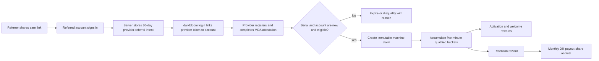

# Provider referral growth program — fixed acquisition rewards plus interim payout share

> Last updated: 2026-09-03 · commit `5d400cf75`

Status: **Proposed** — 2026-08-21 — none of the `provider_referral_*` tables or acquisition-reward code in §9 exists; `coordinator/billing/referral.go` (`ReferralService`) still implements only the consumer platform-fee share this memo builds on, see [`../architecture/billing.md`](../architecture/billing.md#consumer-referral).

**Date:** 2026-08-21

**Owners:** Growth / Coordinator / Billing

**Scope:** provider acquisition, referral attribution, reward accounting, abuse controls, payout, and rollout

---

## 1. Decision

Darkbloom should launch a **two-part provider referral program**:

1. During the public alpha, pay a fixed, budget-capped acquisition reward for a
   newly referred Mac that becomes verified, routable, and retained.
2. During the launch program, pay the referrer a time-limited continuous reward
   equal to **2% of the referred machine's eligible provider payout**. Keep that
   interim formula until Darkbloom decides the platform-fee policy, then apply
   any replacement formula prospectively.

The 2% payout share is an explicit growth subsidy. At the current 0% platform
fee, cooperating accounts could otherwise buy work from their own referred
machine, recover the charge as provider earnings, and collect the extra 2% as
profit. The launch design therefore excludes related-account traffic, caps the
commission base and total award, holds monthly settlement for review, and gives
the campaign a hard cash budget. Those controls reduce the exposure; they do not
turn the subsidy into self-funding unit economics.

The public offer should be:

> Earn $25 when a new verified Mac you refer becomes a retained Darkbloom
> provider. The new provider earns a $10 welcome reward. During the launch
> program, you also earn 2% of its eligible inference payouts, subject to the
> program term and cap. The payout-share formula may change prospectively when
> Darkbloom publishes its platform-fee policy.

This is a growth program, not a lifetime royalty, multi-level program, or claim
on the referred provider's earnings.

## 2. Why this is a separate program

Darkbloom already has a consumer referral system. An account registers a code,
another account applies it, and the referrer receives a percentage of the
platform fee generated by the referred consumer
(`coordinator/billing/referral.go:13-50` and
`coordinator/billing/referral.go:112-216`). The public-alpha platform fee is
currently 0%, so that referral path has no fee pool to distribute
(`coordinator/payments/pricing.go:34-43`).

Provider acquisition has a different job:

- A consumer referral monetizes future demand.
- A provider referral acquires new, retained, routable supply.
- A provider referral must identify one physical machine, not only one account.
- Acquisition rewards need a fixed campaign budget while the platform fee is 0%.
- The interim 2% payout share is funded from the growth budget until the
  platform-fee policy and a sustainable successor formula are approved.

The existing `referrers` table can remain the ownership registry for human-facing
codes (`coordinator/store/postgres.go:309-322`), but provider attribution,
qualification, campaign terms, and reward settlement need separate records. Do
not overload the existing `referrals` relationship or `referral_reward` ledger
entry with provider-acquisition semantics.

## 3. Objectives and non-goals

### 3.1 Objectives

- Increase net-new **qualified provider-hours**, not registrations or installs.
- Reward referrers for recruiting useful operators and helping them remain
  online.
- Give a new provider a small, immediate reason to finish setup.
- Keep acquisition cost and maximum liability explicit.
- Preserve the referred provider's full payout under the active fee policy.
- Prevent self-referral, serial reuse, and retroactive attribution; block
  detectable related-account traffic and bound residual collusion loss.
- Produce an auditable ledger trail and restart-safe, idempotent settlement.

### 3.2 Non-goals

- No lifetime commissions.
- No second-level or multi-level referrals.
- No reward for an account signup, installer download, device code, or transient
  provider connection.
- No minimum inference-volume gate during the alpha; consumer demand is outside
  the provider's control.
- No retroactive claims on machines that Darkbloom has already seen.
- No automatic cash reward for an identity that cannot be bound to verified
  hardware.

## 4. Program mechanics

### 4.1 Public-alpha acquisition reward

| Milestone | Requirement | Referrer | Referred provider |
|---|---|---:|---:|
| Activation | 72 qualified provider-hours within 7 days of the first verified claim | $10 | $10 |
| Retention | 500 qualified provider-hours within 30 days of the first verified claim | $15 | — |
| Maximum fixed reward per retained machine | Both milestones | **$25** | **$10** |

The maximum fixed program cost for one retained machine is $35. A pilot should
use both a claim limit and an atomic cash-budget limit; a count of retained
machines alone is not a sufficient cap because activation rewards can be paid to
machines that later fail retention.

Recommended first campaign:

- Up to 100 verified machine claims.
- $4,000 hard reward budget, inclusive of activation, welcome, and retention
  awards but exclusive of payment-processor fees.
- Claims expire and release an unpaid budget reservation after their milestone
  windows close.
- A claim that has received any reward never silently recycles its already-spent
  budget into a second claim.

### 4.2 Interim continuous payout share

For each successfully settled, non-self-route inference job served by a referred
machine:

```text
actual_provider_payout = final positive payout after fee and billing clamps
platform_reference_payout = payout for the same usage at platform reference price
commissionable_payout = min(actual_provider_payout, platform_reference_payout)
provider_referral_share = 2% × commissionable_payout
```

Recommended terms:

- Accrues from activation until the earliest of 12 months, the $100 per-machine
  continuous-reward cap, or the published transition to a replacement formula.
- Accrued rewards are never clawed back merely because the formula later
  changes; the replacement applies only to jobs completed on or after its
  effective timestamp.
- Settles monthly after at least $1 has accrued and a review hold has elapsed.
- Paid from the campaign growth budget, never deducted from the provider payout.
- Excludes base rewards, welcome rewards, admin rewards, refunds, self-route,
  failed or uncollected jobs, and traffic linked to the referrer or referred
  provider.
- Caps the commission base at the platform reference payout so provider custom
  pricing cannot increase the subsidy.
- Stops future accrual if the machine is transferred to another payout account.
- Uses the campaign terms snapshotted at attribution; future campaign changes do
  not rewrite already-accrued rewards.

The provider payout and platform fee already derive independently from final
job cost (`coordinator/payments/pricing.go:142-162`), and completion settlement
records the linked provider's earning only for a non-free, positive payout
(`coordinator/api/provider.go:1847-1905` and
`coordinator/api/provider.go:2195-2243`). The referral calculation should observe
that final payout but must not change it.

### 4.3 Interim budget and transition rule

The campaign must reserve separate budgets for fixed milestones and continuous
payout share:

```text
campaign_remaining = campaign_cash_budget
                     - fixed_rewards_authorized
                     - payout_share_authorized
```

No commission may be authorized after the budget reaches zero. The exact initial
continuous-share budget remains a launch approval; it is independent of the
$4,000 fixed-reward pilot budget.

Each authorized per-job accrual reserves its amount from the continuous-share
budget. Budget exhaustion affects only the referral candidate; it must never
reduce, delay, or roll back the underlying provider payout.

When the platform-fee policy is approved, Darkbloom should publish a dated
successor formula. Plausible choices include continuing the 2% payout share,
moving to a percentage of realized platform fee, or ending the continuous
component. This report deliberately does not pre-decide that policy. The
transition must preserve previously accrued rewards, apply one formula to each
job based on completion time, and retain a lifetime $100 continuous-reward cap
across both formulas unless new campaign terms expressly replace it.

### 4.4 Worked economics

Assume a $100 completed job under the current 0% platform fee:

| Destination | Independent consumer | Related/colluding consumer |
|---|---:|---:|
| Provider payout | $100 | $100 |
| Provider referrer at 2% | $2 | $2, but ineligible |
| Darkbloom platform revenue | $0 | $0 |
| Darkbloom growth subsidy | $2 | $0 after hard exclusion |

The referred provider still keeps its full payout. For legitimate third-party
traffic, Darkbloom spends $2 of growth budget on $100 of payout. Without the
related-traffic exclusion, a colluding group would receive $102 from a $100
charge before payment costs. That positive-sum loop is the principal risk of the
interim formula and the reason for the hold, cap, campaign budget, and review
controls.

The fixed acquisition bounty and 2% payout share are both intentional growth
spend during the interim phase. Neither should be represented as funded by
current platform margin.

## 5. Qualification: pay for usable capacity

A **qualified provider-hour** is an hour assembled from coordinator-observed
eligibility intervals in which the referred machine is:

1. Linked to the referred account through provider device authentication.
2. Bound to a valid, MDA-verified hardware serial.
3. Attested and at or above the program's trust floor.
4. Running an accepted provider version with verified runtime state.
5. Online with at least one supported model loaded and routable.
6. Below the normal critical thermal and memory-pressure limits.
7. Not suspended, disqualified, or under fraud review.

These gates deliberately reuse the *policy shape* of base-reward eligibility:
attested, healthy, model-loaded, linked, and sufficiently online
(`coordinator/payments/baserewards/engine.go:210-292`). They must not reuse the
base-reward identity key; §6 explains why.

Qualification must not require a minimum number of jobs. A healthy provider
should not fail activation because the network had no demand. When the provider
has received at least 20 dispatches, quality becomes measurable and the
retention gate should additionally require at least a 95% successful-completion
rate, excluding consumer cancellations and other outcomes not attributable to
the provider.

Do not reconstruct qualification from the current provider snapshot at the end
of a milestone. The provider can be healthy at evaluation time after spending
most of the period unavailable. Record idempotent five-minute qualification
buckets only for active claims, including the eligibility result and reason.
This makes progress restart-safe without restoring the high-volume general
telemetry table previously removed from the coordinator.

## 6. Machine identity and attribution

### 6.1 Automatic payouts require a verified serial

The X25519 provider public key is not a stable machine identity. Swift describes
`NodeKeyPair` as ephemeral, generates a fresh pair with a CSPRNG, and constructs
a new pair in every `ProviderLoop` initialization
(`provider-swift/Sources/ProviderCore/Crypto/NodeKeyPair.swift:39-67`;
`provider-swift/Sources/ProviderCore/ProviderLoop.swift:468-514`). Although some
store comments currently call `provider_key` stable, referral payouts must not
key on it.

Use the MDA-attested hardware serial as the automatic reward identity. Provider
records and durable sessions already carry serial, account, attestation, and MDA
state (`coordinator/store/interface.go:843-893`), and the store supports lookup
and lifecycle operations by serial (`coordinator/store/interface_domains.go:580-628`).

Recommended storage:

- Compute an HMAC of the verified serial for the referral subsystem.
- Put a lifetime unique constraint on that serial HMAC.
- Retain raw serial handling in the existing attestation/provider tables only.
- Do not automatically pay a self-signed or unverified serial; route exceptional
  cases to manual review.

### 6.2 Attribution flow



The existing device flow issues a long-lived provider token linked to the
approved account (`coordinator/api/device_auth.go:131-161`), and registration
resolves that token onto `Provider.AccountID`
(`coordinator/api/provider.go:326-348`). Because serial verification happens
after registration, claim creation should run after account linkage **and** MDA
verification are both present, or in a reconciler that waits for both. It must
not award money from the initial WebSocket registration event.

### 6.3 Attribution rules

- The referral intent must exist before the machine's first verified claim.
- The intent expires after 30 days.
- The serial must never have appeared in historical provider records or sessions
  before the intent.
- The referred account must not have prior provider history at attribution.
- One provider referrer is immutable for the lifetime of the serial.
- No retroactive code entry after a machine is seen.
- One referred account may receive automatic rewards for at most three machines
  in a campaign; larger fleets use a reviewed partner agreement.
- An existing consumer referral may prefill the provider code in the UI, but the
  provider claim is a distinct relationship and must be accepted under the
  provider-program terms.

## 7. Abuse and fraud controls

### 7.1 Hard controls

- Block self-referral by account ID.
- Block referrer and referred accounts that resolve to the same Stripe connected
  payout account.
- Enforce lifetime serial uniqueness.
- Require MDA verification and accepted runtime integrity.
- Require attribution before first verified appearance.
- Make campaign, milestone, claim, serial, and payout-accrual writes idempotent.
- Cap fixed campaign spend atomically.
- Cap continuous rewards by term, machine, claim, commission basis, and campaign
  budget.
- Exclude self-route, related-account traffic, failed settlement, and every job
  with a zero provider payout.
- Cap the commission basis at the platform reference payout for the same usage.
- Stop accrual on payout-account ownership changes.

### 7.2 Risk signals and review

IP address, email similarity, timing, and network locality can inform a risk
score but should not independently disqualify a legitimate household, office,
or fleet. Trigger manual review for:

- Several referred accounts converging on related payout identities.
- Repeated claim expiry followed by serial/account reshuffling.
- Traffic dominated by a narrow set of accounts related to the provider or
  referrer.
- Abrupt usage spikes close to a commission cap or term end.
- Payout concentration above an admin-configured threshold.

Rewards under review should accrue as pending but remain non-withdrawable. The
terms must authorize withholding, reversal before withdrawal, and
disqualification for manipulation. Current provider terms already reserve the
right to delay, reverse, withhold, or adjust payouts for fraud and accounting
errors (`docs/legal/terms-of-service.md:67-79`), but the referral program needs
its own plain-language eligibility and abuse terms.

## 8. Accounting and payout design

### 8.1 Separate ledger types

Add distinct entries rather than overloading the consumer referral entry:

- `provider_referral_activation`
- `provider_referral_retention`
- `provider_referral_welcome`
- `provider_referral_commission`

The current ledger distinguishes provider payouts, consumer referral rewards,
admin rewards, and provider floor draws (`coordinator/store/interface.go:391-409`).
Provider-referral entries are reward earnings, not organic provider inference
earnings, and must not inflate provider work, token, or job leaderboard totals.

Use unique references such as:

```text
provider-referral:<claim-id>:activation:referrer
provider-referral:<claim-id>:activation:welcome
provider-referral:<claim-id>:retention:referrer
provider-referral:<claim-id>:commission:<YYYY-MM>
```

The store already exposes an idempotent withdrawable credit keyed on entry type
and reference (`coordinator/store/interface_domains.go:207-218`) and implements
the Postgres path with a transaction-scoped advisory lock
(`coordinator/store/postgres.go:2710-2745`). Milestone and commission settlement
should use that contract or a stronger referral-specific atomic transaction.

### 8.2 Provider earning plus referral candidate outbox

The provider payout is primary and must not depend on referral budget
availability. Extend the provider-credit transaction to record an optional
referral candidate in the same commit:

```text
CreditProviderAccountWithReferralCandidate(
    provider_earning,
    provider_referral_claim_id,
    provider_serial_hmac,
    commissionable_payout,
    formula_version,
)
```

Required invariants:

- The provider earning is credited exactly as it is today regardless of referral
  eligibility or budget remaining.
- A successfully committed eligible earning has at most one durable referral
  candidate outbox row keyed by job ID.
- Commissionable payout never exceeds the actual provider payout or the
  platform reference payout for the same usage.
- Ineligible or related traffic records no candidate.
- A retry after timeout observes the already-settled result rather than paying
  twice.

The provider earning is currently written with `CreditProviderAccount` after
final payout computation (`coordinator/api/provider.go:2195-2243`). The outbox
keeps the referral candidate durably tied to that successful earning without
making campaign budget contention part of the inference settlement hot path.

An asynchronous authorizer consumes the outbox. For each candidate it:

1. Rechecks claim status, term, ownership, and related-account eligibility.
2. Calculates exactly 2% with deterministic micro-USD rounding.
3. Locks the claim and campaign budget.
4. Applies remaining machine cap and campaign budget.
5. Inserts one authorized accrual or a terminal ineligible/budget-exhausted
   result keyed by job ID.

The authorizer is retryable and idempotent. Exhausted referral budget cannot
alter the provider earning that produced the candidate.

### 8.3 Monthly commission settlement

The authorizer produces a durable, job-idempotent accrual from the eligible
provider payout. A monthly settlement worker then:

1. Sums unsettled accruals for one claim and UTC month.
2. Confirms the review hold has elapsed without disqualification.
3. Inserts an immutable commission settlement row.
4. Credits the referrer's withdrawable balance once.
5. Marks exactly the included, already-budgeted accruals settled in the same
   transaction.

This keeps per-job auditability without adding one referral ledger credit for
every inference request.

### 8.4 Withdrawal and tax readiness

Rewards may appear as pending or earned before payout onboarding, but cash
withdrawal requires a ready Stripe Connect account. User records already track
connected-account status and destination readiness
(`coordinator/store/interface.go:545-555`), and the Stripe status endpoint
exposes that state to the UI (`coordinator/api/stripe_payouts.go:235-260`).

Referral compensation can add tax-reporting obligations. Stripe states that a
Connect platform's reporting responsibility depends on the Connect fee-control
configuration and recommends consulting a tax advisor. Before launch, confirm
the applicable 1099 configuration, countries, thresholds, identity collection,
and program terms with counsel and tax operations. See
[Stripe's Connect tax-reporting guidance](https://docs.stripe.com/connect/tax-reporting).

## 9. Proposed module and data model

Keep the feature out of the existing consumer referral service and the provider
WebSocket handler beyond thin hooks.

```text
coordinator/providerreferrals/
├── policy.go          campaign terms, qualification rules, payout-share math
├── attribution.go     intent -> verified machine claim
├── qualification.go   five-minute eligibility buckets and milestone progress
├── settlement.go      fixed awards and monthly commission settlement
├── risk.go            hard blocks and review flags
└── service.go         thin orchestrator
```

Recommended persistent records:

| Record | Purpose | Important uniqueness |
|---|---|---|
| `provider_referral_campaigns` | Immutable/versioned offer terms, dates, shares, caps, budget | campaign ID |
| `provider_referral_intents` | Authenticated code claim before hardware is known | active intent per referred account |
| `provider_referral_claims` | Referrer, referred account, verified serial HMAC, status, snapshotted terms | serial HMAC lifetime unique |
| `provider_referral_qualification_buckets` | Five-minute eligible/not-eligible evidence and reason | claim + bucket start |
| `provider_referral_milestones` | Activation, welcome, retention authorization and settlement | claim + milestone + recipient |
| `provider_referral_payout_candidates` | Transactional outbox row tied to a successful provider earning | job ID |
| `provider_referral_payout_accruals` | Per-job actual/reference payout, commission basis, and 2% share | job ID |
| `provider_referral_commissions` | Monthly capped settlement | claim + UTC month |

The campaign row is the source of truth for offer amounts. Do not hardcode
marketing dollar values in billing handlers or UI components.

## 10. API and product surface

Suggested authenticated routes:

- `GET /v1/provider-referrals/program` — active terms and remaining eligibility.
- `POST /v1/provider-referrals/claim` — attach a code to the authenticated
  account before provider history exists.
- `GET /v1/provider-referrals/me` — the user's code, earnings, caps, and payout
  readiness.
- `GET /v1/provider-referrals/recruits` — privacy-safe claim progress and status.

Suggested admin routes:

- Create, pause, close, or inspect a campaign.
- List claims by status or risk state.
- Approve or reject review-held claims with a recorded reason.
- Read budget authorized, paid, pending, and remaining.
- Read provider payout, commission basis, accrued, held, settled, and capped
  totals.

The `/earn` experience should expose:

- A copyable referral URL such as `https://console.darkbloom.dev/earn?ref=CODE`.
- The fixed activation, retention, and welcome milestones.
- Pending, activated, retained, expired, review-held, and disqualified states.
- Qualified-hour progress and milestone deadlines.
- Fixed rewards versus continuous 2% payout-share earnings.
- The one-year term and remaining per-machine cap.
- Stripe payout-readiness action when money is earned but not withdrawable.

The accurate launch phrase is "2% of eligible inference payouts during the
launch program." The UI and terms must state the exclusions, term, $100 cap,
budget dependency, review hold, and prospective formula-transition rule. Do not
imply that base rewards or every dollar shown in the provider's balance earns a
commission.

## 11. Measurement and experiment

### 11.1 Hypotheses

**H1 — acquisition:** a $25 referrer reward plus a $10 provider welcome reward
increases new 30-day-retained machines compared with organic acquisition.

**H2 — quality:** milestone gating produces referred machines whose reliability
is not materially worse than comparable organic machines.

**H3 — continuous alignment:** an interim 2% share of eligible provider payout
increases high-quality referrals and retention enough to justify its incremental
growth cost, while caps and related-traffic controls keep abuse within the
approved budget.

### 11.2 Primary metric

```text
net-new 30-day qualified provider-hours / referral dollars paid
```

Registrations, downloads, and connected-provider count are funnel metrics, not
the objective.

### 11.3 Funnel and quality metrics

- Referral link opened.
- Authenticated intent recorded.
- New serial verified.
- Activation reached.
- Retention reached.
- 30-, 60-, and 90-day qualified provider-hours.
- Dispatch success rate, avoidable failure rate, and time online with a routable
  model.
- Organic inference earnings, commissionable payout, and 2% accrual.
- Fixed acquisition cost, interim payout-share cost, and total cost per retained
  machine.
- Fraud-review, rejection, expiry, and reversal rates.
- Capacity added by model, memory tier, and region.

### 11.4 Initial success gates

Expand the alpha pilot only when:

- At least 60% of activated machines reach the 30-day retention milestone.
- Fixed rewards plus payout fees are at most $60 per 30-day-retained machine.
- Referred-machine success rate is within five percentage points of a matched
  organic cohort.
- Fraud or disqualification remains below 5% of verified claims.
- Reward settlement reconciles exactly and produces no duplicate credits.

Continuous rewards require additional gates:

- Provider earning and referral candidate commit atomically; each candidate
  authorizes at most one accrual.
- Commissionable payout never exceeds actual payout or platform reference
  payout.
- Related-account and self-route traffic produces no accrual.
- Authorized payout share never exceeds the continuous campaign budget.
- Shadow-calculated commissions reconcile for at least 30 days before money is
  enabled.
- Circular-traffic simulations demonstrate that all relationships detectable by
  account, provider ownership, and Stripe payout identity are excluded; residual
  collusion exposure is measured against the hard cap and review policy.

## 12. Rollout plan

### Phase 0 — instrumentation and shadow claims

- Create campaign, intent, claim, qualification, and admin-read models.
- Record no money.
- Verify serial uniqueness, account linking, qualification buckets, expiry, and
  progress against a small internal cohort.

### Phase 1 — fixed rewards and shadow 2% calculation

- Enable the $10 activation, $10 welcome, and $15 retention rewards.
- Admit at most 100 verified claims under the $4,000 hard budget.
- Require manual review above a cumulative referrer threshold.
- Compute the 2% commissionable payout in shadow without authorizing money.
- Validate platform-reference caps, related-traffic exclusions, custom-price
  behavior, and monthly totals.

### Phase 2 — interim 2% payout-share canary

- Atomically write provider earnings and referral candidate outbox rows, then
  authorize payout accruals asynchronously.
- Approve a separate hard budget for continuous rewards.
- Enable monthly commission settlement for a bounded campaign cohort.
- Run matched accounting, retry, crash-recovery, and circular-traffic tests.
- Enforce the review hold, 12-month maximum term, and $100 machine cap.
- Review growth cost, concentration, related traffic, and abuse weekly.

### Phase 3 — platform-fee decision and prospective transition

- Decide the platform fee and the successor continuous-reward formula.
- Publish the formula and effective timestamp before applying it.
- Preserve accrued 2% rewards and the cross-formula $100 cap.
- Shadow the successor formula before enabling money.

### Phase 4 — general program

- Open self-service referrals only after the acquisition and payout-share gates
  pass.
- Add shortage-specific campaigns only through versioned campaign policy; never
  silently alter existing claims.

Separate kill switches are required for new attribution, fixed milestone
settlement, payout accrual, and monthly commission payout. Disabling new
activity must not erase already-earned claims or make the admin audit trail
unreadable.

## 13. Verification matrix

| Area | Required proof before launch |
|---|---|
| Identity | Restarting a provider changes X25519 key but cannot create a second serial claim |
| Attribution | Code after first verified appearance is rejected; expired intent cannot claim |
| Self-referral | Same account and same Stripe payout identity are blocked |
| Qualification | Restarts, sleep, stale sessions, unhealthy state, and unloaded models count correctly |
| Fixed rewards | Every recipient/milestone credits at most once across retries and coordinator restarts |
| Budget | Concurrent claims and milestones cannot exceed the campaign cash cap |
| Payout accrual | Provider earning and candidate commit together; candidate authorizes one 2% accrual |
| Wash traffic | Detectable related-account and self-route traffic produces no accrual |
| Commission basis | Custom pricing cannot raise the basis above the platform reference payout |
| Caps | Term, machine cap, campaign budget, and ownership-change stop all hold |
| Payout | Rewards remain pending until eligible and withdraw through the existing Stripe path |
| Reporting | Referral rewards never inflate organic provider jobs, tokens, or earnings |
| Store parity | Memory and Postgres stores produce identical transitions and errors |

Unit tests should cover pure policy math; shared store-harness tests should pin
state transitions and idempotency for both stores; API integration tests should
exercise account linking, MDA claim creation, milestone settlement, payout
accrual, and payout visibility. The implementation is not complete until a full
restart/retry test proves that no reward is duplicated.

## 14. Decisions recorded and remaining decisions

### Recorded

- Use a hybrid fixed-plus-continuous program.
- Fixed alpha reward: $25 to referrer and $10 to referred provider after
  milestone completion.
- Interim continuous reward: 2% of eligible settled provider payout, funded from
  the growth budget.
- Commission basis is capped at platform reference payout and excludes base
  rewards, promotions, self-route, failed jobs, and related-account traffic.
- Interim continuous term ends at the earliest of 12 months, the $100 cap, or a
  published prospective transition to the approved successor formula.
- Continuous cap: $100 per machine.
- Provider payout is never reduced by the referral program.
- Automatic eligibility requires a new, MDA-verified hardware serial.
- No lifetime or multi-level rewards.

### Before implementation begins

- Confirm the exact first-campaign dates and $4,000 cash budget.
- Approve the separate hard budget for the interim 2% payout share.
- Confirm whether the three-machine automatic limit is per campaign or lifetime
  per referred payout identity.
- Choose the manual-review payout/concentration threshold.
- Confirm eligible Stripe Connect countries and tax-reporting operations.
- Decide whether an existing consumer referral automatically prefills, but does
  not automatically accept, a provider referral intent.
- Confirm whether continuous commissions stop or transfer when a legitimate
  provider business changes its payout account.
- Decide the successor commission formula together with the platform-fee policy.

## 15. Done versus blocked

**Done:** the incentive model, interim 2% commission basis, subsidy risk,
identity requirement, milestone gates, caps, accounting invariants, rollout,
and success criteria are specified.

**Not implemented:** no schema, API, coordinator, console, ledger, payout, or
legal-text changes have been made by this report.

**Launch blockers:** campaign approval, tax/legal review, durable serial-based
claims, qualification evidence, the provider-earning/referral-candidate outbox,
a separate continuous-reward budget, abuse tests, and a successful shadow/canary
rollout.
