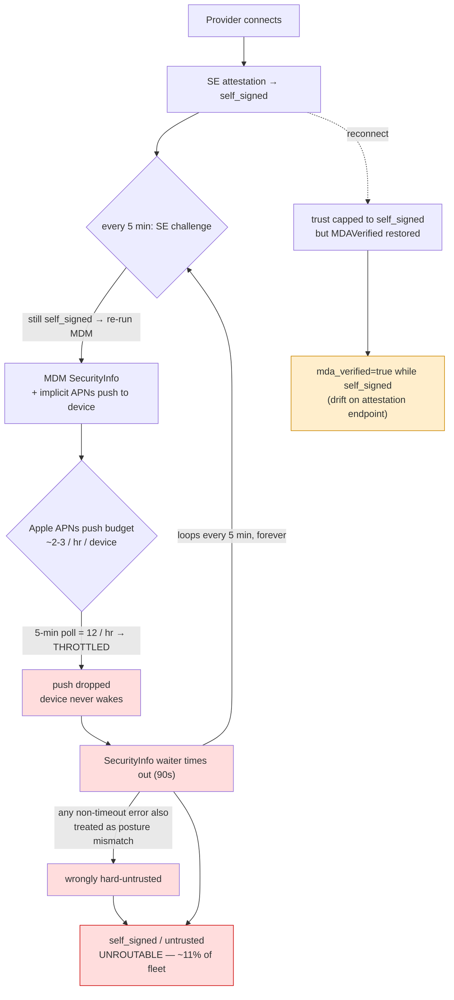
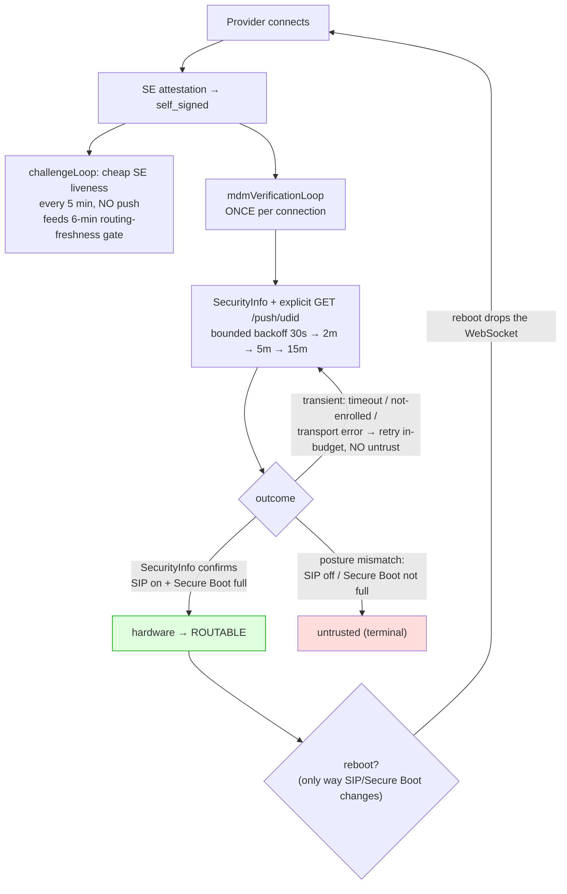

# Provider Trust Reliability

> Last updated: 2026-07-04 · commit `98a38f5b0`

How a provider earns **hardware** trust, why ~11% of the fleet got stranded at
`self_signed`/`untrusted`, what the per-connection MDM fix changed, and how to
observe the trust pipeline.

This is engineer-facing operational doc, not a spec. It does **not** change
trust-grant semantics — hardware trust still requires a genuine, Apple-attested
device. It makes the MDM trust path reliable and observable.

---

## At a glance: before vs after

**Before** — MDM `SecurityInfo` was re-run on the 5-minute challenge for every
`self_signed` provider. Each run pushed via APNs; Apple throttles those, so the
checks timed out and the provider never escaped `self_signed`:



**After** — the cheap SE liveness challenge stays on its ticker; MDM
`SecurityInfo` moves to a per-connection loop with an explicit push and a
push-budget-aware backoff. The check lands once and trust sticks for the
connection (a reboot — the only way SIP/Secure Boot can change — drops the
WebSocket and forces a fresh, re-verified connection):



---

## 1. The problem

Hardware trust via MDM is established by issuing a live **SecurityInfo** command
over the MicroMDM → APNs → device channel and reading back the device's SIP /
Secure Boot posture. The old model ran this verification at registration **and
re-ran it on every 5-minute challenge** for any provider still at `self_signed`.

Each re-verification fired a fresh MDM/APNs push. Apple throttles MDM pushes
aggressively, so under steady fleet load most of those pushes were dropped or
delayed past the SecurityInfo wait timeout. The check never landed, the provider
stayed `self_signed`, the next 5-minute tick pushed again, and the cycle
repeated. Net effect: roughly **11% of the fleet was stranded** unroutable at
`self_signed`/`untrusted` even though the machines were genuine, enrolled Apple
hardware — the trust path was self-inflicting an APNs throttle.

Two **drift / mis-classification** bugs compounded the noise (neither was a
trust *downgrade* — a SecurityInfo timeout already stayed `self_signed` without
untrusting):

1. **Display drift:** on reconnect, trust is capped back to `self_signed` but the
   stored `MDAVerified`/`ACMEVerified` flags (and the late-MDA cert payload) were
   resurrected, so `/v1/providers/attestation` showed `mda_verified=true` next to
   a `self_signed` provider — misleading anyone verifying a provider's hardware.
2. **Outcome mis-classification:** the verify path treated *any* non-timeout
   error as a posture mismatch — so a transient MicroMDM transport hiccup (the
   SecurityInfo command failing to enqueue) would wrongly **hard-untrust** an
   enrolled, genuinely-secure box. Only a SecurityInfo response that actually
   reports SIP-off / Secure-Boot-not-full (or disagrees with the attestation) is
   a real mismatch.

---

## 2. The shipped fix

The verification model moved from **poll-forever-per-challenge** to
**once-per-connection, retried within the connection**:

- **`mdmVerificationLoop` (per connection).** Spawned alongside the challenge
  loop when a provider connects (`api/provider.go`). It owns SecurityInfo
  verification for the lifetime of that one WebSocket and stops the moment
  hardware is earned, on a terminal posture mismatch, or when the connection
  closes.
- **Explicit push + bounded backoff.** It sends the SecurityInfo command, then
  retries on a fast→slow schedule (`30s, 2m, 5m`, then a 15-minute steady
  cadence) — enough to survive APNs / Power-Nap delivery delay and to catch a
  device that finishes enrollment mid-connection, while staying well under
  Apple's push budget. It is **not** re-pushed on every 5-minute challenge.
- **Transient ≠ untrust.** A miss/timeout/not-enrolled outcome is now treated as
  *transient* — it schedules a retry and never downgrades a provider that
  already holds trust. Only a real posture mismatch is terminal. This fixes the
  drift downgrade.
- **Observability gauges.** `providers.by_trust_status` and
  `providers.by_mdm_failure` (see §6) make the stuck cohort and its cause
  visible.

### Why per-connection is security-equivalent to polling

SIP and Secure Boot posture **cannot change at runtime**. Both require a reboot
into Recovery to alter. A reboot drops the WebSocket, which ends
`mdmVerificationLoop` and forces a fresh connection that re-verifies from
scratch. So there is no window in which a machine flips its security posture
while keeping a live, already-verified connection. We don't need to re-poll a
stable property; we only need the one check to *land* — which the bounded
in-connection retry now reliably achieves without spamming APNs.

---

## 3. The trust model

Hardware trust has a **single leg**:

```
TrustHardware  ==  live MDM SecurityInfo posture check passes   (MicroMDM → APNs → device)
```

- **MDM SecurityInfo** (`verifyProviderViaMDM`): the live-command path described
  above, driven by the per-connection `mdmVerificationLoop`. This is the only
  way a provider earns `hardware` trust.
- Two accelerators avoid redundant round-trips without weakening the guarantee:
  the **trust-reuse fast-skip** (DAR-326) lets a recently-verified provider skip
  a redundant re-verification on quick reconnect, and **durable MDA reuse**
  (#436) re-validates the stored Apple MDA cert chain instead of re-fetching it
  from Apple (which is rate-limited to ~1/device/7d). Both reuse *evidence*; the
  SecurityInfo posture check remains the trust grant.

### ACME leg removed (2026-07-03)

There used to be a second, dormant leg: an ACME `device-attest-01` mTLS client
cert issued by step-ca, intended as a throttle-immune alternative to the live
MDM command. It was **removed on 2026-07-03** (`api/acme_verify.go`,
`applyACMETrust`, the step-ca sidecar, the `/acme/*` proxy, the
`com.apple.security.acme` enrollment payload, and the
`EIGENINFERENCE_STEP_CA_ROOT`/`_INTERMEDIATE` env vars are all gone) because it
was never wired end to end — the provider never presented the cert and the
ingress never did mTLS / `X-Ssl-Client-*` header forwarding (the verification
code read nginx-era headers that nothing set) — so **zero ACME verifications
were ever observed in prod**. Meanwhile it actively confused operators: the
dashboard showed a permanent "ACME device-attest-01" red X on every provider
(Linear DAR-394).

Two residues to know about:

- The wire key `acme_verified` is still emitted by
  `/v1/providers/attestation`, `/v1/me/providers`, and `/v1/stats` —
  **hardcoded `false`, deprecated** — because shipped provider builds decode it
  as a required field. New UI/CLI no longer display it.
- **Institutional memory**, should a throttle-immune trust leg ever be wanted
  again: prefer an in-band cert proof (provider sends the cert + a
  challenge-signature over the existing WebSocket, no ingress mTLS dependency),
  and make it **fail closed** on the cert's Apple device-attest SIP/Secure-Boot
  posture extensions (OIDs `1.2.840.113635.100.8.13.*`, parsed by
  `attestation/mda.go`) with short-lived / per-connection re-attested certs —
  otherwise the leg grants `hardware` on a weaker, issuance-time posture
  guarantee than live SecurityInfo.

---

## 4. MDA is identity, not a reliability path

Apple Device Attestation (MDA / `DevicePropertiesAttestation`,
`verifyAppleDeviceAttestation`) is sometimes mistaken for a third reliability
escape hatch. It is not.

- MDA rides the **same live MicroMDM → APNs command channel** as SecurityInfo
  (it's a `DeviceInformation` command). It is subject to the same APNs delivery
  constraints, so it cannot bypass an MDM/APNs throttle.
- Its purpose is **identity + anti-relay**: Apple signs a cert chain binding the
  device to genuine hardware, and the SE-key hash is carried as the attestation
  nonce (embedded as FreshnessCode, OID `1.2.840.113635.100.8.11.1`) so the SE
  key is cryptographically bound to *this* machine. That stops a relay attack
  where one machine answers attestation on behalf of another.

So MDA strengthens *who* a provider is; it does not make trust *more reliable*
to obtain. Don't reach for it to solve an APNs-delivery problem — the mitigation
for delivery flakiness is the bounded in-connection retry (§2) plus the durable
MDA reuse and trust-reuse fast-skip (§3), not extra live commands.

**SIP / Secure Boot posture** comes Apple-signed from SecurityInfo (live). (The
removed ACME leg would have carried the same posture evidence in cert
extensions, OIDs `1.2.840.113635.100.8.13.*` — see §3 if that idea is ever
revived.)

---

## 5. The enrollment-completion gap

A provider that never reaches hardware trust usually has an incomplete MDM
enrollment, not a coordinator bug. The two distinct failure shapes (both bucketed
into `providers.by_mdm_failure`, both surfaced by `darkbloom doctor`):

| Reason (`MDMFailureReason`) | Meaning | Provider-side fix |
|---|---|---|
| `device-not-found` | The enrollment profile was never checked in to MicroMDM at all — MicroMDM has no record of this serial. | Re-install / repair the enrollment profile; confirm the `.mobileconfig` from `/v1/enroll` was actually installed and the MDM payload accepted. |
| `found-not-enrolled` | MicroMDM knows the serial but check-in is incomplete — the device record exists but isn't fully enrolled/responsive. | Finish enrollment (approve MDM in System Settings), then keep the Mac awake and APNs reachable so the check-in completes. |
| `securityinfo-timeout` | Enrolled, but the SecurityInfo push didn't return in time (APNs/Power-Nap delay). | Keep the Mac awake (disable sleep / Power Nap throttling); confirm APNs reachability. The in-connection retry will catch it once a push lands. |
| `posture-mismatch` | Terminal — device reported SIP/Secure Boot disabled. | Re-enable SIP and Secure Boot (reboot into Recovery). |
| `error` | Verification call errored. | Inspect coordinator logs for this provider. |

General provider-side remedies: finish/repair the MDM enrollment profile, keep
the Mac awake (so APNs pushes are delivered promptly), and ensure outbound APNs
connectivity. `darkbloom doctor` reports the local view of enrollment + SE key +
attestation so a provider operator can self-diagnose before the coordinator ever
has to.

---

## 6. Monitoring

Datadog gauges/counters to watch and alert on.

**Trust-cohort gauges** (emitted on a ticker, `api/server.go`):

- `providers.by_trust_status{trust_level,status}` — providers bucketed by trust
  level and status. **Alert** when the `self_signed`/`untrusted` cohort grows or
  fails to shrink — that's the stranded fleet.
- `providers.by_mdm_failure{reason}` — connected, non-hardware providers bucketed
  by `MDMFailureReason` (§5). Tells you *why* the stuck cohort is stuck:
  - rising `device-not-found` / `found-not-enrolled` → provider-side enrollment
    problem (action is on the operators / onboarding).
  - rising `securityinfo-timeout` → MDM/APNs delivery problem (the thing the
    per-connection fix mitigates; sustained growth means APNs is degraded or the
    push budget is again exhausted).
  - any `posture-mismatch` → genuinely insecure machines, expected to stay
    untrusted.

(The `acme.client_cert` / `acme.trust` counters that briefly existed to observe
the dormant ACME leg were removed along with the leg on 2026-07-03; see §3.)
