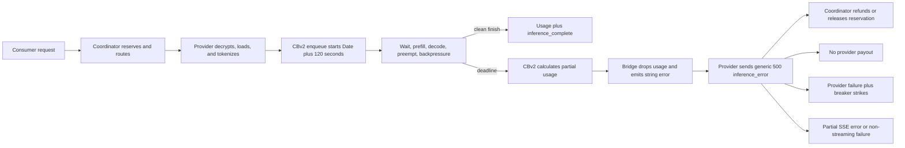
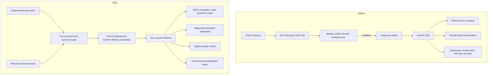

# Generation Deadline Incident and Terminal-State Redesign

> Last updated: 2026-07-20 · commit `5d400cf75`

**Date:** 2026-07-20
**Status:** Investigation complete; implementation not started
**Scope:** CBv2 request lifetime, provider terminal translation, coordinator retry and settlement, provider health, route telemetry, OpenRouter wire behavior, and production impact
**Production access:** PostgreSQL, Datadog, provider reports, and public health endpoints were queried read-only. No code, configuration, monitor, dashboard, deployment, release, traffic, or production state was changed.

## Executive summary

The provider currently gives every request a fixed 120-second lifetime after it
enters the ContinuousBatchingV2 (CBv2) scheduler. That lifetime is not a
generated-token limit. It includes scheduler waiting, prefill, decode,
preemption, and output backpressure. It is measured with wall-clock `Date` and
can terminate a healthy request while it is still producing tokens.

This is a semantic scope regression. The pre-CBv2 implementation used a
120-second timeout only for requests that had not yet been admitted to engine
work. The CBv2 path applies the same duration to the full engine lifetime. The
stale `ProviderLoop.schedulerPendingTimeout` constant still exists, but it is
unused by the production CBv2 path.

When the deadline fires, CBv2 calculates partial token usage correctly. That
usage is discarded twice before the coordinator sees the terminal:

1. `EngineV2Bridge` turns the typed engine finish into a string error and drops
   the reconciled usage.
2. `MultiModelBatchSchedulerEngine` turns that error into another string-only
   failure.

The provider then sends a generic HTTP-like 500 `inference_error`. The
coordinator cannot distinguish a platform deadline from an engine fault. It
refunds or releases the consumer reservation, pays the provider nothing,
records a provider job failure, feeds provider-health breakers, and exposes a
partial stream error or a non-streaming failure. The route row has no actual
usage or cost.

The dominant production population is large:

- 25,749 high-confidence 120-130 second deadline signatures in a fixed 24-hour
  window.
- 178,416 in a fixed seven-day window.
- 174,857 of the seven-day signatures, 98.0%, happened after the coordinator's
  internal content-commit latch was set. This does not prove useful output was
  written to the client.
- No matching usage rows, provider earnings, prompt-token counts,
  completion-token counts, or route costs were recorded.

The current OpenRouter-style internal uptime counter hides most of this. The
streaming path records success at content commit instead of terminal
completion; non-streaming records after its response handler and has different
contamination. Datadog reported 99.902% uptime in the inspected 24-hour window,
while a terminal-success proxy after subtracting observed in-band failures was
96.308%. That proxy is investigative rather than an exact OpenRouter score.
Neither value predicts post-fix uptime. The proxy uses a mixed-mode, partially
reconstructed Datadog denominator; the putatively recoverable cohort comes from
a different attempt-level PostgreSQL window with no stable request-level join to
those metrics. Production also stops the cohort at 120 seconds, so its
counterfactual completion probability is unobserved. All recovery percentages
in this report are arithmetic scenarios, not estimates or forecasts.

The safe fix is not to change 120 to a larger number. The coordinator first
needs an ordered, first-terminal-wins attempt state machine and explicit client
delivery state. Partial billing must be bounded by output successfully written
to the client, not by provider-generated usage alone. After those invariants
are in place, the fixed total wall can be replaced with independent monotonic
leases for admission, prefill progress, decode progress, backpressure, and a
generous request-derived safety bound.

## What the 120-second timer actually means

Production constructs `CBv2EngineLoopConfig()` without overriding its default:

- `provider-swift/Sources/ProviderCore/Inference/EngineV2Factory+Production.swift:464-477`
- `libs/mlx-swift-lm/Libraries/MLXLMCommon/ContinuousBatchingV2/EngineLoopV2.swift:159-188`

The engine assigns the deadline when the request is enqueued:

- `EngineLoopV2.swift:643-690`

The clock therefore excludes earlier provider work such as:

- Request decryption.
- JSON decoding and request-shape translation.
- Cold model loading.
- Some tokenization and template work before engine submission.

After engine enqueue, the same deadline covers all of these distinct phases:

- Waiting behind other engine requests.
- Prompt prefill.
- Token decode.
- Preemption and later resumption.
- Time paused by bounded output-stream backpressure.

Both waiting and running records expire through the same path:

- `EngineLoopV2.swift:1381-1384`
- `EngineLoopV2.swift:1701-1713`

The deadline is stored as a `Date`, so a system wall-clock adjustment can make
it expire early or late. Internal execution time should use a monotonic clock.

### Historical intent

Immediately before the v0.7.5 CBv2-only conversion, the legacy scheduler's
watchdog expired only bridges whose `admittedAt` remained nil. Its code comment
explicitly excluded long prefills after admission. It used `ContinuousClock`.
The relevant historical implementation was:

`73cff2a23^:provider-swift/Sources/ProviderCore/Inference/BatchScheduler+EngineBridge.swift:469-479`

The current declaration at
`provider-swift/Sources/ProviderCore/ProviderLoop.swift:559-561` still names the
value `schedulerPendingTimeout`, but there are no current readers. Changing
that constant would not change production behavior.

### Structural incompatibility with the API contract

The coordinator injects the model registry's `max_output_length` when callers
omit a bound, using 8,192 only when the registry value is unavailable:

- `coordinator/api/consumer.go:1145-1152,1485-1517`

The inspected production requests and active model configuration use output
limits up to 32,768 tokens. This is an observed production value, not a
source-level registry ceiling; registry validation requires a positive value
but does not impose a 32,768 maximum
(`coordinator/api/model_registry_handlers.go:545-550`). Even at an illustrative
55 tokens per second:

| Requested output | Decode time before prefill |
|---:|---:|
| 8,192 tokens | about 149 seconds |
| 16,000 tokens | about 291 seconds |
| 32,768 tokens | about 596 seconds |

Natural stopping means not every request consumes its maximum, but the service
advertises and financially reserves a full output allowance that the engine
cannot honor under the universal 120-second wall when generation approaches
that allowance.

## Current end-to-end failure path



### Engine usage exists at the deadline

`finishRequest` reconciles terminal usage at
`EngineLoopV2.swift:1463-1486`. The step-watchdog path can instead inject raw
zero usage at `EngineLoopV2.swift:1865-1897`, which is one reason terminal cause
and source must remain explicit.

### Usage is lost at two translation boundaries

`EngineV2Bridge` records the finish but discards the resulting information on
the error path:

- `provider-swift/Sources/ProviderCore/Inference/EngineV2Bridge.swift:943-1033`

`MultiModelBatchSchedulerEngine` then throws a string-bearing generation error:

- `provider-swift/Sources/ProviderCore/Inference/MultiModelBatchSchedulerEngine.swift:647-663`

The provider handler sends `inference_error` without usage:

- `provider-swift/Sources/ProviderCore/ProviderLoop+InferenceHandler.swift:775-806`

By contrast, cancellation after provider-observed output already has a partial-usage
recovery path in the same handler and in
`provider-swift/Sources/ProviderCore/Inference/UsageAccounting.swift`.

### The wire error has no terminal or usage semantics

`InferenceCompleteMessage` includes mandatory usage and optional response
attestation. `InferenceErrorMessage` contains only request ID, text, status, and
an optional broad error reason:

- `coordinator/protocol/messages.go:418-435`
- `provider-swift/Sources/ProviderCore/Protocol/Messages.swift:220-251`

The generic generation error maps to status 500:

- `provider-swift/Sources/ProviderCore/Inference/MultiModelBatchSchedulerEngineError.swift:22-29,104-144`
- `provider-swift/Sources/ProviderCore/ProviderLoop+ErrorMapping.swift:53-93`

### Coordinator effects

The coordinator handles the generic error at
`coordinator/api/provider.go:2234-2353`. The current result can include:

- Full reservation refund or service-reservation release.
- No usage write.
- No provider earning.
- `RecordJobFailure`.
- Shape-keyed, node-health, and stable-identity breaker inputs through
  `coordinator/api/consumer.go:280-387`.
- `partial_success/provider_error_after_commit` when the internal commit latch
  was set; response mode is not persisted on the route row.
- A non-streaming error after all internally buffered content is discarded.

The provider-policy deadline is therefore reported as provider sickness.

## Production evidence

### Interpretation and correlation limits

The measurements below describe several different units and must not be merged
into one exact rate:

- `inference_routes` is primarily one row per provider attempt, not one row per
  inbound logical request. The selected-finalized denominator removes known
  speculative losers but cannot reconstruct every retry chain because attempts
  receive new request IDs. Multiple strict attempts may therefore represent one
  caller request, so the attempt rate is not a user-visible request failure rate.
- The strict 120-130 second predicate is a high-confidence deadline proxy, not a
  typed causal field. Other generic provider errors can enter it, and exact
  deadlines outside that total-duration window can be missed.
- `final_status=partial_success` plus positive `actual_ttft_ms` proves the
  coordinator's internal commit latch and TTFT stamp, not a successful client
  write or semantically useful output.
- Streaming mode and endpoint are not persisted on successful route rows, so
  the strict cohort cannot be divided exactly into streaming, non-streaming,
  Chat Completions, Responses, Messages, and Completions.
- PostgreSQL and Datadog fixed-window anchors differ by about 23 minutes. Their
  nearby counts triangulate behavior but are not row-for-row joins. No durable
  logical request ID or shared event ID links a strict PostgreSQL attempt to a
  Datadog success/in-band event, so cross-system subtraction is not a measured
  cohort transition.
- The internal `inference.completions` counter includes cancellation and
  consumer-gone completions; it is not a clean-success denominator.
- Current API-key role is mutable and is not a historical role snapshot.
- The dominant credential concentrates nearly all strict signatures. Results
  characterize the current production workload but do not estimate an average
  across independent consumer populations.
- Candidate count does not persist alternative identities or occupancy. The
  aggregate Datadog idle-alternative metric has no request ID and cannot be
  joined to strict deadline rows.
- Public provider and capacity views are cached and overlapping. A live idle
  snapshot is not a reconstruction of historical route eligibility.
- The counterfactual completion curve after 120 seconds is right-censored by
  policy: production forces a terminal at the cutoff, so neither eventual clean
  completion probability nor time-to-completion beyond 120 seconds is observed.
  The recovery fraction `r` used later is unidentified by current data; recovery
  percentages are scenario inputs, not estimates, confidence bounds, or
  forecasts.
- The route schema does not durably identify the OpenRouter credential, so
  service-account and cancellation findings cannot be attributed to OpenRouter
  solely from traffic shape.
- Public `/health` reported `version=dev`, `build_commit=unknown`, and
  `build_date=unknown`; the exact deployed coordinator commit cannot be proven
  from that endpoint. Database rows, Datadog signals, provider versions, and
  direct provider reports triangulate the observed behavior, while current
  source is used to explain the matching implementation path.

### Query method

All PostgreSQL connections used `default_transaction_read_only=on`, explicit
read-only transactions, UTC, bounded lock timeouts, and bounded statement
timeouts. Credentials were sourced from `coordinator/.env` without printing
them.

The fixed half-open PostgreSQL windows were:

- 24 hours: `[2026-07-19 19:45:00, 2026-07-20 19:45:00)` UTC.
- Seven days: `[2026-07-13 19:45:00, 2026-07-20 19:45:00)` UTC.

The primary denominator was selected, finalized provider attempts excluding
intentional speculative losers.

The high-confidence deadline proxy was:

```sql
error_code = 500
AND error_reason = 'provider_error'
AND (
  (final_status = 'partial_success'
   AND error_class = 'provider_error_after_commit')
  OR
  (final_status = 'error'
   AND error_class = 'provider_error')
)
AND total_duration_ms >= 120000
AND total_duration_ms < 130000
```

The predicate is exact, but its causal interpretation remains a proxy because
the database stores the provider deadline as generic `provider_error`.

### Headline magnitude

| Metric | 24 hours | Seven days |
|---|---:|---:|
| All route-attempt rows | 792,671 | 5,115,339 |
| Selected finalized non-loser denominator | 783,018 | 4,921,395 |
| Strict 120-130 second signatures | 25,749 | 178,416 |
| Rate of selected finalized attempts | 3.2884% | 3.6253% |
| After coordinator commit latch | 24,437 | 174,857 |
| After-commit share | 94.9047% | 98.0052% |
| Before commit | 1,312 | 3,559 |

The broader raw after-commit HTTP-500 class contained 186,124 rows in seven
days. Only 174,857, or 93.9465%, fell in the strict 120-130 second window. The
broader number must not be reported as an exact deadline count.

No anchored day in the seven-day window was near 6,600 errors. The strict
daily counts ranged from 20,488 to 30,021, with a mean of 25,488. Earlier
figures of approximately 6,600/day and 185,900/week did not describe the same
population.

### Duration shape

For relevant generic provider-500 rows:

| Total duration | Seven-day rows |
|---|---:|
| 120 to under 121 seconds | 126,758 |
| 121 to under 122 seconds | 34,907 |
| 122 to under 125 seconds | 13,612 |
| 125 to under 130 seconds | 3,139 |

Strict after-commit duration percentiles were:

| Percentile | Duration |
|---|---:|
| p50 | 120.618 seconds |
| p90 | 121.797 seconds |
| p95 | 122.669 seconds |
| p99 | 125.737 seconds |

The delay above exactly 120 seconds is consistent with a deadline created at
engine enqueue and observed at a subsequent engine-loop boundary, while route
duration starts earlier in the coordinator.

### Direct provider-report validation

The seven-day provider-report corpus contained:

- 470 reports.
- 60 reports containing the exact phrase
  `request exceeded 120s deadline`.
- 3,466 phrase occurrences.
- 2,533 distinct logged request IDs.
- 2,245 IDs matching fixed-window route rows.
- 1,926 matched route rows satisfying the strict signature.

Provider reports are sampled, overlapping, capped, and incomplete. They
validate the proxy but cannot provide a complete numerator.

### Output and accounting

For the strict seven-day population:

- Every route had null `prompt_tokens`.
- Every after-commit route had positive `actual_ttft_ms`; this proves the
  coordinator's commit/TTFT latch was set, not that useful output reached the
  client.
- Every after-commit route had null `completion_tokens`.
- Every before-commit route had zero completion tokens and no recorded content
  TTFT.
- Every route had null `cost_micro_usd`.
- Exact matches in `usage`: zero.
- Exact matches in `provider_earnings`: zero.
- Accounted token and cost totals: zero.
- Provider reward total: zero.

The dominant current owner state was a service role. One service key accounted
for 178,411 of 178,416 strict seven-day signatures. Five current normal-role
routes had five exact refunds totaling 22,765 micro-USD. Current account role
is not a historical snapshot, so this is ownership context rather than a
historical identity proof.

The exact lost token work cannot be reconstructed because the terminal usage
was discarded. Any modeled token or dollar total would be an estimate, not an
accounting fact.

### Request shape

Strict seven-day request estimates:

| Shape | p50 | p90 | p99 | Maximum |
|---|---:|---:|---:|---:|
| Estimated prompt tokens | 2,073 | 27,616.5 | 72,867 | 128,130 |
| Requested output maximum | 16,000 | 32,768 | 32,768 | 32,768 |

Failure rates by output allowance:

| Requested maximum | Strict rows / denominator | Rate |
|---|---:|---:|
| At most 1,024 | 1,762 / 1,206,097 | 0.1461% |
| 1,025 to 4,096 | 55,671 / 1,130,939 | 4.9225% |
| 4,097 to 8,192 | 16,765 / 321,505 | 5.2145% |
| 8,193 to 16,384 | 28,285 / 604,251 | 4.6810% |
| At least 16,385 | 75,933 / 1,658,603 | 4.5781% |

Long prompts were also strongly associated. The seven-day rate reached
10.0389% for estimated prompts of at least 65,536 tokens. Tool requests made up
92.0% of strict before-commit signatures, consistent with additional template
and held-output work consuming the fixed budget before visible content.

### Distribution across models, versions, and providers

Seven-day strict rates:

| Cohort | Rate |
|---|---:|
| `gpt-oss-20b` | 4.5018% |
| Gemma 4 | 2.3722% |
| Provider 0.7.10 | 3.6690% |
| Provider 0.7.11 | 3.5078% |

The signatures appeared on 1,144 stable providers among 2,774 providers that
served in the window. The top provider represented 0.9870% of the cohort, and
110 providers were required to reach half the signatures. This is fleet-wide,
not a small bad-provider set or a single-version rollout failure.

### Disconnects do not explain the population

Only 0.3733% of strict seven-day rows had a provider-session disconnect within
two minutes of terminal time. The corresponding duration-matched success
control was higher at 0.7299%. Provider reconnect churn is real, but it does not
explain the deadline cohort.

### Retry amplification before the coordinator commit latch

A separate query over `[2026-07-13 20:00:00, 2026-07-20 20:00:00)` UTC found
28,383 generic pre-commit 500 rows with cumulative-duration medians of:

| Attempt ordinal | Median duration |
|---:|---:|
| 0 | 122.2 seconds |
| 1 | 244.2 seconds |
| 2 | 366.2 seconds |

The maximum attempt ordinal was 63. This harmonic pattern is strongly
consistent with repeated 120-second failures, but the database lacks the exact
deadline reason and a durable logical request ID across attempts. It must be
reported as a suspected retry-amplification population, not an exact deadline
count.

## Capacity and routing findings

The network was not continuously saturated. A live sample around 20:31 UTC
showed:

- 287 connected providers.
- 205 marked online.
- 69 marked serving.
- 13 marked untrusted.
- Zero current queue.
- Approximately 4.8K global network tokens per second in the public stats view.
- 79 raw warm-minus-running model slots in the model-capacity view.

The exact Datadog shadow selector reruns normal request-eligibility gates and
checks whether another loaded, zero-occupancy provider was available:

| Window | Eligible idle alternative | Evaluated selections | Rate |
|---|---:|---:|---:|
| 24 hours | 102,296 | 789,290 | 12.96% |
| Seven days | 534,249 | 5,000,350 | 10.68% |

For the strict deadline cohort:

- 83.3345% had `candidate_count > 1`.
- 134,153 selected providers were reported running.
- 44,078 selected providers were reported idle.

Occupancy-aware routing can reduce tail latency, but it cannot make the fixed
deadline correct. A quarter of signatures occurred after selecting a provider
reported idle. The shadow metric also proves only that an eligible loaded-idle
alternative existed, not that it would have been faster than the chosen
provider. Historical alternative identities and scores are not persisted.

## OpenRouter impact

### Published uptime contract

OpenRouter's current provider documentation defines endpoint uptime as
successful requests divided by total requests excluding specified user errors.
It explicitly says these affect provider uptime:

- 401 authentication failures.
- 402 payment failures.
- 404 model-not-found failures.
- All 500-class errors.
- Mid-stream errors.
- Successful HTTP responses with an error finish reason.

It says these do not affect uptime:

- 400 bad request.
- 403 geographic or user-policy restrictions.
- 413 oversized payload.
- 429 rate limiting, which is tracked separately.

Sources accessed 2026-07-20:

- <https://openrouter.ai/docs/guides/get-started/for-providers>
- <https://openrouter.ai/docs/api/reference/errors-and-debugging>

OpenRouter recommends returning early 429 responses under actual load rather
than queueing. It also warns that excessive 429s reduce the successful sample
volume used for endpoint and tool-routing evaluation.

### Internal uptime metric hides terminal failures

`coordinator/api/or_uptime.go:14-31` records success at request commit, not clean
terminal completion. A later mid-stream error remains in the success numerator.

Datadog at a fixed 2026-07-20 20:07:40 UTC anchor measured:

| 24-hour signal | Count |
|---|---:|
| Emitted mixed-mode `success` class | 729,645 |
| Provider completion events | 703,146 |
| Post-commit in-band errors | 26,250 |
| Provider `engine_v2_error` events | 26,996 |

The aggregate `success` series mixes two semantics: streaming records at content
commit, while non-streaming classifies after its response handler. The metric
has no stream-mode tag, so the mixture cannot be separated retrospectively.
The emitted OpenRouter-style uptime was 99.902%. That rate already has a
denominator containing the success series plus separately counted failure
classes; the proxy is not `(success - in-band) / success`. Using the rounded
emitted rate to reconstruct its approximate denominator:

```text
mixed denominator ~= 729,645 / 0.99902 = 730,360.8
terminal-success proxy
  ~= (729,645 - 26,250) / 730,360.8
  = 96.3079%
```

The 96.3079% result is derived arithmetic, not a directly measured terminal
rate. Subtraction assumes each in-band error belongs to this denominator and was
previously counted exactly once in its mixed success numerator. Datadog has no
logical-request/stream-mode tag that can prove that correlation, so the
subtraction can overcount or undercount terminal failures. The denominator is
itself reconstructed from a rounded percentage and omits some auth/rejection
paths. This proxy is therefore not an exact OpenRouter score; in-flight
requests, endpoint scope, stream-mode mixture, and status-classification
differences also remain. The
`inference.completions` metric is not a clean-completion count either:
cancellation after output uses `inference_complete`, and consumer-gone partial
completions are included.

### Internal status classifier disagrees with the published contract

`coordinator/api/or_uptime.go:71-90` and
`coordinator/api/or_uptime_test.go:5-33` currently classify every recorded 4xx
other than 408 and 429 as an excluded client error. OpenRouter's provider
documentation explicitly counts 401, 402, and 404 against uptime. Authentication
401 responses are even less visible: several auth middleware exits write the
response directly without calling `recordRejection` or `recordRequestOutcome`
(`coordinator/api/server.go:2192-2208,2283-2285`). Correcting the classifier
alone is insufficient; auth exits must enter the terminal/rejection metric too.
Our dashboard can therefore overstate uptime even after post-commit failures
are corrected.

### Exact OpenRouter provider-ingress error framing is not public

The main streaming error branch at
`coordinator/api/consumer.go:1996-2011` emits approximately:

```json
{
  "error": {
    "message": "...",
    "type": "provider_error"
  }
}
```

OpenRouter's public error documentation shows the normalized downstream shape
that OpenRouter returns to its callers, including a top-level error plus a
`choices` element whose `finish_reason` is `error`:

```json
{
  "error": {
    "code": 504,
    "message": "...",
    "metadata": {
      "error_type": "timeout"
    }
  },
  "choices": [{
    "index": 0,
    "delta": {"content": ""},
    "finish_reason": "error"
  }]
}
```

Our current shape lacks the numeric code, canonical `error_type`, and error
finish reason shown in that normalized downstream envelope. That difference
does not prove the provider ingress is invalid: the public provider-integration
page defines uptime treatment but does not specify the exact upstream error JSON
OpenRouter accepts, and the error page says OpenRouter normalizes upstream
provider errors. The prefill-keepalive helper at
`coordinator/api/prefill_keepalive.go:151-164` also emits `[DONE]` after its
error, but public documentation does not establish whether that is required,
ignored, or harmful at provider ingress.

Therefore the exact Chat Completions, Responses, Anthropic Messages, and legacy
Completions ingress framing must come from a controlled OpenRouter probe or a
private onboarding specification before it is called compatible or pinned as an
external golden contract. Darkbloom should still define one unambiguous internal
terminal per endpoint and test it; the mapping to OpenRouter is provisional
until that probe.

Changing an embedded post-commit error from 500 to 429 does not protect uptime.
Once semantic output has been written, OpenRouter counts the mid-stream error
regardless of its embedded status. The only durable improvement is to avoid the
error or complete with a legitimate normal finish such as `stop` or `length`.
A platform deadline must not be mislabeled as `length`.

### Fetch timeout is not publicly specified

OpenRouter's provider documentation instructs providers to send SSE comment
keepalives during long processing, but it does not publish a numeric fetch
timeout. Repository comments describing approximately `10s + 1ms/token` are
local assumptions, not an external contract.

Production cancellation timing provides partial corroboration:

- 27,359 pre-content `client_gone` rows with non-null duration in the inspected
  24-hour window.
- 9,877, or 36.1%, were within two seconds of
  `10 seconds + estimated prompt tokens * 1 ms`.
- Only 247 were within two seconds of the repository's five-second-base
  formula.
- Median cancellation duration was 10.164 seconds below 256 estimated prompt
  tokens, 11.003 seconds for 256-1,023, and 13.105 seconds for 1,024-4,095.

This makes the 10-second boundary plausible, but the route schema does not
prove the client was OpenRouter. The production keepalive first fires at
exactly 10 seconds (`deploy/environments/prod.env:32` and
`coordinator/api/prefill_keepalive.go:75-114`), so it can race the suspected
boundary. A controlled OpenRouter probe is required before changing the
cadence.

### Service-account 402 risk

A historical `[2026-07-17 17:00:00, 2026-07-17 22:00:00)` UTC interval
contained 244,478 HTTP 402 `insufficient_funds` rejections from one
service-account key. The stored
`client_class` was `unknown`; three service accounts and 43 service keys exist,
so the database cannot prove that key was OpenRouter. If it was, OpenRouter's
published rules say those 402s affected uptime and the incident would dwarf the
generation deadline during that interval.

The OpenRouter credential needs durable, explicit client classification rather
than inference from role, user agent, or traffic shape.

### Scenario analysis, not a post-fix forecast

The measured inputs are 24,437 strict after-commit PostgreSQL attempts in its
fixed 24-hour window and the separate 96.3079% Datadog terminal-success proxy
with an approximately 730,360.8 denominator at its later anchor. There is no
request-level join between them. Normalizing the attempt count by that nearby
reconstructed denominator yields approximately 3.346 percentage points, but it
does not establish that 3.346 points are causally recoverable user requests.

The recovery fraction `r` below is an unmeasured hypothesis. The arithmetic
scenario is:

```text
scenario terminal-success proxy
  = 96.3079%
  + r * 3.346 percentage points
  - new failure percentage points
```

It is valid only under all of these unproven assumptions:

- Every strict signature is the targeted deadline rather than another generic
  provider error, and no targeted deadline falls outside the signature.
- Each PostgreSQL attempt maps one-to-one to a distinct Datadog/OpenRouter
  logical request that was counted once as success and once as in-band failure;
  retries do not duplicate the modeled cohort.
- The PostgreSQL and Datadog traffic populations are exchangeable despite their
  approximately 23-minute anchor difference and different units/denominators.
- The selected fraction `r` would become a clean terminal completion rather than
  later cancellation, stall, overload, malformed terminal, or fetch timeout.
- The denominator remains stable and the redesign introduces no capacity,
  latency, routing, billing, protocol, or client-behavior regression.
- Correctly adding currently omitted 401/402/404 and auth/rejection outcomes
  does not lower the baseline. In production, that correction may lower it.

| Hypothetical strict-attempt recovery input | Arithmetic scenario proxy |
|---:|---:|
| 0% | 96.3% |
| 25% | 97.1% |
| 50% | 98.0% |
| 75% | 98.8% |
| 100% conditional scenario ceiling | 99.7% |

The table is sensitivity analysis, not predicted post-fix uptime, a confidence
interval, or a true system ceiling. Current production data is right-censored at
120 seconds and cannot estimate `r` or show how many requests would finish at
130, 300, or 600 seconds. Only the controlled survival canary can measure that
counterfactual.

## Terminal-state defects that must be fixed first

Changing the deadline or adding usage to `inference_error` on top of the current
plumbing is unsafe. Independent review found several terminal races.

### 1. Provider frame order does not determine the winning terminal

The provider read loop dispatches `inference_complete` asynchronously at
`coordinator/api/provider.go:502-511`, then handles a following
`inference_error` synchronously at `coordinator/api/provider.go:513-515`.
Both handlers use pending-request removal as their effective claim:

- Completion: `coordinator/api/provider.go:1702-1711`.
- Error: `coordinator/api/provider.go:2239-2248`.

A complete frame decoded first can lose to an error decoded second if the error
handler removes the pending request before the completion goroutine runs. One
scheduler ordering charges, pays, and succeeds; another refunds and errors.
The first decoded terminal must be claimed synchronously on ingress.

### 2. Billing can complete while the client sees a timeout

`handleComplete` removes the request and performs synchronous billing before
signaling `CompleteCh`:

- `coordinator/api/provider.go:1702`
- `coordinator/api/provider.go:1873-1989`
- `coordinator/api/provider.go:2198-2207`

Streaming and non-streaming timers can fire while billing is in progress:

- `coordinator/api/consumer.go:2014-2020`
- `coordinator/api/consumer.go:2283-2292`

If completion settlement wins the reservation CAS, a later timeout refund
returns false, but the timeout path ignores that result and still tells the
client it timed out. The provider can be paid and the consumer charged while
the consumer receives an error. Inference timers must stop as soon as a
terminal is synchronously accepted, before billing or database work.

### 3. `ContentCommitted` is not client delivery

`commitFirstContent` marks content committed when the dispatch goroutine reads
a provider chunk:

- `coordinator/api/dispatch.go:458-477`
- `coordinator/api/dispatch.go:1454-1464`

For streaming, the client write happens later. For non-streaming, all chunks
are buffered and the complete response is written much later. A provider chunk
followed by an error can therefore disable retry even though the non-streaming
client received no model output. Which `select` arm wins can change retry
behavior for identical wire traffic.

The commit proxy is broader than semantic content. The current dispatcher can
treat finish-only chunks, usage-only chunks, `[DONE]`, and unparseable
non-boilerplate data as commitment (`coordinator/api/consumer.go:2799-2817`),
and generic endpoints commit their first chunk without the same semantic
classification (`coordinator/api/consumer.go:4292-4319`). This is why production
`actual_ttft_ms` and `provider_error_after_commit` cannot be interpreted as
proof that useful content was written to the caller.

### 4. Provider usage is not client-delivered usage

Three watermarks are distinct:

```text
G = provider-confirmed generated work
R = coordinator-received ordered output
C = semantic output successfully committed through the outer response writer
    and flush (a delivery proxy, not proof of remote application receipt)

C <= R <= G
```

Provider terminal usage describes `G`. It does not prove `R` or `C`.
Coordinator streaming writes currently ignore `fmt.Fprintf` errors at
`coordinator/api/consumer.go:1992-1994`. Partial consumer billing cannot be
enabled from terminal usage alone.

### 5. Partial cancellation is carried as an indistinguishable completion

After provider-observed output, provider cancellation sends `inference_complete` so usage
can settle:

- `provider-swift/Sources/ProviderCore/ProviderLoop+InferenceHandler.swift:820-972`

The completion message has no termination reason. The coordinator records job
success and clears the dispatch-load cooldown
(`coordinator/api/provider.go:1782-1793`). Breaker clearing is path-dependent:
a parked consumer-gone completion skips `noteInferenceSuccess`, while an
ordinary live completion can clear breakers through
`coordinator/api/consumer.go:437-464`. Correctly honoring a client cancellation
is financially settleable but health-neutral, not proof of a natural engine
completion. A new coordinator cannot positively repair this ambiguity for an
old provider. It can only use its own recorded client-cancellation request fence to apply
a conservative neutral/refund fallback; precise natural-completion health and
delivery-bounded partial settlement require a version-matched provider that
sends an explicit completion termination reason and watermark.

### 6. Error and completion channels can obscure the actual terminal

The current request carries separate `ChunkCh`, `CompleteCh`, and `ErrorCh`.
Endpoint handlers reconstruct ordering with independent `select` statements.
For example, generic streaming can observe closed `ChunkCh` and check only
`CompleteCh`, relabeling a real error as `provider ended without completion`:

- `coordinator/api/generic_endpoint_stream.go:45-91`

One ordered attempt-event stream removes this reconstruction problem.

### 7. Usage requires stronger financial validation

Before error usage can affect money, validate at least:

- Generated completion tokens do not exceed the request maximum and are not
  below the provider-emitted sequence/token watermark.
- Provider-emitted tokens are not below the coordinator-written watermark:
  `client-written C <= provider-emitted R <= generated G`.
- Only billable completion usage, not raw generated usage, is capped at `C`.
- Reasoning tokens do not exceed completion tokens.
- Prompt tokens remain within model context and a bounded request estimate.
- Calculated cost does not exceed the reservation for any account role.
- Terminal cause, usage, request ID, output watermark, and response hash are
  covered by provider attestation.
- Provider payout does not exceed collected consumer charge unless an explicit
  platform-subsidy ledger owns the difference.

### 8. Sealed response buffering hides real write outcomes

Inference routes are wrapped in `sealedTransport`, although plaintext requests
bypass it (`coordinator/api/server.go:1693-1714` and
`coordinator/api/sender_encryption.go:113-124`). For opted-in sealed requests,
the wrapper currently breaks delivery accounting:

- Non-streaming `Write` only appends plaintext to `bodyBuf`; the encrypted
  response reaches the inner writer later from deferred `finish()` after the
  handler and its settlement logic return
  (`sender_encryption.go:196-198,273-287,339-376`).
- Streaming `writeSSE` and `flushCompleteEvents` return success while discarding
  encryption and inner `fmt.Fprintf` errors
  (`sender_encryption.go:294-336`).
- The wrapper exposes neither `Unwrap` nor an explicit bounded final-write
  receipt, so `http.ResponseController.SetWriteDeadline` cannot reach the
  underlying response writer through it.

The current handler can therefore record a sealed response as written when it
is merely buffered, or miss an actual network-write failure. The redesigned
delivery state and client-write lease must cover plaintext and sealed paths;
otherwise `V`, `C`, and financial watermarks remain untrustworthy.

### 9. Cold-load cancellation is delayed

The provider event loop awaits `handleInferenceRequest`, which awaits
`ensureModelLoaded` before launching the detached generation task:

- `provider-swift/Sources/ProviderCore/ProviderLoop+Serve.swift:240-270`
- `provider-swift/Sources/ProviderCore/ProviderLoop+InferenceHandler.swift:276-317`

The same actor cannot process the next cancel event while blocked in that load.
Removing the total engine wall without fixing cancellation responsiveness can
increase wasted cold-load work.

## Required invariants

The redesign is governed by these invariants:

1. Each provider attempt accepts exactly one terminal synchronously.
2. Each logical request selects at most one output-producing winner attempt at
   a time. The winner CAS occurs before any attempt-specific client write. For
   an empty completion, the attempt terminal is accepted before, or atomically
   with, winner selection; a late terminal can never steal request ownership.
3. A speculative loser never writes, settles, advances request watermarks, or
   updates provider health from later terminal frames.
4. Failure of one attempt cannot finalize or independently retry the logical
   request while another already-active primary/speculative attempt remains
   eligible to win. The request actor arbitrates the set as a whole.
5. Provider-frame order, not goroutine scheduling, chooses between provider
   terminals on the same attempt.
6. A local attempt-policy timeout or provider disconnect can claim an attempt
   terminal only if no earlier terminal has already won. Client cancellation,
   disconnection, write failure, or logical-request budget expiry instead
   atomically fences the whole request, snapshots every active attempt, stops
   later policy/progress timers, prevents new writes/winners/retries, sends
   per-attempt cancels, and awaits each acknowledgement or grace expiry.
7. Response writes are serialized and bounded. Retry/finalization drains every
   accepted pre-terminal delivery event through a finite client-write lease;
   terminal acceptance cannot snapshot stale delivery state or wait forever.
8. A durable settlement/request row exists before provider dispatch and client
   delivery. Financial effects are idempotent by logical request and effect type.
   Process-local CAS is only an optimization, not the correctness boundary.
9. Retried attempts never charge the consumer or pay the provider.
10. Retry requires `V0,C0`, a live client, a retryable cause, and remaining
   logical-request budget.
11. Once any non-terminal protocol event (`V1`), protocol terminal (`V2`), or
    semantic output (`C1`) is written, no retry may produce a second attempt
    stream. `V2` is absorbing.
12. Transport commitment and protocol/semantic commitment are separate. A
    keepalive can create `T1,V0,C0`; retries can remain invisible, but an
    exhausted request must then end in-band rather than with a new HTTP status.
13. Role/lifecycle events remain buffered until co-emitted with first semantic
    output or emitted by the finalizer. Finish, usage, `[DONE]`,
    `response.completed`, and equivalent protocol terminals remain buffered
    until terminal arbitration and are emitted only by the finalizer. Only
    transport keepalive comments may be written without advancing `V`.
14. Non-streaming output remains `V0,C0` until the complete response body is
    successfully written.
15. Partial consumer charge is bounded by the last successfully written
    cumulative token watermark.
16. Provider payout never exceeds consumer charge without an explicit subsidy.
17. Provider admission provenance (`pre_accept`, `accepted`, or `running`) is
    retained in the terminal snapshot and participates in 429/503 policy.
18. Platform policy deadlines, pre-accept capacity rejection, backpressure, and
    client cancellation are neutral for provider health.
19. Progress stall, engine watchdog, teardown, and unexplained disconnect are
    provider-health faults.
20. One accepted terminal enters the provider-health classification funnel once
    and updates each eligible breaker or tracker at most once. A fault can
    legitimately update distinct shape, node, and stable-identity breakers.
21. Neutral terminals neither strike nor clear breakers.
22. A late terminal is telemetry only and cannot change client output, money,
    routes, or health.
23. Route status, billing status, provider status, and client result derive from
    one final request snapshot that combines the immutable accepted attempt
    terminal with the finalizer-owned response-write outcome.
24. Missing metadata or a legacy terminal falls back conservatively to no
    partial billing and neutral health when natural completion cannot be proven.
    Correct typed cancellation semantics require a matched provider protocol
    version.
25. One logical-request budget starts at coordinator receipt and includes
   coordinator queueing, retries, provider setup/cold load, engine waiting, and
   execution. Each attempt receives only the remaining relative budget; a
   retry never resets the logical-request clock. Its expiry is a request-wide
   fence, not an attempt terminal.
26. Internal clocks are monotonic; cross-machine absolute timestamps are not
    used for correctness.

## Proposed architecture

### Joint request state model

This section is proposed behavior, not a description of current implementation.
The current implementation uses independent pending maps and channels and does
not maintain this joint state.

Provider execution, transport commitment, semantic delivery, logical-request
retry state, finance, and provider health are orthogonal dimensions that must be
coordinated by one request actor and frozen into one final snapshot after the
attempt terminal and any finalizer-owned response write resolve.

```text
Attempt:
  active -> terminal exactly once

Attempt terminal:
  kind       = complete | error | cancelled
  cause      = stop | length | capacity_unavailable |
               attempt_budget_exhausted |
               prefill_stall | decode_stall |
               backpressure_timeout | step_watchdog |
               request_cancel_ack | client_cancel_ack |
               provider_disconnect | engine_teardown |
               provider_error | request_error | no_terminal |
               speculative_loser
  stage      = provider_setup | waiting | prefill | decode |
               backpressure | settlement
  admission  = pre_accept | accepted | running
  usage      = provider-generated work
  watermark  = last provider-emitted ordered chunk/token point
```

```text
Transport:
  T0 = HTTP status and headers are not committed
  T1 = HTTP status is committed and cannot change

Semantic delivery:
  C0 = no semantic model output was confirmed through the outer writer/flush
  C1 = semantic model output was confirmed through the outer writer/flush

Protocol visibility:
  V0 = no attempt-specific or protocol-terminal event was written
  V1 = a non-terminal attempt/protocol event was written
  V2 = a success/error protocol terminal was written; client result is final

Response writer:
  W0 = quiescent (no accepted delivery event queued or in flight)
  W1 = delivery event queued or write in flight

Client:
  live -> gone

Request control:
  active -> request_fenced(cause, ingressSequence, pendingAttemptIDs)
  cause  = client_cancelled | client_gone | request_budget_exhausted

Per-attempt cancellation after a request fence:
  active -> cancel_sent -> acknowledged | grace_expired(no_terminal)

Logical request:
  active(attempts = set), winner_unselected
    -> winner_selected(attempt_id)
    -> retrying (winner cleared while V0,C0)
    -> request_fenced
    -> final

Finance:
  described below as a durable request record plus per-effect states

Provider health:
  unclassified -> success | neutral | fault
```

`C` is the strongest coordinator-observable delivery proxy. It means the
plaintext or sealed outer adapter reported a successful write/flush, not that
the remote SDK parsed or displayed the bytes.

`T1,V0,C0` is a real and important state. A prefill keepalive commits HTTP 200
but does not identify an attempt or deliver semantic output. A hidden provider
retry can still occur, but
if retries exhaust the coordinator must emit an in-band error because the HTTP
status is frozen.

SSE headers, comments, role-only chunks, reasoning scaffolding withheld by a
parser, finish-only chunks, usage-only chunks, `[DONE]`, and
coordinator-received but unwritten chunks do not advance `C`. A pure keepalive
comment leaves `V0`. Role/lifecycle events stay buffered until they can be
co-emitted with the first semantic event, or until the finalizer emits an empty
or error result. Finish, usage, `[DONE]`, `response.completed`, and equivalent
terminal events are owned exclusively by the finalizer after terminal
arbitration; their successful write advances `V2`, an absorbing client-result
state. A successfully written non-terminal lifecycle event advances only `V1`.
For non-streaming, `V` and `C` remain zero until the complete response body is
successfully written, which advances directly to `V2` and sets `C` according to
whether the response contains semantic output.

### Joint terminal transition

At terminal acceptance, the request actor captures this decision context. The
attempt terminal is immutable; delivery fields remain actor-owned until any
in-flight/final response write resolves, after which the actor freezes the final
request snapshot:

```text
(transport T,
 protocol visibility V,
 semantic delivery C,
 response-writer state W,
 client liveness,
 response mode,
 selected logical winner,
 request control/fence state,
 provider admission provenance,
 accepted attempt terminal,
 remaining logical-request budget,
 written token watermark)
```

It applies attempt-event transitions in this order:

1. Under the request actor, reject an event whose attempt is already terminal or
   whose request fence makes it ineligible. Rejection happens before any winner,
   delivery, finance, or health side effect.
2. For a chunk or other non-terminal event, the active attempt atomically selects
   the logical winner before its first attempt-specific client write. Competing
   speculative attempts become `speculative_loser`, are cancelled, and can never
   write, settle, or advance request delivery watermarks.
3. For a terminal event, atomically claim the active attempt first. Only an
   accepted clean empty completion may then select the logical winner, in the
   same actor critical section. A rejected late empty completion cannot cancel
   an active backup or steal request ownership.
4. An accepted terminal stops attempt timers, records an ingress sequence
   boundary, and marks terminal pending. If `W1`, retry/final decisions wait at
   a delivery-quiescence barrier until every accepted winner event at or before
   that boundary is processed and the single writer reports success or failure.
   A terminal cannot revoke an already-queued or already-running earlier write.
   Events after the accepted terminal boundary are dropped.
5. At `W0`, the request actor snapshots `T`, `V`, `C`, client liveness, winner,
   admission provenance, and the written watermark. The provider attempt is
   immutable, but the logical request can still wait for an active peer or retry.
6. The typed terminal selects one immutable attempt-health classification and
   sends it through the health funnel at most once. Logical-request delivery,
   billing, or a failed client write cannot later reclassify provider execution;
   a `speculative_loser` has no health effect.
7. If no winner exists and another primary/speculative attempt is still active
   and eligible to win, the failed attempt is recorded but the logical request
   waits for the existing peer. It does not independently finalize the request
   or launch an unbounded duplicate retry.
8. If no eligible active peer remains, retry is considered only when `V0,C0`,
   the client is live, the cause is retryable, and logical-request budget
   remains. The previous winner is cleared before the replacement attempt can
   win; no loser output or watermark is inherited.
9. If retrying, the failed attempt settles to zero charge/payout. Its already
   selected health classification remains neutral or fault by typed cause.
10. If final, the actor first persists the terminal decision and
    `delivery_pending` state, then transfers exclusive response-write ownership
    to the request finalizer. The wire result is selected from `T`: `T0` permits
    an HTTP status; `T1` requires an in-band terminal. A clean non-streaming
    completion attempts the full response write here; success advances `T` and
    `V2` and sets `C` from the body, while failure records any non-terminal
    protocol visibility in `V1`, leaves `C0`, and marks the client gone.
11. After the finalizer's response write succeeds or fails, it freezes and
    checkpoints the final request-delivery snapshot.
12. Billing is selected from final `C`, mode, cause, and the validated written
    watermark, and durable effect workers apply it.
13. Each attempt route stores its accepted terminal and retry disposition. One
    logical-request terminal/OpenRouter metric is emitted from the final request
    snapshot; retries and speculative losers cannot inflate its denominator.

A request-control event is a separate request-wide transition, not an attempt
terminal. Client cancellation/gone or logical-budget expiry atomically records a
request fence and ingress boundary, disables new winner selection, delivery,
retry, and all later policy/progress timers, then snapshots and cancels every
still-active attempt. A request-budget fence drains pre-fence accepted delivery
events in sequence; a client-gone fence drops queued-but-not-started events and
waits only for an already-running write. Both reach the same bounded quiescence
barrier before freezing delivery. Each provider acknowledgement may
then claim only its own attempt; grace expiry submits `no_terminal` separately
for every still-active attempt. The request client result can finalize after
quiescence, while financial reconciliation waits for those per-attempt terminal
records or their grace expiries.

The combination, not any single boolean, determines behavior. In particular:

- `T0,V0,C0`: retry can stay invisible only while the client is live; final
  failure can use HTTP 4xx/5xx.
- `T1,V0,C0`: keepalive-committed retry can stay invisible only while the client
  is live; final failure is in-band.
- Any `V1`, `V2`, or `C1`: retry is forbidden. `V1` permits only a final
  success/error terminal; `V2` means that terminal is already written and is
  immutable.
- A failed client write never advances `C` or the billable watermark.
- Provider receipt or internal `ContentCommitted` never proves `C1`.

### Adversarial transition table

Every row below is proposed semantics. Tests must force both event orderings
where a race is named. Every `Yes` retry entry also assumes no already-active
peer attempt remains eligible to win; otherwise the request waits for that peer.

| Initial state and event | Winning transition | Retry | Client wire result | Billing and payout | Provider health |
|---|---|---|---|---|---|
| Primary and speculative backup produce first candidate output concurrently | Logical winner CAS selects exactly one attempt before either can write; the other becomes `speculative_loser` | No loser retry; winner continues | Only winner output can enter the serialized writer | Loser zero charge/payout and no request watermark | Loser neutral; winner classified normally |
| Primary fails with `V0,C0` while an already-active speculative backup remains eligible | Failed attempt is recorded; request actor leaves the logical request active for the backup | No new replacement while the existing backup can win | Nothing from failed primary; backup retains response ownership eligibility | Failed primary zero charge/payout | Failed primary by typed cause; backup classified later |
| `speculative_loser` later emits chunk, completion, or error | Loser attempt event is late/request-ineligible | No | Drop and count; never write | No change | No change |
| `T0,V0,C0`, provider returns pre-accept capacity terminal | Attempt becomes terminal `capacity_unavailable`, admission=`pre_accept` | Yes if client live and logical budget remains | Nothing yet; replacement attempt owns response | Failed attempt zero charge/payout | Neutral capacity reject |
| `T0,V0,C0`, pre-accept capacity terminal, no budget/attempt remains | Logical request becomes final | No | HTTP 429 plus `Retry-After` | Refund/release | Neutral capacity reject |
| `T0,V0,C0`, provider accepted and then model load/overload fails | Attempt becomes terminal `capacity_unavailable`, admission=`accepted` | Yes if client live and logical budget remains | Nothing yet; replacement attempt owns response | Failed attempt zero charge/payout | Neutral accepted-capacity failure |
| `T0,V0,C0`, accepted capacity failure, no budget/attempt remains | Logical request becomes final | No | HTTP 503 plus `Retry-After` when appropriate | Refund/release | Neutral accepted-capacity failure, but OpenRouter-counted terminal |
| `T1,V0,C0` after prefill keepalive, provider returns retryable capacity terminal | Attempt becomes terminal; retry-visible and semantic state stay clear | Yes only if client live and logical budget remains | Existing HTTP 200 stays open while replacement attempt runs | Failed attempt zero charge/payout | Neutral capacity reject |
| `T1,V0,C0` after prefill keepalive, retries exhaust | Logical request becomes final | No | Canonical in-band error; status cannot change to 429/504 | Refund/release | Neutral for capacity or policy budget; fault for real engine failure |
| `T0,V0,C0`, attempt-local safety budget expires while client is live and logical budget remains | Attempt terminal `attempt_budget_exhausted` | Yes | Replacement attempt remains invisible | Failed attempt zero charge/payout | Neutral policy outcome |
| `T1,V0,C0`, attempt-local safety budget expires after keepalive while client is live and logical budget remains | Attempt terminal `attempt_budget_exhausted` | Yes | Existing HTTP 200 stays open while replacement attempt runs | Failed attempt zero charge/payout | Neutral policy outcome |
| `T0,V0,C0`, request budget expires before any transport write | Request-wide fence disables delivery/retry/timers and cancels every active attempt | No | HTTP 504 with typed timeout | Refund/release after per-attempt acknowledgement or grace | Neutral policy outcome |
| `T1,V0,C0`, request budget expires after keepalive but before semantic output | Request-wide fence disables delivery/retry/timers and cancels every active attempt | No | Canonical in-band timeout error | Refund/release after per-attempt acknowledgement or grace | Neutral policy outcome |
| A role/lifecycle event is ready before first semantic output, or a finish/usage/`[DONE]`/`response.completed` event is ready before terminal arbitration | Writer buffers it; `V` stays zero. Role/lifecycle may later co-emit with first semantic output; terminal events remain finalizer-owned | Retry remains possible while `V0,C0` | Nothing attempt-specific reaches the client yet | No effect | No effect |
| A non-terminal protocol event was written (`V1,C0`) and a retryable provider error follows | Request becomes final because replacing the attempt would be observable | No | Finalizer emits the canonical in-band error and advances to `V2` on successful write | Refund/release unless a separate delivered-work policy applies | By typed cause |
| A protocol terminal was written (`V2`) | Client result is already final and immutable | No | No later success/error event may be written | Settlement from the frozen terminal snapshot | No later terminal changes health |
| Provider chunk is received, client write fails before semantic bytes commit | Client moves to gone, `C` remains zero, and a request-wide cancel fence snapshots/cancels all active attempts; write failure alone is not an attempt terminal | No because client is gone | Connection is already failed; no further response | Await per-attempt acknowledgement within grace; otherwise refund/no payout | Neutral cancellation unless an earlier provider fault won before the fence |
| Streaming `T1,C1`, request budget expires while progress is otherwise valid | Request-wide fence stops delivery/retry/timers and cancels every active attempt | No | Partial output followed by canonical in-band timeout | With validated winner acknowledgement, no more than written watermark; without it, refund/no payout | Neutral policy outcome |
| Streaming `T1,C1`, real decode stall/watchdog | Attempt and request become final | No | Partial output followed by canonical in-band provider error | Conservative refund/no payout unless product adopts a trusted written-floor policy | Fault, exactly once per eligible breaker |
| Non-streaming provider chunks received, then retryable error before full response write | State remains `T0,V0,C0` unless some separate transport mechanism committed it | Yes if client live and budget remains | No partial body; replacement attempt remains invisible | Failed attempt zero charge/payout | By typed cause |
| Non-streaming provider chunks received, retries exhaust before full response write | Logical request becomes final with `V0,C0` | No | HTTP status if `T0`; in-band only if some transport path already created `T1` | Refund/release | By typed cause |
| Clean non-streaming completion is accepted, then the full response write fails | Attempt remains cleanly complete; final delivery becomes client-gone with `C0` | No because the client is gone | Failed/partial transport only; never record client-visible success | Apply explicit client-gone policy; conservative default refund/no payout or explicit subsidy | Engine success; client outcome separate |
| Client cancel and provider completion race; completion terminal is decoded/claimed first | Completion wins the attempt; the finalizer exclusively owns the subsequent response write while client liveness may still change | No | Streaming uses existing written state; non-streaming attempts the full response and records write success/failure | Settle from the final post-write delivery snapshot and validated usage | Completion success only when natural completion metadata proves it; client delivery outcome remains separate |
| Client cancel arrives before any provider terminal | Request-wide fence stops delivery/retry/timers, snapshots all active attempts, and sends each a provider cancel; this is not itself an attempt terminal | No because client is gone | Cancel/closed connection | Await each typed acknowledgement within settlement grace; missing winner evidence forces refund/no payout | Later acknowledgements/grace are neutral; pre-fence accepted terminals retain their class |
| One provider typed cancellation acknowledgement arrives within grace | Acknowledgement claims only that provider attempt with usage and final sequence | No | Connection remains closed | Winner `C0` refunds; winner streaming `C1` may settle no more than validated watermark; loser attempts remain zero | Neutral cancellation for that attempt |
| Cancellation grace expires with unacknowledged attempts | Submit synthetic `no_terminal` separately for each still-active attempt; request fence is already final | No | No change | Missing winner evidence refunds/no payout | Neutral because the request fence induced cancellation; later provider terminals are telemetry only |
| Provider complete then provider error frames arrive in that wire order | Completion is claimed synchronously at decode | No | Completion result | One completion settlement | Completion health; later error no update |
| Provider error then provider complete frames arrive in that wire order | Error is claimed synchronously at decode | Only if `V0,C0`, client live, cause retryable, and budget remains | Retry or final error based on joint state | One error settlement | Error classification; later complete no update |
| Provider terminal is accepted while billing is blocked; local inference timer fires | Accepted terminal already stopped inference timer | No second terminal | Result from accepted provider terminal | Billing uses separate bounded settlement deadline | Health from accepted terminal only |
| Per-attempt grace claims `no_terminal`, then that provider terminal arrives | That attempt is already terminal; any request refund/effects derived from the sealed plan remain immutable | No | No change | No change; late terminal cannot charge/pay | No change; increment late-terminal metric |
| Provider disconnect races a previously decoded terminal | Previously claimed terminal wins; disconnect is late | No extra retry | No change | No change | No change |
| Backpressure lease expires with `V0,C0` and client still live | Attempt terminal `backpressure_timeout` | Retry only if coordinator determines the failure is attempt-local and transport state permits continued delivery | HTTP status at `T0`; in-band at `T1` | Failed attempt zero charge/payout | Neutral for downstream pressure |
| Backpressure lease expires with streaming `C1` | Request becomes final | No | In-band backpressure/client-slow terminal | Product policy; never above written watermark | Neutral for provider health |

The table deliberately distinguishes a policy request-budget expiry from a
progress stall. Both may use timeout-shaped client transport, but only the real
stall is a provider-health fault.

### Ordered attempt event stream

Replace endpoint reconstruction across independent terminal channels with one
ordered internal stream:

```text
AttemptEvent.accepted(ingressSequence)
AttemptEvent.chunk(ingressSequence, chunkSequence, cumulativeTokens, ciphertext)
AttemptEvent.terminal(ingressSequence, immutable AttemptTerminal)
```

Provider WebSocket frames enter this stream in decode order. Attempt-local
terminal sources such as admission or progress leases compete through the same
attempt arbiter. A request-control event has its own ordered form:

```text
RequestControl.fence(ingressSequence, cause, activeAttemptIDs)
```

Client cancellation/gone or logical-budget expiry records this request-wide
fence and asks every active provider attempt to stop. Each provider
acknowledgement, or a synthetic per-attempt `no_terminal` after grace, later
competes only for its own attempt. The request fence suppresses later
policy/progress timers. An attempt terminal closes that attempt to future side
effects; later frames are counted and dropped.

Ingress sequencing is assigned under the request actor/arbiter. A provider
terminal submission waits synchronously for the terminal claim result, but
finalization still drains earlier accepted winner events through that terminal's
sequence boundary. A local timeout receives its own sequence under the same
arbiter, so scheduler timing cannot jump ahead of an already-accepted chunk.

`AttemptEvent.accepted` durably advances the attempt's admission provenance from
`pre_accept` to `accepted`; confirmed engine work advances it to `running`. The
accepted terminal snapshot retains this provenance. A pre-accept capacity
rejection can become an early 429, while an accepted provider that later fails
model load or overload is a different 503/failover class even if both carry
`capacity_unavailable`.

### First-terminal-wins arbiter

The terminal claim must occur synchronously before asynchronous billing,
database work, handler dispatch, or channel closure:

```text
decode provider terminal
  -> atomically claim attempt terminal
  -> for accepted clean empty completion only, atomically select logical winner
  -> stop inference timers
  -> drain accepted delivery events through the terminal sequence boundary
  -> freeze attempt and transfer exclusive delivery ownership
  -> enqueue finalization work
```

Disconnect cleanup submits a synthetic terminal only if no decoded provider
terminal already won. Completion-versus-error and completion-versus-timeout
outcomes become deterministic. A clean non-streaming completion can still
advance delivery after attempt-terminal acceptance, but only through the single
finalizer; no timer or competing handler can independently replace the accepted
attempt terminal.

The request response writer is actor- or mutex-serialized. Enqueuing an accepted
delivery event sets `W1`; completion records whether bytes/semantic output
committed and returns to `W0` only after no earlier accepted event remains. A
terminal may claim the attempt while `W1`, but it cannot select retry,
settlement, or final wire behavior until the writer reaches `W0` at its terminal
sequence boundary. This mirrors the existing keepalive `takeOver` mutex contract
and closes both queued-write and blocked-write races.

Quiescence is bounded. Every client write gets a monotonic `clientWriteLease`
through `http.NewResponseController(w).SetWriteDeadline`; every wrapper must
implement `Unwrap` or an equivalent explicit deadline hook. The redesigned path
must fail closed if it cannot provide an interruptible bounded outer-transport
write. Expiry cancels/closes the response stream, records `client_gone` without
advancing `C` or the watermark for that write, drains/drops remaining delivery
events, and returns the actor to `W0`. The settlement grace must be longer than
this lease. The server may retain global `WriteTimeout: 0`; no request can wait
forever at the terminal barrier. The serialized writer arms a fresh deadline
for each outer write/flush and clears or replaces it only after the checked
operation returns.

Use one outcome-aware delivery-writer interface for plaintext and sealed
responses. The plaintext adapter reports only checked `Write`/flush results.
The sealed streaming adapter encrypts a complete event, checks the inner write
and `ResponseController.Flush` errors, and reports success only afterward. The
sealed non-streaming adapter may stage plaintext internally, but staging never
advances `T`, `V`, `C`, or a watermark; the request finalizer explicitly invokes
a bounded `CommitBufferedResponse` and waits for its checked inner write before
freezing delivery. Deferred `finish()` becomes abort/cleanup only, not the first
real response write. A successful outer write/flush remains a delivery proxy,
not proof that the remote application consumed the bytes, and observability
must label it accordingly.

Prefill keepalives, attempt output, and terminal events all use this same writer
owner. The existing keepalive goroutine cannot remain an independent writer in
the redesigned path; its timer submits a keepalive event to the request writer,
which serializes it with chunk and terminal delivery.

### Backward-compatible protocol additions

Do not introduce a new terminal message type during the first rollout. Old
coordinators ignore unknown types and would leave requests pending; dual-sending
old and new terminals would trigger the existing terminal race.

Add optional fields to the existing messages:

```json
{
  "type": "inference_error",
  "request_id": "...",
  "error": "...",
  "status_code": 504,
  "terminal_cause": "attempt_budget_exhausted",
  "terminal_stage": "decode",
  "attempt_usage": {
    "prompt_tokens": 100,
    "completion_tokens": 73,
    "reasoning_tokens": 20
  },
  "last_emitted_chunk_seq": 42,
  "last_emitted_completion_tokens": 73,
  "response_hash": "...",
  "se_signature": "..."
}
```

Add optional `cancel_reason` and request-fence sequence/version fields to the
existing coordinator `inference_cancel` message so a matched provider can
acknowledge `client_cancelled`, `client_gone`, or `request_budget_exhausted`
without guessing. The coordinator sends one cancel per active provider request,
not one ambiguous logical-request acknowledgement.

Add optional metadata to chunks:

```json
{
  "chunk_seq": 42,
  "completion_tokens_cumulative": 73
}
```

Add to completion:

- `termination_reason`, including `stop`, `length`, and
  `client_cancelled_after_output`.
- The same final sequence, usage-validation, hash, and signature context.

A provider that acknowledges cancellation before semantic output uses the
existing `inference_error` shape with the typed cancel cause; after output it
uses `inference_complete` with a matching `termination_reason` such as
`client_cancelled_after_output` or `request_budget_exhausted_after_output`. Both
carry final usage, sequence, and fence evidence. Exactly one terminal is sent
for that provider request.

The coordinator supplies a per-request terminal-protocol version. A heartbeat
capability is insufficient because it proves provider capability but not that
the coordinator receiving a particular request supports the semantics.

### Delivery watermark

For streaming responses, the coordinator records the cumulative token
watermark only after the outcome-aware plaintext/sealed adapter reports a
successful outer semantic write and flush. Every encryption, write, and flush
error must be observed. It then checkpoints the confirmed watermark in the
durable request row. A crash between outer-write success and the checkpoint can
only undercount delivery; recovery must not infer or charge the unconfirmed gap.

For non-streaming responses, the client watermark remains zero until the full
response, including any sealed envelope, is committed through the outer adapter.
Buffered provider chunks or plaintext staged inside `sealingResponseWriter`
cannot make the request non-retryable or consumer-billable.

The provider terminal reports generated usage and the last emitted sequence.
The coordinator settles no more than the successfully written watermark. A
missing or inconsistent sequence falls back to refund/no partial charge.

### Single request finalizer

One request-level finalizer receives only the actor's post-quiescence snapshot,
after every pre-terminal event has resolved and the actor has decided that no
active peer or retry remains. It exclusively owns any remaining response write,
but first persists the accepted terminal/request-fence decision in the request
journal. It freezes final delivery after that bounded write succeeds or fails,
and owns:

- Client HTTP/SSE result.
- The complete durable financial-effect plan.
- Logical-request route terminal update.
- Exactly one terminal outcome metric.

The request actor alone owns attempt arbitration, winner selection, retry/stop,
and the once-only typed provider-health decision. The finalizer cannot revisit
those decisions from a different delivery snapshot.

The inference timer stops when the terminal is accepted. Billing receives a
separate bounded settlement deadline. A slow database must not transform a
completed inference into a client-visible inference timeout.

The existing `FinalizeReservation` CAS remains useful, but it is not enough by
itself. It prevents some double money movement while independent route, client,
and breaker paths can still choose different winners. The request finalizer
must own their shared terminal decision.

### Durable settlement journal

The process-local reservation CAS at
`coordinator/registry/registry.go:398-431` cannot provide exactly-once finance
across coordinator crashes or an indeterminate database response. Current
base reservation settlement, per-attempt extra debits/refunds, provider payout,
referral credit, and residual platform credit are separate effects
(`coordinator/registry/registry.go:204-213`,
`coordinator/api/consumer.go:232-248,1284-1316`, and
`coordinator/api/provider.go:2127-2135`). Generic ledger operations do not have
a universal unique request/effect constraint.

Create a durable request/settlement record before provider dispatch or any
client delivery. For normal accounts, create it in the same transaction that
establishes the reservation; service-funded requests still require the row
before dispatch. This closes the crash gap before terminal-journal insertion.

Use a request row, one terminal row per provider attempt, and an extensible child
effect table rather than three fixed effect columns:

```text
request_settlements
  client_request_id       UNIQUE
  request_state           reserved | active | terminal_recorded |
                          delivery_pending | delivery_recorded |
                          settling | settled | manual_review
  winner_attempt_id       nullable
  terminal_snapshot_hash  nullable, immutable once set
  terminal_snapshot       nullable
  confirmed_delivery_seq
  confirmed_delivery_tokens
  delivery_state          none | confirmed | indeterminate
  effects_state           open | sealed
  updated_at

attempt_settlements
  (client_request_id, provider_request_id) UNIQUE
  terminal_snapshot_hash
  terminal_snapshot
  disposition             winner | failed_retry | speculative_loser |
                          cancelled_by_request_fence

settlement_effects
  effect_id               UNIQUE
  client_request_id
  provider_request_id     nullable
  effect_type             base_reservation_debit |
                          attempt_extra_debit | attempt_extra_refund |
                          consumer_settle_adjustment | consumer_refund |
                          provider_payout | referral_credit |
                          platform_fee | explicit_subsidy |
                          service_hold_release
  beneficiary_or_ref      nullable
  idempotency_key         UNIQUE
  amount_micro_usd
  state                   pending | applying | applied | not_applicable |
                          indeterminate | manual_review
  updated_at
```

The base-reservation effect is inserted with the request row and must apply
before initial dispatch. Every provider-specific top-up is a child effect that
must apply before that attempt dispatches; abandoning that attempt creates its
separately keyed extra refund. The current referral reward and residual platform
fee are separate effects, as are provider payout and any explicit subsidy. No
money-moving branch may remain outside this table or an explicitly atomic
composite database transaction represented by one effect.
`DistributeReferralReward` must therefore be split into pure reward planning and
an idempotent referral child-effect application; calling its current
side-effecting form before the effect plan is durable is not allowed.

Every accepted provider terminal first creates its immutable attempt row. Once
the logical request is final, the actor persists the request terminal/fence
snapshot and a `delivery_pending` decision before any finalizer-owned
success/error terminal or non-streaming response write. Streaming watermarks
already confirmed in the row remain available. After the bounded write resolves,
the actor records the delivery outcome, creates the remaining immutable intended
effects, seals the effect set, and enters `settling`. A crash in any gap leaves a
recognizable row: stale `active` or `delivery_pending` requests conservatively
release/refund unless confirmed delivery and terminal evidence support a charge.
A non-streaming write that may have succeeded before its confirmation checkpoint
becomes delivery `indeterminate`; it is never assumed delivered for consumer
charging.

Every financial operation uses its child row's unique idempotency key, derived
from request, optional attempt, effect type, and beneficiary/reference. A
transactional outbox or reconciler drives each effect independently. If an
operation may have committed but its response was lost, only that effect becomes
`indeterminate`. The reconciler reads by idempotency key: an existing matching
effect advances to `applied`; a conclusive absence returns it to `pending` for
idempotent retry; an outcome that still cannot be proved advances to
`manual_review` and is never blindly repeated. The aggregate request becomes
`settled` only after `effects_state=sealed` and every required child is `applied`
or `not_applicable`.

Normal-account reservation references must be request-unique. Service
reservations can remain a different funding mechanism, but their request
terminal, holds/releases, payouts, referrals, fees, and subsidies use the same
durable child-effect recovery model.

This makes exactly-once mean durable idempotence and convergence after restart,
not an impossible promise that a distributed database call executes physically
only once.

## Deadline redesign

The fixed wall is replaced with independent, monotonic leases.

### 0. Logical-request budget

One monotonic logical-request budget begins when the coordinator accepts the
HTTP request. It covers coordinator admission and queueing, every provider
attempt, provider decrypt/setup/cold load, engine waiting, and execution. It is
the parent bound for retry orchestration and any explicit upstream/client
deadline.

Each provider attempt receives only the remaining relative duration. A retry
cannot reset or multiply the budget, so the existing maximum of 64 attempt
ordinals cannot turn one logical bound into 64 full bounds. Provider cold load,
which occurs before CBv2 enqueue, is inside the logical budget even though it is
outside the engine's local leases.

The logical budget is not itself the ordinary generation cutoff. A progressing
request is normally governed by progress leases and token bounds. Expiry ends
the request only when it represents a real upstream/client deadline or the
generous absolute safety policy described below.

### 1. Queue/admission lease

Purpose: bound time before the request begins engine work.

- Starts at engine enqueue.
- Ends permanently at first actual admission.
- Does not re-arm after preemption.
- Expires as a retryable capacity outcome.
- Does not penalize provider health.

This restores the original pending-timeout intent.

Production also has a separate coordinator queue limit of six seconds:

- `deploy/environments/prod.env:27-29`

That coordinator queue timeout must remain distinct from provider engine
admission.

### 2. Prefill progress lease

Purpose: detect a prompt prefill that has stopped making finalized progress.

- Refreshes only after confirmed finalized prefill work.
- Does not refresh from optimistic scheduler planning.
- Emits `progress_stall/prefill` on expiry.

### 3. Decode progress lease

Purpose: detect an engine that stops producing finalized token progress.

- Refreshes on confirmed sampled/finalized token progress.
- Does not expire a request merely because total decode time is long.
- Emits `progress_stall/decode` on expiry.

### 4. Backpressure lease

Purpose: distinguish a healthy engine blocked on downstream buffers from a
compute stall.

- Tracks output-stream and WebSocket pressure separately.
- Does not classify slow consumer/network behavior as engine sickness.
- Cooperates with the coordinator's bounded chunk-overflow cancellation.

### 5. Step watchdog

The existing short engine-health watchdog remains a provider-fault mechanism.
It must report the reconciled usage observed before the wedge instead of
injecting an untyped zero-usage terminal.

### 6. Request-derived absolute safety lease

A generous absolute lease remains as defense against indefinite token dribble,
logic errors, or missing progress events. It is not the normal completion
deadline.

Conceptually:

```text
queue allowance
+ conservative prefill bound(prompt tokens, model)
+ conservative decode bound(max output tokens, model floor TPS)
+ bounded preemption slack
```

The coordinator sends the remaining relative logical-request budget, not an
absolute cross-machine timestamp. The provider can refine its conservative
execution bound after exact tokenization, but may not extend the parent budget.
Admission should reject work that cannot satisfy a declared request budget
before sunk work begins rather than accept and truncate later.

Expiry of a provider-local safety allocation emits
`attempt_budget_exhausted`; the coordinator may retry only within the remaining
logical budget. `request_budget_exhausted` is coordinator-owned and final: it
atomically fences the logical request and cancels all active provider attempts,
rather than masquerading as one attempt terminal.

### Streaming and non-streaming parity

Streaming currently resets a 600-second idle timer after chunks, while
non-streaming uses an absolute 600-second wait in parts of the coordinator.
Removing the engine wall without changing non-streaming would only move its
cliff. Both response modes need progress-aware execution; only client-delivery
commit semantics differ.

## Retry, billing, and provider-health matrix

The matrix below is proposed semantics. It does not describe the current
channel-based implementation.

| Terminal/request cause | Joint state | Retry | Consumer result | Charge and payout | Provider health |
|---|---|---|---|---|---|
| `stop` or `length` | Streaming `T1,V2,C1` after finalizer writes terminal | No | Normal success terminal | Validated prompt plus no more than written completion watermark; normally full validated usage | Success |
| `stop` or `length`, empty successful stream | Streaming `T1,V2,C0` after finalizer writes terminal | No | Normal empty success terminal, not an error | Validated prompt plus zero delivered completion tokens; unseen output is not charged without subsidy policy | Success |
| `stop` or `length`, finalizer terminal write fails | Streaming `T1`, `V0` or `V1`, `C0` or `C1`, client gone; never `V2` | No | Broken/incomplete stream; do not record client-visible terminal success | Never above confirmed written watermark; conservative refund at `C0` | Engine success; client/OpenRouter outcome is failure and remains separate |
| `stop` or `length` | Non-streaming before full response write | No engine retry; finalizer attempts response write | Successful complete body becomes `V2` and sets `C` from its semantic content; failed/partial write records client gone and is not success | Successful semantic delivery charges/pays validated usage; empty success is bounded to prompt plus delivered completion; failed write uses explicit client-gone policy, conservatively refund/no payout | Engine success; client delivery outcome remains separate |
| `attempt_budget_exhausted` | `V0,C0`, client live, logical budget remains | Yes | No new result yet | Failed attempt zero charge/payout | Neutral |
| `attempt_budget_exhausted` | Streaming `T1,C1` | No | Partial output plus typed in-band timeout | Validated prompt plus written output watermark | Neutral |
| Request fence `request_budget_exhausted` | Final `T0,V0,C0` | No | HTTP 504 | Refund/release after per-attempt acknowledgement/grace | Neutral |
| Request fence `request_budget_exhausted` | Final `T1,V0,C0` | No | In-band timeout after keepalive/transport commit | Refund/release after per-attempt acknowledgement/grace | Neutral |
| Request fence `request_budget_exhausted` | Streaming `T1,C1` | No | Partial output plus typed in-band timeout | With validated winner acknowledgement, no more than written watermark; without it, refund/no payout | Neutral |
| `capacity_unavailable` | `V0,C0`, client live, budget remains | Yes | Hidden replacement attempt | Failed attempt zero charge/payout | Neutral capacity signal |
| `capacity_unavailable`, admission=`pre_accept` | Final `T0,V0,C0` | No | HTTP 429 plus `Retry-After` | Refund/release | Neutral capacity signal |
| `capacity_unavailable`, admission=`accepted` or `running` | Final `T0,V0,C0` | No | HTTP 503 plus `Retry-After` when appropriate | Refund/release | Neutral provider health; counted external failure |
| `capacity_unavailable` | Final `T1,V0,C0` | No | In-band error because status is frozen | Refund/release | Neutral capacity signal |
| `capacity_unavailable` | Streaming `T1,C1` | No | Partial in-band error | Product policy; conservative default refund | Neutral node health |
| `prefill_stall`, `decode_stall`, or `step_watchdog` | `V0,C0` | Yes only if client live, policy permits, and logical budget remains | Hidden retry or final status/in-band error according to `T` | Failed attempt zero charge/payout | Fault |
| `prefill_stall`, `decode_stall`, or `step_watchdog` | Streaming `T1,C1` | No | Partial in-band provider error | Refund/no payout unless a trusted written-floor policy is adopted | Fault |
| `backpressure_timeout` | `V0,C0` | Only when attempt-local, client live, and budget remains | Final status/in-band error according to `T` | Failed attempt zero charge/payout | Neutral provider health |
| `backpressure_timeout` | Streaming `T1,C1` | No | Partial in-band terminal | Never above written watermark | Neutral provider health |
| `provider_error`, `provider_disconnect`, or `engine_teardown` | `V0,C0` | Yes only if client live, policy permits, and logical budget remains | Hidden retry or final error according to `T` | Failed attempt zero charge/payout | Fault unless a narrower typed cause overrides |
| `provider_error`, `provider_disconnect`, or `engine_teardown` | Streaming `T1,C1` | No | Partial in-band error | Conservative default refund/no payout | Fault |
| `request_error` | `V0,C0` | No when deterministic | HTTP or in-band client/model error according to `T` | Refund/release | Neutral node health; request-shape policy |
| Typed provider `client_cancelled` acknowledgement | `C0` | No because client is gone | Cancel/closed connection | Refund/no payout | Neutral |
| Typed provider `client_cancelled` acknowledgement | Streaming `T1,C1` | No | Partial cancellation | Charge/pay no more than acknowledged usage and validated written watermark | Neutral |
| Request cancellation grace expires without winner acknowledgement | Any delivery state under request fence | No because client is gone | No change | Refund/no payout; no validated terminal usage exists | Neutral cancellation outcome; each unacknowledged attempt gets neutral `no_terminal` |
| Unexpected `no_terminal` without a request fence | Streaming `T1,C1` after grace | No | Existing stream ends incomplete | Refund unless a trusted written floor exists | Missing-terminal fault |
| Late terminal after any winner | Any | No | No change | No change | No change |

### Retry rule

The provider does not decide `retryable`. The coordinator retries only when all
of these hold:

```text
no retry-visible protocol event or semantic output has been written (`V0,C0`)
AND client is still connected
AND no already-active peer attempt remains eligible to win
AND terminal cause is retryable
AND logical request retry budget remains
AND retry will not repeat a deterministic request/model failure
```

Transport commitment does not by itself disable retry, but it controls the
eventual wire result: after `T1`, an exhausted retry sequence must terminate
in-band.

The logical request gets one stable ID across provider attempts. Provider job
IDs remain distinct. This prevents the current observability gap and lets
operators reconstruct retry chains and eventual outcomes.

### Billing policy

The system must persist separate provider-generated, coordinator-received, and
outer-writer-confirmed usage. The default safe policy is:

- No charge or payout for a retried attempt.
- Streaming partial charge and payout only through the validated written
  watermark and an accepted typed provider terminal/acknowledgement.
- No non-streaming partial charge before the full response write.
- Platform-caused non-streaming work can be provider-compensated only through an
  explicit platform-subsidy ledger; it must not be silently charged to a caller
  that received no response.
- Missing or invalid terminal usage results in conservative refund/no partial
  payout.

### Provider-health policy

Status code is transport information, not the authoritative breaker class.

| Cause | Node breaker | Shape breaker | Capacity tracker |
|---|---|---|---|
| Clean natural completion | Success/clear | Clear same shape | Accept |
| Client cancellation | Neutral | Neutral | No outcome |
| Per-attempt acknowledgement or `no_terminal` grace after a request fence | Neutral | Neutral | No outcome |
| `attempt_budget_exhausted` or `request_budget_exhausted` while progressing | Neutral | Neutral | No outcome |
| `capacity_unavailable` | Neutral | Neutral | Reject |
| `backpressure_timeout` / client slow | Neutral | Neutral | No outcome |
| `prefill_stall` / `decode_stall` | Fault | Strike | No outcome |
| `step_watchdog` | Fault | Strike | No outcome |
| `engine_teardown` / `provider_disconnect` | Fault | Strike | No outcome |
| Unexpected `no_terminal` without a request fence | Fault | Strike | No outcome |
| `request_error` / typed template or model-output fault | Neutral node health | Existing request-shape policy | No outcome |
| Late terminal | No update | No update | No update |

The ingress sequence establishes precedence: after a request fence, later
policy timers, disconnects, and provider terminals cannot create a new fault;
only a terminal accepted before the fence retains its typed health class.

Both current penalty funnels must use the typed classification:

- `RecordJobFailure` in `coordinator/api/provider.go`.
- `noteInferenceError` and its breakers in `coordinator/api/consumer.go`.

Changing only one still falsely penalizes providers.

## OpenRouter status and wire policy

Status and uptime treatment in this section come from OpenRouter's published
provider contract. Exact post-commit provider-ingress error envelopes are
provisional until the controlled wire probe or a private provider specification
confirms them.

### Before transport commitment (`T0,V0,C0`)

| Cause | Wire status | Uptime treatment |
|---|---:|---|
| Invalid request or context | 400 with typed reason | Excluded by published contract |
| Payload too large | 413 | Excluded |
| Genuine capacity/rate limit before admission | 429 plus `Retry-After` | Excluded but tracked |
| Authentication, payment, or catalog integration fault | 401/402/404 | Counted |
| Provider unavailable | 502 | Counted; OpenRouter may fail over |
| Actual timeout after internal retries | 504 with `error_type=timeout` | Counted |
| Accepted provider overload | 503 | Counted |

A provider-policy timeout must not be relabeled 429. Early 429 is correct only
when the request has not been admitted because rate or capacity is unavailable.

### After transport but before retry-visible/semantic output (`T1,V0,C0`)

A prefill keepalive has already frozen HTTP 200. Hidden retries can continue
because no semantic model output has been written, but an exhausted request must
end with a canonical in-band error. It cannot return a new 429, 502, 503, or 504
HTTP status.

### After non-terminal protocol visibility but before semantic output (`T1,V1,C0`)

An attempt-specific lifecycle event is already observable, so a replacement
attempt could create a second stream. Retry is forbidden. The finalizer emits
one canonical success/error terminal if the connection remains writable,
advancing to `V2`; a failed terminal write leaves the stream incomplete.
Nothing may be emitted after `V2`.

### After semantic output (`T1,C1`)

HTTP status is already 200. Every terminal error needs one unambiguous
endpoint-specific in-band terminal; the exact OpenRouter-ingress envelope must
be verified by probe. The published uptime policy counts a mid-stream error
regardless of an embedded 429, 500, 502, 503, or 504.

Natural `max_tokens` completion uses `finish_reason=length` and remains a normal
completion. A deadline, disconnect, or stall remains an internal error terminal
and must not be hidden as `length` to game uptime. Where the verified upstream
schema accepts it, map that cause to `finish_reason=error`; otherwise use the
verified endpoint-specific error terminal.

## Observability redesign

### Persisted route/request fields

Add metadata-only fields:

- `client_request_id` stable across attempts.
- `provider_request_id` per attempt.
- `endpoint`.
- `stream`.
- `transport_committed`.
- `protocol_visibility_state` (`V0`, `V1`, or `V2`).
- `semantic_output_committed`.
- `client_write_outcome`.
- `winner_provider_request_id`.
- `provider_admission_state`.
- `last_received_chunk_seq`.
- `last_client_written_chunk_seq`.
- `generated_completion_tokens`.
- `received_completion_tokens`.
- `client_written_completion_tokens`.
- `attempt_terminal_kind`.
- `terminal_cause`.
- `terminal_stage`.
- `terminal_source`.
- `client_outcome`.
- `provider_outcome`.
- `billing_outcome`.
- `provider_health_outcome`.
- `idle_alternative_exists`.
- `best_idle_alternative_ttft_ms`.
- `best_idle_alternative_score_delta`.
- `terminal_metadata_version`.
- `request_settlement_state` and `delivery_state`.
- Per-child-effect type/state, including reservation, attempt extra, consumer,
  provider, referral, platform, subsidy, and service-hold effects.
- Durable consumer/provider/platform effect keys or their settlement record ID.

No prompt, response, tool argument, or media content is persisted.

### Metrics

Add low-cardinality counters and distributions:

- `inference.attempt_terminal{cause,stage,client_phase,metadata_version}`.
- `inference.request_terminal{client_outcome,provider_outcome,billing_outcome}`.
- `inference.terminal_race_lost{winner,loser}`.
- `inference.speculative_winner{model,attempt_role}`.
- `inference.write_terminal_race{write_outcome,terminal_cause}`.
- `inference.terminal_metadata_missing{terminal_type}`.
- `inference.deadline{kind,stage,progress_phase}`.
- `inference.late_terminal{kind}`.
- `routing.retry_decision{cause,transport_state,protocol_state,semantic_state,client_live,peer_active,retry}`.
- `routing.idle_alternative{model,selected_occupancy}`.
- `billing.partial_settlement{cause,usage_source,outcome}`.
- `billing.usage_rejected{reason}`.
- `billing.generated_received_delivered_gap`.
- `billing.settlement_state{state,effect}`.
- `billing.settlement_recovery{outcome,effect}`.
- `routing.breaker_classification{cause,class}`.
- `protocol.unknown_terminal_type`.

Do not tag request IDs, provider IDs, key IDs, or raw error strings.

### OpenRouter metric

Replace the mixed-mode uptime counter with exactly one terminal request metric.
It must:

- Cover the exact OpenRouter credential, not all traffic guessed by endpoint.
- Count 401, 402, and 404 according to the published provider contract.
- Count every 5xx, 408/504 timeout, mid-stream error, and error finish reason.
- Exclude the documented 400, 403, 413, and 429 classes.
- Emit after final terminal classification, never at first content.

The old counter should run in parallel during migration so dashboard changes can
be explained rather than appearing as an unexplained uptime collapse.

### Monitor corrections

Current monitoring gaps found during the investigation:

- High Error Rate monitor queries nonexistent plural
  `d_inference.inference.errors`; code emits singular `inference.error`.
- P95 coordinator APM monitor is `No Data`; no coordinator APM spans were found.
- Queue Saturation averages global depth above 20 even though production allows
  only eight queued requests per model.
- Fatal Events uses a service name inconsistent with direct provider logs.
- No monitor covers engine deadlines, in-band errors, partial settlement,
  eligible idle alternatives, TTFT shadow shedding, missing terminals, or usage
  rejection.
- The main dashboard defaults to development and contains empty histogram/APM
  widgets.

Direct HTTPS metric submission supports counters and gauges but not the
DogStatsD-only histograms currently assumed. Route-derived aggregates or a
supported distribution transport are required.

## Mixed-version rollout

Optional fields are JSON-compatible, but behavior is not automatically
rollback-safe.

| Provider | Coordinator | Behavior |
|---|---|---|
| Old | Old | Current behavior |
| Old | New | Not eligible for deadline-removal or partial-settlement treatment. Error metadata/watermarks are absent. If the coordinator recorded a client-cancellation request fence before a legacy completion, it conservatively refunds/pays zero and records neutral health rather than calling it natural success; otherwise legacy behavior remains explicitly `legacy_unverified`. |
| New | Old | Old coordinator does not request the new protocol version, so the provider emits legacy messages and old semantics remain. Unknown optional fields would be ignored if accidentally present. |
| New | New | Typed terminal, watermark settlement, and neutral policy classification |

The target invariants in this report are guaranteed only for version-matched
New/New requests. Mixed requests are a bounded migration mode, not evidence that
the invariant is satisfied. They cannot enter the changed-deadline canary or use
partial charge/payout. System-wide claims require the protocol floor to exclude
legacy traffic; rollback knowingly restores legacy behavior and must therefore
also disable the changed policy gates.

Rollout rules:

1. Preserve existing terminal message types and legacy status fields.
2. Deploy coordinator parsing, terminal arbitration, and shadow decisions first.
3. Let providers emit optional metadata only when a coordinator-supplied
   per-request protocol version requests it.
4. Never dual-send old and new terminals.
5. On coordinator rollback, the request-level version disappears and providers
   return to legacy terminal behavior.
6. Enable changed deadline and partial-settlement semantics only for
   version-matched requests. The old-provider cancellation fallback is always a
   conservative refund/no-payout and neutral-health safeguard, not partial
   settlement.
7. Do not claim corrected cancellation classification until the provider fleet
   version floor guarantees `inference_complete.termination_reason` support for
   the affected request cohort.

## Controlled experiments

### Deadline survival canary

Existing data is censored. Randomize capable requests, preferably within the
same provider population, across:

- Existing 120-second total wall control.
- Longer total-wall observation cohorts such as 180, 300, and 600 seconds.
- Phase-lease treatment with no ordinary running wall.

Define eligibility and randomize before dispatch. Persist one stable logical
request ID across attempts, assigned cohort, client class, endpoint/stream mode,
model, request-shape stratum, provider population, assignment time block, and
whether the request was still active at 120 seconds. Use blocked randomization
and a low initial treatment share because longer-lived requests can consume
capacity and affect contemporaneous controls.

Persist the cohort on every route attempt. Measure:

- Clean completion survival after 120 seconds.
- OpenRouter terminal outcome.
- Client cancellation.
- Prefill and decode progress.
- Slot occupancy duration.
- Queue depth and early 429 rate.
- Throughput and TTFT.
- Memory and KV pressure.
- Provider disconnect and watchdog rate.
- Consumer charge, provider payout, and settlement mismatch.

The primary causal estimate is intention-to-treat clean OpenRouter terminal
success over every assigned eligible logical request, with the exact numerator,
denominator, uncertainty interval, and retry-chain treatment reported. Do not
condition the primary comparison on internal commit or observed completion.

For the specific right-censoring question, use the longer-wall cohorts that are
behaviorally identical to control through 120 seconds. Among treatment requests
still active at that boundary, report cumulative clean-completion probability by
180, 300, and 600 seconds, with client cancellation, provider fault, overload,
and fetch timeout as explicit competing outcomes. This estimates the previously
unobserved survival curve and supplies `r`; it must not be inferred from the
current strict signature count. Report results by the predeclared strata and do
not substitute attempt rows for logical-request denominators.

The treatment advances only if actual OpenRouter terminal success improves
without unacceptable capacity, latency, memory, or financial regressions. A
confidence interval that still includes no improvement is not evidence for the
99.7% arithmetic scenario.

### OpenRouter fetch-timeout probe

OpenRouter does not publish a numeric timeout. Run a controlled request forced
to the Darkbloom endpoint with deterministic long prefill. Vary first response
or keepalive at 5, 8, 10, 12, and 15 seconds. Capture:

- Whether an SSE comment resets the timeout.
- Exact cancellation/fallback time.
- OpenRouter generation ID and routing metadata.
- Provider attempt status.
- Whether an early comment followed by an error is classified mid-stream.
- Whether `[DONE]` after an error changes parsing.

Do not change the production keepalive cadence based only on repository
comments or the observational cancellation histogram.

### OpenRouter provider-ingress wire probe

The public downstream error envelope is not an upstream provider schema. Use a
controlled staging endpoint or the private onboarding contract to test, for each
supported endpoint and for both pre-content and post-content failure:

- Darkbloom's current top-level error event.
- A numeric code plus `metadata.error_type`.
- Chat `choices[].finish_reason: "error"` versus no choices.
- Error followed by `[DONE]`, error without `[DONE]`, and connection close.
- Responses and Anthropic lifecycle/error terminals in their native shapes.

Capture OpenRouter's normalized caller response, fallback decision, generation
ID, endpoint health classification, and whether the provider request is treated
as malformed, successful, or mid-stream failed. Only verified variants become
external compatibility fixtures; unverified internal shapes remain explicitly
provisional.

### Routing counterfactual

Persist the best eligible loaded-idle alternative and predicted TTFT/score.
Replay real traces before changing the scheduler. An idle M1 can be slower than
a busy M5, so `idle exists` is not sufficient evidence to route there.

## Required tests

Use fake clocks and explicit barriers instead of sleeps.

| Area | Required coverage |
|---|---|
| Terminal arbitration | Complete then error, error then complete, complete then disconnect, duplicate terminals, and a late empty completion from an already-terminal speculative attempt; terminal validation precedes empty-response winner selection and first accepted terminal always wins |
| Speculative winner | Primary and backup produce chunks concurrently; exactly one winner writes/settles, loser output and late terminals are dropped, and winner watermark cannot mix with loser usage |
| Failed primary with active backup | Primary emits a retryable error while its already-active backup remains eligible; the request waits for the backup instead of finalizing or launching an independent replacement |
| Completion versus timeout | Block settlement after terminal acceptance; verify client, money, route, and health agree |
| Joint transport/semantic state | Exhausted retry under `T0,V0,C0` returns status-coded error; exhausted retry under keepalive-committed `T1,V0,C0` returns in-band error; neither bills partial output |
| Chunk ordering | Chunk and error both ready; streaming commitment depends on successful client write, non-streaming remains retryable before full write |
| Write quiescence | Queue a semantic event without starting its write, and separately block a write already in flight; claim a retryable terminal in both states, then resolve success, failure, and `clientWriteLease` expiry; retry decision must drain every pre-terminal sequence, never hang, and use the resolved `V/C` state |
| Plain/sealed delivery parity | For streaming and non-streaming, inject encryption, inner write, flush, buffered-commit, and deadline failures; staging plaintext never advances delivery, errors propagate, and only checked outer writes advance `V/C` or watermarks |
| Protocol event visibility | Role/lifecycle co-emits with first semantic output or finalizer output; finish, usage, `[DONE]`, and `response.completed` stay finalizer-owned; only keepalive comments permit `T1,V0,C0`; no event follows `V2` |
| Failed client write | Received provider content followed by a failed write leaves `C0`, advances no billable watermark, cancels without retry because the client is gone, and cannot record client-visible success |
| Cancellation race | Force request-fence-before-complete, completion-before-fence, per-attempt typed acknowledgements, and per-attempt grace expiry; a pre-fence accepted terminal retains its attempt outcome, while post-fence acknowledgements cannot reopen request delivery/retry/timers or reclassify health |
| Request-wide cancellation fence | With primary and backup active, accept client-gone and request-budget fences, then fire every attempt/request policy and progress timer; no new winner/write/retry/fault is allowed, and each attempt independently acknowledges or reaches neutral `no_terminal` grace |
| Late terminal | Complete/error after retry, refund, settlement-grace expiry, provider-disconnect winner, and request finalization are telemetry-only |
| Delivery watermark | Write failure, flush failure, skipped/duplicate sequence, valid emitted watermark above written output, emitted watermark above generated usage, and billing cap at written output |
| Cancellation | Before output refund; after streaming settle written watermark only with typed provider acknowledgement; no acknowledgement refunds; non-streaming buffered output still refunds |
| Deadline causes | Admission, prefill, decode, backpressure, safety lease, watchdog, and cancellation races remain distinct |
| Preemption | Admitted request never re-arms admission lease; output-producing request cannot become retryable after preemption |
| Usage validation | Missing, zero, negative, oversized, over-max, reasoning greater than completion, prompt over context, valid and invalid `C <= R <= G` chains, billable cap at `C`, service-account overcharge |
| Durable finance | Crash after request-row/base reservation, per-attempt extra debit/refund, dispatch, streaming write before watermark checkpoint, attempt/request terminal record, final client write before delivery checkpoint, consumer adjustment/refund, provider payout, referral credit, platform fee, and subsidy; open versus sealed effect sets; independently indeterminate child effects; read-by-key reconciliation to applied/pending/manual review; duplicate effect-key rejection |
| Endpoint parity | Chat, Responses, Messages, Completions, streaming and non-streaming use the same internal terminal |
| OpenRouter wire | Internal golden fixtures for every endpoint/cause; separate external fixtures only for ingress shapes verified by controlled probe or private specification, including keepalive-committed error and error-with/without-`[DONE]` |
| Mixed versions | Old/new provider and coordinator combinations plus coordinator rollback |
| Properties | Terminal acceptance precedes empty winner selection; at most one durable child effect per idempotency key; payout at most charge; retry implies `V0,C0`, a live client, no request fence, no eligible active peer, and zero attempt charge; `V1`, `V2`, or `C1` implies no retry; `V2` is absorbing; a request fence suppresses every later write/winner/retry/policy timer; `T1,V0,C0` may retry but cannot later change HTTP status; terminal route cannot be overwritten; each eligible breaker updates at most once |
| Cold-load cancel | Cancel remains responsive while model loading awaits work |
| MTP | MTP finalize and ordinary decode produce identical typed terminal semantics |

Mutation tests should fail when terminal CAS is removed, empty winner selection
moves before terminal validation, sealed staging is confused with outer write,
client delivery is confused with provider receipt, generated usage is capped in
the wrong direction, a monetary branch bypasses child effects, a policy deadline
strikes provider health, or a terminal route can be overwritten.

## Rollout plan

### Phase 0: establish truthful measurement

- Add explicit OpenRouter key classification.
- Add terminal request metric in parallel with the existing mixed-mode metric.
- Correct the published status denominator, including 401/402/404, and route
  auth-middleware exits into the same rejection/terminal metric.
- Add exact engine terminal reason, stage, and duration in privacy-safe
  telemetry.
- Add endpoint, stream, and logical request correlation to route rows.
- Add alerts for in-band errors and deadline signatures.

No deadline, billing, breaker, or client behavior changes in this phase.

### Phase 1: deterministic terminal ownership

- Add synchronous first-terminal-wins attempt arbitration.
- Stop inference timers on terminal acceptance.
- Introduce one ordered attempt event stream.
- Add atomic request-wide cancellation/budget fences with per-attempt
  acknowledgement/grace state.
- Add explicit client delivery state.
- Add logical winner arbitration for speculative attempts and serialize all
  response writes behind a write-quiescence barrier.
- Replace deferred/unchecked sealed response writes with the outcome-aware,
  deadline-capable plaintext/sealed delivery adapters.
- Make terminal route writes immutable or precedence/CAS guarded.
- Add the durable request-settlement journal, unique effect keys, and recovery
  reconciler before changing financial semantics.
- Keep current financial behavior while shadowing the new decision.

### Phase 2: protocol metadata

- Coordinator parses optional typed terminal fields.
- Provider preserves reconciled CBv2 usage through both translation boundaries.
- Add ordered chunk sequence and cumulative token watermark.
- Add cancel reason/fence metadata and per-attempt acknowledgement termination
  reason.
- Add terminal attestation and usage validation.
- Shadow proposed billing and breaker classification.

### Phase 3: terminal settlement and health semantics

- Enable watermark-bounded streaming partial settlement for matched versions.
- Preserve refund/no partial charge for non-streaming output not written.
- Apply reservations, per-attempt extras/refunds, consumer adjustments, provider
  payout, referral credit, platform fee, service holds, and subsidies through
  durable child effects and idempotency keys.
- Make policy deadline and cancellation health-neutral.
- Keep real stalls, watchdogs, teardown, and disconnect as faults.
- Emit one terminal OpenRouter outcome.

### Phase 4: deadline canary

- Run randomized survival cohorts.
- Validate OpenRouter-visible terminal success, not only internal success.
- Validate capacity, throughput, and memory guardrails.
- Keep a request-level kill switch and version-matched rollback.

### Phase 5: phase-lease rollout

- Restore monotonic admission-only timeout.
- Enable prefill, decode, and backpressure progress leases.
- Retain a generous request-derived safety lease.
- Remove the universal running wall after canary gates pass.

### Phase 6: routing optimization

- Replay persisted alternatives.
- Prefer lower predicted TTFT among near-equivalent eligible candidates.
- Canary occupancy-aware tie-breaking separately from deadline behavior.

## Product and protocol decisions still required

The state machine removes ambiguity, but several policies still require an
explicit owner decision before implementation:

- Whether a clean non-streaming engine completion is chargeable when the client
  disconnects or the final response write fails. The conservative default is
  refund/no payout unless a platform-subsidy ledger compensates the provider;
  some API contracts instead charge completed non-streaming work.
- Whether a platform-caused partial streaming timeout charges the written
  watermark or receives a goodwill refund. Provider payout cannot silently
  exceed the chosen consumer charge.
- Whether reasoning and tool-call tokens withheld from visible text become
  billable at generation, coordinator receipt, or semantic delivery. The
  watermark schema must encode the selected rule.
- The source and maximum of the logical-request budget for OpenRouter traffic,
  including how OpenRouter cancellation and any explicit upstream deadline are
  propagated.
- Model/family conservative throughput floors and preemption slack for the
  absolute safety lease.
- Whether a `backpressure_timeout` at `C0` is ever retryable or always treated as
  downstream/client pressure.
- The exact signed terminal payload and key/version negotiation for binding
  cause, stage, usage, sequence, and response hash.
- The exact OpenRouter provider-ingress error envelopes, behavior for error
  followed by `[DONE]`, and numeric fetch-timeout boundary, which require the
  controlled probes or private onboarding specification rather than downstream
  normalization docs or code comments.

## Rejected alternatives

### Raise 120 seconds to 600 seconds

This moves the cliff, preserves usage loss and false provider penalties, and can
hold resources five times longer before the same inconsistent terminal.

### Remove all deadlines immediately

Without admission, progress, backpressure, and safety leases, queue or output
leaks can hold resources indefinitely. Cancellation during cold load is not yet
fully responsive.

### Reset one timer on every token

This does not protect waiting or prefill and permits indefinite token dribble.
It also conflates downstream backpressure with engine progress.

### Treat deadline as `finish_reason=length`

`length` means a real caller/model token limit was reached. Relabeling platform
truncation would hide incomplete output and falsely improve apparent uptime.

### Map every timeout or overload to 429

OpenRouter excludes genuine early capacity 429s. It counts mid-stream errors
regardless of embedded status and counts 5xx timeouts. Mislabeling is both
incorrect and ineffective after output commit.

### Bill whenever an error contains usage

Provider-generated usage does not prove coordinator receipt or client delivery.
This would charge non-streaming callers for discarded output and streaming
callers for unwritten buffered chunks.

### Encode deadline as `inference_complete`

Old coordinators would report truncated output as success, pay it as a clean
completion, and clear provider health.

### Add a new terminal type immediately

Old coordinators ignore unknown message types and leave requests pending until
timeout. Optional fields on existing types are safer for the first rollout.

### Dual-send old and new terminals

The current completion/error ordering race makes the semantic winner
nondeterministic. One request must receive one wire terminal.

### Rely only on the reservation CAS

It can prevent two money movements while the client response, route outcome,
and provider breaker independently choose different terminal winners.

### Always route to an idle provider

Idle is not synonymous with faster. Hardware, model state, prompt size,
throughput, and memory headroom remain part of the routing decision.

## Implementation map

Likely code ownership by concern:

| Concern | Primary files |
|---|---|
| CBv2 typed terminal and monotonic leases | `libs/mlx-swift-lm/Libraries/MLXLMCommon/ContinuousBatchingV2/EngineLoopV2.swift`, `CBv2Contracts.swift`, `SchedulerV2.swift`, MTP finalize files, `OutputStreamV2.swift` |
| Provider terminal propagation | `provider-swift/Sources/ProviderCore/Inference/EngineV2Bridge.swift`, `MultiModelBatchSchedulerEngine.swift`, `MultiModelBatchSchedulerEngineError.swift`, `InferenceTypes.swift`, `UsageAccounting.swift` |
| Provider request/cancel behavior | `provider-swift/Sources/ProviderCore/ProviderLoop+InferenceHandler.swift`, `ProviderLoop+Cancellation.swift`, `ProviderLoop+Serve.swift`, `ProviderLoop+ErrorMapping.swift` |
| Wire protocol | `provider-swift/Sources/ProviderCore/Protocol/Messages.swift`, `coordinator/protocol/messages.go` |
| Terminal arbiter and settlement | `coordinator/api/provider.go`, `coordinator/registry/registry.go`, `coordinator/api/settlement.go`, `coordinator/api/reservations.go` |
| Client delivery and endpoint parity | `coordinator/api/consumer.go`, `generic_endpoint_stream.go`, Responses/Anthropic emitters, `prefill_keepalive.go`, `sender_encryption.go` |
| Retry and route outcome | `coordinator/api/dispatch.go`, `route_outcome.go`, `or_uptime.go` |
| Persistence, correlation, and durable financial effects | `coordinator/store/interface.go`, `coordinator/store/postgres.go`, `coordinator/billing/referral.go`, route telemetry files, new request/attempt/effect settlement schema, outbox, and reconciler |
| Routing alternatives | `coordinator/registry/ttft_shadow.go`, `coordinator/api/ttft_shadow_metrics.go`, scheduler files |
| Documentation | `docs/architecture/request-outcome-observability.md`, operations telemetry/billing docs, this report |

Protocol changes must remain mirrored between Swift and Go, and telemetry wire
changes must obey the repository's three-language synchronization rules.

## Before and after



## Verification performed during investigation

- Targeted coordinator route-terminal tests passed:

```text
go test ./api -run 'Test(CommittedRouteOutcomeIsNonTerminal|PostCommitProviderDisconnectOutcome|InferenceErrorReasonPrecedenceAndDerivation|PostCommitTimeoutAndNoTerminalArePartialSuccess)$' -count=1
```

- The existing CBv2 deadline test passed:

```text
swift test --filter CBv2SchedulerLoopTests/testRequestDeadlineErrorFinishes
```

The existing Swift test proves the engine produces the deadline error. It does
not exercise provider protocol translation, partial usage, coordinator billing,
breaker classification, endpoint parity, or terminal races.

Both the root repository and nested MLX repository were clean after the
investigation. This report is the only durable workspace change from the
documentation step. No implementation changes were made.

## Final conclusion

The exact issue was not merely that 120 seconds was too short. A pending-work
timeout was applied to the entire engine lifetime, and its terminal was passed
through a system that conflated provider execution, coordinator receipt, client
delivery, financial settlement, retry eligibility, provider health, and uptime.

The 120-second wall caused a large, repeatable production failure population,
but changing the number alone would retain incorrect accounting and races. The
durable fix is an ordered terminal state machine, delivery watermarks, one
request finalizer, typed causes, and monotonic phase-specific leases. Once those
are deployed in shadow and verified against OpenRouter's actual wire behavior,
a controlled deadline canary can determine how much of the censored population
finishes successfully and whether the new policy improves real OpenRouter
uptime.
