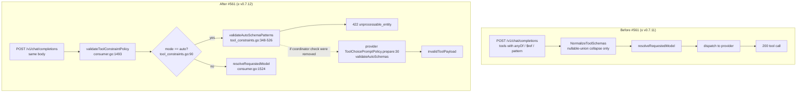

# Root cause: `tool_choice:"auto"` rejects standard JSON-Schema tool definitions for every model

> Last updated: 2026-07-31 · commit `fde284903`

Status: fixed. See the "Fix as shipped" section at the bottom.
Regression tests: `coordinator/api/auto_toolschema_regression_test.go`,
`provider-swift/Tests/ProviderCoreTests/GemmaToolConstraintTests.swift`,
`coordinator/promptsidecar/src/normalize.rs`.

## Summary

The reported 422 is real and reproduces, but the Slack diagnosis is incomplete in
three ways:

1. It is **not** an anyOf/oneOf bug. `anyOf`/`oneOf` is one of at least five
   rejection classes in the same scan; `$ref`/`$defs` (every Pydantic- or
   Zod-generated tool schema) and regex `pattern`/`patternProperties`
   (Brandon's reproduced case) are equally fatal.
2. The proposed fix — defer the scan past `resolveRequestedModel` and gate it on
   provider constrained-decoding capability — is **not sufficient**. The same
   scan exists provider-side in `ToolChoicePromptPolicy.prepare`, also
   model-blind, also shipped in v0.7.12. Gating only the coordinator moves the
   failure from a pre-dispatch 422 to a post-dispatch `invalidToolPayload`.
3. The scan has **no technical justification in `auto` mode at all**.
   `ToolConstraintFactory.make` returns `nil` for `.auto` — auto never compiles
   an inference grammar — and the post-generation validator that auto actually
   uses (`validateJSONSchema`) implements `anyOf`, `oneOf`, `allOf`, `not`,
   `pattern`, and `patternProperties` correctly.

Root cause, stated once: **#561 promoted the constrained-decoding grammar's
expressiveness limits into a global admission policy for `tool_choice:"auto"`,
on both sides of the wire, for a mode that never builds a grammar.**

## Regression window

| | |
|---|---|
| Introduced by | `613ab6043` — `feat(tools): enforce Gemma tool choices at inference (#561)`, 2026-07-22 |
| First shipped | `78701be8c` — v0.7.12 (`LatestProviderVersion` 0.7.11 → 0.7.12), same day |
| Last good | v0.7.11 |
| Reported on | v0.7.15 |

`coordinator/api/tool_constraints.go` and
`provider-swift/.../ToolConstraintValidation.swift` were both **created** by
#561 (`git log --follow`). Before it, no auto-mode tool-schema validator existed
in either process, so these schemas forwarded untouched.

## Code path



Two properties make it model-blind:

- **Ordering.** `validateToolConstraintPolicy` runs at `consumer.go:1493`;
  `resolveRequestedModel` at `consumer.go:1524`. The validator cannot know the
  model, let alone the provider's capability. Same shape in the generic handler
  (`consumer.go:3635`) covering `/v1/completions` and `/v1/messages`.
- **Gate predicate.** `validateDeclaredTools(root["tools"], enforceSchema,
  selected, mode == toolChoiceAuto)` — the auto scan is switched on by the
  *tool_choice literal alone*.

Provider-side mirror, equally model-blind:
`MultiModelBatchSchedulerEngine.swift:247` → `ToolChoicePromptPolicy.prepare` →
`case nil, .mode(.auto): try ToolConstraintValidation.validateAutoSchemas(...)`.
That is the universal per-request path for every model on the box.

## Why the scan is unjustified for `auto`

`ToolConstraintFactory.make` (`ToolConstraintFactory.swift:22-46`):

```swift
guard prepared.mode.requiresInferenceGrammar else { return nil }
switch prepared.mode {
case .auto:  return nil      // auto never constrains the sampler
case .none:  return GemmaNoToolTokenConstraint(...)
case .required, .named: ...
}
```

Auto's only schema consumer is post-generation validation in
`ToolConstraintValidation.validate`:

- `prepared.compiledTools` is built with `try?` in the auto branch. The
  compiler's keyword allowlist (`ToolConstraintSchema.swift:256-264`) excludes
  `anyOf`/`oneOf`/`pattern`/`patternProperties`/`$ref`, so any such schema fails
  to compile → `nil`.
- With `compiledTools == nil` the validator falls back to `validateJSONSchema`,
  which handles `allOf` (:197), `anyOf` (:204), `oneOf` (:211), `not` (:218),
  `patternProperties` (:262-287) and `pattern` (:367) with correct semantics.

So a multi-type union is fully supported by the code path auto actually reaches.
The pre-flight rejection is pure collateral damage.

The one class with a real argument is regex `pattern`/`patternProperties`:
`safePatternMatches` fails **closed** on non-literal patterns, so a valid model
emission would be rejected post-generation. The correct remedy is to not enforce
that assertion, not to refuse the request.
`$ref`/`if`/`dependentSchemas`/`unevaluated*` are simply ignored by
`validateJSONSchema` — under-enforcement, not breakage.

## Observed behavior (from the repro test)

Validator-level, model-blind:

| schema construct under `tool_choice:"auto"` | result |
|---|---|
| `anyOf:[{string},{object}]` (issue repro) | 422 `multi-type anyOf/oneOf unions` |
| `oneOf:[{string},{integer}]` | 422 same |
| `patternProperties:{"^[A-Z_]+$":…}` | 422 `bounded literal pattern…` |
| `pattern:"^[a-f0-9]{8}$"` | 422 same |
| `$defs` + `$ref` (Pydantic/Zod output) | 422 `schema references` |
| `if`/`then` | 422 `conditional assertions` |
| `anyOf:[{string},{null}]` | passes (null is dropped before the count) |
| same union with `tool_choice:"none"` | passes — the scan is skipped entirely |

Same union body under `model` = `gpt-oss-20b`, `gemma-4-26b`, `totally-made-up`:
identical 422. `NormalizeToolSchemas` does not rescue it — it stamps a `type` on
the parent node and leaves the `anyOf` array intact.

End-to-end over the real handler, with no provider registered: the union body
422s **before** the model/provider gates, while the tool-less control body
reaches them. That is direct proof the rejection precedes model resolution.

## Two adjacent defects found while tracing

**A. `tool_choice:"none"` requires a Gemma-class provider.**
`requiresGrammar()` returns true for `none`, which feeds
`RequestTraits.RequiresToolConstraint` → `visionToolsFailFast` →
503 `no online provider … advertises inference-time tool_choice enforcement`.
Only Gemma-4 builds with the pinned template hash advertise the capability
(`CoordinatorClientCodec.toolConstraintModelIDs`). Reproduced: a request with
`tool_choice:"none"` and **zero tools declared** 503s on `gpt-oss-20b`. There is
nothing to enforce; `prepare` already handles `none` by dropping tools and
adding an instruction.

**B. The scan/enforcement gating is exactly inverted.**
`auto` needs no grammar and gets the strictest schema scan; `none` needs a
grammar and skips the scan entirely (`enforceSchema` is
`required || named`, and `validateAutoPatterns` is `mode == auto`).

**C.** The `required`/`named` 503 in the Slack thread is expected given the
capability advertisement, but `model_unavailable` is the wrong code for a
permanent per-model incapability. It should be a 400 with a stable reason, not a
retryable 503.

## Fix as shipped

The auto scan is deleted from all three mirrors rather than gated: `auto` compiles
no grammar, so there is no grammar-feasibility question to answer at admission.

| Mirror | Removed | Kept |
|---|---|---|
| `coordinator/api/tool_constraints.go` | `validateAutoSchemaPatterns`, `validateAutoFiniteNumberIdentity`, `autoConcreteSchemaTypes`, `safeAutoSchemaPattern` and their limits | new `rejectReservedSchemaMetadata` — the client-forgery guard for `x-darkbloom-original-boolean-schema`, now covering `auto` **and** `none` (`none` previously had no guard) |
| `provider-swift/.../ToolConstraintValidation.swift` | `autoSchemaIsSupported` and its private helpers | `rejectReservedSchemaMetadata`, active only when `allowInternalSchemaMetadata == false` (the standalone-server path) |
| `coordinator/promptsidecar/src/tool_constraint.rs` | `validate_auto_tool_patterns`, `validate_auto_schema_patterns`, `raw_schema_concrete_types`, `safe_auto_schema_pattern`, `auto_finite_number_identity_is_exact` | nothing new — the sidecar receives the already-normalized body, where the marker is legitimate |

Both metadata walks are depth-bounded and, on exceeding the bound, stop descending
instead of rejecting: the guard must never fail a schema for anything but the marker.
They also walk schema *positions* only, so a tool that declares a property literally
named after the marker is not mistaken for a forgery.

Post-generation validation, `ToolConstraintValidation.validateJSONSchema`:
`safePatternMatches -> Bool` became `patternAssertionSatisfied -> Bool?`. `nil` means
"cannot evaluate", and only a decisive `false` may reject. An undecidable
`patternProperties` key additionally suppresses the `additionalProperties` fallback
for that property, so `additionalProperties: false` plus an unevaluatable regex can
no longer reject a valid call. An over-count of `patternProperties` degrades to
not-enforced instead of rejecting.

`tool_choice:"none"`: `requiresGrammar()` is now `required || named`.
`ToolConstraintFactory.make` returns `nil` for `.none` off the pinned Gemma contract
instead of throwing, and the engine's multimodal guard admits `.none`. A
Gemma-capable provider still installs `GemmaNoToolTokenConstraint`; everyone else
honors `none` by hiding the tools and rejecting any emitted call after generation.

Capability error: `visionToolsFailFast` returns 400 `invalid_request_error`
(`param: tool_choice`) when the fleet serves the model but no build enforces
`tool_choice`, and keeps the 503 `model_unavailable` only when nothing serves the
model. Owner-scoped routing (self-route / prefer) is not expressible as a serial set
there, so those paths stay on the conservative 503.

Unchanged: `required`/`named` keep their fail-closed compile-time validation in all
three languages. Every construct in the table above still 422s under `required`.

### Rollout note

Providers on v0.7.12–v0.7.15 still carry the provider-side scan. Until the fleet
updates, a union/`$ref` schema that now clears coordinator admission is rejected by
a stale provider with `invalidToolPayload`. That maps to HTTP 400, which
`isTerminalClientErrorCode` (coordinator/api/dispatch.go:702) treats as a
deterministic client-shape rejection — returned once, no failover, no reputation
damage. So the worst case during rollout is the same failed request with a different
message; it self-heals as providers update.

## Review follow-ups (PR #603)

Codex review surfaced five gaps in the first cut; all five were verified real and fixed:

1. **Normalization vs post-generation validation.** `NormalizeToolSchemas` stamps a
   render `type` (first union branch / first finite value / `"string"` for `$ref`-only
   nodes) and COLLAPSES multi-concrete `type` arrays, so the provider's validator was
   enforcing constraints the author never wrote. Fixes: multi-concrete arrays now mirror
   their members into `anyOf` (all three normalizers; `["x","null"]` pairs byte-identical
   to before, parity vectors untouched); the Swift validator treats `$ref`-bearing nodes
   as not-asserted, and a satisfied `anyOf`/`oneOf` or matched `const`/`enum` suppresses
   the sibling render type (`allOf` stays conjunctive).
2. **`tool_choice:"none"` version floor.** Tool-hiding shipped in v0.7.10
   (`ToolChoicePromptPolicy`, #538) but prod routes ≥0.7.5. A tools-declaring `none`
   request now routes only to ≥0.7.10 (`toolChoiceNonePromptPolicyFloor`), and the
   consumer fail-fast uses `HasToolCapableProviderForTraits` so a whole pool below the
   floor 503s instead of dying in the queue.
3. **Previously unenforced keywords.** `if`/`then`/`else`, `dependentRequired`,
   `dependentSchemas`, `propertyNames` are now enforced post-generation (decidable from
   the instance alone). `unevaluated*`/`contentSchema` stay not-asserted, and the code
   comments now say exactly that.
4. **400 vs 503.** The permanent-incapability 400 additionally requires
   `!HasProviderAdvertisingToolConstraint` — an advertisement-only scan that ignores
   trust/freshness — so a trust-lapsed enforcing fleet stays a retryable 503.
5. **Reserved-metadata fold window.** The guards now scan to the normalizer's own
   traversal budget and FAIL CLOSED beyond it (Go: `maxToolSchemaDepth` = 64; Swift:
   walk bound with rejection). Previously a forged marker at depth 33–63 escaped the
   32-deep fail-open walk and `constantMarkedCombinator` folded it into shallow,
   coordinator-vouched metadata.
