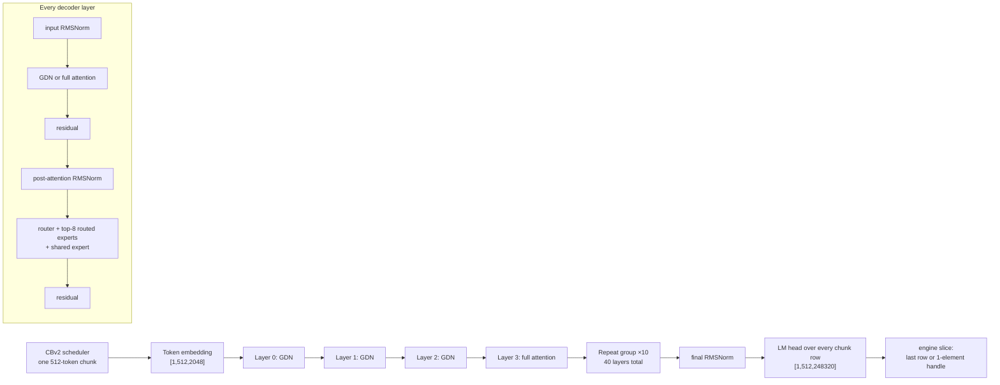
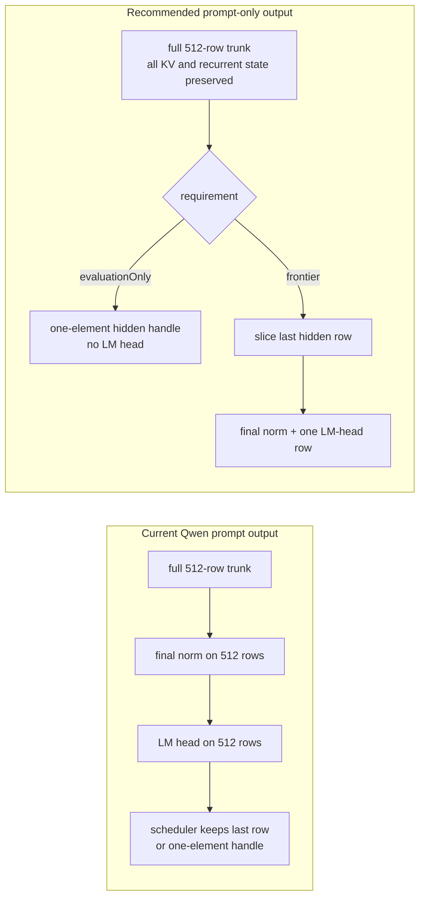
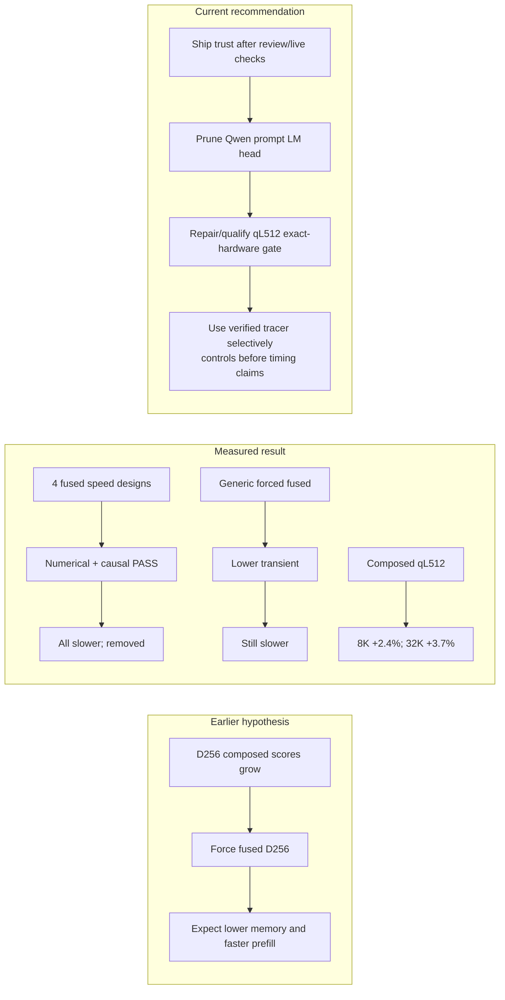
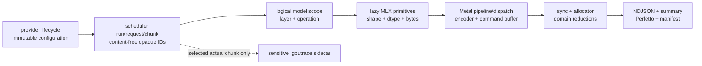

# Qwen3.6 35B-A3B Prefill Metal-Trace Investigation — 2026-08-18

> Last updated: 2026-08-18 · commit `5d400cf75`

## Evidence notation and status

The baseline investigation and linked-PR status freeze at the 2026-08-18 cutoff.
Section 22 adds explicitly labeled 2026-08-19 local diagnostic evidence without
rewriting those baseline measurements. The report does not silently promote an
estimate or perturbative diagnostic value into a baseline measurement.

- **[M] Measured** — emitted by the benchmark or extracted from the named Metal
  System Trace artifact.
- **[S] Source-derived** — calculated from the checked-in source, the exact model
  artifact configuration, or an exact linked pull request.
- **[I] Inference** — an interpretation consistent with the evidence, but not a
  directly timed operator or kernel.
- **[U] Unavailable** — the chosen trace did not record this evidence.
- **[L-S] Local source-derived** — read from the complete, validated local
  diagnostic-tracer implementation. It is uncommitted, has no PR, and is not shipped.
- **[V] Local validation** — emitted by the named local test or build gate.
- **[D-M] Diagnostic measurement** — emitted by the named structured diagnostic
  trace or scoped GPU capture. Diagnostic instrumentation is perturbative, so
  these timings never replace or extend the baseline **[M]** timing series.

A table whose caption says **[M]** contains measured values unless an individual
cell says otherwise. Calculated rates and ratios in such a table are marked
**[S-from-M]**: arithmetic over measurements, not new measurements.

The structured diagnostic files and report text exclude prompt text, token IDs,
raw pointers, user identifiers, secrets, and private request content.
Home-directory paths use `$HOME` deliberately; expand it on the capture host.
The selected `.gputrace` has a different, sensitive/replayable privacy boundary.

---

## Executive summary

1. **[M] Cold scheduler-prefill TTFT rises from 6.407 s at 8K to 92.122 s at
   64K.** Per-prefill-token time rises from 0.7822 to 1.4057 ms, so doubling
   context increasingly costs more than 2x. The four runs were release,
   contiguous-KV, prefix-cache-nil, `maxTokens=1`, one measured iteration per
   size, and 512-token CBv2 chunks.
2. **[M with inferred phase boundary] The target process is GPU-active for
   93.08%–95.87% of the 8K–32K measured window.** This establishes that the
   window is overwhelmingly GPU-active. It does **not** divide that time among
   attention, Gated DeltaNet (GDN), MoE, or the LM head.
3. **[M] Roughly 47% of command buffers in the same windows contain no encoder.**
   Counts grow from 4,375 total / 2,069 empty at 8K to 25,898 / 12,042 at 32K.
   **[I]** The expert-descriptor readback in the non-trust path is a credible
   contributor because source and PR evidence identify about 120 drains per
   512-token chunk, but the default trace contains no explicit synchronization
   reasons. The trace cannot prove that attribution.
4. **[S] Useful logical matrix work changes character with length.** Routed
   experts plus GDN projections are 61.5% of the stated logical work at 8K;
   causal full-attention QK+AV grows from 10.2% at 8K to 47.7% at 64K. The
   aggregate logical rate remains about 8.0–8.5 TFLOP/s. These are logical FLOP
   shares, **not GPU-time shares**; recurrence, convolution, normalization,
   routing/sort, masks, softmax, copies, and other work are omitted.
5. **[S] The largest newly identified model-level waste is the Qwen LM head.**
   Every 512-token chunk projects `[1,512,248320]` BF16 logits (242.5 MiB), then
   the engine consumes only the last row—and on intermediate chunks only a
   one-element graph handle from that row. At 8K this is 8.33 TFLOP and 3.79 GiB
   of logical output writes; at 64K it is 66.66 TFLOP and 30.31 GiB. Qwen lacks
   Gemma's prompt-only output-narrowing conformance, while the engine already has
   the exact contract needed to add it.
6. **[S, PR evidence] Existing speed work materially changes the next step.**
   [#617](https://github.com/Layr-Labs/d-inference/pull/617) shipped E=256 expert
   tiles and fused gate/up, but provider v0.8.5 from
   [#627](https://github.com/Layr-Labs/d-inference/pull/627) still defaults to
   `MLX_GATHER_QMM_EXPERT_SLICES=1`, retaining the descriptor readback.
   [#638](https://github.com/Layr-Labs/d-inference/pull/638) was open at the
   cutoff to make trust the serving default. It must pass review and two live
   post-merge launch/default/escape checks.
7. **[S, PR measurements] Forced fused D256 attention is no longer the speed
   recommendation.** Four numerical/causal-correct fused designs lost and were
   removed. The forced generic fused arm used less transient memory but was
   slower. The qualified winner in open
   [#640](https://github.com/Layr-Labs/d-inference/pull/640) is the existing
   composed path with qL=512 on the exact tested M4 Max configuration: +2.4% at
   8K and +3.7% / 1.22 s at 32K. #640 remained dirty with four unaddressed
   review findings at the cutoff.
8. **[L-S, V] The local content-free diagnostic tracer is implemented and
   validated.** It correlates scheduler chunks, logical model stages, lazy MLX
   primitives, Metal dispatch, command buffers, synchronization, and allocation
   events in summary, selected, and full modes. `DiagnosticTraceTests` passed
   31/31 and the provider release build passed. The code remains local and
   uncommitted, has no PR, was not active in the baseline measurements above,
   and must not be described as merged or shipped.
9. **[D-M] A complete current-revision 64K diagnostic trace and one successful
   scoped final-chunk GPU capture now exist.** The structured trace has 332,157
   records, 9,849,163 intentional mode omissions, and zero drops, failures, open
   scopes, or capacity exhaustion. Its TTFT was 357,254.781 ms, versus the
   authoritative 92,122.223 ms baseline: that difference demonstrates severe
   diagnostic perturbation, not a performance regression. The selected
   `.gputrace` is about 93.76 GB and sensitive/replayable; it is semantic and
   scoped-capture evidence, not a latency sample.

The actionable order is: finish and live-check #638; implement Qwen prompt LM-head
narrowing using the existing Gemma contract; repair/review #640 without making
forced fused automatic; then use the now-qualified local tracer selectively to
test specific dispatch, synchronization, and allocation hypotheses. Any speed
decision still requires a separate same-revision, no-tracer control.

---

## 1. Question and method

### 1.1 Question

The investigation asks where Qwen3.6 35B-A3B cold prefill work goes at 8K, 16K,
32K, and 64K, and which next changes have evidence strong enough to prioritize.
There are two deliberately separate answers:

- **[M] Aggregate execution evidence:** TTFT, target-process GPU-active union,
  command-buffer counts, and `MTLDevice.currentAllocatedSize` samples.
- **[S] Logical-work evidence:** exact model shapes and operator formulas from
  the Qwen source and artifact configuration.

**[U] Kernel or model-stage milliseconds are not available.** The Metal System
Trace template used here has no shader timeline rows, counter profile, tensor
shapes, layer IDs, or explicit synchronization reasons. Logical-work shares must
not be relabeled as time shares.

### 1.2 Benchmark path

**[S]** `darkbloom benchmark --scheduler-prefill` constructs the production CBv2
serving model and engine, with `maxConcurrentRequests: 1`
(`provider-swift/Sources/ProviderBenchmark/SchedulerPrefillBenchmark.swift:181-228`).
It submits a temperature-zero request with `maxTokens: 1`, measures from submit to
first output, and divides by `promptTokens - 1`
(`SchedulerPrefillBenchmark.swift:230-262`). The benchmark documentation states
that the prefix-cache factory input defaults to nil and each iteration is cold
prefill (`SchedulerPrefillBenchmark.swift:54-60`). A 128-token warm-up runs before
the recorded matrix and is not a sample (`SchedulerPrefillBenchmark.swift:122-157`).
After each sample the engine shuts down, synchronizes, and clears the MLX cache
(`SchedulerPrefillBenchmark.swift:255-270`).

**[S]** CBv2's default preferred prefill chunk is 512 tokens
(`libs/mlx-swift-lm/Libraries/MLXLMCommon/ContinuousBatchingV2/CBv2Contracts.swift:687-704`),
and the scheduler caps running prefill assignments at that size
(`libs/mlx-swift-lm/Libraries/MLXLMCommon/ContinuousBatchingV2/SchedulerV2.swift:362-370`). All four measured prompt lengths are exact
multiples of 512.

### 1.3 What TTFT contains

**[S]** The benchmark's TTFT is submit-to-first-output, not a GPU-kernel timer.
It includes scheduler/graph/evaluation/first-sample overhead around the cold
prefill. It excludes later decode because `maxTokens=1`. The reported
`msPerPrefillToken` denominator is `L-1`, exactly as implemented at
`SchedulerPrefillBenchmark.swift:252-262`.

---

## 2. Exact environment

### 2.1 Model and runtime

**Evidence: [M] benchmark JSON plus [S] artifact configuration.**

| Item | Exact value | Evidence |
|---|---|---|
| Model ID | `EigenLabs/Qwen3.6-35B-A3B-MLX-VL-4bit-g64-router8-mtp` | [M] all four JSON reports |
| Artifact | `$HOME/.cache/huggingface/hub/models--EigenLabs--Qwen3.6-35B-A3B-MLX-VL-4bit-g64-router8-mtp/snapshots/baseline-work` | [M] `modelPath` in all reports |
| Binary | `provider-swift/.build/release/darkbloom` | [M] capture wrapper |
| Engine | production ContinuousBatchingV2 scheduler prefill | [S] `SchedulerPrefillBenchmark.swift:181-228` |
| KV | selection `contiguous`, resolved `contiguous` | [M] all reports |
| Prefix cache | nil / not constructed | [S] `SchedulerPrefillBenchmark.swift:54-60` |
| Concurrency | one request | [S] `SchedulerPrefillBenchmark.swift:218-223` |
| Output | temperature 0, `maxTokens=1` | [S] `SchedulerPrefillBenchmark.swift:230-237` |
| MTP activation | not recorded by scheduler-prefill schema 2 | [U] do not infer activation from the artifact name; this report attributes cold prompt work only |
| Prompt chunks | fixed 512 tokens | [S] `CBv2Contracts.swift:687-704`; `SchedulerV2.swift:362-370` |
| Iterations | one measured iteration per size | [M] JSON `iterations: 1` |
| Build mode | release | [M] binary path |
| Host class | Apple Silicon M4 Max | [M] investigation host metadata; no kernel counters were enabled |
| Exact source revision | unavailable in benchmark JSON | [U] do not infer from nearby PR branches |

The exact artifact text configuration is the controlling geometry, not the
struct defaults: hidden 2,048; 40 layers; full attention every fourth layer;
head dimension 256; 16 query heads and two KV heads; 256 experts, top-8; routed
and shared intermediate width 512; vocabulary 248,320; BF16 activations
(`$MODEL/config.json:738-827`). The artifact uses affine 4-bit, group-size-64
quantization by default, with 8-bit router overrides
(`$MODEL/config.json:87-105` and repeated per-layer entries).

### 2.2 Effective optimization environment

**Evidence: [M] exact JSON reports.**

| Variable | Effective value | Meaning for this run |
|---|---:|---|
| `DARKBLOOM_GEMMA4_PREFILL_CHUNK_EVAL` | `18` | retained production optimization projection; not the focus of this Qwen attribution |
| `MLX_GEMMA4_FUSED_WEIGHTED_UNSORT` | `1` | weighted routed-expert path on |
| `MLX_GATHER_QMM_EXPERT_SLICES` | **`1`** | expert-tile route on, descriptor readback/drain retained; **not `trust`** |

**[S]** Serving projection maps the config-backed optimization pair to these
low-level variables and preserves `trust` only when explicitly exported in the
current shipped implementation
(`provider-swift/Sources/ProviderCore/Config/GemmaOptimizationEnvironment.swift:28-58`).
The config defaults the coupled optimization on
(`provider-swift/Sources/ProviderCore/Config/GemmaOptimizationSettings.swift:1-35`).

### 2.3 Capture posture

**[M]** Traces use Apple's **Metal System Trace** template. The table of contents
records GPU counter profile `0` and shader profiler `0`; see
`$TRACE/qwen36-prefill-8192-toc.xml:239-246`. The trace target received a
source-matched release `mlx.metallib`. No local diagnostic-tracer environment was
active for these results.

---

## 3. Artifacts and integrity

Define:

```bash
export MODEL="$HOME/.cache/huggingface/hub/models--EigenLabs--Qwen3.6-35B-A3B-MLX-VL-4bit-g64-router8-mtp/snapshots/baseline-work"
export TRACE="$HOME/Library/Caches/darkbloom/traces/qwen36-prefill-20260818"
```

**Evidence: [M].** Sizes are bundle sizes observed after capture finalization.

| Length | Benchmark JSON | Trace bundle | Bundle size | Integrity | Permitted use |
|---:|---|---|---:|---|---|
| 8,192 | `qwen36-prefill-8192.json` | `qwen36-prefill-8192.trace` | 280 MiB | complete; exports succeeded | timing, GPU union, CBs, allocation |
| 16,384 | `qwen36-prefill-16384.json` | `qwen36-prefill-16384.trace` | 363 MiB | complete; exports succeeded | timing, GPU union, CBs, allocation |
| 32,768 | `qwen36-prefill-32768.json` | `qwen36-prefill-32768.trace` | 767 MiB | complete; exports succeeded | timing, GPU union, CBs, allocation |
| 65,536 | `qwen36-prefill-65536.json` | `qwen36-prefill-65536.trace` | 30 MiB | **incomplete/malformed**; finalization still active after >30 minutes and was interrupted at operator request; `xctrace export` says run data missing, exit 10 | **timing JSON only** |

The 64K inference itself completed and its benchmark JSON is valid. The trace
bundle is not complete and must not support GPU-active, command-buffer, memory,
shader, or counter conclusions.

Existing exports include `*-toc.xml`, `*-gpu.xml`, `*-command-buffers.xml`, and
`*-memory.xml` for the complete runs. The 8K directory also contains process,
Metal-application, driver-thread, and shader exports; the shader export contains
no usable shader timeline rows. These exports are derivative convenience files;
the `.trace` bundles and JSON reports are the primary artifacts.

---

## 4. Measured timing and scaling

### 4.1 Results

**Evidence: [M] JSON; throughput and ratios are [S-from-M].** Throughput is the
inverse of the benchmark's `msPerPrefillToken`.

| Prompt tokens | 512-token chunks [S] | TTFT ms [M] | ms/prefill token [M] | Prefill tok/s [S-from-M] | TTFT vs previous [S-from-M] |
|---:|---:|---:|---:|---:|---:|
| 8,192 | 16 | 6,406.824542 | 0.7821786 | 1,278.6 | — |
| 16,384 | 32 | 14,006.657000 | 0.8549507 | 1,169.7 | 2.186x |
| 32,768 | 64 | 35,075.830416 | 1.0704621 | 934.2 | 2.504x |
| 65,536 | 128 | 92,122.223333 | 1.4056950 | 711.4 | 2.626x |

Relative to 8K, per-token time is +9.3% at 16K, +36.9% at 32K, and +79.7% at
64K **[S-from-M]**. This is one sample at each size under tracing, not a latency
distribution or tail statistic.

### 4.2 Scaling interpretation

- **[S]** Routed MoE, shared/router, GDN projections, full-attention projections,
  and LM-head work are affine in prompt length.
- **[S]** Useful causal full-attention QK+AV work grows approximately with
  `L²`, so its logical share rises from 10.2% at 8K to 47.7% at 64K.
- **[I]** The increasing attention share explains much of the superlinear TTFT
  shape without requiring a claim that the GPU becomes less efficient.
- **[S-from-M]** Aggregate logical work divided by TTFT is 8.39, 8.46, 8.01,
  and 8.01 TFLOP/s. The flatness supports the work-mix explanation, but this is
  not hardware FLOP-counter evidence and not a roofline result.

---

## 5. GPU activity

**Evidence: [M] GPU interval union inside an [I] inferred measured-window
boundary.** The boundary was reconstructed by taking the final target-process
GPU interval and looking backward by benchmark TTFT because the baseline had no
scheduler signposts.

| Prompt | TTFT window [M] | Target GPU-active union [M] | Active fraction [S-from-M] | Trace status |
|---:|---:|---:|---:|---|
| 8K | 6.406825 s | 5.998232871 s | 93.62% | complete |
| 16K | 14.006657 s | 13.428325892 s | 95.87% | complete |
| 32K | 35.075830 s | 32.649189449 s | 93.08% | complete |
| 64K | — | — | **[U]** | malformed trace |

What this establishes: the target is issuing or executing GPU work for almost the
entire reconstructed prefill window. What it does **not** establish: occupancy,
ALU utilization, bandwidth utilization, stage identity, or which overlapping
interval owns a millisecond.

Because the phase boundary is inferred rather than signposted, the percentages
should be read as process-filtered aggregate evidence, not nanosecond-accurate
scheduler-stage boundaries.

---

## 6. Command buffers and dispatch pressure

**Evidence: [M] process-filtered command-buffer export inside the same inferred
window; per-chunk values and percentages are [S-from-M].** “Empty” means no
encoder row was associated with that command buffer in the export. It does not
mean the buffer has zero CPU cost or identify why it exists.

| Prompt | Total CBs [M] | Empty CBs [M] | CBs with encoders [M] | Empty share | Total CB/chunk | Encoded CB/chunk |
|---:|---:|---:|---:|---:|---:|---:|
| 8K | 4,375 | 2,069 | 2,306 | 47.29% | 273.4 | 144.1 |
| 16K | 10,444 | 5,014 | 5,430 | 48.01% | 326.4 | 169.7 |
| 32K | 25,898 | 12,042 | 13,856 | 46.50% | 404.7 | 216.5 |
| 64K | **[U]** | **[U]** | **[U]** | **[U]** | **[U]** | **[U]** |

**[I]** Two mechanisms plausibly contribute to growth:

1. Longer-history composed attention creates more work and dispatches per later
   chunk.
2. `MLX_GATHER_QMM_EXPERT_SLICES=1` retains a descriptor readback. The C++
   comment and #638 describe about 120 stream drains per 512-token chunk as
   three routed gathers × 40 layers
   (`libs/mlx-swift/Source/Cmlx/mlx/mlx/backend/metal/quantized.cpp:1281-1301`).

**[S review discrepancy]** The current Qwen target source also says fused
gate/up is served by **one** gather (`Qwen35.swift:851-868`), and the down
projection is the second gather (`libs/mlx-swift-lm/Libraries/MLXLMCommon/SwitchLayers.swift:449-467`).
That topology suggests 80 descriptor checks per chunk, not the legacy split
gate/up/down count of 120, unless another reachable route adds checks. The
baseline trace has no synchronization reasons with which to reconcile the
difference. Therefore “~120” is recorded here as the C++ comment/#638 claim,
not an established count for this fused artifact; #638 review should correct or
explain it.

**[D-M postscript]** Selected final chunk 127 records 80 routed gathers, 80
expert descriptors, and 80 synchronization begin/end pairs. That observed
selected-chunk count is consistent with the fused two-gather topology and does
not support the legacy “~120” count for this chunk. It still does not identify
which baseline empty command buffers, if any, came from expert drains, nor does
it turn the diagnostic synchronization duration into expert-specific time.

---

## 7. Allocation evidence

Apple defines `MTLDevice.currentAllocatedSize` as the total bytes the device is
using for all of its resources
([Apple documentation](https://developer.apple.com/documentation/metal/mtldevice/currentallocatedsize)).
It is not a byte-traffic counter and not a direct measurement of physically live
resident pages.

**Evidence: [M] samples inside the inferred window; deltas are [S-from-M].**

| Prompt | Baseline/min GiB | Max/end GiB | Delta from baseline GiB | Interpretation |
|---:|---:|---:|---:|---|
| 8K | 19.0036 | 21.5282 | 2.5246 | allocation/cache-retention envelope only |
| 16K | 19.0036 | 24.8051 | 5.8015 | allocation/cache-retention envelope only |
| 32K | 19.0036 | 37.5353 | 18.5317 | allocation/cache-retention envelope only |
| 64K | **[U]** | **[U]** | **[U]** | malformed trace |

**[I]** The monotonic end values are compatible with MLX cache retention plus
larger KV/temporary requirements at longer context. They do not show which
operator owns the bytes. They also must not be used as memory bandwidth or
allocation-churn totals.

The LM-head output figures later in this report are **logical output bytes per
chunk**, not an assertion that all those bytes coexist in `currentAllocatedSize`.
Lazy evaluation and allocator reuse can make logical writes and retained
allocation diverge substantially.

---

## 8. Architecture and operator walkthrough

### 8.1 Exact text-tower structure

**Evidence: [S] artifact config and source.**

- Hidden width 2,048, 40 layers, BF16 activations.
- Layers repeat `GDN, GDN, GDN, full attention`; therefore 30 GDN layers and ten
  full-attention layers (`$MODEL/config.json:745-790`). The source independently
  selects a linear layer when `(layerIndex + 1) % fullAttentionInterval != 0`
  (`libs/mlx-swift-lm/Libraries/MLXLLM/Models/Qwen35.swift:909-929`).
- Full attention: 16 query heads, two KV heads, head dimension 256, GQA factor 8
  (`$MODEL/config.json:745-748,803-807`).
- GDN: 16 key heads × 128, 32 value heads × 128, convolution width 4, FP32 SSM
  state (`$MODEL/config.json:792-798`).
- MoE in every layer: 256 routed experts, top-8, routed width 512, shared width
  512 (`$MODEL/config.json:800-806,823-824`).
- Vocabulary 248,320 and untied embeddings (`$MODEL/config.json:825-827`).

The source configuration decodes these fields and derives the head dimension when
needed (`Qwen35.swift:21-87,89-169`). CBv2 stores attention KV only for the ten
full-attention layers and gives the 30 recurrent layers request-owned convolution
and FP32 SSM state (`Qwen35.swift:171-205`).

### 8.2 Per-chunk flow

**Evidence: [S].**



`Qwen35DecoderLayer` applies input norm, either GDN or full attention, a residual,
post-attention norm, MoE, and the second residual
(`Qwen35.swift:907-1033`). The model iterates all 40 layers
(`Qwen35.swift:1038-1139`), then applies final norm and the vocabulary head
(`Qwen35.swift:1344-1363`).

### 8.3 Where work goes—what can and cannot be said

- **[M]** 93%–96% GPU-active union says the aggregate window is GPU-dominated.
- **[S]** At 8K, routed experts and GDN projections are the two largest stated
  logical matrix categories; at 64K, useful attention QK+AV is the largest.
- **[S]** The LM head is a material 9.0%–15.5% of the stated logical total and
  almost all prompt-row outputs are unused.
- **[U]** No operator has a measured GPU-time percentage in this investigation.
  A statement such as “GDN takes 30.8% of time” would be fabricated.

---

## 9. Detailed logical-work derivation

### 9.1 Counting convention

**Evidence: [S].** A matrix multiplication `[M,K] × [K,N]` is counted as
`2MKN` FLOP (multiply plus add). Per-token affine work uses `M=1`. Quantized
weights change storage and kernel behavior, not the logical dense multiply-add
count. Top-8 routed work counts eight selected experts per token.

The attention QK+AV category uses the dominant useful-causal convention

```text
F_attention(L) ≈ 2 × Hq(16) × D(256) × 10 layers × L²
```

which counts the useful triangular QK and AV payload to leading order. It omits
the lower-order diagonal term and query-block masked excess. It is therefore a
logical asymptotic payload, not exact dispatched Metal instructions.

### 9.2 Per-input-token affine work

**Evidence: [S] exact shapes from `$MODEL/config.json:738-827` and constructors in
`Qwen35.swift:240-277,618-647,840-875,1142-1170`.**

| Category | Derivation | GFLOP/input token |
|---|---|---:|
| Routed experts | `40 × top8 × [2×2048×512 gate + 2×2048×512 up + 2×512×2048 down]` | 2.01326592 |
| Shared expert + routers | `40 × [3×(2×2048×512) + 2×2048×256 + 2×2048×1]` | 0.29376512 |
| GDN projections | `30 × {2×2048×(8192 qkv + 4096 z + 32 b + 32 a) + 2×4096×2048 out}` | 2.02113024 |
| Full-attention projections | `10 × {2×2048×(8192 gated-Q + 512 K + 512 V) + 2×4096×2048 O}` | 0.54525952 |
| LM head | `2×2048×248320` | 1.01711872 |

The routed gate/up implementation is fused at the module level, but fusion does
not change the logical FLOP count. `Qwen35SparseMoeBlock` builds the fused
`SwitchGLU`, computes precise-softmax routing and top-k selection, evaluates
routed experts, and adds the gated shared expert
(`Qwen35.swift:840-904`).

### 9.3 Logical totals by prompt length

**Evidence: [S].** Values are rounded to two decimals; percentages are shares of
the stated total only.

| Prompt | Total TF | Routed experts TF / % | Shared+router TF / % | GDN projections TF / % | Attn projections TF / % | LM head TF / % | QK+AV TF / % |
|---:|---:|---:|---:|---:|---:|---:|---:|
| 8K | 53.75 | 16.49 / 30.7% | 2.41 / 4.5% | 16.56 / 30.8% | 4.47 / 8.3% | 8.33 / 15.5% | 5.50 / 10.2% |
| 16K | 118.50 | 32.99 / 27.8% | 4.81 / 4.1% | 33.11 / 27.9% | 8.93 / 7.5% | 16.66 / 14.1% | 21.99 / 18.6% |
| 32K | 280.98 | 65.97 / 23.5% | 9.63 / 3.4% | 66.23 / 23.6% | 17.87 / 6.4% | 33.33 / 11.9% | 87.96 / 31.3% |
| 64K | 737.89 | 131.94 / 17.9% | 19.25 / 2.6% | 132.46 / 18.0% | 35.73 / 4.8% | 66.66 / 9.0% | 351.84 / 47.7% |

**Evidence: [S-from-M].**

| Prompt | Logical total TF [S] | TTFT s [M] | Aggregate logical TFLOP/s |
|---:|---:|---:|---:|
| 8K | 53.75 | 6.4068 | 8.39 |
| 16K | 118.50 | 14.0067 | 8.46 |
| 32K | 280.98 | 35.0758 | 8.01 |
| 64K | 737.89 | 92.1222 | 8.01 |

### 9.4 Explicit omissions

**[S/U]** The total does not count GDN recurrence math, depthwise convolution,
RMS norms, sigmoid/SiLU, RoPE, routing softmax/arg-partition/sort, score masks,
precise attention softmax, concatenation/slicing/copies, KV writes, descriptor
construction, synchronization, or sampling. Some are substantial. The table is
not a complete operation count and cannot be compared directly to a device peak.

---

## 10. Full attention: why D256 is composed and why the recommendation changed

### 10.1 Projection and cache path

**Evidence: [S].** Each full-attention layer projects a gated Q output of 8,192
features, K and V of 512 each, applies Q/K normalization and RoPE, updates the
layer cache, attends, gates the output, and applies O projection
(`Qwen35.swift:602-719`). The ten attention caches correspond to every fourth
model layer (`Qwen35.swift:171-185,921-929`).

### 10.2 D256 dispatch

**Evidence: [S].** For query length greater than eight, MLX's fused “full” SDPA
accepts only equal Q/V head dimensions 64, 80, or 128. D256 is accepted only by
the short-query vector family. Therefore Qwen prefill with qL>8 falls back
(`libs/mlx-swift/Source/Cmlx/mlx/mlx/backend/metal/scaled_dot_product_attention.cpp:591-639`).

The fallback is composed as:

1. scale Q;
2. QK matrix multiplication;
3. apply causal/array mask;
4. precise softmax;
5. AV matrix multiplication.

That sequence is canonical at
`libs/mlx-swift/Source/Cmlx/mlx/mlx/fast.cpp:718-820`.

### 10.3 Query blocking and score tensor

**Evidence: [S].** CBv2 defaults to qL=128 blocks for multi-token prompt
attention; zero disables blocking (`libs/mlx-swift-lm/Libraries/MLXLMCommon/ContinuousBatchingV2/AttentionV1.swift:25-49`).
For each block it slices Q and only the K/V prefix visible to that block, then
calls SDPA and concatenates block outputs (`AttentionV1.swift:556-653`). The
ordinary single-call terminal is `MLXFast.scaledDotProductAttention`
(`AttentionV1.swift:667-701`).

At the final block, the BF16 score tensor is logically
`[1,16,128,L]`, giving:

**Evidence: [S].**

| Final context | Logical final score-block bytes |
|---:|---:|
| 8K | 32 MiB |
| 16K | 64 MiB |
| 32K | 128 MiB |
| 64K | 256 MiB |

This is the size of one logical composed score block, not a claim about peak
`currentAllocatedSize` or simultaneous allocation across layers.

### 10.4 #640 evidence and changed recommendation

**Evidence: [S, exact PR measurements].** Open
[#640](https://github.com/Layr-Labs/d-inference/pull/640) tested the same
production CBv2 shape on an exact qualified M4 Max configuration:

| Prompt | qL128 control | Qualified composed qL512 | Improvement |
|---:|---:|---:|---:|
| 8K | 6,206.8 ms | 6,056.6 ms | 2.4% |
| 32K | 32,879.5 ms | 31,660.9 ms | 3.7% / 1.22 s |

qL512 added 40.6 MiB transient at 32K. The explicit generic fused D256 arm used
1.668 GiB transient versus 1.974 GiB for the compared composed arm (−15.5%) but
was slower. Four specialized fused designs—Q8 head-sharded, Q32/D128-sharded,
two-head GQA, and eight-head GQA—passed numerical and causal gates, lost on
speed, and were removed.

Therefore:

- **[S] Speed default:** qualified composed qL512 on the exact tested hardware.
- **[S] Compatibility default elsewhere:** historical qL128.
- **[S] Memory escape arm:** forced fused may remain explicit and opt-in.
- **[I, rejected]** Do not make forced fused automatic merely because it is
  bounded-memory; measured speed evidence is negative.

#640 was still **DIRTY** at the cutoff with four unaddressed review findings:
40-GPU-core qualification, exact D256 qualification, benchmark reporting of the
selected arm/block width, and report code citations. Its dependency chain is
[mlx#8](https://github.com/Layr-Labs/mlx/pull/8) →
[mlx-c#4](https://github.com/Layr-Labs/mlx-c/pull/4) →
[mlx-swift#13](https://github.com/Layr-Labs/mlx-swift/pull/13) →
[mlx-swift-lm#109](https://github.com/Layr-Labs/mlx-swift-lm/pull/109); #109 was
open and clean at the cutoff.

The #640 no-trace controls differ in revision/environment from this Metal-trace
run. They are independent optimization evidence, not a clean estimate of
`xctrace` overhead.

---

## 11. Gated DeltaNet

### 11.1 Projection work

**Evidence: [S].** Each of the 30 GDN layers computes:

- `in_proj_qkv`: 2,048 → 8,192;
- `in_proj_z`: 2,048 → 4,096;
- `in_proj_b`: 2,048 → 32;
- `in_proj_a`: 2,048 → 32;
- `out_proj`: 4,096 → 2,048.

The dimensions are constructed at `Qwen35.swift:217-277`, and the CBv2 path
executes those projections, gathers request-owned recurrent state, runs the
shared chunk processor, stages new state, normalizes/gates, and projects out at
`Qwen35.swift:431-483`. Projection-only logical work is 2.02113024 GFLOP per
input token across 30 layers.

### 11.2 Sequential recurrence

**Evidence: [S].** The custom Metal kernel loads recurrent state into FP32 local
state and loops `t = 0 ..< T` sequentially, updating decay, delta, state, and
output before advancing input pointers
(`libs/mlx-swift-lm/Libraries/MLXLLM/Models/GatedDelta.swift:23-97`). The launch
shape and output shapes are defined at `GatedDelta.swift:128-175`. The public
entry point computes beta/decay in FP32, creates or converts the recurrent state
to FP32, and chooses the Metal kernel when available
(`GatedDelta.swift:279-317`).

**[I]** This sequential-in-T kernel is an important diagnostic target because
later chunks still process 512 recurrent steps in each of 30 layers, but no
current trace evidence assigns it a duration. The source-derived projection
share excludes recurrence and convolution, so the GDN category understates total
GDN work.

---

## 12. MoE and the expert-tile path

### 12.1 Logical MoE flow

**Evidence: [S].** Every layer computes 256 router logits, precise softmax,
arg-partition top-8, optional score renormalization, routed `SwitchGLU`, weighted
expert reduction, and a separately gated shared expert
(`Qwen35.swift:840-904`). Routed matrix shapes are:

- fused gate/up `[E=256, N=1024, K=2048]`;
- split gate or up `[256,512,2048]` when fusion is ineligible;
- down `[256,2048,512]`.

The sanitizer performs per-layer gate/up fusion when checkpoint quantization
policies permit it (`Qwen35.swift:1233-1247`).

### 12.2 Expert-tile qualification

**Evidence: [S].** The common route classifier accepts E=256, W4/g64 affine,
BF16 contiguous inputs/scales/biases, assignment counts 4,096/8,192/16,384, and
the exact Qwen fused/split/down geometries
(`libs/mlx-swift/Source/Cmlx/mlx/mlx/backend/common/gemma4_expert_qmm.h:108-170`).
The Metal tile kernel consumes per-expert descriptors, rejects over-dispatched
empty slots, and runs 32×32×32 quantized tiles
(`libs/mlx-swift/Source/Cmlx/mlx/mlx/backend/metal/kernels/quantized.h:2505-2598`).

In non-trust mode, the descriptor builder is synchronized to host so a detected
sortedness violation can fall back safely. In `trust`, the over-dispatched tile
grid consumes the device-produced count without the readback; a real sortedness
violation makes that matmul undefined instead of taking the legacy fallback
(`libs/mlx-swift/Source/Cmlx/mlx/mlx/backend/metal/quantized.cpp:1281-1338`).

### 12.3 Shipped state

**Evidence: [S, PR status].**

- Merged [#617](https://github.com/Layr-Labs/d-inference/pull/617) shipped E=256
  expert tiles, fused gate/up, the UAF-fix dependency, and preservation of an
  operator-exported `trust`. Its measured 8K result was 1,243 → 1,364 tok/s with
  tiles and safe readback, or 1,433 tok/s with trust (+15.2% vs baseline).
- Merged [#627](https://github.com/Layr-Labs/d-inference/pull/627) released that
  stack in provider v0.8.5. Tiles are on, but the serving default remains `=1`
  and therefore keeps the drain.
- Open-at-cutoff [#638](https://github.com/Layr-Labs/d-inference/pull/638) changes
  serving default to `trust`, with exact `=1` retained as the drain escape hatch.
  Its recorded test evidence was 80 Swift and 62 Python tests passed. It still
  required review and two live post-merge checks: stock launch must latch
  `trust`; explicit `=1` must restore and persist the drain escape behavior.

**[I]** Because #638 unlocks an already measured and already shipped kernel path,
it is higher-confidence than inventing another MoE kernel. It should precede new
kernel work.

---

## 13. LM head: the new high-confidence finding

### 13.1 Current behavior

**Evidence: [S].** Qwen's CBv2 positioned forward traverses the full model,
applies final norm to every hidden row, and applies the LM head to the entire
normalized tensor (`Qwen35.swift:1301-1363`). Qwen does not conform to the
prompt-only output-narrowing model contract.

The scheduler's recurrent prefill path receives those full logits and only then
narrows them to:

- `[B,1]` for an intermediate `.evaluationOnly` chunk; or
- `[B,vocab]` for the final `.lastPositionLogits` chunk.

See `libs/mlx-swift-lm/Libraries/MLXLMCommon/ContinuousBatchingV2/EngineLoopV2.swift:1831-1896`
and `EngineLoopV2.swift:1965-1974`. The general prompt contract explicitly says
intermediate chunks need no vocabulary projection and the frontier needs one
last-position vector
(`libs/mlx-swift-lm/Libraries/MLXLMCommon/ContinuousBatchingV2/PrefillOutputV2.swift:1-42`).

For this artifact, every 512-token chunk therefore creates logical logits of:

```text
[1, 512, 248320] × 2 BF16 bytes = 254,279,680 bytes = 242.5 MiB
```

Only one of 512 rows can contribute a frontier vector: 511/512 = **99.8047% rows
unused**. Intermediate chunks consume only one element from the last row as a
graph handle, so “one useful row” is already a conservative description of
waste.

### 13.2 Cumulative cost

**Evidence: [S].** Logical writes assume one full BF16 output tensor per chunk;
logical FLOPs use `2×2048×248320` per input row.

| Prompt | Chunks | LM-head logical work | Full-logits logical writes | Share of stated total |
|---:|---:|---:|---:|---:|
| 8K | 16 | 8.33 TFLOP | 3.79 GiB | 15.5% |
| 16K | 32 | 16.66 TFLOP | 7.58 GiB | 14.1% |
| 32K | 64 | 33.33 TFLOP | 15.16 GiB | 11.9% |
| 64K | 128 | 66.66 TFLOP | 30.31 GiB | 9.0% |

These are not allocation-residency or measured-time values. They are exact
logical output size and matrix-work calculations for the source path.

### 13.3 Existing proven pattern

**Evidence: [S].** The engine-level opt-in is `CBv2PrefillSteppableModel`; its
model-level adapter contract is `CBv2LanguageModelPrefillForwardable`
(`PrefillOutputV2.swift:44-102`). Gemma implements the model-level contract by:

- running the entire trunk for every token;
- returning a one-element hidden handle for `.evaluationOnly`;
- slicing the last hidden row **before** applying the LM head for
  `.lastPositionLogits`.

That implementation is canonical at
`libs/mlx-swift-lm/Libraries/MLXLLM/Models/Gemma4Text.swift:2168-2203`.

### 13.4 Recommendation

**[I grounded in S]** Create a new Qwen model-level prefill PR using the Gemma
pattern. No existing PR was found for Qwen LM-head pruning. The PR should:

1. add `CBv2LanguageModelPrefillForwardable` conformance to the Qwen text target;
2. preserve the full 40-layer trunk, every full-attention KV write, every
   recurrent-state update, positions, and causal-vision embedding path;
3. skip the LM head entirely for `.evaluationOnly` and return a small last-hidden
   handle whose graph still depends on the whole trunk;
4. for `.lastPositionLogits`, slice `hidden[...,-1,:]`, then apply final norm and
   the LM head once;
5. keep decode and MTP target verification on their existing full contracts;
6. prove frontier-logit parity and request-state/KV parity, then benchmark the
   same 8K/16K/32K/64K matrix without and with tracing.



**[S upper bound, not predicted speedup]** This removes essentially the stated
LM-head prompt-row work—15.5% of the 8K logical total and 9.0% of the 64K total—
while retaining one frontier projection. Actual TTFT gain may be smaller because
logical FLOP share is not time share.

---

## 14. Relationship to FalconGEMM

**Evidence: [S external source].**
[FalconGEMM](https://arxiv.org/html/2605.06057) is a framework for deploying and
selecting lower-complexity matrix multiplication algorithms. Its paper describes
code generation, group-parallel fusion, and a shape/hardware decision model; the
evaluation uses NVIDIA GPUs and ARM/x86 CPUs with standard floating-point/FP8
GEMM baselines, and reports prefill gains on several model workloads.

The relationship to this investigation is conceptual, not an available backend:

- **[S] Relevant idea:** Qwen prefill contains a large, stable matrix-shape
  inventory. A shape-aware decision layer is the right way to qualify an
  alternative algorithm rather than making it global.
- **[S] Mismatch:** the dominant routed path here is indexed E=256 W4/g64
  gather-QMM with device-produced expert assignments, not ordinary dense BF16 or
  FP8 GEMM. The shipped expert-tile route is already a topology-specific Metal
  solution.
- **[S] Mismatch:** this repository has no FalconGEMM integration, MLX primitive,
  Metal implementation, W4/g64 correctness path, or artifact benchmark.
- **[U]** No FalconGEMM speedup, numerical result, memory result, or compatibility
  result was measured on this Qwen artifact or M4 Max.

**[I]** FalconGEMM is a research candidate for dense affine shapes only after a
Metal/MLX prototype exists. It should not displace the immediate, source-proven
LM-head elimination or the already measured expert-trust and qL512 work. Any
prototype needs per-shape qualification, quantization compatibility, end-to-end
parity, memory accounting, and same-revision A/Bs.

---

## 15. Shipped work and PR status at the cutoff

**Evidence: [S] exact linked PRs.** “Prefill relevance” prevents decode or
consumer-streaming gains from being misattributed to cold prefill compute.

| PR | Cutoff status | What it did | Prefill relevance |
|---|---|---|---|
| [#611](https://github.com/Layr-Labs/d-inference/pull/611) | merged | shipped production Qwen VLM target + inline MTP surface in v0.8.3 | enablement and correctness; not this prefill speed attribution |
| [#614](https://github.com/Layr-Labs/d-inference/pull/614) | merged | streams Qwen reasoning deltas instead of buffering until close | improves consumer-observed TTFT semantics; does not reduce cold prefill compute |
| [#616](https://github.com/Layr-Labs/d-inference/pull/616) | merged | GDN capture-verify + target-prefix MTP | decode/speculative verification, beta-off; not cold prefill |
| [#617](https://github.com/Layr-Labs/d-inference/pull/617) | merged | E=256 expert tiles, fused gate/up, trust support, UAF-fix pins | direct prefill optimization |
| [#621](https://github.com/Layr-Labs/d-inference/pull/621) | merged-equivalent/redundant via #617 pin | single-forward MTP draft rounds | decode/speculation, not cold prefill |
| [#627](https://github.com/Layr-Labs/d-inference/pull/627) | merged | provider v0.8.5 Qwen speed-stack release | ships tiles; serving default remains safe `=1` drain posture |
| [#638](https://github.com/Layr-Labs/d-inference/pull/638) | **open, review required** | default serving expert tiles to trust; exact `=1` escape | direct prefill unlock; two live checks outstanding |
| [#640](https://github.com/Layr-Labs/d-inference/pull/640) | **open, DIRTY** | exact-hardware qL512 composed qualification + explicit fused memory arm | direct attention prefill work; four review findings outstanding |
| [#641](https://github.com/Layr-Labs/d-inference/pull/641) | merged | adaptive persistent-history MTP, about 2x decode in its canary | decode/speculation only; do not credit cold prefill |
| Qwen LM-head narrowing | **no PR found** | would project only frontier row | new direct prefill recommendation |
| Local diagnostic tracer | **postscript: validated locally; uncommitted, no PR** | content-free scheduler→MLX→Metal correlation; final 64K structured trace and selected capture complete | diagnostic only; not shipped and not a speed result |

The PR status column is intentionally frozen at the investigation cutoff; a PR
page may later show a different state. The local tracer row alone includes the
explicit 2026-08-19 postscript status because it has no PR timeline.

---

## 16. Why the recommendation changed



**[S]** Lower memory and higher speed are separate objectives. #640 proves that
the bounded-memory fused arm is useful as an explicit escape but loses the speed
selection on the measured M4 Max. **[I]** The correct policy is a qualified
composed default plus an explicit fused memory arm, not a universal fused path.

---

## 17. Verified local diagnostic tracer

### 17.1 Status boundary

**[L-S, V]** The diagnostic tracer is now implemented locally and its final
engineering gates pass: `DiagnosticTraceTests` is 31/31 and a clean provider
release build with whole-module optimization succeeds. The final source-only
modular refactor preserves the public APIs, native ABI, and diagnostic schema.
CMake registers the split C++ translation units; SwiftPM/Xcode discover the
split Swift sources. The implementation remains uncommitted, has no PR, and is
not merged or shipped. It was not active in the baseline benchmark or Metal
System Trace runs in Sections 2–7, so the baseline timing and its limitations
remain authoritative.

The current artifact evidence is intentionally split:

- the earlier complete 8K, 16K, and 32K diagnostic summary directories were
  produced before the final overhead-reduction revision and remain semantic
  evidence only;
- the complete 64K final structured trace uses the current implementation and is
  the canonical diagnostic artifact;
- the successful selected-chunk `.gputrace` is a scoped, sensitive, replayable
  sidecar and is never a latency-comparable sample.

### 17.2 Implemented correlation and mode architecture

**[L-S]** The final source tree is split by responsibility:

| Layer | Local source (final line count) | Responsibility |
|---|---|---|
| Swift | `DiagnosticTrace.swift` (434) | public façade and trace-session lifecycle |
| Swift | `DiagnosticTraceEvents.swift` (473) | event definitions, correlation, and native emission |
| Swift | `DiagnosticTraceCapture.swift` (666) | selected-chunk capture policy, boundaries, finalization, and sidecar handling |
| Native | `diagnostic_trace.cpp` (495) | public C entry points and dispatch into the internal modules |
| Native | `diagnostic_trace_context.cpp` (258) | context and scope lifecycle |
| Native | `diagnostic_trace_storage.cpp` (346) | bounded event storage plus omission, drop, and failure accounting |
| Native | `diagnostic_trace_export.cpp` (619) | NDJSON, Perfetto, summary, and manifest export |
| Native private | `diagnostic_trace_internal.h` (134) | shared implementation declarations; not installed |

The installed public `diagnostic_trace.h` remains the fixed event-schema and
opaque-context boundary; the split changes neither that boundary nor the
serialized schema. Configuration is parsed once and then immutable for the run.
A fixed event-kind table and bounded record storage avoid a second, dynamically
evolving schema. The implementation has three explicit modes:

- **summary** preserves all-run scheduler, request, actual-chunk, logical-stage,
  reduction, and lifecycle semantics while suppressing high-volume deep detail;
- **selected** keeps that all-run summary and adds deep native detail only for
  selected actual scheduler chunks;
- **full** enables deep detail across the run and is reserved for deliberately
  small diagnostics because its volume and perturbation are high.

The Swift layer assigns opaque run, request, and actual scheduler-chunk identities
and carries layer/logical-operation context through lazy MLX work. Native tracing
covers primitive begin/end, fixed array metadata, pipeline and dispatch records,
encoder and command-buffer lifecycle, synchronization, resource allocation and
release, and memory snapshots. Domain-specific semantic events cover quantized
matrix multiplication (including expert descriptors and routed gathers), SDPA,
GDN, MoE shapes, and LM-head produced/consumed shapes. Provider activation and
shutdown own tracer start/finish so run and request closure cannot be detached
from the benchmark lifecycle.



The scheduler begins a selected capture on the real chunk boundary and ends it
after normal finalization. The tracing path does not add an evaluation, barrier,
wait, or command-buffer split merely to create the capture boundary. Capture
itself still changes observability and overhead.

### 17.3 Outputs, completeness, and privacy

**[L-S]** Finalization writes `events.ndjson`, `summary.json`,
`perfetto.json`, and `manifest.json` via temporary outputs. NDJSON is the
lossless event stream; Perfetto is the correlated visual view; the summary
contains reductions; and the manifest records configuration, schema/value
layouts, capacities, omissions, drops, failures, scope balance, sidecars,
timing limitations, and the privacy contract.

The structured outputs are content-free: they exclude prompt text, token IDs,
request/user identifiers, raw pointers, secrets, and private request content.
Opaque correlation IDs, tensor shapes/dtypes/byte counts, logical operation
names, and pipeline names are retained. By contrast, an Instruments
`.gputrace` bundle is sensitive and replayable even when the structured export
is content-free. It must remain local with restrictive permissions unless a
separate privacy review approves transfer.

The tracer explicitly marks per-dispatch occupancy, ALU utilization, cache-hit
rates, stall reasons, bandwidth counters, and other unavailable hardware
counters as unavailable; it does not backfill them from logical FLOP estimates.
Capacity drops, failed emissions, open scopes, or exhaustion make an artifact
incomplete. Intentional mode/filter omissions are counted separately and do not
masquerade as drops.

### 17.4 Interpretation boundaries

- **[D-M] Enabled tracing is strongly perturbative.** The final 64K diagnostic
  TTFT is 357,254.781 ms and wall time is 403.43 s; the baseline 64K TTFT is
  92,122.223 ms. Diagnostic timing must not be substituted into the baseline
  series or treated as a product regression.
- **[L-S] Disabled-path intent is narrower than a measured claim.** The guard is
  designed to avoid allocation, locking, clocks, formatting, and I/O when
  disabled, but this report has no repeated same-revision disabled-versus-absent
  latency distribution.
- **[L-S] Logical scopes are graph-construction intervals, not GPU intervals.**
  GPU timing may come only from command-buffer public timestamps or the scoped
  capture, and overlapping intervals require a union rather than a sum.
- **[D-M] Synchronization reduction is diagnostic accounting.** The global
  223,128,940,789 ns synchronization-wait total includes time waiting behind
  queued GPU work; it is not 223.129 s of uniquely attributable expert-readback
  cost and cannot be added to TTFT.
- **[D-M] The final artifact is complete despite intentional suppression.** It
  has zero drops, failures, open scopes, and capacity exhaustion. Its 9,849,163
  intentional omissions are the expected consequence of the final summary plus
  selected-detail policy.

### 17.5 Local qualification checklist

- **Passed [V]:** `DiagnosticTraceTests`, 31/31.
- **Passed [V]:** clean provider release build with whole-module optimization.
- **Passed [V, D-M]:** the post-split 512-token Qwen summary smoke emitted
  exactly 11,383 records, completed with zero drops, failures, open scopes, or
  capacity exhaustion, and preserved the pre-split semantic counts.
  Its 375.239 ms TTFT is perturbative diagnostic output, not timing evidence.
- **Preserved [L-S, D-M]:** the modular source split does not replace or
  reinterpret the canonical final 64K artifact or result in Section 22.
- **Passed [D-M]:** one current final 64K structured run closes all 128 measured
  chunks, the request, and the run with no drops, failures, open scopes, or
  capacity exhaustion.
- **Passed [D-M]:** selected deep detail is present for final chunk 127, and its
  scoped `.gputrace` finalized successfully.
- **Passed [D-M]:** the final capture tree has restrictive permissions and no
  unsafe filesystem object types; structured files satisfy the content-free
  contract.
- **Not claimed:** merged/shipped status, a PR review, production suitability,
  negligible disabled overhead, latency comparability, hardware-counter
  availability, or operator/kernel time shares.

The detailed final artifact inventory and exact reconciliations are in
Section 22.

---

## 18. Evidence gaps and limitations

1. **[M] One sample per size.** There is no median, variance, p95, p99, thermal
   distribution, or tail evidence.
2. **[I] `xctrace` overhead is probably nonzero but unmeasured.** #640 controls
   differ in revision and environment and cannot estimate it cleanly.
3. **[I] Phase boundaries are inferred.** The final target GPU interval minus
   TTFT approximation was necessary because the baseline had no scheduler
   signposts.
4. **[U] No shader timeline rows.** The default template exported no useful
   shader timeline for the target.
5. **[U] No GPU counter profile.** Occupancy, utilization, bandwidth, cache-hit,
   and stall metrics are unavailable.
6. **[U] No tensor/layer identity in the baseline trace.** Operator shapes and
   layers come from source, not trace rows.
7. **[U] No explicit synchronization reasons.** Empty command buffers cannot be
   causally assigned to expert readback or another wait.
8. **[S limitation] Logical-work share is not time share.** Kernels have different
   arithmetic intensity, quantization overhead, launch cost, and achieved
   throughput.
9. **[S limitation] FLOP total omits nonlinear and movement work.** GDN
   recurrence/conv, norms, routing/sort, masks, softmax, copies, and KV traffic
   are additional.
10. **[M] Baseline 64K Metal System Trace malformed.** Only its JSON timing is
    valid. The later successful diagnostic selected-chunk `.gputrace` is a
    different scoped artifact and does not rehabilitate this baseline bundle.
11. **[U] Source revision absent from JSON.** Reproduction must record the exact
   revision and metallib hash next time.
12. **[U] No live-residency or traffic measurement.** `currentAllocatedSize` is
   aggregate allocated resources, not memory traffic or necessarily resident
   working set.
13. **[D-M limitation] Diagnostic counts are semantic evidence, not time
    shares.** The tracer proves occurrence, identity, shape, lifecycle, and
    reduction relationships; instrumentation changes scheduling and latency.
14. **[D-M limitation] The scoped GPU capture is operationally expensive and
    sensitive.** Its approximately 93.76 GB bundle is replayable and unsuitable
    for routine or whole-run collection.
15. **[D-M limitation] Earlier diagnostic summaries have stale overhead.** The
    complete 8K/16K/32K directories predate the final overhead reduction and
    cannot benchmark the current tracer.

---

## 19. Prioritized roadmap and PR order

### P0 — Finish #638 and prove the launch semantics

**Evidence basis: [S, existing measurement].** This unlocks the already measured
+15.2% 8K expert path rather than inventing a new kernel.

- Resolve review.
- After merge, run the two outstanding live checks: stock launch latches `trust`;
  explicit `=1` restores the drain and persists through launchd rewrite.
- Cut/release only after those checks; document the escape hatch.
- Re-run a same-revision safe-`1` versus trust scheduler-prefill matrix so the
  fleet default has direct release evidence.

### P1 — New Qwen prompt LM-head narrowing PR

**Evidence basis: [S, high-confidence source finding].** Use
`CBv2LanguageModelPrefillForwardable` and the Gemma implementation. Preserve all
trunk/cache/recurrent work; move the slice before the final norm/head and project
only the frontier row. This is the largest unclaimed, model-level prompt waste
found here and needs no speculative Metal kernel.

Required evidence: frontier-logit parity, intermediate-chunk state/KV parity,
text/VLM causal path, cancellation, MTP exclusion, then same-revision release
8K/16K/32K/64K A/Bs with repeated samples.

### P2 — Repair and review #640; keep forced fused explicit

**Evidence basis: [S, measured PR result].** Address the four findings, land the
dependency chain in order, and ensure benchmark output records the selected arm
and block width. Preserve qL128 outside the exact qualified hardware gate. Do not
promote forced fused to speed default; retain it only as a bounded-memory control.
Coordinate the provider version/release changes with #638 rather than allowing
two branches to claim the same next release.

### P3 — Preserve the tracer as diagnostics; prepare review only if adopted

**Evidence basis: [L-S, V, D-M].** Local implementation and qualification are
complete: tests and provider release build pass, the final 64K structured artifact
is complete, and a selected final-chunk capture finalized. Keep the code
uncommitted/no-PR status explicit until it is deliberately proposed. A future PR
must preserve the privacy and completeness gates, receive normal review, and add
a repeated same-revision disabled-versus-absent control before claiming disabled
cost. Neither diagnostic TTFT nor scoped-capture duration is optimization
evidence, and the current reductions do not assign operator/kernel time shares.

### P4 — Tracer-guided dispatch and kernel work

**Evidence basis: [D-M semantics plus I, not hotspot timing].** Candidates, not
conclusions:

1. device-side expert retract/fallback to eliminate host drain without trust's
   undefined-output risk;
2. command-buffer/encoder coalescing where the tracer proves empty-buffer cause;
3. GDN recurrence specialization or scan restructuring, subject to exact FP32
   state parity;
4. dense/quantized matrix alternatives, including FalconGEMM-inspired methods,
   only per qualified shape;
5. additional attention policies for other hardware after clean A/Bs.

---

## 20. Reproducibility commands

These commands are documentation only; they were not rerun while writing this
report.

### 20.1 Exact inner benchmark command

The preserved capture wrapper is `$TRACE/run-prefill-capture.sh`. Its effective
privacy-safe equivalent is:

```bash
export REPO=/path/to/d-inference
export TRACE="$HOME/Library/Caches/darkbloom/traces/qwen36-prefill-20260818"

"$REPO/provider-swift/.build/release/darkbloom" benchmark \
  --scheduler-prefill \
  --prefill-lengths 8192 \
  --prefill-iterations 1 \
  --kv-backend contiguous \
  --model EigenLabs/Qwen3.6-35B-A3B-MLX-VL-4bit-g64-router8-mtp \
  2>"$TRACE/qwen36-prefill-8192.stderr.log" \
  >"$TRACE/qwen36-prefill-8192.json"
```

Repeat with `16384`, `32768`, and `65536`. `maxTokens=1` is fixed inside the
scheduler-prefill benchmark rather than passed as a CLI option
(`SchedulerPrefillBenchmark.swift:230-237`). Do not add prompt text to the report
or tracer output.

The effective expert setting must be visible in the JSON as
`MLX_GATHER_QMM_EXPERT_SLICES=1` to reproduce this baseline. A trust run is a
different arm and must be named accordingly.

### 20.2 Metal System Trace capture

The exact inner wrapper and argument are preserved in the bundle metadata. The
following is a reproducible outer invocation; it is not claimed to be a byte-for-byte
copy of unavailable shell history:

```bash
length=8192
export MLX_METALLIB_PATH="$REPO/provider-swift/.build/arm64-apple-macosx/release/mlx.metallib"

xcrun xctrace record \
  --template 'Metal System Trace' \
  --output "$TRACE/qwen36-prefill-${length}.trace" \
  --launch -- "$TRACE/run-prefill-capture.sh" "$length" \
  >"$TRACE/qwen36-prefill-${length}.json"
```

Use a new output path for every attempt; do not overwrite the preserved bundles.
Do not treat command return as sufficient—export the table of contents and a
required data table before calling a bundle complete.

### 20.3 Integrity export

```bash
xcrun xctrace export \
  --input "$TRACE/qwen36-prefill-8192.trace" \
  --toc \
  --output "$TRACE/qwen36-prefill-8192-toc.xml"
```

For the interrupted 64K bundle, this integrity step fails with missing run data
and exit 10. That failure is the reason the 64K trace is excluded from aggregate
GPU/CB/allocation analysis.

### 20.4 Reproduction checklist

- record exact repository revision and release metallib SHA-256;
- preserve model ID and resolved artifact path;
- confirm JSON says contiguous selected/resolved and one iteration;
- confirm effective environment, especially `=1` versus `trust`;
- preserve the unrecorded 128-token warm-up behavior;
- keep prefix cache nil and one request;
- capture each size separately;
- require `xctrace export --toc` plus at least one target data export;
- report trace completeness independently from inference completion;
- never publish prompt content, token IDs, request/user IDs, raw pointers,
  machine UUIDs, or secrets.
- keep baseline, diagnostic structured-trace, and scoped-capture roots distinct;
- record diagnostic mode, immutable configuration, source revision, and whether
  the artifact predates the final overhead reduction;
- require the diagnostic manifest to report zero drops, failures, open scopes,
  and capacity exhaustion before calling structured output complete;
- reconcile measured scheduler chunks separately from global semantic/probe
  counts; do not force all global counts through a 128-chunk denominator;
- capture only named actual scheduler chunks, never a full 64K run by default;
- treat `.gputrace` as sensitive/replayable even when adjacent JSON/NDJSON is
  content-free; preserve directory/file permissions and inspect symlink targets
  and filesystem object types before transfer;
- keep failed or malformed attempts, label them superseded, and never overwrite
  them with a later success;
- do not compare diagnostic or capture timing with the baseline. Any tracer-cost
  claim requires a repeated same-revision no-tracer control.

---

## 21. Canonical sources and links

### Benchmark and scheduler

- `provider-swift/Sources/darkbloom/BenchmarkCommand.swift:61-87,179-216` — CLI
  mode, KV selection, scheduler-prefill dispatch.
- `provider-swift/Sources/darkbloom/BenchmarkCommand+Sweep.swift:137-162` — prompt
  lengths, iteration validation, JSON output.
- `provider-swift/Sources/ProviderBenchmark/SchedulerPrefillBenchmark.swift:54-178,181-270`
  — cold-prefix-cache posture, warm-up, production engine, `maxTokens=1`, TTFT,
  denominator, cleanup.
- `libs/mlx-swift-lm/Libraries/MLXLMCommon/ContinuousBatchingV2/CBv2Contracts.swift:687-704`
  — default 512-token prefill chunk.
- `libs/mlx-swift-lm/Libraries/MLXLMCommon/ContinuousBatchingV2/SchedulerV2.swift:362-370,519-528`
  — scheduler chunk caps.

### Qwen model

- `libs/mlx-swift-lm/Libraries/MLXLLM/Models/Qwen35.swift:21-205` — config decoding,
  full-attention cadence, attention/recurrent CBv2 state geometry.
- `Qwen35.swift:217-483` — GDN projections, chunk processing, recurrent state.
- `Qwen35.swift:602-719` — full-attention projections, Q/K/V, cache and output.
- `Qwen35.swift:840-904` — router, top-k, routed and shared experts.
- `Qwen35.swift:907-1139` — decoder and 40-layer traversal.
- `Qwen35.swift:1142-1170,1233-1247` — vocabulary head and routed gate/up fusion.
- `Qwen35.swift:1301-1363` — current CBv2 positioned forward and full LM head.
- `$MODEL/config.json:738-827` — exact artifact text-tower dimensions.

### Attention and GDN kernels

- `libs/mlx-swift/Source/Cmlx/mlx/mlx/backend/metal/scaled_dot_product_attention.cpp:591-639`
  — fused/vector head-dimension selection.
- `libs/mlx-swift/Source/Cmlx/mlx/mlx/fast.cpp:718-820` — composed fallback.
- `libs/mlx-swift-lm/Libraries/MLXLMCommon/ContinuousBatchingV2/AttentionV1.swift:25-49,556-701`
  — qL128 blocking and SDPA terminal.
- `libs/mlx-swift-lm/Libraries/MLXLLM/Models/GatedDelta.swift:23-175,279-317`
  — sequential Metal recurrence and FP32 state.

### Expert kernels and prompt output

- `libs/mlx-swift/Source/Cmlx/mlx/mlx/backend/common/gemma4_expert_qmm.h:108-170`
  — E=256, assignment-count, quantization and Qwen geometry gate.
- `libs/mlx-swift/Source/Cmlx/mlx/mlx/backend/metal/kernels/quantized.h:2505-2598`
  — expert tile shader.
- `libs/mlx-swift/Source/Cmlx/mlx/mlx/backend/metal/quantized.cpp:1281-1338`
  — safe readback versus trust.
- `libs/mlx-swift-lm/Libraries/MLXLMCommon/ContinuousBatchingV2/PrefillOutputV2.swift:1-102`
  — prompt-only output contract.
- `libs/mlx-swift-lm/Libraries/MLXLMCommon/ContinuousBatchingV2/EngineLoopV2.swift:1831-1896,1965-1974`
  — Qwen full-logits forward followed by scheduler slice.
- `libs/mlx-swift-lm/Libraries/MLXLLM/Models/Gemma4Text.swift:2168-2203` — proven
  model-level frontier-only projection pattern.

### Diagnostic tracer (complete local implementation; uncommitted, no PR)

- `libs/mlx-swift/Source/MLX/DiagnosticTrace.swift` (434 lines) — public façade
  and trace-session lifecycle.
- `libs/mlx-swift/Source/MLX/DiagnosticTraceEvents.swift` (473 lines) — event
  definitions, correlation, and native emission.
- `libs/mlx-swift/Source/MLX/DiagnosticTraceCapture.swift` (666 lines) —
  selected-chunk capture policy, boundaries, finalization, and sidecar handling.
- `libs/mlx-swift/Source/Cmlx/mlx/mlx/diagnostic_trace.h` — unchanged public
  event schema and opaque-context boundary.
- `libs/mlx-swift/Source/Cmlx/mlx/mlx/diagnostic_trace.cpp` (495 lines) — public
  C entry points and internal-module dispatch.
- `libs/mlx-swift/Source/Cmlx/mlx/mlx/diagnostic_trace_context.cpp` (258 lines)
  — context and scope lifecycle.
- `libs/mlx-swift/Source/Cmlx/mlx/mlx/diagnostic_trace_storage.cpp` (346 lines)
  — bounded storage and omission/drop/failure accounting.
- `libs/mlx-swift/Source/Cmlx/mlx/mlx/diagnostic_trace_export.cpp` (619 lines)
  — reductions plus NDJSON, Perfetto, summary, and manifest export.
- `libs/mlx-swift/Source/Cmlx/mlx/mlx/diagnostic_trace_internal.h` (134 lines)
  — shared private declarations; explicitly non-installed.
- The CMake source list registers all four native compilation units; SwiftPM and
  Xcode discover all three Swift source files. Public APIs, the native ABI, and
  the serialized schema are unchanged by the split.
- `libs/mlx-swift-lm/Libraries/MLXLMCommon/ContinuousBatchingV2/EngineLoopV2.swift`
  — all-run request/chunk lifecycle, logical scopes, natural finalization, and
  selected actual-chunk capture boundaries.
- `provider-swift/Sources/ProviderBenchmark/SchedulerPrefillBenchmark.swift` —
  benchmark activation, provider lifecycle ownership, and finalization.

### Pull requests

- [d-inference #611](https://github.com/Layr-Labs/d-inference/pull/611) — Qwen
  VLM + inline MTP production support.
- [d-inference #614](https://github.com/Layr-Labs/d-inference/pull/614) — reasoning
  streaming TTFT semantics.
- [d-inference #616](https://github.com/Layr-Labs/d-inference/pull/616) — GDN
  capture-verify MTP.
- [d-inference #617](https://github.com/Layr-Labs/d-inference/pull/617) — E=256
  expert tiles, fused gate/up, trust support.
- [d-inference #621](https://github.com/Layr-Labs/d-inference/pull/621) — single-forward
  MTP draft round; shipped equivalently through #617's merged pin.
- [d-inference #627](https://github.com/Layr-Labs/d-inference/pull/627) — provider
  v0.8.5 speed-stack release.
- [d-inference #638](https://github.com/Layr-Labs/d-inference/pull/638) — default
  trust for serving, open at cutoff.
- [d-inference #640](https://github.com/Layr-Labs/d-inference/pull/640) — D256
  attention qualification, open/dirty at cutoff.
- [d-inference #641](https://github.com/Layr-Labs/d-inference/pull/641) — adaptive
  persistent-history MTP decode.
- [mlx #8](https://github.com/Layr-Labs/mlx/pull/8),
  [mlx-c #4](https://github.com/Layr-Labs/mlx-c/pull/4),
  [mlx-swift #13](https://github.com/Layr-Labs/mlx-swift/pull/13), and
  [mlx-swift-lm #109](https://github.com/Layr-Labs/mlx-swift-lm/pull/109) — #640
  dependency chain.

### External canonical references

- [Apple `MTLDevice.currentAllocatedSize`](https://developer.apple.com/documentation/metal/mtldevice/currentallocatedsize)
  — allocated-resource byte semantics.
- [FalconGEMM paper, arXiv:2605.06057](https://arxiv.org/html/2605.06057) —
  lower-complexity GEMM deployment/execution/decision framework; research
  relationship only, no measured integration here.

---

## 22. Postscript — final 64K diagnostic trace and scoped GPU capture

This postscript records the verified 2026-08-19 local diagnostic result without
changing the 2026-08-18 baseline conclusions. In this section only, define:

```text
$TRACE=$HOME/Library/Caches/darkbloom/traces/qwen36-prefill-diagnostic-20260818/65536-final-capture
```

### 22.1 Final artifact inventory and status

**Evidence: [D-M] exact final manifest and filesystem inventory.**

| Artifact | Exact path under `$TRACE` | Bytes | Status and handling |
|---|---|---:|---|
| Native event stream | `events.ndjson` | 94,617,774 | complete; content-free structured output |
| Perfetto view | `perfetto.json` | 71,630,649 | complete; content-free structured output |
| Manifest | `manifest.json` | 4,221 | complete; authoritative completeness/configuration record |
| Reductions | `summary.json` | 1,775 | complete; diagnostic reductions, not baseline timing |
| Selected GPU capture | `capture-run5492-request7985-chunk127.gputrace` | 93,761,648,073 logical; 93,762,138,112 filesystem | complete; sensitive/replayable; keep local |

The structured trace contains **332,157 records** and **9,849,163 intentional
omissions**, with **zero drops, failed emissions, open scopes, or capacity
exhaustion**. Intentional omissions are mode/filter decisions made by the final
summary-plus-selected configuration; they are not hidden record loss.

The 8K, 16K, and 32K diagnostic summary directories also completed, but they
were produced before the final overhead-reduction revision. They remain useful
for qualitative lifecycle and semantic checks only and are not current-overhead
benchmarks. Previous failed or malformed diagnostic capture attempts remain
preserved and explicitly superseded; no value from them is promoted into the
final inventory. Separately, the original baseline 64K Metal System Trace is
still malformed and timing-JSON-only.

### 22.2 Timing boundary and overhead reduction

| Run | Evidence | TTFT | Wall time | Permitted interpretation |
|---|---|---:|---:|---|
| 64K baseline | **[M]** benchmark JSON | 92,122.223 ms | — | authoritative cold-prefill timing |
| 64K final diagnostic | **[D-M]** final structured run | 357,254.781 ms | 403.43 s | perturbative diagnostic execution only |
| selected chunk 127 GPU capture | **[D-M]** scoped `.gputrace` | — | 80,645.832 ms capture interval | scoped replay/correlation evidence only |

The final 512-token summary path emits approximately **11,383 records**, versus
**49,842** in the initial implementation, a reduction of about **77%** while
retaining the all-run semantic context. This engineering reduction does not make
enabled tracing inexpensive: the final 64K diagnostic TTFT is still dramatically
above baseline. The report therefore makes no tracer-overhead percentage,
product-regression, or speedup claim from these non-comparable runs.

### 22.3 Chunk and semantic-count reconciliation

**[D-M]** The measured set contains exactly **128 scheduler chunks**. Selected
deep chunk **127** starts at token offset **65,024** and has actual count **512**.
The summary separately reports maximum target **65,536** and sum of actual
counts **65,664**. The extra 128 in the latter aggregate is retained as recorded;
it is not silently removed or forced through the 128 measured-chunk denominator.
Global semantic totals may include execution outside the measured chunk set, as
the explicit SDPA parity probes demonstrate.

| Semantic event family | Global count | Final measured chunk 127 |
|---|---:|---:|
| GDN | 3,930 | 30 |
| MoE shape | 5,320 | 40 |
| SDPA | 5,170 | 40 |
| Dense QMM | 52,785 | 391 |
| Routed gather | 10,800 | 80 |
| Expert descriptor | 10,240 | 80 |
| LM-head fraction | 129 | 1 |

Of the 5,170 global SDPA records, **5,120** are the measured qL128 blocks
(40 per measured chunk) and the remainder are parity probes. This is why global
semantic totals are evidence of executed shapes and paths, not a license to
derive operator-time shares or to assume every record belongs to measured
prefill.

### 22.4 Selected deep-detail inventory

**[D-M]** The selected final chunk contains:

| Deep event family | Exact count |
|---|---:|
| Primitive begin/end pairs | 4,823 |
| Pipeline records | 7,412 |
| Dispatch records | 3,706 |
| Encoder begin/end pairs | 371 |
| Command-buffer create | 525 |
| Command-buffer commit | 412 |
| Command-buffer complete | 412 |
| Synchronization begin/end pairs | 80 |
| Allocations | 5,033 |
| Releases | 160 |

These counts demonstrate cross-layer correlation and selected-detail coverage.
They do not by themselves imply leaks, one-to-one lifecycle ratios, exclusive
durations, or bottleneck shares.

### 22.5 Exact summary reductions

- **[D-M] Synchronization wait:** 223,128,940,789 ns. This includes waiting
  behind queued GPU work and is diagnostic wall-clock accounting, not an
  independently additive or expert-specific TTFT component.
- **[D-M] LM-head output:** 32,611,368,960 B produced and 993,534 B consumed;
  recorded useful-output fraction **0.0000304659**. These are logical
  produced/consumed bytes, not measured memory traffic or resident allocation.
- **[D-M] Scheduler aggregate:** maximum target 65,536; sum actual 65,664. Both
  are reported because they answer different manifest reductions.

The LM reduction directly confirms the shape-level waste described in Section 13
without converting logical bytes into a GPU-time percentage. Likewise, the
synchronization reduction makes waits inspectable. For selected final chunk 127,
the observed 80 routed gathers, 80 expert descriptors, and 80 synchronization
pairs support the fused two-gather topology rather than the legacy “~120” claim;
they still do not assign baseline empty command buffers or synchronization time
to that mechanism.

### 22.6 Scoped capture filesystem and privacy result

The successful scoped bundle is:

```text
$TRACE/capture-run5492-request7985-chunk127.gputrace
```

**[D-M]** Its logical size is **93,761,648,073 B** and filesystem size is
**93,762,138,112 B**. The inventory found one directory at mode `0700`, 2,667
regular files at mode `0600`, 1,140 safe internal symlinks, and no unsafe
filesystem object types. The capture interval is **80,645.832 ms**.

This successful finalization proves that selected actual-chunk capture works; it
does not make `.gputrace` suitable for routine collection. The bundle is
impractically large, may contain replayable process/GPU state, and has a
different privacy boundary from the content-free JSON/NDJSON outputs.

Operationally:

1. use **summary** mode for all-run semantics and add **selected** detail only
   for a named chunk needed to test a concrete hypothesis;
2. avoid full-run GPU capture and reserve **full** tracer mode for deliberately
   small diagnostics;
3. allocate a fresh output path, verify free space before capture, and never
   overwrite a failed or malformed attempt;
4. require manifest completeness and structured-file finalization independently
   from benchmark completion;
5. retain restrictive directory/file permissions, validate symlink targets and
   object types, and obtain privacy review before moving or publishing a
   `.gputrace`;
6. use Perfetto/NDJSON to navigate semantic relationships, then use the selected
   capture only for the narrow question that required GPU replay detail;
7. return to an exact same-revision no-tracer benchmark for every performance
   decision.

The final operational conclusion is narrow: the tracer is now a verified local
diagnostic instrument capable of complete 64K structured correlation and one
selected deep GPU capture. Its output volume and timing perturbation rule out
continuous use, whole-run capture, and substitution for baseline performance
measurement.
