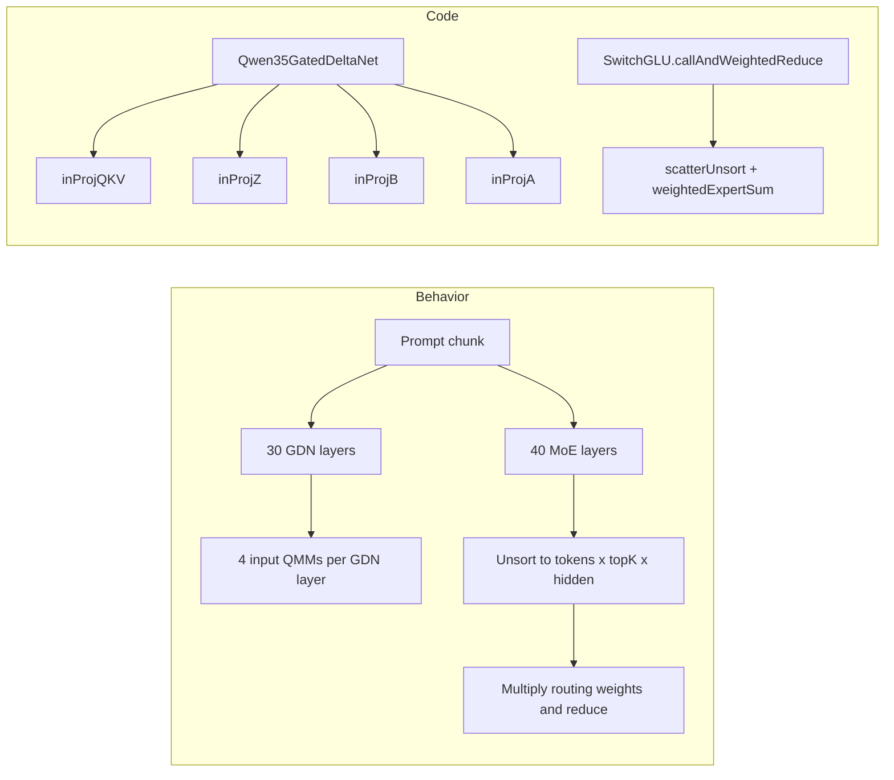
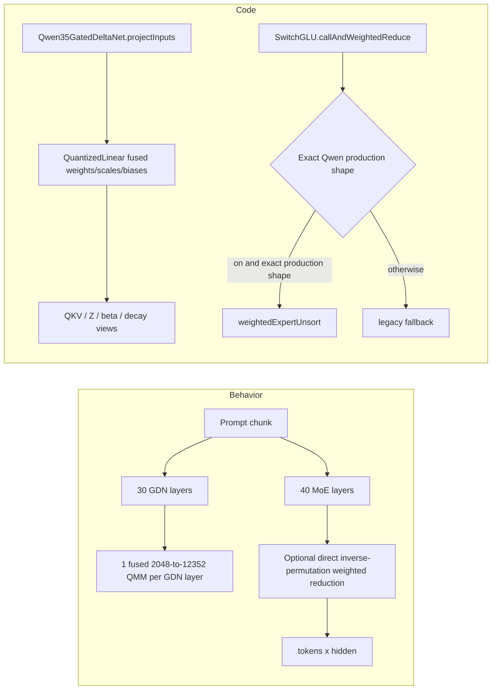

# Qwen prefill retained optimizations — PR body (2026-08-21)

> Last updated: 2026-08-21 · commit `eba775987`

Archived PR description for the rebase of the retained Qwen prefill optimisations; the measurements behind it are in [`2026-08-21-qwen-prefill-retained-optimizations.md`](2026-08-21-qwen-prefill-retained-optimizations.md).

## Summary

Rebases the retained Qwen prefill improvements onto current master after PRs
#646-#650. It intentionally excludes the unqualified D=256 attention path,
router fusion, and the rejected MoE Mega-Kernel experiments.

Retained:

- fuse the four GDN input projections into one quantized QMM;
- enable Qwen direct sorted-expert weighted reduction by default with an explicit rollback flag;
- include parity and isolated performance tests.

## Before

## After

## Canonical implementation

- GDN fusion: `mlx-swift-lm/Libraries/MLXLLM/Models/Qwen35.swift:306-516`
- Batched MoE flattening/caller: `mlx-swift-lm/Libraries/MLXLLM/Models/Qwen35.swift:1311-1382`
- Direct-reduction default/rollback: `mlx-swift-lm/Libraries/MLXLMCommon/SwitchLayers.swift:261-266`
- Eligibility/fallback: `mlx-swift-lm/Libraries/MLXLMCommon/SwitchLayers.swift:493-581`

## Evidence

- GDN fusion parity: QKV/Z exact; A/B max difference approximately `4.1e-6`.
- Historical GDN step A/B: 10.2% lower TTFT at 8K, 6.0% at 16K, 6.5% at 32K.
- Direct expert reduction isolated primitive benchmark: 0.6389 ms -> 0.3564 ms,
  1.793x speedup at 2,048-token stripe geometry.

## Excluded

- D=256 Steel attention: correctness passed, speed not isolated under stable posture.
- Router/shared-gate fusion: wash/regression at 8K.
- MoE Mega-Kernel/GateUp+SwiGLU fusion: 63.5-71.2% slower in paired tests.
