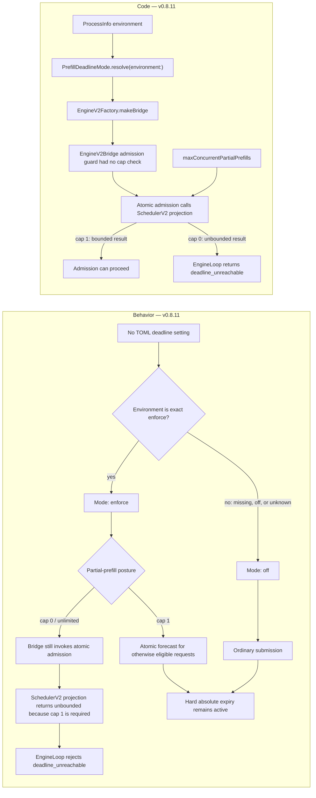
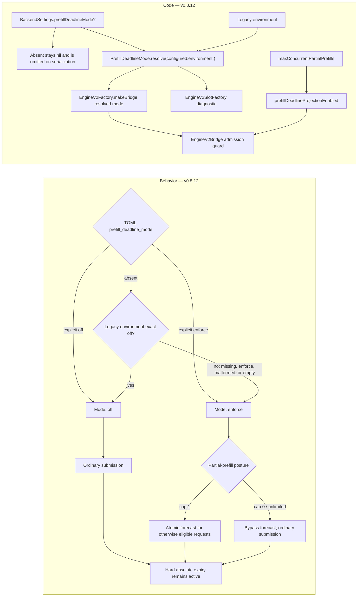

# v0.8.12 Default-On Prefill Deadline Admission

> Last updated: 2026-08-25 · commit `e0a0d16d9`

Date: 2026-08-25
Branch: `release/v0.8.12-deadline-admission`
Status: implementation candidate; no tag, publication, deployment, or fleet
mutation was performed by this change.

## Decision

v0.8.12 makes provider-side atomic first-token deadline admission the default
for every request that satisfies the existing eligibility and proof
requirements.

Typed config is source-aware and authoritative when present:

- explicit `[backend] prefill_deadline_mode = "off"` resolves `off`;
- explicit `[backend] prefill_deadline_mode = "enforce"` resolves `enforce`;
- an absent key inherits the legacy environment control, where only exact
  lowercase `DARKBLOOM_PREFILL_DEADLINE_MODE=off` disables;
- absent config plus missing, `enforce`, malformed, or empty environment
  securely resolves `enforce`.

Production config loading rejects an unknown typed value. The optional field
preserves absence through TOML serialization, so merely reading and writing an
existing config does not materialize an explicit policy.

Effective forecast admission also requires the proven scheduler posture:
`maxConcurrentPartialPrefills == 1`. Exact
`DARKBLOOM_CBV2_MAX_PARTIAL_PREFILLS=0` restores unlimited partial-prefill
interleave and therefore bypasses the bounded atomic forecast API. It leaves
the resolved deadline mode unchanged, but requests use ordinary submission
because unlimited interleave is outside the projection proof. Hard absolute
expiry remains active.

## Canonical implementation

- **Typed policy and precedence.**
  [`BackendSettings.prefillDeadlineMode`](../../provider-swift/Sources/ProviderCore/Config/ProviderConfig.swift#L171-L175)
  is optional; its
  [`CodingKeys` and decoder](../../provider-swift/Sources/ProviderCore/Config/ProviderConfig.swift#L243-L305)
  preserve an absent key as `nil`, and
  [`ConfigManager.load(from:)`](../../provider-swift/Sources/ProviderCore/Config/ProviderConfig.swift#L535-L550)
  uses strict parsing; the
  [`loadRuntimeSnapshot` production path](../../provider-swift/Sources/darkbloom/Darkbloom.swift#L113-L136)
  selects it for every existing runtime config, while
  [`ConfigManager.parseValidating` / `serialize`](../../provider-swift/Sources/ProviderCore/Config/ProviderConfig.swift#L618-L642)
  provide the production rejection and TOML round trip.
  [`PrefillDeadlineMode.resolve(configured:environment:)`](../../provider-swift/Sources/ProviderCore/Inference/PrefillDeadlineMode.swift#L3-L23)
  implements configured-value authority and exact-lowercase environment
  fallback. The omission, round-trip, invalid-value, and exhaustive precedence
  contracts are pinned by
  [`ConfigTests`](../../provider-swift/Tests/ProviderCoreTests/ConfigTests.swift#L43-L87),
  [`ConfigValidationTests`](../../provider-swift/Tests/ProviderCoreTests/ConfigValidationTests.swift#L97-L108),
  and
  [`deadlineModeUsesSourceAwarePrecedence`](../../provider-swift/Tests/ProviderCoreTests/EngineV2ProductionWiringTests.swift#L2192-L2221).
- **Production cap and mode wiring.**
  Coordinator-connected serving hands
  `loopConfig.config.backend.prefillDeadlineMode` through
  [`ProviderLoop.makeEngineV2BundleForSlot`](../../provider-swift/Sources/ProviderCore/ProviderLoop+EngineV2.swift#L524-L605).
  Local mode passes the same typed value through the
  [`Start` CLI handoff](../../provider-swift/Sources/darkbloom/StartCommand+Modes.swift#L84-L104)
  into
  [`StandaloneServerConfig`](../../provider-swift/Sources/ProviderCore/Server/StandaloneServer.swift#L78-L114);
  [`StandaloneServer.resliceAndBuildBundle`](../../provider-swift/Sources/ProviderCore/Server/StandaloneServer.swift#L735-L865)
  then supplies it to the shared slot factory.
  [`EngineV2Factory.maxConcurrentPartialPrefills` and `prefillDeadlineProjectionSupported`](../../provider-swift/Sources/ProviderCore/Inference/EngineV2Factory+Production.swift#L120-L154)
  resolve cap `1` versus unlimited/unsupported postures, while
  [`productionSchedulerConfig`](../../provider-swift/Sources/ProviderCore/Inference/EngineV2Factory+Production.swift#L172-L186)
  installs that cap in the scheduler.
  [`EngineV2Factory.makeBridge`](../../provider-swift/Sources/ProviderCore/Inference/EngineV2Config.swift#L150-L190)
  resolves the typed mode and supplies the projection-capability guard;
  [`EngineV2SlotFactory.makeProductionBundle`](../../provider-swift/Sources/ProviderCore/Inference/EngineV2SlotFactory.swift#L262-L288)
  accepts the optional mode and runtime environment, then
  [reports unsupported postures and constructs the bridge](../../provider-swift/Sources/ProviderCore/Inference/EngineV2SlotFactory.swift#L616-L654)
  from those same inputs. The focused suite separately executes
  [resolver precedence](../../provider-swift/Tests/ProviderCoreTests/EngineV2ProductionWiringTests.swift#L2192-L2221),
  [direct `makeBridge` mode/cap wiring](../../provider-swift/Tests/ProviderCoreTests/EngineV2ProductionWiringTests.swift#L2223-L2280),
  [cap parsing and scheduler configuration](../../provider-swift/Tests/ProviderCoreTests/EngineV2ProductionWiringTests.swift#L2282-L2333),
  and the
  [slot-factory bypass diagnostic](../../provider-swift/Tests/ProviderCoreTests/EngineV2ProductionWiringTests.swift#L2335-L2365);
  those tests do not substitute for the wrapper handoffs cited above.
- **Bridge eligibility and calibration.**
  [`EngineV2Bridge.firstTokenDeadlineAdmission`](../../provider-swift/Sources/ProviderCore/Inference/EngineV2Bridge.swift#L1037-L1070)
  requires resolved `enforce`, the cap-compatible guard, a text-only request,
  the anchored deadline, an initialized isolated prefill EWMA, and a finite
  positive haircutted rate; decode uses its own independently observed rate.
  Isolation is decided at the
  [`engine-submit boundary`](../../provider-swift/Sources/ProviderCore/Inference/EngineV2Bridge.swift#L819-L824)
  and revoked on overlap by
  [`isIsolatedPrefillSubmitBoundary` / `disqualifyOverlappedPrefillSamples`](../../provider-swift/Sources/ProviderCore/Inference/EngineV2Bridge.swift#L1072-L1093);
  [`finishAndEmit`](../../provider-swift/Sources/ProviderCore/Inference/EngineV2Bridge.swift#L1666-L1722)
  marks only natural `.stop` / `.length` terminals successful, and
  [`recordFinish`](../../provider-swift/Sources/ProviderCore/Inference/EngineV2Bridge.swift#L1785-L1829)
  invokes
  [`recordPrefillSample`](../../provider-swift/Sources/ProviderCore/Inference/EngineV2Bridge.swift#L1848-L1905)
  only behind that success guard; the sampler then admits only valid cold
  prefills. The ordinary-submit bootstrap, mode-off, missing-deadline, and
  multimodal cases are pinned by
  [`failOpenCasesUseOrdinarySubmit`](../../provider-swift/Tests/ProviderCoreTests/EngineV2PrefillSamplingTests.swift#L768-L838).
- **Atomic scheduler verdict.**
  [`SchedulerV2.firstTokenWorkProjection`](https://github.com/Layr-Labs/mlx-swift-lm/blob/52c2396d00f28533fbbbc2261d749949d10590df/Libraries/MLXLMCommon/ContinuousBatchingV2/FirstTokenDeadlineAdmissionV2.swift#L200-L225)
  requires cap `1`; it charges launched work without elapsed credit and follows
  authoritative running-then-waiting order through the target's complete
  first-token step
  ([in-flight charge](https://github.com/Layr-Labs/mlx-swift-lm/blob/52c2396d00f28533fbbbc2261d749949d10590df/Libraries/MLXLMCommon/ContinuousBatchingV2/FirstTokenDeadlineAdmissionV2.swift#L568-L630),
  [ordered projection](https://github.com/Layr-Labs/mlx-swift-lm/blob/52c2396d00f28533fbbbc2261d749949d10590df/Libraries/MLXLMCommon/ContinuousBatchingV2/FirstTokenDeadlineAdmissionV2.swift#L757-L948)).
  [`EngineLoopV2.enqueueForFirstTokenDeadline`](https://github.com/Layr-Labs/mlx-swift-lm/blob/52c2396d00f28533fbbbc2261d749949d10590df/Libraries/MLXLMCommon/ContinuousBatchingV2/EngineLoopV2.swift#L1279-L1478)
  serializes enqueue, prefix preview, projection, deadline verdict, rejection,
  and activation; its
  [`firstTokenProjectedWork`](https://github.com/Layr-Labs/mlx-swift-lm/blob/52c2396d00f28533fbbbc2261d749949d10590df/Libraries/MLXLMCommon/ContinuousBatchingV2/EngineLoopV2.swift#L1521-L1585)
  requires capacity-ledger guarantees and a valid rate for each projected
  phase. Unbounded or over-budget work returns typed
  `deadlineUnreachable` and is
  [discarded before GPU work](https://github.com/Layr-Labs/mlx-swift-lm/blob/52c2396d00f28533fbbbc2261d749949d10590df/Libraries/MLXLMCommon/ContinuousBatchingV2/EngineLoopV2.swift#L1589-L1601).
  Deterministic engine tests pin
  [no-forward rejection](https://github.com/Layr-Labs/mlx-swift-lm/blob/52c2396d00f28533fbbbc2261d749949d10590df/Tests/MLXLMTests/CBv2FirstTokenDeadlineAdmissionTests.swift#L514-L542),
  [absolute queue-wait accounting](https://github.com/Layr-Labs/mlx-swift-lm/blob/52c2396d00f28533fbbbc2261d749949d10590df/Tests/MLXLMTests/CBv2FirstTokenDeadlineAdmissionTests.swift#L643-L681),
  and
  [separate mixed-phase rates](https://github.com/Layr-Labs/mlx-swift-lm/blob/52c2396d00f28533fbbbc2261d749949d10590df/Tests/MLXLMTests/CBv2FirstTokenDeadlineAdmissionTests.swift#L793-L874).
- **Coordinator failover.**
  `deadline_unreachable` is explicitly
  [provider-health neutral](../../coordinator/api/route_outcome.go#L93-L104).
  The pre-content error path
  [excludes the failed provider and retries](../../coordinator/api/dispatch.go#L1833-L1863),
  while
  [`noteProviderError`](../../coordinator/api/dispatch.go#L1511-L1549)
  withholds neutral refusals from breakers and capacity trackers.
  [`shouldStopFailover`](../../coordinator/api/dispatch.go#L1571-L1663)
  keeps trying untried providers without consuming the generic capacity retry
  cap. Each attempt refreshes the same absolute clock through
  [`PendingRequest.RefreshFirstContentBudget`](../../coordinator/registry/registry.go#L499-L520),
  and the provider writer
  [recomputes the remaining wire budget at dequeue](../../coordinator/api/provider_wire.go#L80-L107).
  Candidate exhaustion resolves to one retryable 429 with `Retry-After` in the
  [`exhausted` terminal](../../coordinator/api/dispatch.go#L3148-L3256).
  Integration tests pin
  [distinct-provider retry with decreasing budgets](../../coordinator/api/deadline_unreachable_integration_test.go#L155-L236),
  [health neutrality](../../coordinator/api/dispatch_nonfault_breaker_test.go#L130-L153),
  and
  [single-429 exhaustion](../../coordinator/api/deadline_unreachable_integration_test.go#L293-L384).
- **Hard expiry and cap-zero rollback.**
  [`FirstContentDeadline`](../../provider-swift/Sources/ProviderCore/Coordinator/CoordinatorClientTypes.swift#L10-L48)
  anchors the relative wire budget once to a monotonic instant.
  [`EngineV2Bridge.checkFirstContentDeadline`](../../provider-swift/Sources/ProviderCore/Inference/EngineV2Bridge.swift#L1157-L1191)
  remains independent of forecast mode and is called at the final
  [post-suspension pre-submit boundary](../../provider-swift/Sources/ProviderCore/Inference/EngineV2Bridge.swift#L808-L817).
  Tests prove cap `0` uses ordinary submission while preserving expiry
  ([`capZeroUsesOrdinarySubmission`](../../provider-swift/Tests/ProviderCoreTests/EngineV2PrefillSamplingTests.swift#L663-L697))
  and that every forecast fail-open branch still rejects expired work
  ([`expiredRequestsNeverFailOpen`](../../provider-swift/Tests/ProviderCoreTests/EngineV2PrefillSamplingTests.swift#L840-L885)).

## Before



## After



## Why activation helps

The provider cannot recover time already consumed by a queue it knows cannot
meet the caller's first-content deadline. Atomic admission projects work
through the candidate request's first token while holding the authoritative
engine queue state. If that work cannot fit in the remaining budget, the
provider returns typed `deadline_unreachable` capacity failure before the
request enters a GPU prompt step. The coordinator can then try another
eligible provider while budget remains; if no provider can serve, it returns
the existing bounded retryable capacity response.

This does **not** make prefill faster. It avoids spending scarce deadline and
GPU capacity on work whose first token cannot arrive in time.

## Evidence motivating the change

The historical
[`2026-08-24-qwen-openrouter-timeout-fix-and-release.md`](2026-08-24-qwen-openrouter-timeout-fix-and-release.md)
recorded the evidence available before v0.8.11:

- PR-reported production symptoms were approximately 10–11% Qwen OpenRouter
  downtime and approximately 11,000 `client_gone` rows in 24 hours aligned with
  the external first-content deadline.
- An M4 Max Qwen run measured one 8K prefill at about 5.35 seconds and four
  fairly interleaved 8K prefills at about 24.98 seconds each.
- A deterministic scheduler simulation at the measured rate produced a
  first-token staircase under serialized prefill and showed that rejecting the
  fourth unreachable row would let the coordinator redispatch it instead of
  waiting locally for timeout.

The production counts were not re-queried for this patch, and the scheduler
result is simulation rather than a signed candidate A/B. They establish the
failure mechanism and motivation, not v0.8.12 rollout success. Default-on
canary evidence remains a release gate.

The v0.8.11 report intentionally remains a historical pre-release snapshot. It
correctly says its inspected resolver defaulted admission to `off`; this
v0.8.12 report is the activation addendum. Release prose is not evidence that
the v0.8.11 runtime default was enabled.

## Eligibility, bootstrap, and proof boundaries

The mode flip does not broaden admission. The bridge constructs an atomic
deadline policy only when all of the following are true:

1. The coordinator propagated a positive remaining first-content budget and
   the provider converted it once to an absolute monotonic deadline.
2. The bridge has initialized its queue-excluded isolated cold-prefill EWMA.
3. The request is text-only; multimodal requests remain excluded because token
   count cannot safely price vision-tower work.
4. The conservative prefill rate is finite and positive. It remains the
   isolated EWMA with the existing fixed haircut; no static or registration
   fallback rate is invented.
5. Production scheduler configuration serializes partial prefill with cap `1`.
   Cap `0`/unlimited and positive caps above `1` bypass forecast admission
   rather than invoking a projection that cannot prove that posture.

Bootstrap is deliberately fail-open at the forecast layer. A fresh model slot
has no isolated prefill EWMA, so requests use ordinary submission until a
successful cold, isolated, non-overlapped prefill produces a valid sample.
Cache hits, failed requests, and work overlapping another prefill or decode do
not initialize that scheduler rate. Absolute pre-submit expiry checks remain
active whenever a deadline was propagated, including during bootstrap and when
forecast mode is `off`.

Once the bridge supplies a policy, the engine owns the proof:

- prefix adoption, enqueue, the scheduler snapshot, projection, capacity
  guarantee, verdict, and activation execute on the serialized engine queue;
- the projection follows authoritative scheduler order through the target's
  first-token step and charges already launched work without elapsed credit;
- every projected phase needs its own conservative rate. Mixed prefill/decode
  work with no initialized decode rate is unbounded; decode is never priced at
  prefill throughput;
- projected KV operations must be guaranteed by the authoritative capacity
  ledger;
- once the cap-1-compatible atomic path is entered, paused, unsupported
  scheduler state, complexity-limit, or otherwise unprovable projections are
  unbounded and fail closed as `deadline_unreachable`;
- a rejected request is removed before any GPU forward and releases its
  pre-submit resources.

Atomic projection currently vouches only for serialized partial prefill
(`maxConcurrentPartialPrefills == 1`). Cap `0` does not manufacture a proof or
change `PrefillDeadlineMode`; production detects that configured posture before
submission and skips forecast admission. This distinction preserves both
requirements: cap `1` still fails closed for genuinely unbounded engine state,
while cap `0` remains a functional serving rollback.

## Mixed-version behavior

v0.8.12 adds no protocol field or message:

- v0.8.10-or-earlier coordinator + v0.8.12 provider: no propagated deadline
  means no atomic forecast; ordinary compatibility behavior remains.
- Deadline-aware coordinator + v0.8.11 provider: the older provider retains
  its shipped mode resolution; the coordinator's absolute timeout,
  cancellation, and pre-content retry remain authoritative.
- Deadline-aware coordinator + v0.8.12 provider: eligible text requests use
  atomic admission by default when partial-prefill cap `1` is configured.
- Any coordinator + v0.8.12 provider with exact mode `off`: atomic forecast is
  disabled immediately, while propagated absolute-expiry checks remain intact.
- Any coordinator + v0.8.12 provider with cap `0`/unlimited: deadline mode can
  still resolve to `enforce`, but forecast admission is bypassed because that
  scheduler posture is outside the bounded proof. Ordinary serving and hard
  absolute expiry remain active.

No provider-version floor is introduced for this activation.

## Release integrity and rollout gates

Source authorities move together to `0.8.12`:

- [`ProviderCore.version`](../../provider-swift/Sources/ProviderCore/ProviderCore.swift#L243-L251);
- coordinator
  [`LatestProviderVersion`](../../coordinator/api/server.go#L142-L154).

The
[release-integrity script](../../scripts/check-release-version.sh#L20-L53)
and coordinator
[cross-language version test](../../coordinator/api/provider_version_sync_test.go#L23-L61)
must both pass. Before publication:

1. Run focused config parsing/serialization, resolver precedence,
   production-factory wiring, atomic admission, FCFS cap-0, and
   version-integrity tests.
2. Run the complete provider and coordinator suites and production builds.
3. Exercise old/new and new/old coordinator/provider combinations.
4. On an owned Apple Silicon canary, prove default mode emits an early typed
   refusal for an unreachable text request, starts no GPU prompt step, releases
   reservations, and lets a coordinator with an eligible peer redispatch.
5. Verify missing deadline, fresh-slot bootstrap, cache-hit-only bootstrap,
   multimodal, missing decode-rate, unprovable capacity, and cap-0 postures
   retain the documented behavior.
6. On a canary, set `[backend] prefill_deadline_mode = "off"`, run ordinary
   `darkbloom restart`, and confirm forecast admission is bypassed while
   absolute expiry/coordinator cancellation remain active. Then set
   `"enforce"`, restart normally, and confirm enforcement returns.
7. Hold the dev canary and compare final success, bounded 429, 5xx,
   `client_gone`, orphan-work, settlement, and provider-restart rates before
   production publication.

Rollback of release discovery or already installed binaries remains governed
by the normal release runbook. The durable behavioral rollback is:

```toml
[backend]
prefill_deadline_mode = "off"
```

Edit the active config (`~/.config/darkbloom/provider.toml` unless the service
was installed with a custom `--config` path), save it, then run:

```bash
darkbloom restart
```

The provider rereads its config on ordinary restart.

### Restore or inherit

To force enforcement, including when an older installation persists legacy
environment `off`, set:

```toml
[backend]
prefill_deadline_mode = "enforce"
```

To inherit the legacy environment control again, remove
`prefill_deadline_mode`. With no environment exact `off`, absence securely
enforces. After any of these edits, run ordinary:

```bash
darkbloom restart
```

This rollback does not touch `DARKBLOOM_CBV2_MAX_PARTIAL_PREFILLS` or any other
control. If cap `0` remains configured, deadline mode can resolve to `enforce`
while forecast admission remains bypassed until cap `1` is restored.

## Non-goals and known gaps

- No claim that prefill throughput or first-token compute latency improves.
- No multimodal forecast admission and no fallback service rates.
- No change to coordinator deadlines, billing, routing prices, model weights,
  prefix-cache policy, or wire protocol.
- No provider-local post-submit deadline watchdog; coordinator cancellation
  remains authoritative after submission.
- No signed v0.8.12 artifact, live default-on production A/B, mixed-version
  system run, or rollout observation is included in this source change.
