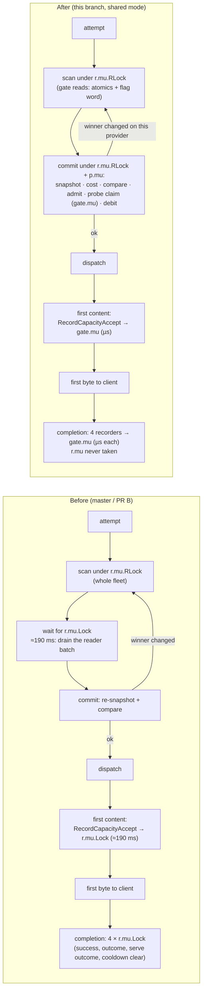
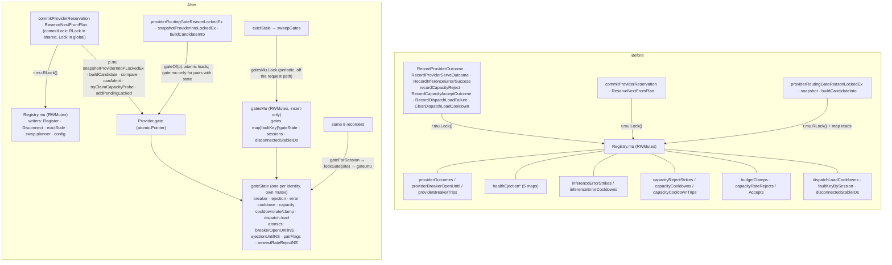

# perf(registry): take the global write lock off the per-request path (Tier 3)

Stacks on `perf/coordinator-registry-scan-2026-09-03` (PR B: per-model index, arena snapshots,
cached medians). **Merge after it and after PR #818** (`perf/coordinator-tier1-2026-09-03`, the
`lockWrite(site)` observer and `ScanCount` stamp); this branch is rebased onto #818 once it lands —
the six recorder bodies #818 instruments are rewritten wholesale here, so the conflicts resolve
to this branch. Two things to do **at that rebase**:

- #818's `TestRegistryLockWaitHistogramTaggedBySite` (api) drives a `registry.mu.write_wait_ms`
  sample through `reg.ClearDispatchLoadCooldown` behind `HoldWriteLockForTest`. On this branch that
  recorder never touches `r.mu`, so the test must be retargeted at a remaining `r.mu` writer (a
  config setter, or the commit in `global` mode) or it hangs.
- Route `commitLock.lock()` in `global` mode through `r.lockWrite("commit")` /
  `("commit_plan")` so the kill switch keeps its write-wait histogram; in `shared` mode the commit
  takes `r.mu.RLock` and has no write wait to report.

Design and evidence: `docs/reports/2026-09-03-coordinator-perf-proposal/01-registry-lock.md`
(E1–E4), README §3 Tier 3 and §6.

## What was wrong

`Registry.mu` is a writer-preferring `sync.RWMutex`. Every served request took it for **writing six
times** — the reservation commit, the first-content capacity accept, and at completion
`RecordInferenceSuccess`, `RecordProviderOutcome`, `RecordProviderServeOutcome`,
`ClearDispatchLoadCooldown` — plus `ReserveNextFromPlan` held it across its whole loop. Each
holder ran for microseconds (0.007 core in total), but a pending writer blocks every new reader
and must drain the active batch of fleet scans first: **≈190 ms per acquisition in prod**, 152
writers queued behind one scanning reader, two of the six acquisitions before the first byte.
Commits that lost the race rescanned the fleet (10–14 iterations per reservation). Coordinator-caused
TTFB at the median: ≈2.4 s.

## What changed

Two halves, shipped together (neither helps alone — see 01 "Why not (a) alone"):

**(a) Per-identity gate state.** The node-health breaker, stable-identity health ejection, the
shape-keyed inference-error cooldown, the capacity cooldown / rate window / budget clamp and the
dispatch-load cooldown moved out of the global maps into one `gateState` per fault key
(`registry/gate_state.go`), each with its own `sync.Mutex`. Recorders resolve the gate, take
`gate.mu`, mutate, release — **they never touch `r.mu`**. Connected providers cache their gate
(`p.gate`, atomic); the disconnected trailing-flush path does one `gatesMu.RLock` lookup. The scan
reads the two hot booleans (breaker open, ejected) from atomics and a per-gate flag word says which
per-model trackers hold state, so a provider with no fault state costs the scan a few atomic loads and
no lock section. The size-triggered map sweeps (>1024 / >2048 walks under the write lock) became a
periodic per-gate sweep from the eviction loop. Identity rebinds migrate a gate's state and forward the
orphan, so a recorder holding a stale pointer still lands on the live state; and because a recorder
resolves its gate under `gatesMu.RLock` but locks it only after letting go of `gatesMu`, it re-validates
the gate under `gate.mu` once acquired (not retired by the sweep, still the session's cached gate) and
re-resolves through the index otherwise (see "Review follow-ups").

**(a′) Commit without the global write lock.** `commitProviderReservation` and
`ReserveNextFromPlan` hold `r.mu` for **reading** (identity, catalog and cache-routing config only)
and do everything that decides the reservation — fresh snapshot, cost rebuild, the "winner unchanged
since scan" compare, admit re-check, probe claim, pending debit — inside **one `p.mu` section** on the
winner. The half-open capacity probe is check-and-claim under `gate.mu`. The breaker-bypass re-scan is
a read.

Lock order: `r.mu → p.mu → gatesMu → gate.mu`. Never `r.mu` or `p.mu` while holding `gatesMu` or a
`gate.mu`. There is deliberately **no walk-wide gates lock** on the scan; the parallel speed-up guard
below is what keeps it out.

## Before / after

### Behaviour

### Code

## Invariants (from 01, with how each is protected now)

| Invariant `r.mu.Lock()` protected before | Now |
|---|---|
| No double-booking of a provider | `providerCanAdmitLockedEx` + `addPendingLocked` under **`p.mu`** — unchanged, and now in the same `p.mu` section as the fresh snapshot (`snapshotProviderIntoPLockedEx`), so nothing on the provider changes between the check and the debit. Test: N goroutines vs one capped provider admit exactly the serial capacity, both modes, `-race`. |
| Probe claim atomic w.r.t. other commits | `gateState.tryClaimCapacityProbe`: check **and** claim in one `gate.mu` section, per identity; a closed gate rejects the reservation instead of leaking a second probe. Test: two sessions of one identity racing → exactly one claim. |
| Fleet-wide serialization makes the "unchanged since scan" compare exact (herd avoidance) | The four-field compare runs against a snapshot taken under the **same `p.mu` hold that debits**; only the winner's own counters are compared, so `p.mu` suffices. A concurrent commit on the same provider is either fully before (visible → rescan) or fully after. |
| Stale gate state seen by a scan | Already tolerated between scan RUnlock and commit; the commit re-checks under `p.mu`/`gate.mu`. Readers of a gate being migrated see either the intact pre-merge view or the forward, never the reset (forward is stored before reset). |
| Identity rebind moves accumulated fault state | `bindStableFaultKey` migrates `gateState` → `gateState` under `gatesMu.Lock` (the only place two gate locks nest); stale pointers follow `forwardTo`; a recorder holding a stale pointer re-validates under `gate.mu` (not retired, still the session's cached gate) and re-resolves through the index otherwise; the session is repointed inside the migration's two-gate locked section, so a recorder holding the source either wrote before the merge (its outcome travels) or sees the pointer moved. A shared identity gate with other live sessions is emptied, not orphaned — the repointed `p.gate` is what tells a stale holder its outcome now belongs to the new gate. The lock-free "no per-model state" fast paths (probe claim, the clear recorders) trust a cleared flag only while `p.gate` still points at the gate it was read from (`refHasPairState`). |
| Fault state survives Disconnect; identity-less residue is dropped | `detachSessionGate`: caches the stable id for the trailing flush and keeps the identity's gate; a session-keyed gate (no identity) is dropped at Disconnect. |
| Bounded maps | Periodic `sweepGates` from the eviction loop (plus a rate-limited inline sweep past 4096 gates): prunes dead per-model entries; drops gates with no live session once idle for 10 min, marking them `retired` under `gate.mu` before the index delete so a recorder that resolved the gate before the walk re-resolves instead of writing into it. A gate's **creation counts as activity** for the idle grace, so a gate filed for a disconnected identity (the trailing flush's first fault, a serve outcome by stable id) cannot be swept before the recorder that created it takes the lock — an untouched disconnected identity therefore lingers ≤ 10 min instead of dropping on the first sweep (negligible: one empty `gateState`). Half-open trip memory of a **live** gate is never pruned (the old size-triggered sweeps only ran past 1024 entries). |

## Mode flag

`EIGENINFERENCE_RESERVE_COMMIT_MODE` = `shared` (default) | `global`, read once at construction.

- `shared`: commit and plan consumption hold `r.mu.RLock` + `p.mu` (this change).
- `global`: they take `r.mu.Lock()` — the previous fleet-wide serialization, kept as the **kill
  switch** for (a′). The recorders stay on their per-identity gates in **both** modes: that half is
  safe on its own, and the flag exists for a defect in the shared commit.

The request-path suites run in both modes (`forEachCommitMode`).

## Observability

- `registry.gate.wait_ms` — DogStatsD histogram tagged `site:` (`breaker`, `health_ejection`,
  `inference_error`, `inference_success`, `capacity_reject`, `capacity_accept`,
  `dispatch_load_failure`, `dispatch_load_clear`, `clamp_heartbeat`), emitted only when a `gate.mu`
  wait exceeds 1 ms (uncontended path: one `TryLock`, no clock reads). Distinct from #818's
  `registry.mu.write_wait_ms`. The commit-path probe claim (`capacity_probe` site) takes the same
  gate lock but does not report its wait: it runs under `p.mu` (and `r.mu` in `global` mode), where the
  emit must not happen; the recorders' waits on the same gates cover it.
- The #809 per-attempt stamps (`lock_wait_us`, `scan_us`, `admit_us`) are the acceptance metric.

## Bench (this box: M-series, 16 threads, `-benchtime 2s -count 2`; load average 330–380 on 16 cores during both runs — treat absolute numbers as ±30%, ratios within a run as the signal)

| Benchmark | PR B (base) | this branch |
|---|---:|---:|
| RequestPathWalkParallel-16 (RLock-only fleet walk) | 158–176 µs/op | 100–109 µs/op |
| RequestPathWalkParallelWithWriter-16 — one recorder at 500/s under 16 walkers: **writer wait mean** | **1.7–2.6 ms** | **39–72 µs** |
| … writer wait max | 18–100 ms | 31–68 ms (scheduler noise at this load) |
| RequestPathSerial (scan+commit+5 recorders+release) | 424–537 µs/op | 346–351 µs/op |
| RequestPathParallel-16 (same, 16 threads) | 353–386 µs/op | 145–157 µs/op |
| **parallel speed-up (serial ÷ parallel)** | **≈1.2×** | **≈2.3×** (read-only walk ceiling on this box at that moment: 2.6×) |
| FleetReserveProviderExParallel-16 | 311–351 µs/op | 312 µs/op (fixture herds every goroutine onto model 0 with colliding request ids → rescans dominate; not a lock signal) |

`TestRequestPathParallelSpeedup` pins the guard. **Deviation from the proposal's "asserts ≥ 4× at
16 threads":** the absolute 4× is asserted only when the box's own read-only fleet walk (RLock, no
writers) reaches 4× — an unloaded machine; on a busy box it asserts the relative property instead
(request path ≥ 60% of the read-only walk's speed-up; the base branch sits at ≈45%), and above a
1-minute load of 2×GOMAXPROCS it skips with the numbers logged, because lock-holder preemption
defeats every locking scheme there. Each quantity is the best of three interleaved fixed-work runs.
On the development box (load 449–459 on 16 cores) it therefore **skipped**, measuring read-only
4.75× vs request path 3.50× (74%). The request path's ceiling sits below the read-only walk's
because of three pre-existing global write locks the read walk does not pay: `ttftCalibration.
notePrediction` per warm commit, the warm-pool `recordEvent` per cold dispatch, and the cache
tracker on `RemovePending`. None of them is `r.mu`.

## Acceptance metrics (prod, via #809 stamps)

- `admit_us` p99 < 10 ms; attempt-start → first-lock p90 < 50 ms, for 24 h.
- `registry.mu.write_wait_ms` (#818) collapses to the non-request writers (Register/Disconnect/
  evictStale/swap planner/config: tens per second); `registry.gate.wait_ms` stays empty or
  single-digit ms.
- Rescans per attempt (`ScanCount`, #818) → ~1.

## Rollout

1. Deploy with the default (`shared`). Kill switch: `EIGENINFERENCE_RESERVE_COMMIT_MODE=global`
   restores the fleet-wide commit serialization without touching the recorders.
2. **Not in this branch (deploy knob):** the #799 routing semaphore is still sized to host
   `runtime.NumCPU()` and its slots were held across the write-lock wait. With the wait gone, re-size
   `EIGENINFERENCE_ROUTING_CONCURRENCY` to the container's CPU quota so it bounds scan CPU as
   designed.
3. Re-profile 30 s after landing and diff against 00.

## Behaviour-neutral changes worth knowing about

- `ClearDispatchLoadCooldown` returns without taking any lock when the identity has no dispatch-load
  state (one flag load) — the common completion case.
- `RecordCapacityAcceptOutcome(_, _, false)` lost its read-only no-state probe; every accept now takes
  one uncontended `gate.mu` (microseconds, per identity) instead of an `r.mu.RLock` probe.
- `Disconnect` of an identity-less session drops **all** of that session's fault residue (capacity
  trackers included); before, only breaker / inference-error / dispatch-load residue was dropped.
- `TestReserveProviderWithPlanPrimarySelectionUnchanged` compared candidate summaries including
  their wall-clock `HBAgeMs`; it flaked 4/40 under `-race` on the loaded box (0/40 on base at that
  moment). The summaries' heartbeat ages are now zeroed like the decision's own `SnapshotAgeMs`.
  Test-only; revert if preferred.
- `ReserveNextFromPlan` is exercised concurrently with one plan per goroutine (the plan itself is
  single-consumer); the existing sequential plan suite covers the rest under `-race`.

## Remaining `r.mu` writers

Register, Disconnect, `evictStale` (strike map install), the swap planner
(`expirePendingModelLoads`/`reservePendingModelLoads`), `markUntrusted`, config setters, hook
setters. **No `r.mu.Lock()` remains on any request path.** The recorders take `r.mu` in no mode; the
only read-side touch left near a recorder is the budget snapshot for the clamp
(`providerReportsTokenBudget`/`providerBudgetSnapshot`), which reads `p.BackendCapacity` under
`p.mu` via the `sessions` index — no `r.mu` at all.

## Review follow-ups

Codex left two P2 findings on the gate index; both were legitimate and share one root cause — a
recorder resolves its gate under `gatesMu.RLock` but locks it only after releasing `gatesMu`, a
window the map-keyed code never had (key resolution and the write shared one `r.mu.Lock` section
with the bind). Fixed by re-validating the gate under `gate.mu` after acquiring it and re-resolving
through the index otherwise (`gateRef` / `lockGate`, `retired`, the repoint inside the migration's
locked section, creation-counts-as-touched):

- **F1 — recorders racing a shared-identity rebind** (`migrateGateLocked(..., false)` reset the shared
  gate without a forward; a recorder holding the old pointer wrote into the emptied gate that now
  belonged to the other session — a success left the migrated clamp/cooldown unreleased, a fault
  poisoned the other identity's breaker). The removed comment claiming parity with the map-keyed
  implementation was wrong. Commit `d21e0d48f`.
- **F2 — the sweep dropping in-flight recorder updates** (the sweep decided under `gate.mu`, unlocked,
  deleted; a trailing-flush recorder that had already resolved the pointer wrote the disconnect 502
  into a gate no lookup would find — `evictStale` runs `Disconnect` then `sweepGates` in the same
  pass, and a gate created for a disconnected identity had `touched == 0`). Commit `d21e0d48f`.
- **Adjacent gap found while fixing F1 — the commit-path probe claim** (`tryClaimCapacityProbe` via
  `gateOf(p).lockResolved()` mutated `probeAt` with no session check, so a rebind racing a commit could
  leak one probe through a cooled pair; the lock-free "no state" fast path had the same hole one layer
  up — an emptied source gate's flag says "nothing" because the state moved). Now claimed through the
  same validated lock, both commit modes, with `refHasPairState` confirming a cleared flag against
  `p.gate`. Commit `020fac64f`.

Deliberately unchanged: `detachSessionGate` does not retire the session-keyed gate it drops at
Disconnect — a recorder racing it writes into residue that is dropped by design (see "Disconnect of
an identity-less session drops all of that session's fault residue" above).

## Tests

- `reserve_commit_test.go`: exact-capacity concurrent commit through `ReserveProviderEx` AND through
  `ReserveNextFromPlan` (both modes, `-race`); the half-open probe race end to end — two sessions of
  one identity, N concurrent reservations, exactly one admitted (both modes); identical routing walks
  and per-provider gate outcomes across modes before/after concurrent scans + recorders over the
  fault-state fixture (breaker-open, ejected, capacity-cooled, dispatch-load-cooled, error-cooled,
  budget-clamped — the recorders in the concurrent phase target healthy providers, so this is
  `-race` interleaving coverage plus "faulted stay excluded", not a decision-changing script); the
  parallel speed-up guard; the mode-flag parser (unknown values fall back to `shared` and are logged).
- `gate_state_test.go`: stale-pointer migration, no empty-gate window for lock-free readers during a
  live re-attestation, shared-identity rebind, sweep liveness rule, trailing-flush resolution,
  exclusive probe claim, nil-safety, wait observer, recorders never block behind `r.mu.Lock`; from
  the review follow-ups: a stale ref across a shared-identity rebind lands on the session's new gate
  and leaves the other identity untouched; a stale ref across a sweep of a disconnected gate lands on
  the gate a fresh lookup finds (by session and by stable id); a clear keeps the retired gate and
  files nothing; a fresh gate survives the first sweep; a rebind between the probe's resolution and
  its claim lands the claim on the new gate in both commit modes; the lock-free fast path follows
  the rebind; recorders + probe claims racing rebinds and sweeps under `-race`.
- `request_path_probe_test.go`: the probe benches from 01.
- Existing tracker suites adapted to the gate API (helpers only; assertions unchanged); index ==
  brute-force, routing_context, fleet_sample and gate-tally suites untouched and green.
- `api`: `TestRegistryGateWaitHistogramTaggedBySite`; full `go test ./api/` green against the new
  registry.
